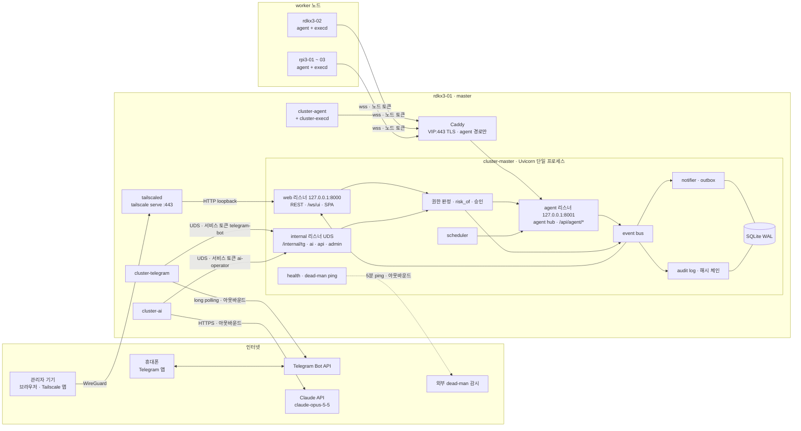
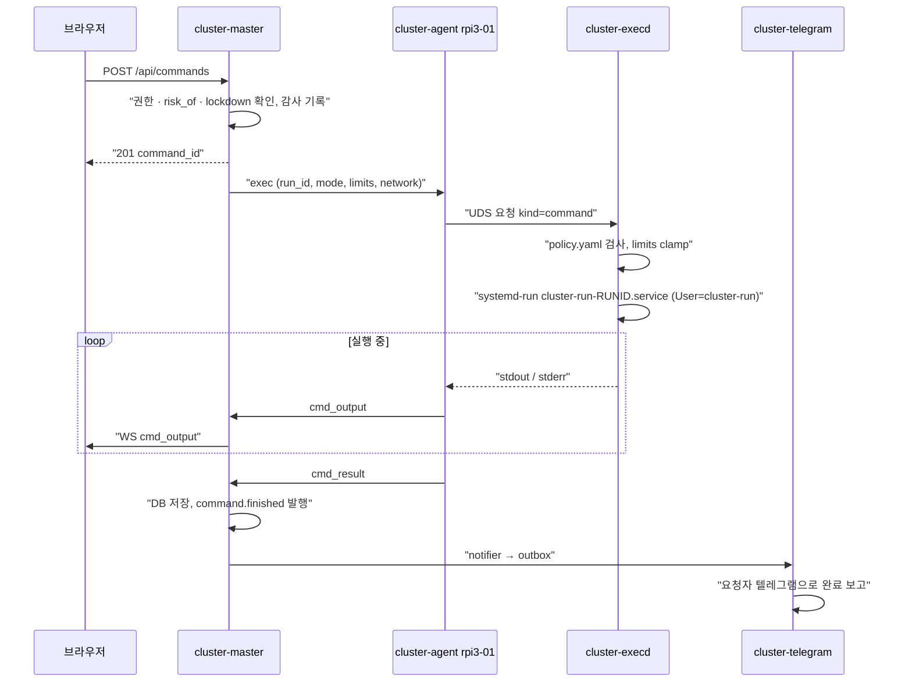
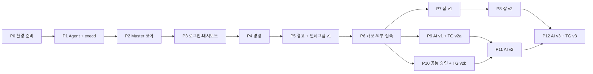

# Cluster Web 마스터 계획서

> RDK X3 2대 + Raspberry Pi 3B 3대 클러스터의 상태를 웹으로 보여주고, 웹·텔레그램에서 노드에 명령을 내리고, 노드가 들고 나도 계속 도는 분산 작업을 실행하고, 요청한 작업이 끝나면 텔레그램으로 보고하며, master에서 도는 AI 에이전트가 자연어 지시를 승인 범위 안에서 수행하는 관리 시스템의 마스터 계획서.

이 문서는 전체 그림, 확정된 결정, 단계 계획을 담는다. 세부 설계는 아래 문서가 정의하고, **충돌하면 세부 설계 문서가 우선한다. 보안 규칙은 [security.md](./design/security.md)가 기준선이며 다른 어떤 문서도 그것을 완화할 수 없다.**

| 문서 | 정의하는 것 |
|---|---|
| [design/topology.md](./design/topology.md) | 노드 역할·레이블·용량, 네트워크·VIP, 전원·냉각·스토리지·시간, 리소스 예산, 콜드 스탠바이·백업·생존 감시, Phase 0 체크리스트, 설치 순서 |
| [design/security.md](./design/security.md) | 위협 모델, 외부 접속(Tailscale), 방화벽·SSH, 웹 인증·세션·step-up, RBAC·위험도·승인 기준선, agent 채널, 실행 권한(cluster-execd), 격리, 시크릿, 감사 로그, lockdown, 사고 대응, 단계별 보안 체크리스트 |
| [design/jobs.md](./design/jobs.md) | 잡 모델(Job/Task/Attempt), 스케줄러, pull 분배, 재시도·재배치, BPU 라우팅, 번들·아티팩트, 잡 프로토콜·API·테이블 |
| [design/telegram.md](./design/telegram.md) | cluster-telegram 구조, 계정 연결, 완료 보고·알림 규칙과 형식, outbox, 명령어, 승인 버튼, AI 대화 창구 |
| [design/ai-agent.md](./design/ai-agent.md) | cluster-ai 구조, 모델·파라미터, 툴, 승인 정책, 작업 상태 머신, 인젝션 방어, 비용 통제, 시스템 프롬프트, AI 화면 |

---

## 1. 개요와 목표

### 1.1 핵심 목표

| # | 목표 | 완료 모습 |
|---|---|---|
| G1 | **모니터링** | 5대의 CPU·메모리·온도·디스크·네트워크·BPU·저전압 상태가 5초 주기로 대시보드에 보이고, 이력 그래프와 경고가 있다 |
| G2 | **원격 제어** | 웹에서 단일/다중 노드에 프리셋·셸 명령을 실행하고 출력이 실시간으로 보인다. 텔레그램에서도 승인된 범위의 제어를 한다 |
| G3 | **유동적 분산 작업** | 노드 추가·이탈에 맞춰 배치 대상이 바뀌고, 부하·온도 기반으로 배치하며, BPU 작업은 RDK X3로 가고, 장애 시 자동 재배치된다 |
| G4 | **외부 접속** | 집 밖에서도 노트북·휴대폰으로 웹에 접속한다. 인바운드 포트는 열지 않는다 |
| G5 | **텔레그램 완료 보고** | 사용자가 요청한 명령·잡·AI 작업이 끝나면 요청자의 텔레그램으로 결과가 온다 |
| G6 | **AI 에이전트** | 텔레그램·웹의 자연어 지시를 master에서 도는 에이전트가 조사·수행·보고한다. 변경은 사람 승인 후에만 |
| G7 | **이력·감사** | 모든 실행·승인·로그인·설정 변경이 지울 수 없는 감사 로그에 남는다 |

### 1.2 보안 최우선 원칙

원격 명령 실행, 외부 접속, AI 자동화가 함께 있으므로 **이 시스템이 뚫리면 클러스터 전체와 가정 LAN이 뚫린다**는 전제로 설계한다(상세: [security.md](./design/security.md) 0장).

1. **인바운드 포트 0개.** 외부 접속은 Tailscale(WireGuard), 텔레그램은 long polling, AI는 HTTPS 아웃바운드만.
2. **프로세스·계정 분리.** 웹(cluster-master), 텔레그램(cluster-telegram), AI(cluster-ai), 노드 데몬(cluster-agent), 사용자 코드(cluster-run), root 실행 위임(cluster-execd)은 서로 다른 Unix 계정과 시크릿을 가진다.
3. **채널이 약할수록 권한은 좁게.** 텔레그램·AI는 웹과 같거나 더 엄격하다. critical 작업은 웹 + step-up에서만.
4. **변경은 사람 승인, 승인은 정확한 payload에.** AI와 텔레그램 변경 작업은 실행될 내용 그대로에 해시로 묶인 승인이 있어야 하고, 실행은 master가 저장된 사본으로만 한다.
5. **master가 뚫려도 남는 방어선.** 원격으로 바꿀 수 없는 노드 로컬 정책(policy.yaml), 외부 감사 앵커, tailnet ACL.
6. **경고는 보안 경계가 아니다.** 위험 패턴 경고·확인 대화상자는 실수 방지용이고, 경계는 계정·권한·인증·승인·커널 격리다.
7. **모든 실행은 감사 로그에 남고, 감사 로그는 지울 수 없다.**

### 1.3 범위 밖

자동 HA(합의 기반 리더 선출, 실시간 DB 복제), 보드 위 로컬 LLM 추론, Docker 런타임, 원격 전원 사이클(스마트 플러그), 웹 터미널, DAG 파이프라인은 v1 범위 밖이다("나중" 항목은 18장).

---

## 2. 확정된 결정 사항

| # | 질문 | 사용자 결정 | 설계 반영 |
|---|---|---|---|
| D1 | 노드 구성 | **RDK X3 2대, Raspberry Pi 3B 3대** (Pi 3B = 1GB, 100Mbps, PoE/WoL 없음) | [topology.md](./design/topology.md) 1장. 원격으로 끈 Pi는 물리적으로만 켤 수 있음 → 전원 끄기는 critical |
| D2 | master 위치 | **RDK X3 (`rdkx3-01`)**, `rdkx3-02`는 콜드 스탠바이 후보 | topology.md 1·7장. VIP `master.cluster.internal`, 수동 failover RTO 30분 |
| D3 | 클러스터 용도 | **분산 작업까지, 유동적으로** | [jobs.md](./design/jobs.md): 배치 시점 온라인 노드 대상, 부하·온도 필터·점수, BPU 라우팅, lease 기반 재배치, array 잡 pull 분배 |
| D4 | 외부 접속 | **외부(인터넷)에서 접속 가능** | [security.md](./design/security.md) 3장: Tailscale + `tailscale serve`(Funnel 금지), 웹은 LAN에도 직접 노출하지 않음 |
| D5 | 셸 명령 | **자유 실행 허용** | admin + `cluster-run` 계정(root 아님). root는 `as_root` = admin + 웹 + step-up + 노드 로컬 정책 허용 시만(security.md 9·10장) |
| D6 | 프론트엔드 | **React + TypeScript + Vite (권장안)** | 빌드는 CI에서, 정적 산출물만 master에 배포 |
| R1 | 추가 요구 | **보안 최우선** | security.md가 기준선. 각 Phase는 보안 체크리스트 통과가 완료 조건(18장) |
| R2 | 추가 요구 | **요청 작업 완료 시 텔레그램 보고** | [telegram.md](./design/telegram.md) 6장. MVP(Phase 5)에 포함 |
| R3 | 추가 요구 | **가능하면 서버의 로컬 에이전트가 자연어 지시 수행** | [ai-agent.md](./design/ai-agent.md): 에이전트 프로세스는 rdkx3-01에서 로컬로, 모델 추론만 Claude API(`claude-opus-5-5`). 보드에서 LLM을 돌리는 것은 비현실적(RAM·BPU 특성)이라 기각. Claude Agent SDK(원시 셸 내장)는 RBAC·승인을 우회하므로 기각하고 우리 API를 감싼 전용 툴만 노출 |

---

## 3. 노드 구성 요약

상세: [topology.md](./design/topology.md).

| 호스트명 | 보드 | 역할 | 상주 서비스 | 잡 용량 (slots / bpu_slots / job_mem_mb) |
|---|---|---|---|---|
| `rdkx3-01` | RDK X3 (2GB/4GB, Phase 0 확인) | **master** + worker(축소) | cluster-master, cluster-telegram, cluster-ai, cluster-agent, cluster-execd, Caddy, tailscaled, chrony 서버 | 1 / 1 / 2GB는 공식 결과(256 미만이면 잡 미배치), 4GB 1408 |
| `rdkx3-02` | RDK X3 | worker(BPU 주력) + master 콜드 스탠바이 | cluster-agent, cluster-execd, tailscaled (master 계열은 설치 후 mask) | 3 / 2 / 1024 (4GB 2816) |
| `rpi3-01~03` | Raspberry Pi 3B (1GB) | worker(CPU) | cluster-agent, cluster-execd | 2 / 0 / 384 (잠정) |

- **네트워크**: 기가비트 unmanaged 스위치, 전 노드 유선, DHCP 예약. agent는 물리 호스트가 아니라 VIP 이름 `master.cluster.internal`로 접속한다. 대역은 Phase 0에서 실제 값으로 치환(예시 `192.168.1.0/24`).
- **Pi 3B 병목**: 이더넷이 USB2 버스를 공유해 실효 약 90Mbps. 큰 데이터는 1Gbps RDK X3 우선, 대용량 전송은 WebSocket 제어 채널이 아닌 별도 HTTPS 경로로.
- **용량 권위값**: 스케줄러가 쓰는 레이블·용량은 노드 자가 보고가 아니라 admin이 확정한 master 등록값(security.md 8.3).
- **스토리지·시간**: master DB는 USB SSD 권장, journald 제한, zram, chrony(master가 NTP 서버).
- **콜드 스탠바이**: 1시간마다 age 암호화 백업을 rdkx3-02로 push, 관리 PC가 주 1회 pull(오프사이트 필수). 외부 dead-man 감시가 rdkx3-01 다운을 알린다(topology.md 7장).

---

## 4. 전체 아키텍처

### 4.1 구성도



### 4.2 통신 경로

| 경로 | 방식 | 인증 | 상세 |
|---|---|---|---|
| 관리자 기기 → 웹 | Tailscale(WireGuard) → `tailscale serve` → web 리스너 | tailnet ACL + 앱 비밀번호 + TOTP + 세션 | security.md 3·5장 |
| agent → master | `wss://master.cluster.internal/ws/agent` (Caddy가 내부 CA 인증서로 TLS 종료) | 업그레이드 헤더 `Authorization: Bearer cat_…` + `X-Node-Id`, CA 고정 | security.md 8장 |
| agent → master 파일 | `https://master.cluster.internal/api/agent/*` (번들·항목 다운로드, 아티팩트 업로드) | 같은 노드 토큰 (+ Attempt 업로드 토큰) | jobs.md 10·13장 |
| cluster-telegram ↔ Telegram | long polling `getUpdates`, 아웃바운드만 | 봇 토큰 | telegram.md 2장 |
| cluster-ai → Claude API | HTTPS 아웃바운드 | API 키(`LoadCredential`) | ai-agent.md 3장 |
| cluster-telegram / cluster-ai → master | UDS `/run/cluster-master/internal.sock`, 라우트 허용 목록 | 서비스 토큰(principal `telegram-bot` / `ai-operator`), DB 직접 접근 없음 | security.md 4.1·12.2 |
| agent → execd | UDS `/run/cluster-execd.sock` | `SO_PEERCRED` uid = cluster-agent | security.md 9.3 |
| master → 외부 감시 | 5분마다 HTTPS ping | ping URL | topology.md 7.4 |

### 4.3 명령 실행 흐름



승인이 필요한 요청(AI, 텔레그램의 medium 이상)은 `202 {approval_id}`를 돌려주고, 사람이 승인하는 순간 master가 저장된 payload로 같은 흐름을 시작한다(1단계 모델, security.md 7.5-8).

### 4.4 설계 원칙

- **Agent → Master 상시 WebSocket (push 방식).** agent가 먼저 접속해 연결 하나로 메트릭 업로드, 명령·잡 수신, 출력 스트리밍을 처리한다. 노드는 리스닝 포트가 없다. (대안: master 폴링은 모든 노드에 HTTP 서버 노출, MQTT는 브로커 추가와 요청-응답 매칭 부담 → 기각. Prometheus+Grafana는 Pi 3B에 무겁고 명령 기능이 없음 → 기각.)
- **Master는 단일 프로세스(Uvicorn worker 1개)**, 세 리스너(web·agent·internal)가 같은 이벤트 루프에서 메모리 상태(agent 연결, 예약 장부, 링버퍼)를 공유한다.
- **in-process 이벤트 버스**: `node.online`, `node.offline`, `alert.raised`, `alert.resolved`, `command.finished`, `job.finished`, `ai_task.created/progress/question/state/finished`, `approval.requested`, `approval.decided`, `security.login`, `security.telegram_link`, `system.lockdown`. 소비자: UI WebSocket 허브, 텔레그램 notifier(outbox), 감사 로그.
- **명령 vs 잡**: 명령 = 큐 없이 즉시 실행(슬롯 미사용, `cluster-cmd.slice`). 잡 = 큐에 들어가 스케줄러가 배치·재시도·추적(`cluster-jobs.slice`). 둘 다 agent의 같은 executor와 execd의 `cluster-run-<run_id>.service`를 쓴다.

---

## 5. 구성 요소별 요약

| 구성 요소 | 위치 · 계정 | 역할 | 상세 |
|---|---|---|---|
| **cluster-agent** | 모든 노드 · `cluster-agent` (root 아님, sudo 없음, NoNewPrivileges) | 메트릭 수집, master 연결 유지, 명령·Task 수신과 execd 요청, 출력 중계, 결과 저널, 번들 다운로드 | 7·8장, jobs.md 9·13장 |
| **cluster-execd** | 모든 노드 · root, 소켓 활성화(연결마다 짧게 삶) | 노드 로컬 `policy.yaml` 검사, limits clamp, `systemd-run`으로 `cluster-run` 실행, root_op 실행, 번들 설치, 안전한 산출물 수집, 취소 | security.md 9·11장 |
| **cluster-master** | rdkx3-01 · `cluster-master` | 인증·세션·RBAC, agent hub, 상태 집계·메트릭 저장, 명령 중계, 승인, 이벤트 버스, notifier·outbox, 감사 로그, lockdown, REST/WS API, SPA 서빙 | 12·13장, security.md |
| **scheduler** | cluster-master 내부 asyncio 태스크 | 잡 필터·점수·큐, pull 응답, lease 감시, 재배치 | jobs.md 5~8장 |
| **cluster-telegram** | rdkx3-01 · `cluster-telegram` | long polling, 개인 채팅·연결 사용자 게이트, 명령 파싱, outbox 배달, 승인 버튼 중계, AI 입력 전달 | telegram.md |
| **cluster-ai** | rdkx3-01 · `cluster-ai` | AI 태스크 lease, Tool Runner 루프, 전용 typed 툴(master 내부 API 호출), 비용·반복 가드, 보고 작성 | ai-agent.md |
| **Web UI** | 브라우저 (React SPA) | 대시보드, 노드 상세, 명령 센터, 잡, AI, 승인함, 이력·감사, 설정 | 14장 |
| **Caddy** | rdkx3-01 · `caddy` | VIP:443에서 agent 경로(`/ws/agent`, `/api/agent/*`)만 TLS 종료, 나머지 403 | security.md 4.1 |
| **tailscaled** | rdkx3-01, rdkx3-02 | 외부 접속, `tailscale serve`로 웹만 노출 | security.md 3장 |

---

## 6. 기술 스택

| 영역 | 선택 | 이유 |
|---|---|---|
| Agent · execd | Python 3 (**3.8 호환 유지**), `psutil`, `websockets`, `PyYAML` (가능하면 배포판 apt 패키지) | 두 보드 기본 탑재, 빌드 불필요, RDK BPU Python API와 연동 쉬움 |
| Master · telegram · ai | Python 3.10+, FastAPI, Uvicorn 단일 worker, httpx | async WebSocket, UDS 클라이언트. anthropic SDK 1.x가 3.10 이상 요구. RDK 이미지가 3.8이면 독립 실행형 CPython 3.11(topology.md 5장) |
| DB | SQLite (WAL) + SQLAlchemy/SQLModel | 별도 서버 불필요, 5대 규모에 충분 |
| 텔레그램 | httpx로 Bot API 직접 호출(약 400줄) | 의존성 최소, 감사 가능, outbox 설계와 1:1 (telegram.md 3.2) |
| AI | `anthropic` 1.x `AsyncAnthropic`, `client.beta.messages.tool_runner` + `@beta_async_tool`, 모델 `claude-opus-5-5`, `output_config.effort` 명시(기본 medium), `fallbacks="default"`, 자동 프롬프트 캐싱 | ai-agent.md 3장 |
| Frontend | React + TypeScript + Vite, Tailwind CSS, uPlot(또는 Chart.js) | 빌드는 CI에서, 클러스터에 Node.js 없음, 외부 CDN 없음(CSP) |
| 인증 | Argon2id(`argon2-cffi`), TOTP(RFC 6238), 서버측 세션 | security.md 5장 |
| 프로세스·격리 | systemd (transient unit, cgroup v2, 하드닝 옵션, `LoadCredential`) | security.md 9·11장 |
| 네트워크 | Tailscale, Caddy(내부 CA), nftables, OpenSSH, chrony | security.md 3·4장 |
| 백업 | `sqlite3 .backup` + `age` 암호화 + rsync over SSH(쓰기 전용 강제 명령) | topology.md 7.2 |
| CI | GitHub Actions(커밋 SHA 고정), ruff, pytest(3.8·3.11·3.13 매트릭스), `npm ci --ignore-scripts`, gitleaks | security.md 17장 |

---

## 7. 모니터링 항목

### 7.1 공통 (psutil)

| 분류 | 항목 | 주기 |
|---|---|---|
| 정적 정보 | hostname, IP/MAC, OS·커널, CPU 모델·코어 수, 총 RAM, 보드 종류, agent 버전, 격리 모드(`systemd`/`fallback`), 레이블·용량 보고값 | 접속 시 1회 |
| CPU | 전체·코어별 사용률, 현재 클럭, load average | 5초 |
| 메모리 | 사용량, available, swap(zram) | 5초 |
| 디스크 | 파티션별 사용률, I/O | 5초 |
| 네트워크 | 인터페이스별 송수신 속도 | 5초 |
| 온도 | SoC 온도 | 5초 |
| 시스템 | uptime, 프로세스 수, 상위 프로세스 Top 5(CPU/메모리), `reboot-required` 여부 | 15초 |
| 스케줄 | `sched`: 빈 슬롯·BPU 슬롯, 잡 메모리 여유, 실행 중 Attempt(lease 갱신 겸함), 캐시된 번들 | 5초 |

### 7.2 Raspberry Pi 3B 전용

- 온도: `vcgencmd measure_temp` 또는 `/sys/class/thermal/thermal_zone0/temp`
- **저전압·스로틀링**: `vcgencmd get_throttled` — bit 0 현재 저전압 / bit 1 클럭 제한 / bit 2 스로틀링 / bit 3 온도 소프트 제한, bit 16~19 부팅 이후 발생 이력. Pi 3B는 전원 문제로 저전압이 흔하므로 대시보드 경고와 스케줄러 필터에 쓴다.
- 클럭·전압: `vcgencmd measure_clock arm`, `vcgencmd measure_volts core` (`cluster-agent`의 `video` 그룹 필요 여부는 Phase 0 P7)

### 7.3 RDK X3 전용

- **BPU 사용률**: `/sys/devices/system/bpu/bpu0/ratio`, `bpu1/ratio` → `extra.bpu: [코어0, 코어1]`
- 온도: `/sys/class/hwmon/hwmon0/temp1_input` (m°C)
- 종합 상태: `hrut_somstatus` — sysfs 경로를 못 찾을 때 출력 파싱으로 대체
- RDK X3 경로는 OS 이미지 버전에 따라 다를 수 있다. Phase 0(topology.md 8.1 R1~R3)에서 실기기로 확인한 뒤 확정한다.

collector 구조: `collectors/base.py`(인터페이스 `static_info()`, `collect()`), `common.py`, `rpi.py`, `rdkx3.py`. 보드는 config의 `board`를 우선하고 없으면 `/proc/device-tree/model`로 감지한다. 각 항목은 개별 try/except로 감싸 실패 값은 `null`로 보낸다. master는 `extra`를 허용 키 목록·4KB 상한으로 다시 자른다(security.md 8.3).

### 7.4 경고 규칙 (기본값, 설정 가능)

| 조건 | 수준 | 비고 |
|---|---|---|
| 노드 15초 이상 응답 없음 | 별도 `node.offline` 이벤트(경고 수준과 별개. 텔레그램은 60초 지속 시, 방해 금지 시간에는 보류 → 요약) | telegram.md 8.1 |
| 온도 ≥ 70°C / ≥ 80°C | warning / critical | 70°C 이상 노드에는 신규 잡 배치 안 함(jobs.md 5.2) |
| Pi 저전압 플래그 | warning | 현재 비트면 신규 잡 배치 안 함 |
| 디스크 ≥ 90% | warning | |
| 메모리 ≥ 90% 5분 지속 | warning | |
| `reboot-required` | warning | security.md 17장 |
| 마지막 성공 백업 2시간 초과 | critical | topology.md 7.2 |
| 감사 체인 검증 실패, 중복 연결, 등록 IP 밖 토큰 사용, 인증서 만료 30일 전, 노드 입력 상한 초과 지속 | critical/warning (`security.*`) | security.md 8·13장 |
| 잡 노드 반복 실패 | warning (`job_node_failing`) | jobs.md 7.3 |
| master 자체 다운 | 외부 dead-man 서비스가 알림 | topology.md 7.4 |

---

## 8. 명령 기능

### 8.1 단계

| 단계 | 설명 | 실행 계정 | 위험도 | Web | Telegram | AI |
|---|---|---|---|---|---|---|
| 프리셋: 조회성 (`readonly: true`) | 로그·상태 조회 | cluster-run 또는 readonly root_op | low | operator+ | operator+ | 자동 목록만 승인 없이 |
| 프리셋: 변경 | 재부팅, 서비스 재시작, apt, 캐시 정리 | root_op (노드 정책에 argv 고정) | high | operator+ · 확인 | operator+ · 확인 + TOTP | 승인(단건) |
| 프리셋: 전원 끄기 | `system.poweroff` | root_op | critical | admin · step-up · 노드 이름 입력 | ✗ | ✗ |
| 셸 명령 | 자유 입력, `/bin/sh -c` | cluster-run | high | admin | admin · 셸 스위치 on · 확인 + TOTP | admin · 명령별 승인 |
| as_root 셸 | 임의 root 셸 | root (샌드박스 없음, cgroup·타임아웃·감사만) | critical | admin · step-up · 노드 `allow_as_root_shell: true`인 노드만 | ✗ | ✗ |
| 웹 터미널 | xterm.js 대화형 셸 | — | — | 나중 | — | — |

권한 매트릭스 전체는 [security.md](./design/security.md) 7.3, 위험도는 master의 단일 함수 `risk_of()`가 계산한다.

### 8.2 프리셋 정의 (`master/presets.yaml`)

```yaml
- id: logs.journal
  label: 서비스 로그 보기
  root_op: logs.journal            # argv는 노드 policy.yaml에 고정 (security.md 9.4)
  params:
    unit:  { type: enum, values: [cluster-agent, ssh] }
    lines: { type: int, min: 10, max: 1000, default: 100 }
  role: operator
  readonly: true                   # 조회성. ssh 유닛 때문에 AI 자동 목록에는 넣을 수 없음

- id: diag.disk
  label: 디스크 사용량
  argv: [df, -h, -x, tmpfs, -x, devtmpfs]   # cluster-run으로 실행
  role: operator
  readonly: true

- id: system.reboot
  label: 재부팅
  root_op: system.reboot           # detach: 예약 후 즉시 응답, 복귀로 완료 확정
  role: operator
  confirm: true

- id: system.poweroff
  label: 전원 끄기
  root_op: system.poweroff
  role: admin
  stepup: true
  warning: "끈 뒤에는 원격으로 다시 켤 수 없습니다 (전원을 다시 꽂아야 함)"

- id: service.restart
  label: 서비스 재시작
  root_op: service.restart
  params:
    unit: { type: enum, values: [docker] }   # cluster-agent는 agent.restart(detach)
  role: operator

- id: system.apt_upgrade
  label: 패키지 업그레이드
  root_op: apt.upgrade             # survive_disconnect: agent가 끊겨도 dpkg를 끊지 않음
  role: admin
```

- 프리셋은 **셸을 거치지 않고 argv 리스트로** 실행한다. root가 필요한 동작은 `root_op: <id>`로만 가리키고 실제 argv·env·실행 모드는 노드 로컬 `/etc/cluster-execd/policy.yaml`이 정한다. master가 보낸 argv는 root_op에서 무시된다. sudoers는 쓰지 않는다(security.md 9.2).
- presets.yaml과 policy.yaml의 `readonly`가 다르면 master는 변경으로 취급한다. AI 진단 프리셋(`diag.*`)은 ai-agent.md 4.2.

### 8.3 실행 규칙

| 항목 | 규칙 |
|---|---|
| 경로 | master `exec` → agent → execd(`kind=command` 또는 `root_op`) → `systemd-run`으로 `cluster-run-<run_id>.service`, `cluster-cmd.slice` |
| 타임아웃 | 기본 60초, 최대 10분. 초과·취소 시 유닛 stop(cgroup 전체: SIGTERM → 5초 → SIGKILL) |
| 동시 실행 | 노드당 2개(명령은 잡 슬롯을 쓰지 않음) |
| 출력 | stdout/stderr 청크 즉시 전송, 저장은 실행 1건당 256KB(앞·뒤 보존), 자체 시크릿 형식은 저장 전 마스킹 |
| 자기 단절 동작 | `system.reboot`, `system.poweroff`, `agent.restart`는 root_op `detach`: execd가 3초 뒤 실행을 예약하고 즉시 `status=scheduled`를 보낸다. master는 노드 복귀(5분 이내)로 완료를 확정하고 `command.finished`를 발행한다 |
| 중단 위험 동작 | `apt.*`, `maint.apt_clean`은 `survive_disconnect`: agent가 끊겨도 끝까지 돌고 결과를 재접속 후 전달 |
| 네트워크 | 명령 기본 `internet`(대화형 유지보수), 잡 기본 `none` |
| 위험 패턴 | `rm -rf /`, `mkfs`, `dd of=/dev/` 등은 "다시 입력해 확인" 단계(과속방지턱, 보안 경계 아님) |
| lockdown | 새 실행 거부, 실행 중 전부 취소, agent는 해제 전까지 모든 `exec` 거부 |

### 8.4 다중 노드 실행

- 대상: 개별, 쉼표 목록, 보드별(`board=rpi3`), 전체(`all`). 요청 시점에 구체적 node_id 목록으로 푼다(승인 payload에는 `all` 저장 금지).
- 요청 1건 → 노드별 실행 건(`command_runs`), 화면은 노드별 탭/분할 창. 오프라인 노드는 즉시 `skipped`.
- 끝까지 책임지고 처리해야 하는 작업은 "잡으로 실행" 버튼으로 broadcast 잡으로 변환한다(jobs.md 15장).

---

## 9. 분산 작업 요약

상세: [jobs.md](./design/jobs.md).

| 항목 | 설계 |
|---|---|
| 모델 | **Job**(사용자 제출 단위) → **Task**(한 노드에서 한 번 실행될 일) → **Attempt**(실제 실행 1회). ID는 ULID, 표시용 `J-<seq_no>` |
| 유형 | `single`(최적 노드 1대, push), `broadcast`(노드당 1개, `max_parallel` 롤링, master 노드 마지막), `array`(항목 묶음, **agent가 슬롯이 빌 때 요청하는 pull**) |
| runtime | `preset`(프리셋 role), `template`(admin 등록 템플릿, operator 가능, medium), `shell`·`python`(임의 코드, admin, high) |
| "유동적" 대응 | 배치 대상 = **배치 시점의 온라인 노드**(새 노드는 `hello` 직후 후보) · 5초 metrics로 온도·스로틀·메모리 필터와 부하·슬롯·지역성 점수 · `bpu: 1` → `bpu_slots > 0`(RDK X3)만 · lease 45초 만료 → lost → 다른 노드로 재배치(at-least-once, 태스크 멱등 전제) · pull 방식이라 빠른 노드가 자동으로 더 많이 처리 |
| 실행 | execd `kind=job` → `cluster-run-<attempt_id>.service`, `cluster-jobs.slice`(MemoryMax = job_mem_mb), 작업 디렉터리 `/var/lib/cluster-run/work/<attempt_id>`, 네트워크 기본 `none`, 사용자 env는 `CW_` 접두사 |
| 장애 | 재시도·backoff, 반복 실패 노드 회피·차단, poison 항목 격리, master 재시작 시 60초 재조정, agent 결과 저널(`unacked_results`) |
| 노드 관리 | cordon / drain(`wait`·`requeue`) — admin |
| 데이터 | 코드 번들(≤50MB)·데이터 번들(≤2GB)은 sha256 내용 주소 HTTPS 다운로드 + 노드 캐시(execd가 root 소유로 설치), 아티팩트는 execd가 `O_NOFOLLOW`로 수집 → HTTPS 업로드(경로 검증) → 웹 다운로드는 `attachment` + `CSP: sandbox` |
| 보고 | 최종 상태에서 `job.finished` 1회 → 텔레그램(`notify`: `default`\|`always`\|`failure`\|`never`) |
| AI 제출 | 항상 승인 객체(`202 {approval_id}`), 승인 순간 master가 같은 해시의 명세로 잡 생성 |
| 단계 | Jobs v1 = Phase 7 (single·broadcast·cordon), Jobs v2 = Phase 8 (array·pull·BPU·drain·아티팩트) |

---

## 10. 텔레그램 보고 요약

상세: [telegram.md](./design/telegram.md).

| 항목 | 설계 |
|---|---|
| 수신 | long polling(`getUpdates`), webhook 금지, 개인 채팅만, 허용 user_id ∩ 웹 계정 연결 사용자만(그 외 무응답) |
| 계정 연결 | 웹에서 일회용 코드(10분, operator/admin은 step-up) → `/link <코드>`, 웹 사용자 1명 ↔ 텔레그램 계정 1개 |
| **완료 보고 (핵심)** | `command.finished`, `job.finished`, `ai_task.finished` → master notifier가 수신자(요청자)·`notify`·prefs를 적용해 마스킹된 HTML을 outbox에 저장 → cluster-telegram이 배달. 첫 줄 상태 이모지·이름, 대상·집계·소요 시간, 실패 노드 출력 꼬리 `<pre>`, "상세 보기" 링크 |
| 알림 | 노드 offline(60초 지속), 경고, 보안(새 기기 로그인 — "본인 아님" 버튼), lockdown, 승인 요청 |
| 신뢰성 | outbox at-least-once, 지수 백오프, 429 `retry_after` 준수, 유효 기간 만료. 텔레그램 장애는 master를 막지 않음 |
| 명령 | v1: `/start /help /status /mute /lockdown /unlink` · v2a: `/ai`, `/ai!`, 일반 텍스트, `/cancel T-n` · v2b: `/nodes /node /jobs /job /run /sh /cancel /approvals` |
| 승인 | `ap:<id>:<nonce>:<y\|n>` 버튼, master가 연결·권한·만료·nonce·payload 해시·메시지 일치를 검증. **medium 이상은 TOTP 6자리**(침해된 봇의 위조 방지). 승인 메시지는 자르지 않고, 길면 웹 전용 |
| 금지 | critical(as_root, 전원 끄기, 사용자·토큰·보안·AI 정책, lockdown 해제), cordon/drain은 텔레그램 불가. 전체 출력·시크릿·내부 IP는 보내지 않음 |
| 자유 텍스트 | 출력·오류·AI 보고는 `<pre>`/`<code>` 안에만, 링크는 "상세 보기" 하나, AI 본문의 외부 URL 무력화 |

---

## 11. AI 에이전트 요약

상세: [ai-agent.md](./design/ai-agent.md).

| 항목 | 설계 |
|---|---|
| 해석 | "로컬 에이전트" = rdkx3-01에서 로컬로 도는 오케스트레이터(cluster-ai, RSS ≤150MB). 추론만 Claude API |
| 모델 | `claude-opus-5-5`, `output_config.effort` 명시(기본 `medium`, 사용자가 `high` 선택 가능), thinking 파라미터 미전송(adaptive 상시), `tool_choice` auto, prefill 없음, `fallbacks="default"`, 툴은 `submit_job` 외 `strict: true`(길이·범위·개수 제약은 툴 함수·master가 검증), `stop_reason`이 `refusal`/`max_tokens`면 툴 실행 전에 중단 |
| 툴 | 전용 typed 툴만: 읽기(상태·노드·메트릭·경고·프리셋·명령 결과·잡), 자동 진단 프리셋, `ask_user`, `send_progress`, 변경(`run_preset`, `run_shell`(admin, `as_root` 필드 없음), `submit_job`, 취소), `propose_plan`. 승인·사용자·토큰·보안·감사·AI 정책·as_root·cordon·로컬 셸·HTTP fetch는 툴이 없음 |
| 권한 | `ai-operator` = 요청 사용자의 **현재** 권한 ∩ AI 채널 규칙 ∩ `ai_policy`. AI는 승인을 결정할 수 없음 |
| 승인 | 변경은 단건 승인(payload 해시 바인딩, 10분), 사람이 승인하면 master가 실행. 계획 승인(v3)은 medium 이하·비코드 단계만 묶음(최대 30분) |
| 인젝션 | 툴 결과의 untrusted 문자열은 랜덤 id 경계로 감싸고 제어·bidi 문자 제거. **실제 방어는 승인·권한·노드 정책** |
| 데이터 | Claude API로 가는 모든 문자열은 `redact` 마스킹 + 크기 상한(노드당 100줄/8KB, 툴 결과 16KB) |
| 비용 | 권고형 `task_budget` + 하네스 강제 상한(반복·툴 수·2시간·태스크 $1/$2·일 $5·월 $50, 호출 전 예측 차단) + Anthropic 콘솔 지출 한도. 캐싱: 고정 툴·시스템 프롬프트, 가변 정보는 messages |
| 단계 | AI v1(읽기 전용) = Phase 9, AI v2(변경 + 단건 승인) = Phase 11, AI v3(계획 승인 + 잡) = Phase 12 |

---

## 12. 프로토콜과 API 요약

### 12.1 Agent ↔ Master WebSocket

JSON 메시지, 모든 메시지에 `type` 필드. 토큰은 메시지가 아니라 업그레이드 요청 헤더로 보낸다. 상세 스키마는 Phase 2에서 `docs/protocol.md`로 작성한다.

| 방향 | type | 주요 필드 | 상세 |
|---|---|---|---|
| A→M | `hello` | node_id, board, agent_version, static_info(레이블·용량 보고값, isolation, datasets), running_tasks, unacked_results(`task_result`·`cmd_result`), orphaned | security.md 8장, jobs.md 13.1 |
| A→M | `metrics` | ts, cpu, mem, disk, net, temp_c, extra(허용 키), sched | 7장, jobs.md 5.1 |
| A→M | `cmd_output` / `cmd_result` | run_id, stream, data / status(`ok`·`timeout`·`cancelled`·`error`·`scheduled`), exit_code, duration_ms | 8.3 |
| A→M | `task_accept` · `task_reject` · `task_progress` · `task_output` · `task_result` · `work_request` | attempt_id 펜싱 | jobs.md 13.3 |
| M→A | `welcome` | metrics_interval, server_time, lockdown 상태, lease_ttl_s, work_request_interval_s | |
| M→A | `exec` / `cancel` | run_id, mode(preset·shell), argv \| command \| root_op+params, as_root, limits, network, timeout | security.md 9.3 |
| M→A | `task_assign` · `task_cancel` · `task_result_ack` · `work_none` | | jobs.md 13.2 |
| M→A | `config`, `lockdown`, `unlock` | | security.md 16장 |

- 연결 관리: 인증 실패는 업그레이드 단계 401. close code 4401 인증 실패, 4403 신원 불일치, 4409 중복 연결, 4429 속도 초과. `metrics`가 heartbeat를 겸하고 15초 무수신이면 offline. agent 재접속은 지수 백오프(1→2→4…최대 30초). 저장 시각은 master 수신 시각 기준.
- 입력 검증: 메시지 1 MiB, 출력 청크 64 KiB, 초당 50 메시지·1 MiB/s, metrics 2초에 1개, 필드 단위 상한, run_id 소유 검증(security.md 8.3).
- agent HTTPS: `GET /api/agent/bundles/{sha256}`, `GET /api/agent/items/{attempt_id}`, `PUT /api/agent/artifacts/{attempt_id}/{name}` — agent 리스너에만 마운트(jobs.md 13.4).

### 12.2 REST API (web 리스너, prefix `/api`)

| 영역 | 엔드포인트 | 권한 | 상세 |
|---|---|---|---|
| 인증·세션 | `POST /auth/login`, `POST /auth/totp`, `POST /auth/stepup`, `POST /auth/logout`, `GET /auth/me`, `GET/DELETE /auth/sessions[/{id}]` | — / 로그인 | security.md 5·6장 |
| 클러스터·노드 | `GET /cluster/summary`, `GET /nodes`, `GET /nodes/{id}`, `GET /nodes/{id}/metrics?range=&step=` | viewer | |
| 노드 관리 | `POST /nodes`(토큰 1회 표시), `PATCH /nodes/{id}`(레이블·용량 확정), `POST /nodes/{id}/token`(재발급), `DELETE /nodes/{id}` | admin · step-up | security.md 8.2·8.3 |
| 스케줄 상태 | `POST /nodes/{id}/cordon`, `/uncordon`, `/drain` | admin | jobs.md 8장 |
| 프리셋·명령 | `GET /presets`, `POST /commands`(`201 {command_id}` 또는 `202 {approval_id}`), `GET /commands`, `GET /commands/{id}`, `POST /commands/{id}/cancel`, `GET /commands/{id}/output?node=`(다운로드 헤더) | viewer / operator+ / admin | 8장 |
| 잡 | `POST /jobs`, `POST /jobs/validate`, `GET /jobs`, `GET /jobs/{id}`, `GET /jobs/{id}/tasks`, `GET /tasks/{id}`, `GET /attempts/{id}/log`, `POST /jobs/{id}/cancel`, `POST /jobs/{id}/retry`, `GET /jobs/{id}/artifacts`, `GET /artifacts/{id}`, `POST/GET/DELETE /bundles`, `GET/POST/PATCH/DELETE /job-templates` | runtime별 | jobs.md 16.1 |
| 승인 | `GET /approvals`, `GET /approvals/{id}`, `POST /approvals/{id}/decide`(필요 시 step-up) | 그 작업을 직접 할 수 있는 사람 | security.md 7.5 |
| AI | `POST /ai/tasks`, `POST /ai/tasks/{id}/messages`, `POST /ai/tasks/{id}/cancel {scope}`, `GET /ai/tasks[/{id}]`, `GET /ai/usage`, `GET/PUT /ai/policy`, `POST /ai/enabled` | viewer+ / admin | ai-agent.md 2.3 |
| 텔레그램·알림 | `POST /telegram/link-codes`, `DELETE /telegram/link`, `GET/PUT /notification-prefs`, `GET /telegram/unknown-senders` | 본인 / admin | telegram.md 14장 |
| 경고 | `GET /alerts` | viewer | |
| 시스템·보안 | `POST /system/lockdown`(operator+), `DELETE /system/lockdown`(admin · step-up), `GET/PUT /settings/security`(admin · step-up: `allow_shell`, `web.origins`, `telegram.*`, 세션 정책) | | security.md 6·16장 |
| 감사 | `GET /audit`(admin, 다른 역할은 본인 행위), `POST /audit/export`(step-up) | | security.md 13장 |
| 사용자 | `GET/POST/PATCH/DELETE /users`, 다른 사용자 TOTP·비밀번호 초기화 | admin · step-up | |

모든 상태 변경 요청은 `X-CSRF-Token` + Origin(`web.origins`) 검사, 모든 쓰기는 감사 로그. FastAPI `/docs`는 운영에서 끈다.

### 12.3 UI WebSocket (`/ws/ui`)

세션 쿠키 + Origin 검사. 이벤트: `node_status`, `metrics`, `alert`, `cmd_output`, `cmd_result`, `job_status`, `task_status`, `task_progress`, `task_output`, `node_sched`, `ai_task.state`, `ai_task.progress`, `approval.requested`, `approval.decided`, `system.lockdown`. 상세 이벤트(잡·Attempt·AI 태스크)는 `subscribe` 메시지로 구독한다.

### 12.4 내부 API (internal 리스너, UDS)

| 접두사 | 호출자 | 내용 | 상세 |
|---|---|---|---|
| `/internal/tg/*` | `telegram-bot` | 연결, outbox lease·결과, 조회, `/run`·`/sh`, 취소, 승인 결정 중계(medium 이상 TOTP), AI 메시지 | telegram.md 3.3 |
| `/internal/ai/*` | `ai-operator` | 태스크 lease·상태·이벤트·inbox·질문·진행·계획·승인 결과 조회·종료, 정책 조회 | ai-agent.md 2.3 |
| `/internal/api/*` | `ai-operator` | **명시적 허용 목록**만(읽기 GET, 명령·잡 제출·취소) | security.md 4.1 |
| `/internal/admin/*` | 콘솔 CLI (peer uid 0) | lockdown, 감사 기록 등 | security.md 13.1·16장 |

라우트마다 허용 principal을 선언하고 선언이 없으면 기본 거부, 리스너별 라우트 목록은 CI 스냅숏으로 고정한다.

---

## 13. 데이터 모델

master DB(SQLite WAL). 컬럼 상세는 각 소유 문서.

| 영역 | 테이블 | 소유 문서 |
|---|---|---|
| 사용자·인증 | `users`(id, username, password_hash, role, disabled, created_at), `sessions`, `user_devices`, `totp_secrets`(암호화), `recovery_codes`, `service_tokens` | security.md 5·12장 |
| 노드·메트릭 | `nodes`(name, board, token_hash, 등록 IP, **labels·capacity 등록값**, static_info 보고값, sched_state·사유, last_seen, created_at), `metrics_1m`(node_id, ts, cpu_avg, cpu_max, mem_pct, temp_avg, temp_max, disk_pct, net_rx, net_tx, bpu_avg, extra ≤4KB), `alerts`(node_id, kind, level, message, started_at, resolved_at) | 이 문서, security.md 8.3, jobs.md 17장 |
| 명령 | `commands`(id, user_id, kind[preset·shell·root_op], preset_id, command_text, params, targets(node_id 목록), as_root, origin[web·telegram·ai], ai_task_id, approval_id, notify, created_at), `command_runs`(command_id, node_id, run_id, status, exit_code, output ≤256KB, started_at, finished_at) | 이 문서, telegram.md 6.1, ai-agent.md 14장 |
| 승인·보안·시스템 | `approvals`, `system_state`(mode normal·lockdown), `system_settings`(`ai_policy`, `web.origins`, `web_base_url`, `telegram.allowed_user_ids`, `telegram.shell_enabled`, `allow_shell` 등), `audit_log`(해시 체인, append-only 트리거) | security.md 7.5·13·16장 |
| 잡 | `jobs`(seq_no, spec, spec_hash, notify …), `tasks`, `task_attempts`, `bundles`, `artifacts`, `job_templates` | jobs.md 17장 |
| 텔레그램 | `telegram_links`, `telegram_link_codes`, `telegram_confirm_tokens`, `telegram_unknown_senders`, `notification_outbox`, `notification_prefs` | telegram.md 14장 |
| AI | `ai_tasks`(seq_no, channel, notify …), `ai_task_events`, `ai_plans`, `ai_usage`(gap_s 포함) | ai-agent.md 14장 |

**저장 전략 (SD 수명)**

- 5초 원본 메트릭은 **메모리 링버퍼**(노드당 1시간, 720개)에만 두고, DB에는 **1분 집계**만 기록(기본 30일 보관).
- 상태 변경 쓰기는 배치로 묶는다. 예외: **감사 로그는 배치 대상이 아니다**(`BEGIN IMMEDIATE`로 체인 직렬화, security.md 13.1). 잡 결과는 DB 커밋 후 ack(jobs.md 17장).
- 잡 로그·아티팩트는 DB가 아니라 파일(`/var/lib/cluster-master/{logs,artifacts}`), DB에는 요약만.
- 보존: 잡 90일·로그 30일·아티팩트 7일, AI transcript 90일, outbox 종료 행 7일, 감사 로그는 CLI 보관 처리만.
- 시각: 대부분 UTC epoch 초(REAL), 감사 로그는 정수 ms.
- master DB는 USB SSD(`/var/lib/cluster-master`) 권장.

---

## 14. 웹 UI 화면

| 화면 | 경로 | 내용 | 권한 |
|---|---|---|---|
| 로그인 | `/login` | 아이디/비밀번호 → TOTP. operator/admin은 첫 로그인 시 TOTP 등록 강제 | — |
| 대시보드 | `/` | 상단 요약(온라인 수, 총 코어·RAM, 평균 CPU, 최고 온도, 활성 경고, 실행 중 잡, 대기 승인, lockdown 배너) + 노드 카드 그리드(cordon/drain 배지, 슬롯 사용량, 격리 저하 표시) | viewer+ |
| 노드 상세 | `/nodes/:id` | 정적 정보, 시계열 그래프(CPU·메모리·온도·네트워크·BPU, 실시간·1h·24h·7d), 디스크, 상위 프로세스, 실행 중 Task, 빠른 동작, 코든/드레인(admin), 레이블·용량 등록값과 보고값 비교 | viewer+ |
| 명령 센터 | `/commands` | 대상 선택, 프리셋(파라미터 폼) 또는 셸 입력, 위험 패턴 확인, as_root(step-up + 원문 확인), 노드별 실시간 출력, 중지, "잡으로 실행" | operator+ / admin |
| 잡 | `/jobs`, `/jobs/new`, `/jobs/:id`, `/bundles` | 목록·진행률, 템플릿 폼(operator)·YAML 편집(admin)·`validate` 미리보기(Task 수, 후보 노드, 위험도), 노드별 Task 그리드·실시간 로그·아티팩트 다운로드 | viewer+ / operator+ / admin |
| AI | `/ai`, `/ai/:id`, `/ai/costs` | 새 지시 입력(effort), 태스크 목록, transcript(untrusted 회색 박스, 텍스트로만 렌더링), 후속 지시, "중단"/"AI만 중단", 비용·캐시 적중률 | viewer+ (본인) / admin |
| 승인함 | `/approvals` | 원문 명령(자르지 않음, 비ASCII 이스케이프), 대상, 위험도, 만료, 요청자 설명(검증되지 않음 라벨), 계획 단계 펼침, high 단건 버튼, 필요 시 step-up | 결정 권한자 |
| 이력·감사 | `/history`, `/audit` | 명령·잡·AI·승인 이력 필터, 감사 로그(삭제 기능 없음), 내보내기(step-up) | viewer+ / admin |
| 설정 | `/settings/*` | 사용자(admin), 노드 등록·토큰·레이블 확정(admin · step-up), **보안 설정**(`allow_shell`, `web.origins`, 세션 정책, 텔레그램 허용 ID·셸 스위치 — step-up), 내 세션·기기, 텔레그램 연결, 알림 설정, AI 설정(admin · step-up, AI 스위치), 경고 임계값, 메트릭 주기·보관 | 역할별 |

대시보드 와이어프레임:

```
+----------------------------------------------------------------------------------+
| Cluster Web  [Dashboard] [Commands] [Jobs] [AI] [Approvals 1] [History] [Settings]|
+----------------------------------------------------------------------------------+
| Online 5/5 | Cores 20 | RAM 7.0GB | Avg CPU 23% | Max 58C | Alerts 1 | Jobs 2     |
+---------------+---------------+---------------+---------------+------------------+
| rdkx3-01  (*) | rdkx3-02  (*) | rpi3-01   (*) | rpi3-02   (*) | rpi3-03  (*)     |
| RDK X3 master | RDK X3 standby| Pi 3B         | Pi 3B         | Pi 3B [!] UV     |
| CPU [###-] 31%| CPU [####]72% | CPU [#---] 12%| CPU [##--] 25%| CPU [#---] 8%    |
| RAM [##--] 45%| RAM [###-]61% | RAM [###-] 52%| RAM [##--] 40%| RAM [##--] 38%   |
| TMP 58C       | TMP 64C       | TMP 49C       | TMP 51C       | TMP 47C          |
| BPU [#---] 20%| BPU [###-]70% |               |               |                  |
| slots 0/1     | slots 2/3 B2/2| slots 1/2     | slots 2/2     | slots 0/2 cordon |
+---------------+---------------+---------------+---------------+------------------+
```

(`[!] UV` = 저전압 경고, `B2/2` = BPU 슬롯)

UI 보안 규칙: 노드·출력·AI 문자열은 React 텍스트 렌더링만(`dangerouslySetInnerHTML` 금지, ESLint error), ANSI는 SGR만 허용, 출력에서 링크를 만들지 않음, 신뢰할 수 없는 파일은 다운로드 전용(security.md 5.6·8.4).

---

## 15. 보안 요약

상세·기준선: [security.md](./design/security.md).

| 계층 | 핵심 통제 |
|---|---|
| 외부 접속 | Tailscale만(인바운드 0), tailnet ACL은 관리자 그룹 → master·standby(rdkx3-02)의 443·22만, 기본 정책 삭제, device approval, Funnel 금지, 웹은 LAN에도 비노출. Pi에는 Tailscale 미설치 |
| 네트워크 | 리스너 3분리(web·agent 127.0.0.1, internal UDS), Caddy는 agent 경로만, nftables(입력 기본 drop, `cluster-run`의 내부 포트·tailnet·SSH egress 차단), SSH 키 전용·관리 PC/ProxyJump만 |
| 웹 인증 | 콘솔에서만 admin 생성, Argon2id, operator/admin TOTP 필수, `__Host-` 세션 쿠키(SameSite=Strict, 유휴 30분·절대 12시간), rate limit·잠금, CSRF + Origin, CSP, 새 기기 로그인 텔레그램 알림 |
| step-up | as_root, 전원 끄기, 사용자·노드·토큰·보안·AI 정책, lockdown 해제, 감사 내보내기 → TOTP 재입력(5분) |
| 권한 | viewer / operator(프리셋·템플릿 잡, 임의 코드 불가) / admin(셸·임의 코드 잡·관리). AI = 요청자 권한 ∩ AI 정책, 승인 결정 불가. critical은 웹 + step-up만 |
| 승인 | `approvals`: 실행될 payload 그대로 + 해시, master가 결정 순간 실행(1단계), 만료(10분, 계획 30분), master 재시작 시 전부 만료, 표시 = 해시 대상(제어·bidi 거부·비ASCII 이스케이프), high 일괄 승인 금지, 텔레그램 medium 이상 TOTP |
| 노드 실행 | sudoers 없음. root 소유 `cluster-execd`가 노드 로컬 `policy.yaml`(원격 변경 불가: as_root 셸 기본 off, root 동작 고정 목록, limits 상한)을 강제하고 `cluster-run-<run_id>.service`로 샌드박스 실행. agent는 토큰만 가진 비root, `cluster-run`은 토큰·소켓 접근 불가 |
| agent 채널 | TLS + 내부 CA 고정, 노드별 토큰(해시만 저장, 업그레이드 헤더), 신원 고정, run_id 소유, 크기·속도·필드 상한, 배치 레이블은 master 등록값 |
| 시크릿 | `LoadCredential`만(환경변수·명령줄·YAML·git 금지), 서비스별 분리(master는 API 키·봇 토큰 없음), `redact` 마스킹(로그·감사·텔레그램·Claude API), CA 키·백업 복호화 키는 클러스터 밖 |
| 감사 | append-only 트리거 + 해시 체인(직렬화) + 매일 verify(실패 시 경보, 자동 lockdown 안 함) + 텔레그램 head 앵커 + 암호화 백업 사본 |
| 킬 스위치 | lockdown(웹·텔레그램·CLI 발동, 웹 admin + step-up 또는 CLI로만 해제), AI 전용 스위치 |
| 공급망 | 해시 고정 lock 파일, CI에서만 빌드, `npm ci --ignore-scripts`, `curl \| bash` 금지, root 구성요소는 SSH/Ansible로만 |
| 사고 대응 | lockdown → 증거 보존 → 토큰 폐기 → 키 교체 → 감사 확인 → 노드 재설치 → 복귀(security.md 19장) |

---

## 16. 디렉터리 구조 (모노레포)

```
Cluster_Web/
├── README.md
├── docs/
│   ├── PLAN.md                     # 이 문서
│   ├── design/                     # topology, security, jobs, telegram, ai-agent
│   ├── protocol.md                 # Agent↔Master 메시지 상세 스키마 (Phase 2)
│   ├── phase0/<hostname>.md        # 실기기 확인 기록 (topology.md 8.2)
│   └── incidents/                  # 사고 기록 (security.md 19장)
├── common/                         # master·telegram·ai·agent 공용 (Python 3.8 호환)
│   └── cluster_common/
│       ├── redact.py               # 시크릿 마스킹 (security.md 12.3)
│       ├── sanitize.py             # ANSI·제어·bidi 문자 처리
│       └── canonical_json.py       # 승인·감사 해시용
├── agent/                          # 모든 노드
│   ├── cluster_agent/
│   │   ├── __main__.py             # --once, --mock, --mock-board 등
│   │   ├── config.py
│   │   ├── connection.py           # wss, 업그레이드 헤더 인증, 재접속
│   │   ├── executor.py             # 명령·Task 공용 실행기 (execd 요청, 출력 중계, 취소)
│   │   ├── execd_client.py         # execd UDS 클라이언트
│   │   ├── tasks.py                # task_*, 슬롯, 결과 저널, work_request
│   │   ├── bundle_cache.py
│   │   └── collectors/             # base, common, rpi, rdkx3
│   └── tests/
├── execd/                          # root 실행 위임 데몬 (SSH/Ansible로만 배포)
│   ├── cluster_execd/              # policy, validate, systemd_run, collect, install_bundle, fallback
│   ├── policy.example.yaml
│   └── tests/
├── master/                         # rdkx3-01
│   ├── app/
│   │   ├── main.py                 # 리스너 3개 (web 8000 / agent 8001 / internal UDS)
│   │   ├── config.py, db.py, models.py
│   │   ├── auth/                   # sessions, totp, stepup, rbac, risk(risk_of)
│   │   ├── api/web/                # auth, nodes, commands, jobs, bundles, approvals, ai, telegram, settings, users, audit, alerts
│   │   ├── api/agent/              # bundles, items, artifacts
│   │   ├── api/internal/           # tg, ai, api_allowlist, admin
│   │   ├── ws/                     # agent_hub, ui_hub
│   │   └── services/               # metrics_store, alerts, commands, scheduler, jobs, bundles, approvals,
│   │                               # events, notifier, ai_tasks, audit, lockdown, deadman
│   ├── cli/cluster_master_admin.py # create-admin, lockdown, token rotate, audit verify, config set
│   ├── presets.yaml
│   └── tests/                      # RBAC 표, 라우트 스냅숏, 승인 우회, 프로토콜
├── telegram/
│   ├── cluster_telegram/           # tgapi, poller, gate, handlers, outbox_pump, master_client
│   └── tests/fake_telegram.py      # 가짜 Bot API 서버
├── ai/
│   ├── cluster_ai/                 # worker, runner, tools/, guard, pricing, transcript, prompts/system_v1.txt
│   ├── tests/                      # 스텁 모델 서버, 하네스·정책 테스트
│   └── evals/                      # 모델 평가 과제 20개
├── web/                            # React + TS + Vite (빌드 산출물만 배포)
│   ├── src/pages/                  # Login, Dashboard, NodeDetail, Commands, Jobs, JobNew, JobDetail, Bundles,
│   │                               # AiTasks, AiTranscript, AiCosts, Approvals, History, Audit, Settings/*
│   ├── src/components/, src/api/, src/store/
│   └── package.json, package-lock.json
├── deploy/
│   ├── systemd/                    # cluster-master, cluster-agent, cluster-execd.socket, cluster-execd@,
│   │                               # cluster-telegram, cluster-ai, cluster-vip, cluster-backup.timer,
│   │                               # cluster-audit-verify.timer, cluster-cmd.slice, cluster-jobs.slice
│   ├── caddy/Caddyfile
│   ├── nftables/                   # master.nft, worker.nft
│   ├── sshd/10-cluster.conf
│   ├── hosts.cluster
│   ├── install_master.sh
│   ├── install_agent.sh            # --token-file - (stdin)
│   └── ansible/                    # 전 노드 일괄 배포, root 구성요소 배포
├── scripts/
│   └── dev_cluster.sh              # 로컬: master + mock agent N개 + 가짜 Bot API + 스텁 모델
└── .github/workflows/ci.yml
```

---

## 17. 배포와 운영

| 항목 | 방법 |
|---|---|
| master | `/opt/cluster-web`에 venv(해시 고정 `requirements.lock`). `cluster-master.service`가 리스너 3개(127.0.0.1:8000 web, 127.0.0.1:8001 agent, UDS internal)를 띄움. 시크릿은 `LoadCredential=` |
| 웹 | CI에서 `npm ci --ignore-scripts && npm run build` → 릴리스 산출물 + `SHA256SUMS` → master에서 체크섬 검증 후 설치, FastAPI가 정적 파일 서빙(SPA fallback) |
| 외부 접속 | `tailscale up --advertise-tags=tag:cluster-master --ssh=false …`, `tailscale serve --bg --https=443 http://127.0.0.1:8000`. **Phase 3·4 보안 체크 통과 전에는 serve를 켜지 않음** |
| agent TLS | Caddy가 VIP:443에서 `master.cluster.internal` 인증서(내부 CA, 관리 PC에서 서명)로 종료. `caddy.service`는 `cluster-vip.service` 뒤에 시작 |
| agent | 웹에서 노드 등록(step-up) → 토큰 1회 표시 → `read -rs T && printf %s "$T" \| sudo ./install_agent.sh --master wss://master.cluster.internal/ws/agent --ca ca.pem --token-file -`. 스크립트가 `cluster-agent`·`cluster-run` 계정, `python3-psutil` 등 apt 의존성, `/etc/cluster-agent/{config.yaml,agent.token 0600,ca.pem}`, cluster-execd·policy.yaml, nftables, 유닛을 설치. 첫 접속 후 웹에서 레이블·용량 확정 |
| 텔레그램·AI | `cluster-telegram.service`, `cluster-ai.service` (각자 계정, `cluster-svc` 그룹으로 UDS 접근, 봇 토큰·API 키는 각 서비스 credential만) |
| 일괄 배포 | Ansible로 전 노드 설치·업데이트. **root 구성요소(cluster-execd, policy.yaml, nftables, sshd)는 SSH/Ansible로만** — 웹의 "agent 업데이트" 경로로 바꿀 수 없음 |
| 업데이트 | agent 업데이트 전 drain 권장. OS 보안 패치는 unattended-upgrades(보안만, 자동 재부팅 끔). RDK 벤더 BSP는 수동 |
| 백업 | `cluster-backup.timer` 1시간: `sqlite3 .backup` + 설정·credential → `age` 암호화 → rdkx3-02 `cluster-backup` 계정(쓰기 전용 강제 명령)으로 push. 관리 PC가 주 1회 pull(오프사이트 필수). 2시간 누락 시 경보 |
| 생존 감시 | cluster-master가 5분마다 외부 dead-man 서비스에 ping. 끊기면 그 서비스가 알림(topology.md 7.4) |
| 감사 검증 | `cluster-audit-verify.timer` 매일. 체인 head는 매일 텔레그램으로 앵커 |
| failover | 수동, RTO 30분: rdkx3-01 격리 → rdkx3-02에 백업 복원 → 실행·승인 만료 처리 → 서비스 unmask·시작 → `tailscale serve` + `web_base_url` 전환 → agent 재접속 확인(topology.md 7.3). v1 완료 전 리허설 1회 |
| 운영 CLI | `cluster-master-admin`: create-admin, lockdown on/off, token rotate, reset-totp, rekey-totp, audit verify/archive, config set. master 실행 중에는 internal UDS `/internal/admin/*` 경유 |

---

## 18. 개발 단계 (마일스톤)

### 18.1 원칙

- **보안 기반은 처음부터 깐다.** 계정 분리·execd·TLS·리스너 분리·감사 체인은 기능보다 먼저 들어간다. 각 Phase는 [security.md](./design/security.md) 20장의 같은 번호 행을 통과해야 완료다.
- **텔레그램 완료 보고는 요청된 핵심 기능이므로 MVP(Phase 5)에 넣는다.**
- **외부 접속은 MVP(Phase 6)에 넣되,** 로그인·명령 보안 체크(Phase 3·4)를 통과한 뒤에만 켠다.
- **AI 변경 작업은 공통 승인 인프라(Phase 10) 이후에만.** 승인이 필요 없는 AI 읽기 전용 진단은 그보다 먼저(Phase 9) 할 수 있다.
- 사용자 우선순위대로 분산 작업(D3)을 AI(R3, "가능하면")보다 먼저 둔다.

### 18.2 Phase 표

**MVP = Phase 0 ~ 6.** 🖥 = 하드웨어 없이 PC에서 mock(mock agent, 가짜 Bot API, 스텁 모델 서버, 개발용 Linux VM의 systemd)으로 개발 가능, 🔧 = 실기기 필요.

| Phase | 내용 | 완료 기준 | 보안 체크 (security.md 20장) | 개발 환경 |
|---|---|---|---|---|
| **0. 환경 준비** | OS 설치, 호스트명·IP·DHCP 예약, SSH 키, 시간 동기화, 보드 설정, 하드닝(nftables·SSH·기본 계정), **Phase 0 체크리스트**(topology.md 8장: 메트릭 경로, cgroup, systemd-run, RAM·ION 예약, needrestart, setuid, Python 버전, iperf3), 관리 PC에 내부 CA·age 키 생성, 텔레그램 봇 생성 | 5대 SSH 가능, `docs/phase0/<host>.md` 5개, 리소스 예산·용량 재계산 | Phase 0 행 | 🔧 |
| **1. Agent + execd** | collector(공통·Pi·RDK), `--once`/`--mock`, wss 연결·재접속(업그레이드 헤더 인증), **cluster-execd**(policy.yaml, 검증, `systemd-run`, 취소, 모드 A/B), executor, 설치 스크립트 골격 | 각 보드 fixture로 `--once` JSON 검증, 개발 VM에서 execd로 `cluster-run` 실행·취소·limits clamp·collect 링크 테스트 통과 | Phase 1 행 | 🖥 (실기기 확인은 Phase 0·6) |
| **2. Master 코어** | FastAPI 골격, **리스너 3분리 + 라우트 허용 목록**, agent hub(토큰 해시, 신원 고정, 상한), 메모리 상태·링버퍼, `/api/nodes`, `/ws/ui`, 이벤트 버스, **감사 로그 체인**, `redact`, 서비스 토큰·internal UDS, `docs/protocol.md` | mock agent 5개 접속 시 API로 상태 조회, 연결 끊으면 offline, 라우트 스냅숏·체인 verify 테스트 | Phase 2 행 | 🖥 |
| **3. 로그인·대시보드** | React 골격, 콘솔 admin 생성, 로그인·TOTP·세션·step-up, CSRF·CSP·Origin, 대시보드·노드 카드·노드 상세(실시간) | 브라우저에서 노드 카드 5초 갱신, 인증 테스트 통과 | Phase 3 행 | 🖥 |
| **4. 명령** | 프리셋(root_op·readonly)/셸/as_root(step-up), 출력 스트리밍, 중지, 다중 노드, `detach`·`survive_disconnect`, 이력·감사, RBAC 표, `risk_of()`, lockdown | 3개 노드 동시 `uptime` → 노드별 출력·종료 코드·이력, RBAC table-driven 테스트 통과 | Phase 4 행 | 🖥 |
| **5. 경고·이력 + 텔레그램 v1** | 1분 집계·그래프·경고 규칙, cluster-telegram 골격, 계정 연결, notifier·outbox, **명령 완료 보고**, 경고·보안 알림, `/status /lockdown /mute` | 웹에서 3개 노드에 명령 → 요청자 텔레그램에 보고, 24시간 그래프, 온도 경고 알림, 가짜 Bot API 장애 30분 동안 master 정상 | Phase 5 행 | 🖥 (가짜 Bot API) |
| **6. 배포·외부 접속** | systemd 유닛·설치 스크립트·Ansible, Caddy·VIP, **Tailscale·ACL·`tailscale serve`**, 백업(age, rdkx3-02, 관리 PC pull), dead-man 감시, failover 리허설, 런북 연습 | 전체 재부팅 후 자동 복귀, LTE에서 휴대폰으로 웹 접속 + 텔레그램 보고 수신, 공인 IP 열린 포트 0, 관리 PC 사본으로 복원 리허설 성공 | Phase 6 행 | 🔧 |
| **7. 잡 v1** | single·broadcast, runtime 4종(코드 번들), 필터·점수, 재시도·lease·재배치, 재시작 재조정, cordon, execd `kind=job`, 잡 UI, `job.finished` → 텔레그램 | jobs.md 22.1 T1~T6, 실기기 시나리오 20.3(전 노드 apt 롤링) | Phase 7·8 행 | 🖥 → 🔧 |
| **8. 잡 v2 (유동 분배)** | array + pull, BPU 라우팅, drain, 아티팩트(수집·업로드·다운로드), 데이터 번들·지역성, poison, 노드 차단 | jobs.md T7~T10, 실기기 시나리오 20.1(BPU 5000장)·20.2(스윕 5대 분배) | Phase 7·8 행 | 🖥 → 🔧 |
| **9. AI v1 + 텔레그램 v2a** | cluster-ai, 읽기 툴·진단 프리셋, ask_user·progress, 비용 원장·상한, 웹 AI 화면, 텔레그램 `/ai`·진행·질문·보고·`/cancel T-n` | 텔레그램(또는 웹)에서 "왜 rpi3-02가 느린지" → 변경 없이 진단 보고 + 비용 | Phase 9 행 | 🖥 (스텁 모델 + 소액 실제 API) |
| **10. 공통 승인 + 텔레그램 v2b** | `approvals`(security.md 7.5), 202 경로(`/api/commands`, `/api/jobs`), 웹 승인함·결정 API(step-up), 만료 스윕·재시작 expire, 이벤트, 텔레그램 `ap:` 버튼·TOTP·조회/제어 명령·셸 | 웹에서 승인·실행 흐름, 텔레그램 `/run` 변경 프리셋 확인 + TOTP → 실행·보고, 승인 해시 불일치 거부·봇 침해 시뮬레이션 거부 | Phase 10 행 | 🖥 |
| **11. AI v2** | 변경 툴(`run_preset`·`run_shell`·취소), 단건 승인 연동, 만료 → 재요청, 위험 패턴 web+step-up, 입력 문자 규칙 | 디스크 정리 시나리오가 단계별 승인으로 완료, 승인 우회·인젝션 테스트 전부 통과 | Phase 11 행 | 🖥 |
| **12. AI v3 + 텔레그램 v3** | `propose_plan`(묶음 규칙), `submit_job`·잡 조회·`wait_for_job`, 장시간 잡 분리 보고, 텔레그램 계획 승인 메시지 | "이미지 폴더 BPU 분류" → 템플릿 잡 승인 1회 → 완료 보고 | Phase 12 행 | 🖥 → 🔧 |
| **나중** | 웹 터미널, 파일 배포, Docker, 원격 전원(스마트 플러그), mTLS, 봉인 감사 사본(v2), VLAN, WebAuthn, 예약 AI 점검, aging·공정성, Task uid 분리 | — | — | — |



- Phase 1~5는 하드웨어 없이 개발할 수 있다. 실기기 검증은 Phase 0·6과 각 잡 단계의 실기기 시나리오에서 집중적으로 한다.
- Phase 7·9·10은 서로 독립이라 순서를 바꿀 수 있다(1인 개발이므로 기본 순서는 7 → 8 → 9 → 10).

---

## 19. 테스트 전략

| 범위 | 방법 |
|---|---|
| Agent collector | `vcgencmd`·`hrut_somstatus` 출력과 sysfs 내용을 fixture로(Phase 0 원문), 파싱 단위 테스트. Python 3.8·3.11·3.13 CI 매트릭스 |
| execd | 개발 Linux VM(systemd)에서 통합 테스트: policy 거부(`allow_shell`, as_root, 알 수 없는 root_op), limits clamp, env 허용 목록, `collect`의 심볼릭·하드·디렉터리 링크·FIFO·바꿔치기, 취소 시 자식 정리, `detach`·`survive_disconnect`, `cluster-run`이 토큰·소켓 접근 불가 |
| Master | pytest + TestClient: 인증·세션·step-up, **RBAC table-driven(역할 × 채널 × 작업, security.md 7.3)**, `risk_of()` 표, **리스너별 라우트 스냅숏**, 가짜 agent WS로 프로토콜·상한·신원 고정, 감사 체인 직렬화·verify, 승인 해시·만료·재시작 expire |
| 잡 | mock agent N개(`--mock-speed`, `--mock-fail-items`, `--mock-temp`, `--mock-freeze`) + 주입 가능한 clock으로 시나리오 T1~T10과 불변식(예약 장부, 성공 Attempt 1개), 아티팩트 경로 순회, 다운로드 헤더(jobs.md 22장) |
| 텔레그램 | 가짜 Bot API 서버: 게이트, 연결, 승인 위조·재사용·만료·payload, medium 이상 TOTP, 봇 침해 시뮬레이션, 긴 승인 메시지, 429·403·장애 30분, 형식·마스킹·URL 무력화(telegram.md 15장) |
| AI | 스텁 모델 서버로 하네스·정책(승인 우회, 인젝션, 비용 상한, stop_reason, 캐시 경고, 계획 묶음), 실제 API 모델 평가 20과제(회당 $3 상한)(ai-agent.md 15장) |
| Frontend | TypeScript 타입 체크, Vitest(ANSI 정화기, 승인 화면 이스케이프), ESLint `react/no-danger` error |
| E2E | master + mock agent 5개 + 가짜 Bot API + Playwright: 로그인(TOTP) → 대시보드 → 명령 실행 → 텔레그램 보고 수신 |
| 보안 수동 점검 | Phase 6: 외부망 포트 스캔, tailnet 내 8000/8001 접근 불가, `systemd-analyze security`, 복원 리허설, 런북 1~3단계 |
| 실기기 예산 | Pi에서 agent RSS < 40MB·CPU < 3%, execd 실행당 RSS 실측(topology.md 6.1), 잡 실행 중 offline 오탐 0건, BPU 동시 Task 처리량 |
| CI | GitHub Actions: ruff, pytest, `npm ci --ignore-scripts && npm run build`, `npm audit --audit-level=high`, gitleaks, 라우트·툴 스키마·시스템 프롬프트 스냅숏 |

---

## 20. 리스크와 대응

| 리스크 | 대응 |
|---|---|
| Pi 3B 저전압 → 불안정·SD 손상 | 5V 2.5A 이상 어댑터·짧은 케이블, throttled 경고, 저전압 노드에 잡 배치 안 함 |
| SD 카드 수명·손상 | 1분 집계만 기록, journald 제한, zram, master DB는 USB SSD, 설치 재현 가능(Ansible) |
| 원격으로 끈 노드를 다시 켤 수 없음 | 전원 끄기 = critical(웹 admin + step-up + 노드 이름 입력), 텔레그램·AI 불가. 나중에 스마트 플러그 |
| rdkx3-01(master) 장애 | agent는 master 없이 재접속 대기, 콜드 스탠바이(RPO 1시간·RTO 30분), 외부 dead-man 감시로 감지, 관리 PC 오프사이트 백업 |
| rdkx3-02에 잡과 백업이 집중 | 백업은 age 암호화(키는 클러스터 밖), 관리 PC 사본 필수, 텔레그램 head 앵커(수용된 위험, topology.md 7.2) |
| RDK X3 메트릭 경로·커널 기능이 이미지마다 다름 | 여러 경로 탐색 + `hrut_somstatus` fallback, Phase 0 확인, 격리 모드 A/B 판정 |
| RDK 이미지가 Python 3.8 | 독립 실행형 CPython 3.11 산출물(topology.md 5장) |
| Pi 1GB RAM 부족 | agent 의존성 최소, execd 오버헤드를 예산에 반영(잡 384MB 잠정), Pi에 Tailscale·master 계열 없음 |
| cgroup 컨트롤러 없음 | 모드 A에서도 샌드박스·TasksMax·타임아웃 유지, 메모리는 execd RSS 감시, 모드 B 노드에는 임의 코드 잡 미배치 |
| 명령 기능 악용 / 웹 침해 | 인바운드 0, TOTP·step-up, 리스너 분리, 노드 로컬 정책, 감사 로그, lockdown |
| cluster-execd(root) 버그 | 입력 검증 엄격(JSON 한 줄, run_id 패턴, 허용 목록), 실행은 PID 1에 위임하고 execd 자체 샌드박스, 테스트 우선, SSH로만 배포 |
| 텔레그램 계정·휴대폰 탈취 | 허용 ID + 연결, critical 불가, medium 이상 TOTP, 셸 기본 off, 웹에서 연결 해제·lockdown |
| cluster-telegram 프로세스 침해 | 내부 API 허용 목록, medium 이상 TOTP로 위조 승인 차단, 결정 외 관리 경로 없음 |
| AI 오작동·프롬프트 인젝션 | 전용 툴, 사람 승인(payload 해시), AI 승인 결정 불가, 문자 규칙, 묶음 제한, 요청 상한, 킬 스위치 |
| AI 비용 폭주 | 사전 예측 차단, 태스크·일·월 상한(master 원장), 콘솔 지출 한도 |
| 명령 출력이 외부(Anthropic·Telegram)로 나감 | `redact` 마스킹, 크기 상한, 텔레그램은 요약만·최소 알림 모드, Anthropic 데이터 정책 확인(Phase 0) |
| Tailscale·IdP 계정 탈취 | IdP MFA, device approval, ACL, 앱 비밀번호 + TOTP가 별도로 필요 |
| 공급망 | 해시 고정, CI에서만 빌드, 서명 저장소, curl\|bash 금지 |
| BPU 동시 사용 동작 불명 | Phase 0 확인 후 `bpu_slots` 조정 |
| 승인 피로 | 위험도 강조, high 일괄 승인 금지, 태스크당 요청 상한, 읽기 진단은 자동 |
| 1인 개발 범위 과다 | MVP(0~6) 먼저, 잡·AI는 단계별, 효용 낮은 기능(공정성·방해 금지 요약 등)은 v2/나중 |

---

## 21. 남은 결정 사항 (사용자에게 확인할 것)

### 21.1 사용자 결정이 필요한 것

| # | 분야 | 질문 | 현재 기본값 (확인 전까지 이대로 진행) |
|---|---|---|---|
| Q1 | 하드웨어 | RDK X3 두 대의 RAM(2GB/4GB)과 RDK OS 이미지·커널 버전 | 2GB 가정. 4GB면 rdkx3-01도 잡을 더 받음. 이미지는 22.04 계열 |
| Q2 | 네트워크 | 가정 LAN 대역, 공유기 DHCP 풀 범위, 풀 밖 예약 지원 여부, 관리 PC 고정 IP | `192.168.1.0/24`, 풀 `.100~.199`, VIP `.200` |
| Q3 | 하드웨어 | 스위치 신규 구입 여부(VLAN 원하면 managed 필요), rdkx3-01용 USB SSD 유무, 전원 어댑터 구성(RDK X3 규격, Pi 개별 어댑터 vs 멀티포트) | unmanaged 8포트, SSD 있으면 DB를 SSD에 |
| Q4 | 외부 접속 | 접속할 모든 기기에 Tailscale 앱 설치 + IdP 계정 MFA를 받아들일 수 있는지(아니면 Cloudflare Tunnel + Access: 도메인 필요, Cloudflare가 평문을 봄) | Tailscale |
| Q5 | 보안 | 노드 로컬 `allow_as_root_shell` 기본 false(as_root 셸을 쓸 노드는 SSH로 직접 켬)로 괜찮은지 | 5대 모두 false |
| Q6 | 텔레그램 | 텔레그램 셸(`/sh`)과 텔레그램에서의 AI 셸 승인을 쓸지. 끄면 AI 셸 승인은 웹에서만 | off (v2b에서 켤 수 있음) |
| Q7 | 텔레그램 | 텔레그램에서의 **medium 이상 변경·승인에 TOTP 6자리를 매번 요구**하는 것(봇 프로세스 침해 대비)을 받아들일 수 있는지 | 요구 (보안 기준선. 거부하면 high는 웹 전용으로 좁히는 대안) |
| Q8 | 키 보관 | 내부 CA 개인키와 백업 age 복호화 키를 관리 PC + 오프라인 사본(USB/종이)에 두는 방식이 괜찮은지, 비밀번호 관리자 등 별도 보관처를 원하는지 | 관리 PC + 오프라인 사본 |
| Q9 | 생존 감시 | 외부 dead-man 서비스(SaaS 또는 자체 호스팅)를 쓸지, rdkx3-02 감시 + 별도 알림 봇을 쓸지 | 외부 서비스 (a) |
| Q10 | 잡 | 잡 네트워크 기본값 `none`(인터넷이 필요한 잡은 명세·템플릿에 선언)으로 괜찮은지 | `none` |
| Q11 | 잡 | operator에게 cordon/drain을 허용할지 | admin 전용 |
| Q12 | 잡 | 번들·아티팩트를 백업에 넣을지(넣으면 백업 용량 증가, 빼면 failover 후 번들 재업로드) | 제외 |
| Q13 | 잡 | 웹에서 사람이 직접 제출하는 high 잡(전 노드 apt upgrade 등)에 확인 대화상자 외에 step-up까지 요구할지 | 확인 대화상자만 |
| Q14 | 텔레그램 | 마스킹된 출력 파일을 직접 요청할 때만 받는 opt-in 옵션이 필요한지 | 없음 (출력은 꼬리 N줄 + 웹) |
| Q15 | 텔레그램 | `/lockdown`의 확인 버튼 1회 유지 vs 즉시 발동 | 확인 1회 |
| Q16 | 텔레그램 | 시간대 Asia/Seoul, 방해 금지(v2) 기본값, 일일 요약(기본 off, 09:00), 계정 1:1 연결 제한 | 표기대로 |
| Q17 | AI | 비용 상한(태스크 $1/high $2, 하루 $5, 한 달 $50). 하루 medium 10건이면 월 약 $69~87로 월 상한보다 높음 | 표기대로, 실사용 보고 조정 |
| Q18 | AI | `/cancel`의 기본 동작이 그 태스크가 시작한 실행 중 명령·잡까지 취소하는 것으로 맞는지(웹에는 "AI만 중단" 옵션) | 전부 취소 |
| Q19 | AI | Anthropic 계정·조직 설정에서 API 데이터 보존·학습 사용 정책을 확인하고 받아들일 수 있는지 | 확인 필요 |

### 21.2 이 통합에서 결정한 것 (재확인 불필요)

- 계획 승인 TTL 30분: 묶을 수 있는 단계를 medium 이하·비코드로 제한하는 대신 security.md 7.5-3 예외로 허용.
- 같은 `cluster-run` Task끼리의 파일 접근: `TemporaryFileSystem` + `BindPaths`로 자기 디렉터리만 보이게 하고(Phase 1 동작 확인), 프로세스 간 시그널은 v1 수용 위험.
- 로컬 LLM: 클러스터 안에서 돌리지 않는다(rdkx3-02 잡 할당량에 영향 없음). 나중에 외부 PC 백엔드를 붙일 수 있게 인터페이스만 둔다.
- 승인 실행 주체: master 1단계 모델(승인 순간 실행).

### 21.3 Phase 0·구현 시 확인할 사실 (사용자 결정 아님)

BPU 코어 지정·동시 공유 동작 · `systemd-run --uid --pipe --wait` 종료 코드 전달과 하드닝 속성 적용 여부 · `TemporaryFileSystem`+`BindPaths` 조합 · cgroup 컨트롤러 · ION/CMA 예약량 · needrestart 모드 · `journalctl --facility` 지원 · vcgencmd 권한 · Telegram Bot API 한도와 `<pre>` 안 자동 링크 여부 · anthropic SDK 세부(`fallbacks`·최상위 `cache_control` 전달 방식, `strict` 지정, 캐시 수명) · Tailscale과 nftables 공존 · Secure 쿠키의 `http://localhost` 동작.
