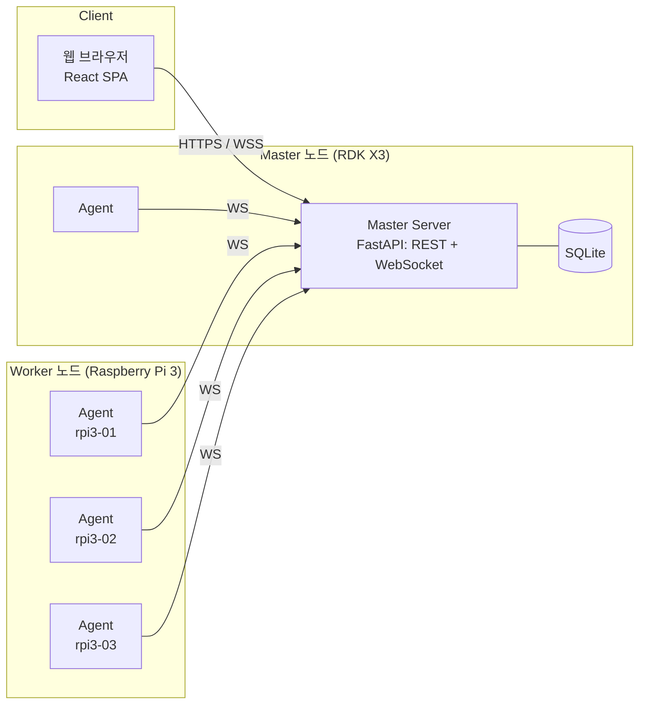
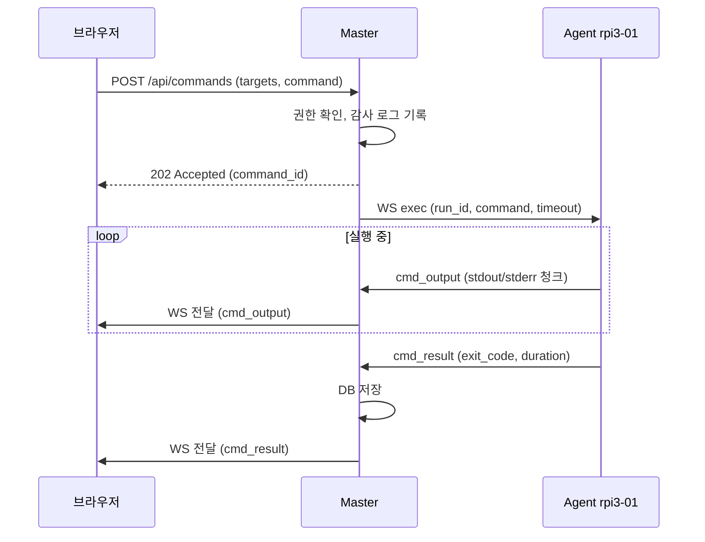

# Cluster Web 설계 계획서

> RDK X3 + Raspberry Pi 3로 구성한 클러스터의 상태를 실시간으로 보여주고,
> 웹에서 각 노드에 명령을 내릴 수 있는 관리 웹 서비스의 설계 문서.

---

## 1. 목표와 범위

### 핵심 목표
1. **모니터링** — 클러스터 전체·노드별 상태(CPU, 메모리, 온도, 디스크, 네트워크, RDK X3의 BPU 사용률 등)를 실시간 표시
2. **원격 제어** — 웹에서 단일/다중 노드에 명령 실행(사전 정의 동작 + 셸 명령), 실행 결과를 실시간 스트리밍
3. **이력 관리** — 메트릭 추이 그래프, 명령 실행 이력, 감사 로그

### MVP 완료 기준
- 모든 노드가 대시보드에 온라인/오프라인 상태와 함께 5초 주기로 갱신되어 표시된다
- 노드 하나 또는 여러 개를 선택해 명령을 실행하면 출력이 실시간으로 보이고, 종료 코드가 이력에 남는다
- 로그인한 사용자만 접근할 수 있고, 명령 실행은 권한(operator/admin)이 있는 사용자만 가능하다

### 이후 확장 (MVP 범위 밖)
웹 터미널, 파일 배포, 분산 작업 큐, 원격 전원 제어

---

## 2. 하드웨어 전제

| 항목 | RDK X3 | Raspberry Pi 3 (B / B+) |
|---|---|---|
| SoC | Sunrise X3, Cortex-A53 ×4 | BCM2837, Cortex-A53 ×4 |
| AI 가속 | BPU 5 TOPS (2코어) | 없음 |
| RAM | 2GB / 4GB | 1GB |
| 유선 LAN | 기가비트 | 100Mbps(3B) / USB2 기반 기가비트(3B+, 실효 ~300Mbps) |
| OS | RDK OS (Ubuntu 기반, 22.04 계열 권장) | Raspberry Pi OS Lite 64-bit 권장 |
| 역할 | **Master** + Worker(BPU 작업) | Worker |

**Master를 RDK X3에 두는 이유**: RAM과 네트워크 대역폭이 가장 넉넉하다. 마스터 프로세스 자체는 가벼우므로(목표 RSS 150MB 이하) BPU 작업과 공존할 수 있다.
RDK X3를 AI 전용으로 비워두고 싶다면 Pi 3 하나를 마스터로 지정해도 된다. 마스터 위치는 설정값일 뿐 설계에는 영향이 없다.

### 네트워크
- 모든 노드를 기가비트 스위치에 유선 연결, 공유기 DHCP 예약 또는 고정 IP
- 호스트명 규칙: `rdkx3-01`, `rpi3-01`, `rpi3-02`, …
- 시간 동기화 필수(chrony 또는 systemd-timesyncd). Pi에는 RTC가 없다

---

## 3. 전체 아키텍처



### 구성 요소
| 구성 요소 | 위치 | 역할 |
|---|---|---|
| **Agent** | 모든 노드(마스터 포함) | 메트릭 수집, 명령 실행, 결과 전송 |
| **Master Server** | RDK X3 | Agent 연결 관리, 상태 집계, REST/WebSocket API, 인증, 명령 중계, 이력 저장 |
| **Web UI** | 브라우저 | 대시보드, 노드 상세, 명령 센터, 이력, 설정 |

### 통신 방식: Agent → Master 상시 WebSocket (push 방식)
Agent가 마스터로 먼저 접속해 WebSocket 연결을 유지한다. 이 연결 하나로 메트릭 업로드와 명령 수신·출력 스트리밍을 모두 처리한다.

| 방식 | 장점 | 단점 |
|---|---|---|
| **A. Agent→Master WebSocket (채택)** | 양방향 실시간 출력 스트리밍, 마스터 포트 하나만 열면 됨, 노드 IP가 바뀌어도 무관 | 연결 관리·재접속 로직 필요 |
| B. Master가 각 Agent의 HTTP API 폴링 | 구현 단순 | 모든 노드에 HTTP 서버 노출(공격 표면 증가), 출력 스트리밍 어려움 |
| C. MQTT 브로커(Mosquitto) | IoT 표준, pub/sub | 브로커라는 구성 요소 추가, 명령-응답 매칭을 직접 구현해야 함 |

> Prometheus + node_exporter + Grafana 조합도 있지만 1GB RAM의 Pi 3에는 무겁고 명령 실행 기능이 없어 별도 도구가 또 필요하다. 이 프로젝트에는 직접 만드는 가벼운 구조가 맞다.

**Master는 단일 프로세스(Uvicorn worker 1개)로 운영한다.** Agent 연결 상태를 프로세스 메모리에 들고 있기 때문이며, 노드 수십 대 규모까지는 이것으로 충분하다.

### 명령 실행 흐름



---

## 4. 기술 스택

| 영역 | 선택 | 이유 |
|---|---|---|
| Agent | Python 3 + `psutil` + `websockets` | 두 보드 모두 Python 기본 탑재, 컴파일 불필요, RDK X3의 Python BPU API와 연동 쉬움 |
| Master | Python 3.10+ + FastAPI + Uvicorn | async 기반 WebSocket 기본 지원, 자동 API 문서(`/docs`) |
| DB | SQLite(WAL 모드) + SQLAlchemy/SQLModel | 별도 DB 서버 불필요, 소규모에 충분 |
| Frontend | React + TypeScript + Vite | 컴포넌트 기반 실시간 UI. **빌드는 개발 PC/CI에서** 하고 정적 파일만 마스터에 배포(클러스터에 Node.js 불필요) |
| UI / 차트 | Tailwind CSS, Chart.js(또는 uPlot) | 가볍다 |
| 프로세스 관리 | systemd | 부팅 시 자동 실행, 장애 시 자동 재시작 |
| 리버스 프록시(선택) | Caddy | HTTPS 설정이 간단(내부 CA 지원) |

**Python 호환성**: Agent는 의존성을 `psutil`, `websockets`, `PyYAML` 정도로 최소화해 오래된 RDK X3 이미지(Ubuntu 20.04, Python 3.8)에서도 돌게 한다. Master는 Python 3.10+를 기준으로 한다.

---

## 5. 모니터링 항목

### 공통 (psutil)
| 분류 | 항목 | 주기 |
|---|---|---|
| 정적 정보 | hostname, IP/MAC, OS·커널, CPU 모델·코어 수, 총 RAM, 보드 종류, Agent 버전 | 접속 시 1회 |
| CPU | 전체·코어별 사용률, 현재 클럭, load average | 5초 |
| 메모리 | 사용량, swap | 5초 |
| 디스크 | 파티션별 사용률, I/O | 5초 |
| 네트워크 | 인터페이스별 송수신 속도 | 5초 |
| 온도 | SoC 온도 | 5초 |
| 시스템 | uptime, 프로세스 수, 상위 프로세스 Top 5(CPU/메모리) | 15초 |

### Raspberry Pi 3 전용
- 온도: `vcgencmd measure_temp` 또는 `/sys/class/thermal/thermal_zone0/temp`
- **저전압·스로틀링**: `vcgencmd get_throttled` — Pi 3는 전원 어댑터 문제로 저전압이 흔하므로 대시보드 경고로 표시
  - bit 0 현재 저전압 / bit 1 클럭 제한 / bit 2 스로틀링 중 / bit 3 온도 소프트 제한
  - bit 16~19: 부팅 이후 위 상황이 발생한 적 있음
- 클럭·전압: `vcgencmd measure_clock arm`, `vcgencmd measure_volts core`

### RDK X3 전용
- **BPU 사용률**: `/sys/devices/system/bpu/bpu0/ratio`, `/sys/devices/system/bpu/bpu1/ratio`
- 온도: `/sys/class/hwmon/hwmon0/temp1_input` (단위 m°C)
- 종합 상태: `hrut_somstatus` (온도, CPU 클럭, BPU 사용률) — sysfs 경로를 못 찾을 때 출력 파싱으로 대체

> ⚠️ RDK X3 경로는 OS 이미지 버전에 따라 다를 수 있다. Phase 0에서 실기기로 확인한 뒤 확정한다.

### Collector 구조
```
collectors/
  base.py     # Collector 인터페이스: static_info(), collect() -> dict
  common.py   # psutil 기반 공통 수집
  rpi.py      # vcgencmd, throttled 플래그
  rdkx3.py    # BPU, hwmon 온도
```
- 보드 종류는 설정 파일의 `board` 값을 우선 쓰고, 없으면 `/proc/device-tree/model` 등으로 자동 감지한다
- 각 항목은 개별 try/except로 감싸 하나가 실패해도 나머지는 정상 전송한다(실패 값은 `null`)

---

## 6. 명령 기능 설계

명령은 위험도에 따라 세 단계로 나눈다.

| 단계 | 설명 | 필요 권한 | 예시 |
|---|---|---|---|
| ① 프리셋 동작 | 버튼으로 실행하는 사전 정의 명령. 파라미터는 검증된 값만 허용 | operator | 재부팅, 서비스 재시작, 로그 조회, apt update |
| ② 셸 명령 | 자유 입력 명령. Agent 전용 계정(root 아님)으로 실행 | admin | `df -h`, `python3 job.py` |
| ③ 웹 터미널 | xterm.js 기반 대화형 셸 (확장 단계) | admin | `htop`, `vim` |

### 프리셋 정의 예시 (`master/presets.yaml`)
```yaml
- id: system.reboot
  label: 재부팅
  argv: [sudo, /usr/sbin/reboot]
  role: operator
  confirm: true

- id: system.poweroff
  label: 전원 끄기
  argv: [sudo, /usr/sbin/poweroff]
  role: admin
  confirm: true
  warning: "끈 뒤에는 웹에서 다시 켤 수 없습니다 (전원을 다시 꽂아야 함)"

- id: service.restart
  label: 서비스 재시작
  argv: [sudo, /usr/bin/systemctl, restart, "{service}"]
  params:
    service: { type: enum, values: [cluster-agent, docker] }
  role: operator

- id: logs.journal
  label: 서비스 로그 보기
  argv: [journalctl, -u, "{unit}", -n, "{lines}", --no-pager]
  params:
    unit:  { type: enum, values: [cluster-agent, ssh] }
    lines: { type: int, min: 10, max: 1000, default: 100 }
  role: operator
```
프리셋은 **셸을 거치지 않고 argv 리스트로 실행**한다. 파라미터는 타입·범위 검증을 통과한 값만 치환되므로 명령 주입이 불가능하다.

### Agent 실행 규칙
- 프리셋은 `asyncio.create_subprocess_exec`, 셸 명령은 `create_subprocess_shell`로 실행하고 stdout/stderr를 청크 단위로 즉시 전송
- 기본 타임아웃 60초(최대 10분). 초과 시 프로세스 그룹 전체 종료(SIGTERM → 5초 후 SIGKILL)
- 사용자가 "중지"를 누르면 `cancel` 메시지로 같은 방식으로 종료
- 노드당 동시 실행 수 제한(Pi 3 기본 2개)
- 출력 저장 상한: 실행 1건당 256KB(초과 시 앞·뒤 부분만 보존)
- `reboot`/`poweroff`는 결과를 먼저 보낸 뒤 실행(연결이 끊겨 결과를 못 받는 문제 방지)

### 다중 노드 실행
- 대상 지정: 개별 선택, 보드 종류별(`board=rpi3`), 전체(`all`)
- 요청 1건 → 노드별 실행 건(`command_runs`)으로 분리, 화면에는 노드별 탭/분할 창으로 출력 표시
- 오프라인 노드는 즉시 `skipped` 처리

---

## 7. Agent ↔ Master 프로토콜

WebSocket 위의 JSON 메시지. 모든 메시지에 `type` 필드가 있다.

**Agent → Master**

| type | 시점 | 주요 필드 |
|---|---|---|
| `hello` | 접속 직후 | node_id, token, board, agent_version, static_info |
| `metrics` | 주기적(기본 5초) | ts, cpu, mem, disk, net, temp_c, extra |
| `cmd_output` | 명령 실행 중 | run_id, stream(stdout/stderr), data |
| `cmd_result` | 명령 종료 | run_id, status(ok/timeout/cancelled/error), exit_code, duration_ms |

**Master → Agent**

| type | 시점 | 주요 필드 |
|---|---|---|
| `welcome` | `hello` 인증 성공 | metrics_interval, server_time |
| `exec` | 명령 요청 | run_id, mode(preset/shell), argv 또는 command, timeout |
| `cancel` | 명령 중지 | run_id |
| `config` | 설정 변경 | metrics_interval 등 |

메트릭 메시지 예시:
```json
{
  "type": "metrics",
  "ts": 1791244800.0,
  "data": {
    "cpu":  { "percent": 23.5, "per_core": [20.1, 30.2, 18.0, 25.7], "freq_mhz": 1200, "load": [0.42, 0.37, 0.30] },
    "mem":  { "total": 1024000000, "used": 412000000, "percent": 40.2 },
    "temp_c": 51.3,
    "disk": [{ "mount": "/", "percent": 61.0 }],
    "net":  { "eth0": { "rx_bps": 12000, "tx_bps": 8000 } },
    "extra": { "throttled": "0x0" }
  }
}
```
RDK X3는 `extra`에 `{"bpu": [12, 0]}`처럼 BPU 코어별 사용률을 담는다.

### 연결 관리
- `hello`의 토큰 검증에 실패하면 즉시 연결 종료(close code 4401)
- `metrics`가 heartbeat 역할을 겸한다. 마지막 수신 후 15초(주기×3)가 지나면 offline 처리
- Agent는 연결이 끊기면 지수 백오프(1 → 2 → 4 … 최대 30초)로 재접속
- 저장 시각은 마스터 수신 시각을 기준으로 한다(노드 시계 오차 대비)

---

## 8. API 설계

### REST (prefix `/api`)
| Method | Path | 설명 | 권한 |
|---|---|---|---|
| POST | `/auth/login` | 로그인(세션 쿠키 발급) | - |
| POST | `/auth/logout` | 로그아웃 | 로그인 |
| GET | `/auth/me` | 현재 사용자 정보 | 로그인 |
| GET | `/cluster/summary` | 전체 요약(온라인 수, 총 코어/RAM, 평균 부하, 활성 경고) | viewer |
| GET | `/nodes` | 노드 목록 + 현재 상태 | viewer |
| GET | `/nodes/{id}` | 노드 상세(정적 정보 + 최신 메트릭) | viewer |
| GET | `/nodes/{id}/metrics?range=1h&step=1m` | 메트릭 이력 | viewer |
| POST | `/nodes` | 노드 등록 → Agent 토큰 발급 | admin |
| DELETE | `/nodes/{id}` | 노드 삭제(토큰 폐기) | admin |
| GET | `/presets` | 내 권한으로 실행 가능한 프리셋 목록 | viewer |
| POST | `/commands` | 명령 실행(targets + preset_id/params 또는 shell) | operator / admin |
| GET | `/commands` | 명령 이력(필터: 노드, 사용자, 기간) | viewer |
| GET | `/commands/{id}` | 실행 결과 상세(노드별 출력) | viewer |
| POST | `/commands/{id}/cancel` | 실행 중지 | operator |
| GET | `/alerts` | 현재/과거 경고 | viewer |
| GET, POST, PATCH, DELETE | `/users` | 사용자 관리 | admin |

### WebSocket
| Path | 연결 주체 | 용도 |
|---|---|---|
| `/ws/agent` | Agent | 메트릭 업로드, 명령 수신·결과 전송 |
| `/ws/ui` | 브라우저 | 실시간 메트릭, 노드 상태 변화, 경고, 명령 출력 수신 |
| `/ws/terminal/{node_id}` | 브라우저 | (확장) 웹 터미널 |

---

## 9. 데이터 모델과 저장 전략

```
users        (id, username, password_hash, role, created_at)
nodes        (id, name, board, token_hash, static_info JSON, last_seen, created_at)
metrics_1m   (node_id, ts, cpu_avg, cpu_max, mem_pct, temp_avg, temp_max,
              disk_pct, net_rx, net_tx, bpu_avg, extra JSON)
commands     (id, user_id, kind[preset|shell], preset_id, command_text,
              params JSON, targets JSON, created_at)
command_runs (id, command_id, node_id, status, exit_code, output,
              started_at, finished_at)
alerts       (id, node_id, kind, level, message, started_at, resolved_at)
audit_log    (id, user_id, action, detail JSON, ip, ts)
```

### SD카드 수명 고려
- 5초 단위 원본 메트릭은 **메모리 링버퍼**(노드당 최근 1시간, 720개)에만 보관 → 실시간 그래프용
- DB에는 **1분 집계값만** 기록하고, 기본 30일이 지나면 자동 삭제(설정 가능)
- SQLite WAL 모드, 쓰기는 배치로 묶어서 처리
- (선택) 마스터 DB를 USB SSD에 두면 안정성이 높아진다

---

## 10. 웹 UI 화면 구성

| 화면 | 내용 |
|---|---|
| **로그인** | 아이디/비밀번호 |
| **대시보드** | 상단 요약(온라인 노드 수, 총 코어·RAM, 평균 CPU, 최고 온도, 활성 경고) + 노드 카드 그리드 |
| **노드 상세** | 정적 정보, 시계열 그래프(CPU/메모리/온도/네트워크/BPU, 범위: 실시간·1시간·24시간·7일), 디스크, 상위 프로세스, 빠른 동작 버튼, 이 노드 전용 명령 입력창 |
| **명령 센터** | 대상 선택(개별/보드별/전체), 프리셋 선택 또는 셸 명령 입력, 노드별 실시간 출력 창, 종료 코드, 중지 버튼 |
| **이력** | 명령 실행 이력, 감사 로그(필터·검색) |
| **설정** | 사용자 관리, 노드 등록(토큰 발급), 경고 임계값, 메트릭 주기·보관 기간 |

대시보드 와이어프레임:
```
+--------------------------------------------------------------------+
| Cluster Web      [Dashboard] [Commands] [History] [Settings] admin |
+--------------------------------------------------------------------+
| Online 4/4 | Cores 16 | RAM 6.0GB | Avg CPU 23% | Max 58C | Alerts 1 |
+----------------+----------------+----------------+-----------------+
| rdkx3-01   (*) | rpi3-01    (*) | rpi3-02    (*) | rpi3-03     (*) |
| RDK X3 master  | Pi 3B+         | Pi 3B+         | Pi 3B  [!] UV   |
| CPU [###--] 31%| CPU [#----] 12%| CPU [##---] 25%| CPU [#----] 8%  |
| RAM [##---] 45%| RAM [###--] 52%| RAM [##---] 40%| RAM [##---] 38% |
| TMP 58C        | TMP 49C        | TMP 51C        | TMP 47C         |
| BPU [#----] 20%|                |                |                 |
| up 3d 4h       | up 3d 4h       | up 1d 2h       | up 6h           |
+----------------+----------------+----------------+-----------------+
```
(`[!] UV` = 저전압 경고)

### 경고 규칙 (기본값, 설정 가능)
| 조건 | 수준 |
|---|---|
| 노드 15초 이상 응답 없음 | critical |
| 온도 ≥ 70°C / ≥ 80°C | warning / critical |
| Pi 저전압 플래그 감지 | warning |
| 디스크 사용률 ≥ 90% | warning |
| 메모리 사용률 ≥ 90%가 5분 지속 | warning |

---

## 11. 보안 설계

원격 명령 실행 기능이 있으므로 **이 웹이 뚫리면 클러스터 전체가 뚫린다**는 전제로 설계한다.

1. **네트워크**: LAN 내부 전용. 공유기 포트포워딩 금지. 외부 접속이 필요하면 Tailscale/WireGuard 같은 VPN 사용
2. **웹 인증**: 비밀번호는 bcrypt/argon2 해시로 저장, HttpOnly + SameSite=Strict 세션 쿠키, 로그인 시도 횟수 제한. 최초 실행 시 admin 계정 생성을 강제(기본 비밀번호 없음)
3. **권한(RBAC)**: viewer(보기) / operator(프리셋 실행) / admin(셸 명령, 사용자·노드 관리)
4. **Agent 인증**: 노드별 개별 토큰(마스터에는 해시만 저장). 토큰을 폐기하면 그 노드는 즉시 차단
5. **Agent 권한 최소화**: 전용 계정 `cluster-agent`(root 아님)로 실행. root가 필요한 동작만 sudoers에 **전체 경로와 인자까지 명시**해서 허용
   ```
   # /etc/sudoers.d/cluster-agent
   cluster-agent ALL=(root) NOPASSWD: /usr/sbin/reboot, /usr/sbin/poweroff, \
       /usr/bin/systemctl restart cluster-agent, /usr/bin/systemctl restart docker, \
       /usr/bin/apt-get update
   ```
6. **명령 주입 방지**: 프리셋은 파라미터 검증 후 argv 리스트로 실행(셸 미사용)
7. **셸 명령 기능은 설정으로 끌 수 있게** 한다(`allow_shell: false`)
8. **감사 로그**: 누가·언제·어느 노드에·무엇을 실행했고 결과가 어땠는지 모두 기록. UI에는 삭제 기능을 두지 않는다
9. **전송 암호화**: Caddy로 HTTPS/WSS 제공(내부 CA 또는 자체 서명 인증서)
10. **시크릿 관리**: 세션 키 등은 `.env`/설정 파일로 관리하고 저장소에 커밋하지 않는다

---

## 12. 디렉터리 구조 (모노레포)

```
Cluster_Web/
├── README.md
├── docs/
│   ├── PLAN.md                  # 이 문서
│   └── protocol.md              # Agent↔Master 메시지 상세 명세 (Phase 2)
├── agent/                       # 모든 노드에서 실행
│   ├── cluster_agent/
│   │   ├── __main__.py          # 진입점 (--once, --mock 옵션)
│   │   ├── config.py
│   │   ├── connection.py        # WebSocket 연결, 재접속
│   │   ├── executor.py          # 명령 실행, 스트리밍, 타임아웃
│   │   └── collectors/
│   │       ├── base.py
│   │       ├── common.py        # psutil
│   │       ├── rpi.py           # vcgencmd
│   │       └── rdkx3.py         # BPU, hwmon
│   ├── tests/
│   └── requirements.txt
├── master/                      # RDK X3에서 실행
│   ├── app/
│   │   ├── main.py              # FastAPI 앱, 정적 파일(SPA) 서빙
│   │   ├── config.py
│   │   ├── db.py
│   │   ├── models.py
│   │   ├── auth.py              # 세션, RBAC
│   │   ├── api/                 # auth, nodes, commands, users, alerts
│   │   ├── ws/
│   │   │   ├── agent_hub.py     # Agent 연결 관리
│   │   │   └── ui_hub.py        # 브라우저 브로드캐스트
│   │   └── services/
│   │       ├── metrics_store.py # 링버퍼 + 1분 집계
│   │       ├── commands.py      # 명령 분배, 결과 수집
│   │       └── alerts.py
│   ├── presets.yaml
│   ├── tests/
│   └── requirements.txt
├── web/                         # React + Vite (빌드 결과만 마스터에 배포)
│   ├── src/
│   │   ├── pages/               # Login, Dashboard, NodeDetail, Commands, History, Settings
│   │   ├── components/          # NodeCard, Gauge, MetricChart, CommandOutput, ...
│   │   ├── api/                 # REST 클라이언트, WebSocket 훅
│   │   └── store/
│   └── package.json
├── deploy/
│   ├── systemd/                 # cluster-master.service, cluster-agent.service
│   ├── sudoers.d/cluster-agent
│   ├── install_master.sh
│   ├── install_agent.sh
│   └── ansible/                 # (선택) 전 노드 일괄 배포
├── scripts/
│   └── dev_cluster.sh           # 로컬 개발: master + mock agent N개 실행
└── .github/workflows/ci.yml
```

---

## 13. 배포와 운영

- **Master**: `/opt/cluster-web`에 Python venv로 설치, `cluster-master.service`(systemd)로 `uvicorn app.main:app --host 0.0.0.0 --port 8000 --workers 1` 실행
- **Web**: 개발 PC/CI에서 `npm run build` → `web/dist`를 마스터로 복사, FastAPI가 정적 파일로 서빙(SPA fallback 포함)
- **Agent**: `deploy/install_agent.sh --master ws://rdkx3-01:8000/ws/agent --token <TOKEN>`
  1. `cluster-agent` 계정 생성
  2. `python3-psutil` 등을 apt로 설치(32-bit Pi OS에서도 빌드 없이 설치됨)
  3. `/etc/cluster-agent/config.yaml` 작성
  4. sudoers 파일 설치 후 `visudo -c`로 문법 검증
  5. `cluster-agent.service` 활성화(`Restart=always`)
- **일괄 배포(선택)**: Ansible 플레이북으로 전 노드에 한 번에 설치·업데이트
- **업데이트**: 초기에는 git pull + 재시작 스크립트, 이후 "Agent 업데이트" 프리셋으로 웹에서 일괄 업데이트
- **백업**: SQLite DB를 하루 1회 `sqlite3 ... ".backup ..."`으로 백업

---

## 14. 개발 단계 (마일스톤)

| Phase | 내용 | 완료 기준 |
|---|---|---|
| **0. 환경 준비** | OS 설치, 고정 IP·호스트명, SSH 키, 시간 동기화, **실기기에서 메트릭 경로 확인**(vcgencmd, BPU sysfs, hrut_somstatus) | 모든 노드 SSH 접속 가능, 메트릭 명령 출력 샘플 기록 |
| **1. Agent MVP** | 공통·보드별 collector, `--once`로 JSON 출력, `--mock` 모드 | 각 보드에서 `python -m cluster_agent --once`가 올바른 JSON 출력 |
| **2. Master MVP** | FastAPI 골격, `/ws/agent` 허브, 메모리 상태 관리, `/api/nodes`, `/ws/ui` | mock agent 4개 접속 시 API로 상태 조회, 연결 끊으면 offline 감지 |
| **3. 대시보드 MVP** | React 골격, 로그인, 대시보드·노드 카드 실시간 갱신 | 브라우저에서 노드 카드가 5초마다 갱신 |
| **4. 명령 기능** | 프리셋/셸 실행, 출력 스트리밍, 중지, 다중 노드, 이력·감사 로그, RBAC | 3개 노드에 동시에 `uptime` 실행 시 노드별 출력·종료 코드 표시, 이력 저장 |
| **5. 이력·그래프·경고** | 1분 집계 저장, 노드 상세 그래프, 경고 규칙·표시 | 24시간 그래프 표시, 온도 임계값 초과 시 경고 표시 |
| **6. 배포·운영** | systemd 유닛, 설치 스크립트, HTTPS, 백업 | 클러스터 재부팅 후 전 노드 자동 복귀, 실기기에서 MVP 시나리오 통과 |
| **7. 확장(선택)** | 웹 터미널, 파일 업로드·배포, 작업 큐(BPU 작업은 RDK X3로 라우팅), Docker 관리, 스마트 플러그/릴레이 원격 전원 제어 | — |

- **MVP = Phase 0~4**
- Phase 1~5는 하드웨어 없이 PC에서 mock agent로 개발할 수 있다. 실기기 검증은 Phase 0과 6에서 집중적으로 한다

---

## 15. 테스트 전략

- **Agent**: collector 단위 테스트 — `vcgencmd`/`hrut_somstatus` 출력과 sysfs 파일 내용을 fixture로 만들어 파싱 검증(실기기 없이 실행 가능)
- **Master**: pytest + FastAPI TestClient — 인증·RBAC, 명령 라우팅, offline 판정, 가짜 Agent WebSocket으로 프로토콜 검증
- **Frontend**: TypeScript 타입 체크, 주요 컴포넌트 Vitest
- **E2E**: master + mock agent N개 + Playwright로 "로그인 → 대시보드 → 명령 실행" 시나리오
- **CI**: GitHub Actions에서 ruff(lint), pytest, `npm run build`
- **실기기 리소스 예산**: Pi 3에서 Agent RSS 40MB 미만, CPU 3% 미만

---

## 16. 리스크와 대응

| 리스크 | 대응 |
|---|---|
| Pi 3 저전압 → 불안정·SD 손상 | 5V 2.5A 이상 어댑터 사용, throttled 플래그 경고로 조기 발견 |
| SD카드 수명·손상 | 1분 집계만 기록, journald 용량 제한(`SystemMaxUse`), 마스터 DB는 USB SSD 고려 |
| 원격으로 전원을 끄면 다시 켤 수 없음 | 종료 버튼에 경고 + 확인 단계, 필요하면 스마트 플러그·PoE 스위치(3B+는 PoE HAT)로 전원 제어 확장 |
| 마스터 장애 시 웹 전체 중단 | Agent는 마스터 없이도 정상 동작(재접속 대기), 마스터는 systemd 자동 재시작 |
| RDK X3 메트릭 경로가 OS 버전마다 다름 | collector가 여러 경로를 탐색 + `hrut_somstatus` 파싱 fallback, Phase 0에서 확인 |
| Pi 3 RAM(1GB) 부족 | Agent 의존성 최소화, 마스터는 RDK X3에 배치 |
| 명령 기능 악용 | 11장 보안 설계, LAN 전용 운영 |

---

## 17. 확인이 필요한 결정 사항

1. **노드 구성**: RDK X3 몇 대, Pi 3 몇 대? Pi 모델은 3B인지 3B+인지?
2. **마스터 위치**: RDK X3(권장) / Pi 3 중 하나
3. **클러스터 용도**: 관리·모니터링 중심인지, 분산 작업 실행(예: BPU 추론 작업 분배)까지 하는지. 후자라면 Phase 7 작업 큐의 우선순위를 높인다
4. **외부 접속**: LAN 전용(권장) / VPN(Tailscale 등)으로 외부 접속
5. **셸 명령 자유 실행**: admin에게 허용(기본, 설정으로 끌 수 있음) / 프리셋만 허용
6. **프론트엔드**: React(권장) / Vue / 빌드 없는 순수 HTML+JS
7. **OS 버전**: RDK X3 이미지 버전, Pi OS 32-bit / 64-bit
