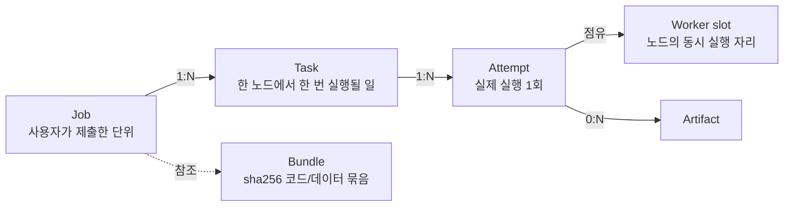
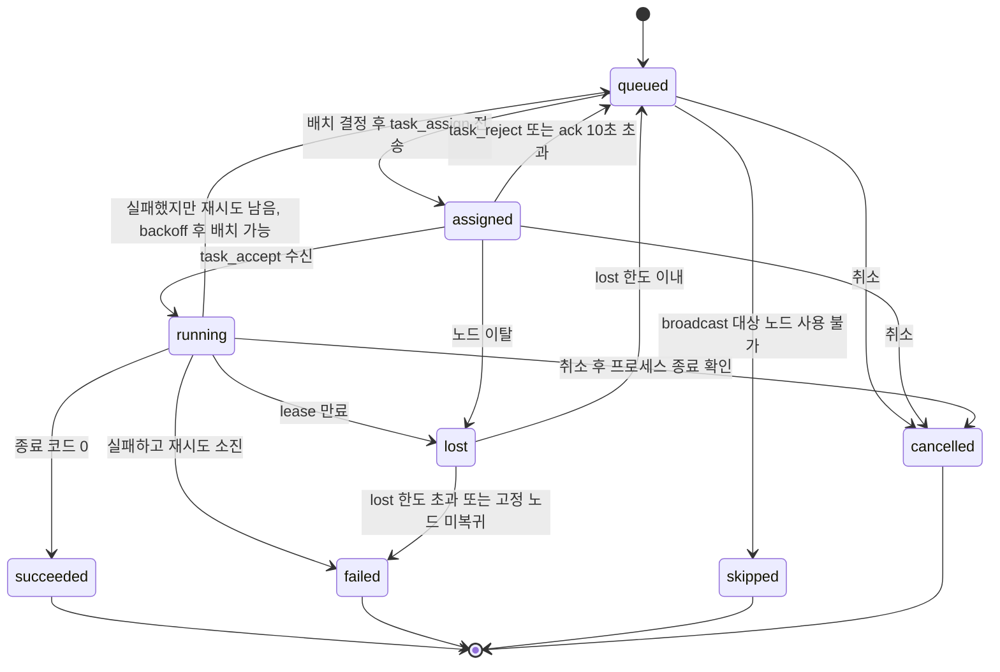
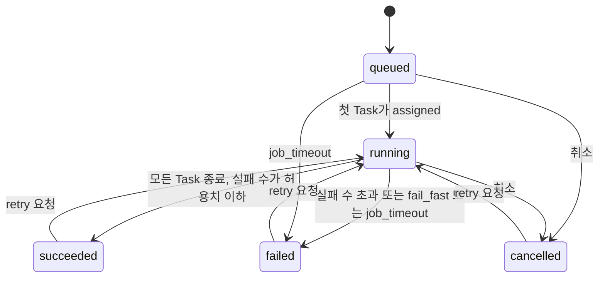
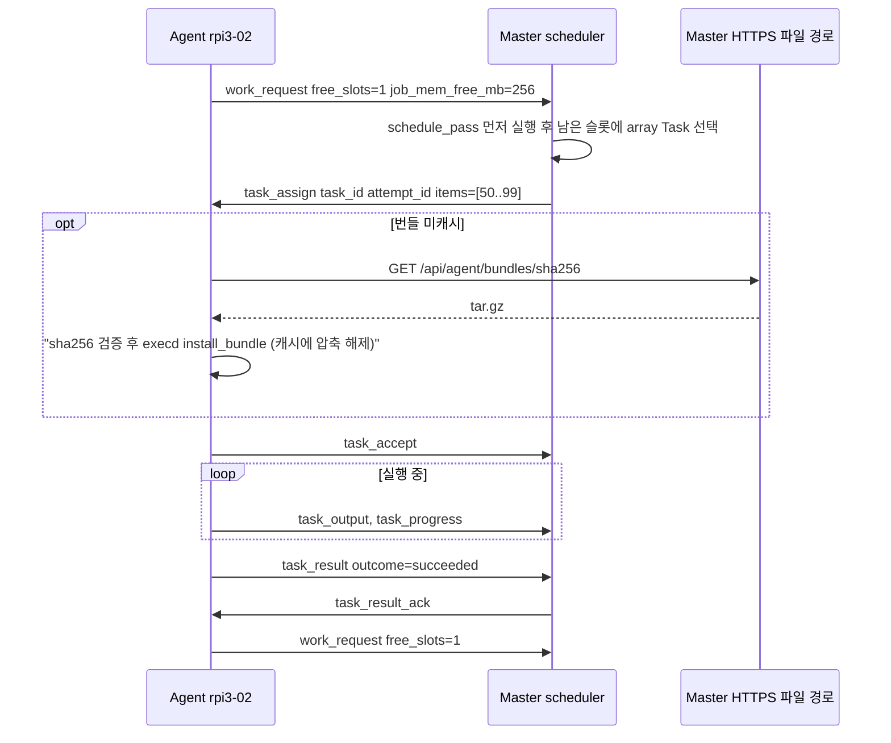
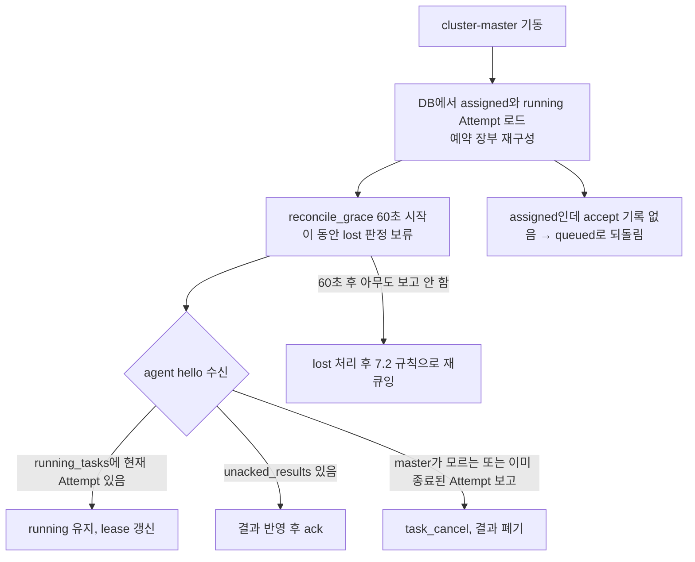

# 분산 작업(잡) 시스템 설계

> 노드가 들어오고 나가도 계속 돌아가는 잡 큐: 실시간 부하·온도 기반 배치, RDK X3 BPU 라우팅, pull 방식 동적 분배, 노드 장애 시 자동 재배치.

**관련 문서**: [PLAN.md](../PLAN.md) · [topology.md](./topology.md) · [security.md](./security.md) · [telegram.md](./telegram.md) · [ai-agent.md](./ai-agent.md)

이 문서가 정하는 것과 다른 문서로 넘기는 것:

| 주제 | 이 문서 | 다른 문서 |
|---|---|---|
| Job/Task/Attempt 모델, 스케줄러, 재시도·재배치, 잡 프로토콜·API·테이블 | 정의 | — |
| 노드 레이블, 기본 용량(`slots`, `bpu_slots`, `job_mem_mb`), 대역폭 수치 | 사용만 | [topology.md](./topology.md) 1.2절·3.4절·6장 |
| `cluster-agent` → `cluster-run` 실행 위임(cluster-execd), 샌드박스 속성, as_root, 위험도 함수 `risk_of()`, 승인 정책, 서비스 토큰 | 요구사항·사용만 | [security.md](./security.md) 7·9·11장 |
| job.finished 보고 메시지 형식, `notify` 값 정의, 텔레그램에서 잡 제출 | 이벤트 계약만 | [telegram.md](./telegram.md) 6장 |
| AI의 `submit_job` 툴 동작 | 잡 쪽 계약만 | [ai-agent.md](./ai-agent.md) |

---

## 1. 요구사항 정리

"유동적" 요구를 다음 5가지로 해석한다.

| # | 요구 | 설계 대응 |
|---|---|---|
| F1 | 노드가 들어오고 나가도 동작 | 배치 대상은 잡 제출 시점이 아니라 **배치 시점의 온라인 노드**. 새 노드는 `hello` 직후 후보가 되고, array 잡은 즉시 pull을 시작 |
| F2 | 실시간 부하/온도 기반 배치 | 5초 `metrics`를 필터(온도·스로틀·메모리)와 점수(부하·슬롯·지역성)에 사용 (5장) |
| F3 | 이기종 자원(BPU) 라우팅 | `resources.bpu` → `bpu_slots > 0` 노드(= `board=rdkx3`)만 후보 (12장) |
| F4 | 장애 시 자동 재배치 | 태스크 lease + heartbeat 만료 → `lost` → 재큐잉. at-least-once (7장) |
| F5 | 빠른 노드가 더 많이 처리 | array 잡은 agent가 슬롯이 빌 때마다 다음 항목을 가져가는 pull 방식 (6장) |

**v1 범위 밖**: 선점(preemption), DAG, Docker 런타임, cron 스케줄 실행, 자동 HA master.

---

## 2. 개념 모델



| 개념 | 정의 | 예 |
|---|---|---|
| **Job** | 사용자가 제출한 작업 명세 1건. 상태와 집계(성공/실패 수)를 가진다 | "사진 5000장 BPU 추론" |
| **Task** | Job을 쪼갠 실행 단위. single은 1개, broadcast는 대상 노드당 1개, array는 항목 묶음(chunk)당 1개 | "항목 0~49 처리" |
| **Attempt** | Task의 실행 1회. 노드·시작/종료 시각·종료 코드·로그를 가진다. 재시도/재배치마다 새 Attempt | "rdkx3-02에서 2번째 시도" |
| **Worker slot** | 노드가 광고하는 동시 실행 자리. 일반 슬롯(`slots`)과 BPU 슬롯(`bpu_slots`)은 **별개 풀**이고 메모리(`job_mem_mb`)는 공유 | rpi3-01: slots 2, bpu_slots 0 |

- 모든 Job/Task/Attempt ID는 **ULID**(시간순 정렬 가능한 랜덤 ID)다. 정수 autoincrement를 쓰지 않는 이유: 콜드 스탠바이 failover로 백업 시점 DB가 복원되면 ID가 재발급되어 아직 살아 있는 agent의 Attempt와 충돌할 수 있다([topology.md](./topology.md) 7.3절).
- **명령(command)은 이 모델 밖**이다. 명령은 큐 없이 즉시 실행되고 슬롯을 차지하지 않는다. 차이는 15장.

### 2.1 Task 상태 머신



| 상태 | 의미 | 종료? |
|---|---|---|
| `queued` | 배치 대기. `not_before`(재시도 backoff)가 지나야 배치 후보 | |
| `assigned` | `task_assign`을 보냈고 `task_accept` 대기 (슬롯은 이미 예약) | |
| `running` | agent가 실행 시작을 확인. lease가 살아 있음 | |
| `lost` | 노드가 사라져 결과를 알 수 없음. 즉시 재큐잉 판단 (순간 상태) | |
| `succeeded` / `failed` / `cancelled` | 최종 결과 | 예 |
| `skipped` | broadcast 대상 노드가 오프라인/코든이라 실행하지 않음 (PLAN.md 8장 명령의 `skipped`와 같은 의미) | 예 |

**Attempt 결과(`task_attempts.outcome`)** 는 더 세분한다: `succeeded`, `error`(종료 코드 ≠ 0), `timeout`, `oom`, `cancelled`, `lost`, `rejected`. Task 상태 전이는 이 결과와 재시도 정책(7.2절)으로 결정된다.

### 2.2 Job 상태



- 승인이 필요한 제출(AI, 텔레그램의 medium 이상)은 **승인 전에는 `jobs` 행을 만들지 않는다.** 명세는 `approvals.payload`에만 존재하고, 사람이 승인하는 순간 master가 그 payload 그대로 잡을 생성한다(security.md 7.5-8, 14.2절).
- 성공 판정: `failed_tasks ≤ failure_policy.max_failed_tasks` (기본 0). `skipped`는 실패로 세지 않지만 보고에 표시한다.

---

## 3. 잡 유형

| 유형 | Task 생성 | 배치 방식 | 대표 용도 | 단계 |
|---|---|---|---|---|
| **single** | 1개 | master가 최적 노드 1대 선택(push) | 스크립트 1회 실행, 모델 변환 | v1 |
| **broadcast** | 조건에 맞는 노드당 1개 (제출 시점에 대상 확정, 노드 고정) | push. `max_parallel`로 롤링 | 전 노드 패키지 업데이트, 설정 배포, 점검 | v1 |
| **array** | 항목 목록을 `chunk_size`로 나눈 묶음당 1개 (노드 미정) | agent가 슬롯이 비면 요청(pull) | 이미지 일괄 추론, 파라미터 스윕 | v2 |
| DAG / 파이프라인 | 잡 간 의존성 | — | 전처리 → 추론 → 병합 | 나중 |
| Docker 런타임 | `runtime: docker` | — | 의존성 격리 | 나중 |

**broadcast 세부 규칙**

- 대상 = 제출 시점에 `constraints`를 만족하는 등록 노드 전체. 그 시점에 오프라인/코든인 노드는 `broadcast.on_unavailable`에 따라 `skip`(기본, 즉시 `skipped`) 또는 `wait`(`wait_timeout_s`까지 대기 후 `skipped`).
- Task가 노드에 고정되므로 **lost 시 다른 노드로 옮기지 않는다.** 노드가 lease 유예(7.1절) 안에 돌아와 `running_tasks`로 보고하면 그대로 계속한다. 유예가 지나 `lost`가 되면 같은 노드에 다시 큐잉(`max_lost` 소모)하고 노드 복귀를 `broadcast.wait_timeout_s`(기본 600초)까지 기다린 뒤, 복귀하지 않으면 `failed(lost)`.
- 롤링: 동시에 `running`인 Task ≤ `max_parallel`. 실행 순서는 `broadcast.order`(기본: 이름순, **`node_role=master` 노드는 맨 마지막**).
- 실패 처리: 실패 수가 `failure_policy.max_failed_tasks`를 넘으면 남은 `queued` Task를 `cancelled(rollout_stopped)`로 바꾸고 롤아웃을 멈춘다.
- `broadcast.settle_s`: 한 노드 성공 후 다음 노드로 넘어가기 전 대기. 대기 후 해당 노드가 online이고 metrics가 신선하지 않으면(예: 재부팅 후 미복귀) 그 Task를 실패로 본다.

**array 세부 규칙** — 6장.

---

## 4. 잡 명세

명세는 YAML 또는 JSON. master는 정규화(기본값 채움, 키 정렬)한 JSON을 `jobs.spec`에 저장하고 `spec_hash = sha256(정규화 JSON)`을 함께 저장한다(승인 해시 검증에 사용).

### 4.1 전체 예시 (array + BPU)

```yaml
name: bpu-infer-photos
type: array                    # single | broadcast | array
runtime: python                # shell | python | preset | template
bundle: sha256:9f2c4e...       # runtime=python 필수. POST /api/bundles 결과
entrypoint: infer.py           # 번들 안 경로 (bundle.yaml의 기본값을 덮어씀)
args: ["--model", "yolov5s_672x672_nv12.bin"]
env: { BATCH: "8" }            # 비밀값 금지 (viewer도 명세를 볼 수 있음). 프로세스에는 CW_BATCH로 보임
data:                          # 선택. 읽기 전용 데이터 번들 (11장)
  - { name: photos, bundle: "sha256:51ab07..." }
items:
  range: { start: 0, stop: 5000 }   # 또는 list: [...] 또는 file: items.jsonl (번들 안)
chunk_size: 50                 # Task 1개 = 항목 50개
resources: { cpu: 1.0, mem_mb: 384, bpu: 1 }
network: none                  # none(기본) | internet | lan  (security.md 11.2)
constraints:
  board: [rdkx3]               # bpu: 1 이면 자동으로 rdkx3로 좁혀짐. 명시는 선택
  labels: { arch: aarch64 }
  nodes: []                    # 명시 지정 (비우면 제한 없음)
  exclude_nodes: []
placement: least_loaded        # least_loaded | spread | pack  (single/broadcast에 의미, array는 6장)
max_parallel: 3                # 잡 전체 동시 running Task 상한 (0 = 제한 없음)
max_per_node: 0                # 노드당 동시 running 상한 (0 = 슬롯만큼)
retries: 2                     # error/timeout/oom 재시도 횟수
retry_on: [error, timeout, oom]
timeout: 900                   # Attempt당 초 (기본 600, 최대 86400)
job_timeout: 14400             # 잡 전체 (선택)
priority: 5                    # 0~9, 클수록 먼저
failure_policy: { max_failed_tasks: 2, fail_fast: false }
outputs:
  paths: ["out/*.jsonl"]       # 작업 디렉터리 기준 glob → 아티팩트
  max_task_mb: 20
  max_job_mb: 500
  log_kb: 64                   # Attempt당 보존 로그 (array 기본 64, 그 외 256)
notify: default                # default | always | failure | never  (telegram.md 6.1)
as_root: false                 # 잡에서는 v1에 true 불가 (9.6절)
```

### 4.2 필드 표

| 필드 | 타입 / 기본값 | 적용 유형 | 설명 |
|---|---|---|---|
| `name` | str, 필수 | 전부 | 1~64자 `[a-z0-9._-]` |
| `type` | enum, 필수 | | `single` / `broadcast` / `array` |
| `runtime` | enum, 필수 | | `shell`(셸 문자열) / `python`(번들) / `preset`(presets.yaml의 argv) / `template`(admin이 등록한 템플릿) |
| `command` | str | shell | `/bin/sh -c`로 실행 (명령과 같은 셸, security.md 9.3) |
| `bundle`, `entrypoint`, `args` | sha256, str, list | python | `python3 -B <bundle_dir>/<entrypoint> <args...>` |
| `preset` | `{id, params}` | preset | PLAN.md 8장 프리셋 정의와 같은 검증 경로. 프리셋의 `role`이 제출 권한이 됨 |
| `template` | `{id, params}` | template | 9.5절 |
| `env` | map | 전부 | 값 ≤ 4KB, 키 `[A-Z_][A-Z0-9_]*`, 최대 32개. 프로세스에는 **`CW_<KEY>`로 노출**된다(execd 허용 규칙, security.md 9.3). `CLUSTER_*`는 execd가 만드는 예약 변수라 지정 불가 |
| `network` | enum / `none` | 전부 | `none`이면 `PrivateNetwork=yes`. `internet`/`lan`은 명세·템플릿이 선언할 때만. 위험도 계산과 승인 화면에 강조 표시 |
| `data` | list | 전부 | 읽기 전용 데이터 번들 (11장) |
| `items` | `list` \| `range` \| `file` | array | `list` JSON ≤ 1MB, 더 크면 `file` |
| `chunk_size` | int / 1 | array | Task당 항목 수. Task 수 ≤ 10,000이 되도록 제출 시 검증 |
| `resources.cpu` | float / 1.0 | 전부 | `CPUQuota = cpu × 100%`. 슬롯 1개를 차지하는 건 동일 |
| `resources.mem_mb` | int / 256 | 전부 | `MemoryMax`이자 배치 시 예약량 |
| `resources.bpu` | 0 \| 1 / 0 | 전부 | 1이면 `bpu_slots` 1개 사용(일반 슬롯 대신) |
| `constraints` | | 전부 | `board`(목록), `labels`(정확 일치), `nodes`, `exclude_nodes`. 레이블 키는 [topology.md](./topology.md) 1.2절. 배치용 레이블은 **master 등록값**으로 판정한다(노드 자가 보고 아님, security.md 8.3) |
| `placement` | enum / least_loaded | single, broadcast | 5.3절 |
| `max_parallel` | int / 0 | 전부 | broadcast 롤링은 1 |
| `broadcast` | `{on_unavailable: skip\|wait, wait_timeout_s, order, settle_s}` | broadcast | 3장 |
| `retries` / `retry_on` | int 2 / `[error, timeout]` | 전부 | broadcast의 preset은 기본 0 |
| `timeout` / `job_timeout` | int 초 | 전부 | 초과 시 프로세스 그룹 종료 |
| `priority` | 0~9 / 5 | 전부 | operator 상한 7, admin 9. AI 제출 기본 4 |
| `failure_policy` | `{max_failed_tasks: 0, fail_fast: false}` | 전부 | `fail_fast: true`면 첫 최종 실패에서 나머지 취소 |
| `outputs` | | 전부 | 10.4절 |
| `notify` | enum / `default` | 전부 | `default`\|`always`\|`failure`\|`never` — 정의는 [telegram.md](./telegram.md) 6.1. AI 제출 잡 기본 `never` |
| `as_root` | bool / false | 전부 | v1은 true면 400 거부 |

### 4.3 제출 시 검증 (POST /api/jobs, `POST /api/jobs/validate`)

1. 스키마·한도 검증(18장 한도표).
2. 권한: runtime별 필요 역할(9.5절) ≤ 제출자 역할. service principal은 `on_behalf_of` 사용자의 역할로 판정.
3. 참조 검증: bundle/data sha256 존재, preset/template id 존재와 params 검증.
4. **배치 가능성 사전 점검**: 제약을 만족하는 등록 노드가 0대면 400. 지금 온라인인 후보가 0대면 경고만(노드 복귀 시 실행).
5. `validate`는 위 결과 + 예상 Task 수 + 후보 노드 목록 + 위험도(`risk_of()`, 14.2절)를 돌려주고 아무것도 만들지 않는다(UI 미리보기, AI의 사전 점검용).

---

## 5. 스케줄러 (master)

`master/app/services/scheduler.py`. cluster-master 프로세스 안의 asyncio 태스크 하나로 돈다(Uvicorn 단일 worker 전제, PLAN.md 4장).

### 5.1 입력: agent가 광고하는 자원

- big.LITTLE 노드(ODROID-N2 계열, topology.md 1.1.1): `slots`는 big 코어 수(4)다. v1에서는 커널 스케줄러에 맡기고, v2에서 execd가 `odroidn2` 노드의 잡 유닛에 `AllowedCPUs=2-5`(cgroup v2 cpuset, 커널 6.x 이미지 전제)를 걸어 little 코어 2개를 agent·master 몫으로 남긴다. 레이블 `big_cores`가 그 근거다. `extra.thermal_throttle=true`인 노드는 Pi의 throttled 비트와 같이 신규 배치에서 제외한다.
- 노드 레이블과 용량(`slots`, `bpu_slots`, `job_mem_mb`): **master의 노드 등록 레코드가 권위값**이다. `hello.static_info`의 보고값은 등록 시 기본값 제안과 불일치 경고에만 쓴다 — [topology.md](./topology.md) 1.2절, security.md 8.3.
- `metrics` (5초): 기존 필드 + 아래 `sched` 블록. **이 메시지가 실행 중 Attempt의 lease 갱신도 겸한다.**

```json
{
  "type": "metrics",
  "ts": 1791244800.0,
  "data": { "cpu": {"percent": 63.0, "load": [2.1, 1.8, 1.5]}, "mem": {"available": 402000000}, "temp_c": 58.2,
            "extra": {"throttled": "0x0"} },
  "sched": {
    "free_slots": 1, "free_bpu_slots": 0, "job_mem_free_mb": 256,
    "running": ["01JA8Z...attempt", "01JA90...attempt"],
    "cached_bundles": ["9f2c4e", "51ab07"]
  }
}
```

master는 자체 **예약 장부**(노드별 assigned/running Attempt의 슬롯·메모리 합)를 권위 있는 값으로 쓰고, agent의 `sched` 값은 교차 확인용이다. 둘이 어긋나 agent가 받을 수 없으면 `task_reject(no_capacity)`로 경합을 해소한다.

### 5.2 필터 (하나라도 걸리면 후보 제외)

| # | 조건 | 기본값 / 출처 |
|---|---|---|
| 1 | 노드 `online`이고 마지막 metrics ≤ 15초 | PLAN.md 12장 |
| 2 | 스케줄 상태가 `active` (코든·드레인 아님) | 8장 |
| 3 | `constraints` 만족 (board, labels, nodes, exclude_nodes), `arch` 일치 | 4.2절 |
| 4 | 슬롯: `bpu=0`이면 일반 슬롯 여유 ≥ 1, `bpu=1`이면 BPU 슬롯 여유 ≥ 1 | 장부 |
| 5 | 메모리: `job_mem_mb − 예약합 ≥ mem_mb` **그리고** 실측 `MemAvailable − mem_mb ≥ 150MB` | 둘 다 만족 (명령·OS 사용분 반영) |
| 6 | 온도 `< 70°C` (PLAN.md 7.4 warning 임계와 동일). 한 번 걸리면 `< 65°C`가 될 때까지 제외(히스테리시스) | `scheduler.temp_block_c`, `temp_resume_c` |
| 7 | Pi `throttled` 현재 비트(bit 0 저전압, bit 2 스로틀링) 꺼짐. 과거 비트(16~19)는 경고만 | PLAN.md 7장 |
| 8 | 잡의 `max_parallel`, `max_per_node` 여유 | 4.2절 |
| 9 | Task의 `avoid_nodes`에 없음. 단 다른 후보가 0대면 무시(소프트) | 7.3절 |
| 10 | 잡 단위 노드 차단 목록(`jobs.blocked_nodes`)에 없음 | 7.3절 |
| 11 | runtime이 `shell`/`python`이면 노드 격리 모드가 `systemd`(모드 A)일 것. 모드 B(`fallback`) 노드에는 임의 코드 잡을 배치하지 않는다 | security.md 11.2 |

RDK X3의 스로틀링 신호는 온도 외에 확인된 것이 없다(Phase 0 R4에서 trip point 확인 후 필요 시 조건 추가).

### 5.3 점수 (single, broadcast의 노드 선택)

```text
cpu_util   = min(1, load1 / cpus)            # metrics.cpu.load[0]
slot_free  = free_slots / slots              # BPU 잡이면 bpu 슬롯 기준
mem_free   = (job_mem_mb - reserved) / job_mem_mb
temp_room  = clamp((70 - temp_c) / 30, 0, 1)
locality   = 0.3  if 필요한 bundle/data가 모두 캐시됨   else 0
net_pen    = 0.3  if (bundle+data 크기 ≥ 100MB) and net_mbps < 1000  else 0
master_pen = 0.3  if node_role == master  else 0

least_loaded = 0.4*(1-cpu_util) + 0.3*slot_free + 0.2*mem_free + 0.1*temp_room
               + locality - net_pen - master_pen
spread       = least_loaded - 0.5 * (이 잡의 running Task 수 on node)
pack         = least_loaded*0.2 + 0.5 * (이 잡의 running Task 수 on node)   # 한 노드부터 채움
동점: 노드 이름순
```

- 가중치는 시작값이며 `scheduler.weights`로 조정한다. 데이터 크기 페널티는 [topology.md](./topology.md) 3.4절의 "100MB 이상 입력은 1Gbps 노드 우선" 규칙을 구현한 것이다.
- `master_pen`으로 rdkx3-01(master)에는 다른 후보가 없을 때만 배치된다. BPU 잡이 rdkx3-02를 먼저 채우는 것도 이 페널티 덕분이다([topology.md](./topology.md) 6.2절).

### 5.4 실행 루프와 큐 순서

스케줄 패스는 이벤트 기반 + 2초 tick으로 돈다: 잡 제출, Task 종료, `node.online`, 코든 해제, `work_request` 수신 시 즉시 1회.

```text
schedule_pass():
  candidates = queued Task (not_before ≤ now, 잡의 max_parallel 여유)
               정렬: priority desc, job.created_at asc, task.idx asc
  for task in candidates (single/broadcast만):        # array Task는 pull로만 나간다 (6장)
      nodes = filter(task) → score(task.placement) → 최고점 노드
      있으면 예약 장부에 기록 → task_assign 전송 → task.state = assigned
```

**우선순위 기본 규칙 (v1)**

| 규칙 | 내용 |
|---|---|
| 우선순위 | `priority` 0~9. 높은 쪽 먼저, 같으면 제출 순서 |
| 잡 간 공정성 | 같은 우선순위의 array 잡끼리는 running Task가 적은 잡에 먼저 준다(라운드로빈 효과) |
| 선점 | 없음. 높은 우선순위 잡도 실행 중 Task를 밀어내지 않는다 |
| 나중 | aging(대기 10분마다 +1), 사용자 공정성(`max_running_share_per_user`). 사용자가 사실상 1명이고 AI도 그 사용자 대신 동작하므로 v1에서는 효용이 없다 |

명령(command)은 이 큐를 거치지 않으므로 잡이 꽉 차도 대화형 명령은 즉시 실행된다. 대신 명령이 쓰는 CPU/메모리는 metrics로 필터 5·점수에 반영된다.

---

## 6. array 잡의 pull 분배

### 6.1 흐름



### 6.2 규칙

- agent는 다음 시점에 `work_request`를 보낸다: `welcome` 직후, Task 종료 직후(`task_result_ack` 수신 후), 빈 슬롯이 있는 동안 30초마다. 응답할 일이 없으면 master는 `work_none {retry_after_s}`.
- master는 `work_request`를 받으면 **먼저 `schedule_pass()`** 를 돌려 대기 중인 single/broadcast Task가 이 노드를 원하면 우선 배정하고, 남은 슬롯만큼 array Task를 5.4절 순서로 고른다. 노드 필터(5.2절)는 동일하게 적용한다.
- 한 번에 주는 Task 수 = `min(free_slots, max_tasks)`. v1은 prefetch 없음(빈 슬롯만큼만).
- 결과: 느린 노드는 요청이 드물고 빠른 노드는 자주 요청하므로 **처리량에 비례해 자동 분배**된다. 노드가 중간에 합류하면 다음 `work_request`부터 참여하고, 이탈하면 그 노드의 Task만 lost → 재큐잉된다.
- `chunk_size` 가이드: Task 1개가 30초~5분 걸리도록. 너무 작으면 Task 오버헤드(배정 왕복, 프로세스 기동 — Pi에서 Python 기동만 수백 ms)가 커지고, 너무 크면 마지막 묶음에서 느린 노드가 꼬리를 만든다.
- 꼬리 지연 대응(나중): 남은 queued가 0이고 idle 노드가 있으면 가장 오래 걸리는 Task를 다른 노드에서 투기적으로 중복 실행하고 먼저 끝난 결과를 채택(태스크 멱등성 전제). v2에서 노드별 평균 항목 시간으로 `chunk_size`를 자동 조정하는 것도 검토.

---

## 7. 장애 처리와 재시도

### 7.1 lease와 lost 판정

| 타이머 | 기본값 | 의미 |
|---|---|---|
| `assign_ack_timeout_s` | 10 | `task_assign` 후 `task_accept`/`task_reject`가 없으면 예약 해제 후 `queued` |
| heartbeat | 5초 metrics, 15초 무응답 시 `node.offline` | PLAN.md 12장 |
| `lease_ttl_s` | 45 | Attempt가 마지막으로 `metrics.sched.running`에 포함된 시각 + 45초가 지나면 `lost`. offline(15초) 후 30초 유예 = agent 재시작·순간 단절 흡수 |
| `reconcile_grace_s` | 60 | master 기동 후 이 시간 동안은 lost 판정을 보류(7.4절) |

- `node.offline` 이벤트 시 해당 노드의 Attempt를 UI에 "응답 없음"으로 표시하고, lease 만료 시 `lost`로 확정한다.
- lost Task는 **다른 노드로 재배치**(노드 고정 Task 제외). lost는 `retries` 예산을 쓰지 않고 별도 `max_lost`(기본 3)로 센다 — 노드 고장은 Task 잘못이 아니기 때문이다.

### 7.2 재시도 정책

| Attempt 결과 | 재시도 | 예산 | 비고 |
|---|---|---|---|
| `rejected` | 즉시 재배치 (거부한 노드는 이번 패스에서 제외) | 소모 없음 | 경합·번들 해시 불일치 등 |
| `lost` | 즉시 재큐잉 | `max_lost` | |
| `error` / `timeout` / `oom` | `retry_on`에 있으면 backoff 후 재큐잉 | `retries` | backoff = 10초 × 2^(n−1), 최대 5분 |
| `cancelled` | 없음 | — | |

- 한 Task의 총 Attempt는 하드 상한 10.
- `oom`은 systemd 유닛 결과 `oom-kill` 또는 cgroup `memory.events`의 oom_kill 증가로 판정(Phase 0 확인, 불가하면 SIGKILL + 메모리 상한 근접으로 추정). v1은 메모리를 자동 증액하지 않고 **여유 메모리가 더 큰 노드**를 우선한다.
- 재시도는 같은 Attempt 번호를 재사용하지 않는다. Task는 `CLUSTER_ATTEMPT`로 몇 번째 시도인지 알 수 있다.

### 7.3 반복 실패 노드 회피와 poison 격리

| 상황 | 동작 |
|---|---|
| Task가 노드 X에서 `error`/`timeout`/`oom` | X를 그 Task의 `avoid_nodes`에 추가 (필터 9, 소프트) |
| 같은 잡의 서로 다른 Task 3개가 10분 안에 노드 X에서 실패 | X를 그 잡의 `blocked_nodes`에 추가(필터 10, 하드) + `alert.raised(kind=job_node_failing)` |
| array Task가 **서로 다른 2개 노드**에서 `error`로 실패 | poison으로 판정 → 남은 재시도와 무관하게 `failed(reason=poison)`로 격리, 잡은 계속 진행. 성공 여부는 `failure_policy`로 판정 |

poison 판정 이유: 항목 자체(깨진 이미지, 잘못된 파라미터)가 원인이면 재시도해도 노드만 바꿔가며 계속 실패한다. 상세 화면에서 poison Task의 항목 목록과 마지막 로그를 바로 보여준다.

### 7.4 의미론: at-least-once → 태스크는 멱등이어야 한다

lease 만료 후 재배치했는데 원래 노드가 실제로는 살아서 계속 실행 중이었을 수 있다(네트워크 단절). 따라서 **같은 Task가 두 번 이상 실행될 수 있다.** 잡 작성 규칙:

- 결과는 작업 디렉터리(`$CLUSTER_OUTPUT_DIR`)에 쓰고 아티팩트로 올린다. 공유 위치에 직접 append하지 않는다.
- 외부 부작용이 있으면 `CLUSTER_TASK_ID`를 멱등 키로 쓴다(같은 키는 한 번만 반영).
- `apt upgrade`처럼 원래 멱등인 작업은 그대로 괜찮다.

master 쪽 중복 방지(펜싱):

- 결과는 `attempt_id` 기준으로 한 번만 반영한다(중복 `task_result`는 ack만 다시 보냄).
- 이미 `lost`/`cancelled`로 처리된 Attempt가 나중에 보고되면 결과를 폐기하고 아직 실행 중이면 `task_cancel`을 보낸다. (v2 검토: Task가 아직 종료되지 않았고 늦은 Attempt가 성공이면 그 결과를 채택하고 새 Attempt를 취소.)

### 7.5 결과 전달 보장 (agent 측)

- agent는 `task_result`를 보내기 전에 `/var/lib/cluster-agent/results/<attempt_id>.json`에 기록하고 `task_result_ack`를 받으면 지운다. 연결이 끊겨 있으면 재접속 후 `hello.unacked_results`로 다시 보낸다.
- agent가 SIGTERM으로 정상 종료될 때(업데이트 등): 실행 중 Task를 종료시키고 각 Attempt를 `outcome=lost, reason=agent_shutdown`으로 보고한 뒤 끝낸다 → master가 lease를 기다리지 않고 즉시 재배치. **agent 업데이트 전에는 drain을 권장**한다(8장).
- v1에서 Task 프로세스는 agent↔execd 연결 수명에 묶인다(연결이 끊기면 execd가 유닛을 stop, security.md 9.3). agent 비정상 재시작 후에는 execd에 남은 `cluster-run-*` 유닛 정리를 요청하고 `hello.orphaned`로 보고 → 즉시 lost. 예외: root_op 중 `survive_disconnect`(apt 등)는 끊겨도 끝까지 돌고 결과를 `results/`에 남긴다(security.md 9.4). v2: 출력을 `StandardOutput=file:`로 돌리고 유닛 이름으로 재접속(re-adopt) — execd가 연결을 붙잡지 않게 되어 메모리도 줄어든다([topology.md](./topology.md) 6.1).

### 7.6 master 재시작 시 상태 복구



- 정상 재시작(systemd 자동 재시작, 업데이트)은 agent와 Task에 영향이 없다. agent는 백오프로 재접속하고 실행 중 Task는 계속 돈다.
- **콜드 스탠바이 failover로 백업 DB를 복원한 경우**([topology.md](./topology.md) 7.3절): 복원 직후 모든 non-terminal Attempt를 `lost`로, assigned Task를 `queued`로 일괄 전환한다(백업 이후 상태를 믿을 수 없으므로). 백업 이후에 제출된 잡은 DB에 없으므로 복구 완료 보고에 "최근 1시간 이내 제출 잡은 재제출 필요"를 포함한다. agent가 보고하는 모르는 Attempt는 위 규칙대로 취소된다. 번들·아티팩트 파일은 백업 대상이 아니므로 필요한 번들은 다시 업로드해야 한다(없으면 `rejected(bundle_unavailable)` 후 Task 실패).

---

## 8. 노드 코든 · 드레인

| 상태 (`nodes.sched_state`) | 새 배치 | 실행 중 Task | 용도 |
|---|---|---|---|
| `active` | O | — | 기본 |
| `cordoned` | X | 그대로 계속 | 잠깐 새 일만 막기 (온도 문제 조사 등) |
| `draining` | X | 끝날 때까지 대기 (`deadline_s` 후 남은 Task는 requeue) | 업데이트·재부팅 전 |
| `drained` | X | 없음 | 드레인 완료 표시. 유지보수 후 uncordon으로 `active` |

- `POST /api/nodes/{id}/drain {deadline_s: 600, mode: wait|requeue}` — `requeue`면 즉시 실행 중 Task에 `task_cancel(reason=drain)`을 보내고 재큐잉한다(예산 소모 없음, 노드 고정 Task는 노드 복귀 대기).
- 드레인 중인 노드에도 **명령**은 실행할 수 있다(유지보수 명령을 내려야 하므로).
- broadcast 대상 노드가 코든/드레인 상태면 `on_unavailable` 규칙을 따른다. 단 **broadcast 잡 자체가 그 노드의 유지보수 작업**일 수 있으므로 `broadcast.include_cordoned: true` 옵션을 둔다(admin 전용).
- 상태 변경은 audit_log에 남고 UI WS로 즉시 반영된다. 코든 상태는 agent 재접속·master 재시작 후에도 유지(DB 저장).

---

## 9. 실행 환경 (agent 측)

### 9.1 실행 계정과 실행 위임

- Task는 **`cluster-run` 계정**(sudo 없음)으로 실행된다. 명령과 같은 계정, 같은 실행 경로다.
- agent 데몬(`cluster-agent`)은 직접 프로세스를 띄우지 않는다. **root 소유 실행 위임 데몬 `cluster-execd`**(security.md 9.3)에 UDS로 요청하고, execd가 노드 로컬 policy 검사·limits clamp 후 `systemd-run`으로 transient unit을 띄운다. 이 문서에서 말하는 "launcher"는 **agent 안의 execd 클라이언트**(`agent/cluster_agent/execd_client.py`)일 뿐이다.

| execd 요청 (`kind`) | 실행 주체 | 내용 |
|---|---|---|
| `install_bundle` | root (execd) | agent가 `/var/lib/cluster-agent/incoming/<sha256>`에 받은 파일을 execd가 sha256 재검증·tar 검사 후 `/var/lib/cluster-run/cache/{bundles,data}/<sha256>/`에 root 소유 읽기 전용으로 푼다 |
| `job` | 유닛은 `cluster-run` | 작업 디렉터리 `/var/lib/cluster-run/work/<attempt_id>` 생성(cluster-run 0700) → 9.2 속성으로 `systemd-run` → stdout/stderr를 소켓으로 agent에 중계 |
| `stop` | root (execd) | `systemctl stop cluster-run-<attempt_id>.service` (SIGTERM → `TimeoutStopSec` 후 SIGKILL, 그룹 전체) |
| `collect` | `cluster-run`으로 권한을 내린 execd 자식 | `outputs.paths`에 맞는 일반 파일만 `openat(O_NOFOLLOW)`로 읽어 바이트 스트림으로 넘기고, agent가 받아 `/var/lib/cluster-agent/outbox/<attempt_id>/`에 직접 쓴다(root는 agent 디렉터리에 쓰지 않음, security.md 9.3, 10.4절) |
| `cleanup` | root (execd) | 작업 디렉터리 삭제 |

- 유닛 이름은 **`cluster-run-<attempt_id>.service`**(security.md 11.1과 하나로 통일, `run_id = attempt_id`). execd는 `run_id`를 `^[A-Za-z0-9_-]{1,64}$`로 검증한다.
- agent는 `cluster-run`이 만든 경로를 **직접 열지 않는다.** agent 토큰(`cluster-agent` 0600)과 `/var/lib/cluster-agent`는 잡 유닛에서 항상 `InaccessiblePaths`다.

### 9.2 systemd-run 기반 자원 제한

execd가 만드는 실행 속성은 **security.md 11.2가 기준**이다. 잡은 그 위에 잡 고유 값만 더한다:

```bash
# execd 내부 (개념). 실제 속성 목록은 security.md 11.2
systemd-run --unit=cluster-run-01JA8Z... --slice=cluster-jobs.slice \
  --uid=cluster-run --gid=cluster-run --pipe --wait --collect \
  <security.md 11.2 기본 속성 전부> \
  -p MemoryMax=384M -p CPUQuota=100% -p TasksMax=256 -p RuntimeMaxSec=900 \
  -p Nice=10 -p IOSchedulingClass=idle \
  -p BindReadOnlyPaths=/var/lib/cluster-run/cache/bundles/9f2c4e... \
  --setenv=CLUSTER_TASK_ID=01JA8Z... --setenv=CW_BATCH=8 ... \
  /bin/sh -c "$COMMAND"
```

| 잡 고유 속성 | 목적 |
|---|---|
| `cluster-jobs.slice` | 잡 전체 메모리 합 상한 = `job_mem_mb` (`MemoryMax`), `CPUWeight=50` ([topology.md](./topology.md) 6.2절). 명령은 `cluster-cmd.slice` |
| `MemoryMax`, `MemorySwapMax=0` | Task별 `resources.mem_mb`. zram 스왑으로 새는 것 방지 |
| `CPUQuota` | `resources.cpu × 100%` |
| `TasksMax` | fork 폭주 방지 |
| `RuntimeMaxSec` | `timeout` 강제 (execd 타이머와 이중) |
| `Nice=10`, `IOSchedulingClass=idle` | 대화형 명령·agent보다 뒤로 |
| `BindReadOnlyPaths` | 이 Task가 쓰는 번들·데이터 캐시만 읽기 전용으로 보이게 |
| `network=none` → `PrivateNetwork=yes` | 4.2절 `network` 필드 |

샌드박스 속성(`NoNewPrivileges`, `ProtectSystem=strict`, `InaccessiblePaths`, `TemporaryFileSystem`, `CapabilityBoundingSet=` 등)은 security.md 11.2에서 가져오며 이 문서에서 빼거나 바꾸지 않는다.

**Phase 0 확인 사항** ([topology.md](./topology.md) 8장 C5~C7에 이어서):

- `--uid` + `--pipe` + `--wait` 조합의 동작과 **종료 코드 전달 방식**(systemd-run 반환값 또는 `systemctl show -p Result,ExecMainStatus`) — 보드별 systemd 버전에 따라 다를 수 있음.
- 위 하드닝 속성이 RDK X3 벤더 커널/systemd에서 오류 없이 적용되는지. 적용 불가 속성은 보드별 프로필에서 빼고 security.md 11.3 판정을 그 노드에 맞게 낮춘다.
- BPU Task는 `/dev`의 BPU·ION 장치 접근이 필요하므로 `PrivateDevices`를 쓰지 않고, 필요하면 `DeviceAllow=`로 해당 장치만 허용(장치 경로·그룹은 R7).

**격리 모드** (security.md 11.2): 노드는 `hello.static_info.isolation = systemd | fallback`을 보고하고 UI에 표시한다.

- **모드 A `systemd` + 컨트롤러 없음** (Pi에서 memory 컨트롤러가 꺼진 경우 등): `MemoryMax`/`CPUQuota`만 무시되고 나머지 샌드박스·`TasksMax`·`RuntimeMaxSec`는 그대로다. 메모리는 execd가 1초마다 유닛 cgroup(`cgroup.procs`)의 RSS 합을 측정해 `mem_mb × 1.1`을 2회 연속 넘으면 stop(`oom`으로 기록).
- **모드 B `fallback`** (`systemd-run` 자체를 못 쓸 때만): execd가 `setsid` + uid 전환으로 실행하고 아래로 대체한다. 이 노드에는 `shell`/`python` 잡을 배치하지 않는다(5.2 필터 11).

| 제한 | 모드 B 대체 수단 (모두 execd가 수행) |
|---|---|
| 메모리 | `prlimit --as` (가상 메모리 기준이라 여유 있게 `mem_mb × 2`) + 프로세스 그룹 RSS 합 감시, `mem_mb × 1.1`을 2회 연속 넘으면 종료(`oom`) |
| fork 수 | `prlimit --nproc` (TasksMax 대체) |
| CPU | `nice 10`, `ionice -c3` |
| 시간 | execd 타이머 → 프로세스 그룹에 SIGTERM, 10초 후 SIGKILL (root인 execd가 보내므로 uid 문제 없음) |
| OOM 우선순위 | `/proc/<pid>/oom_score_adj = 500` |

### 9.3 작업 디렉터리와 환경 변수

```text
/var/lib/cluster-run/                     # cluster-run 영역 (임의 코드 쪽)
  work/<attempt_id>/        # 소유 cluster-run, 0700. Task의 cwd (execd가 생성·삭제)
    out/                    # $CLUSTER_OUTPUT_DIR — outputs.paths의 기본 위치
  cache/bundles/<sha256>/   # 압축 해제된 코드 번들 (root 소유, cluster-run 읽기 전용)
  cache/data/<sha256>/      # 데이터 번들 (root 소유, cluster-run 읽기 전용)

/var/lib/cluster-agent/                   # agent 영역 (비밀 쪽, 잡 유닛에서 InaccessiblePaths)
  incoming/<sha256>         # 다운로드 중·검증 전 번들 파일 (install_bundle 입력)
  outbox/<attempt_id>/      # execd collect 스트림을 agent가 저장 (cluster-agent 소유). agent가 읽어 업로드
  results/<attempt_id>.json # 미전달 결과 (7.5절)
```

| 환경 변수 (execd가 생성) | 값 |
|---|---|
| `CLUSTER_JOB_ID`, `CLUSTER_TASK_ID`, `CLUSTER_ATTEMPT_ID` | ULID |
| `CLUSTER_ATTEMPT` | 1부터 시작하는 시도 번호 |
| `CLUSTER_TASK_INDEX` | Task 순번 (array는 chunk 번호, broadcast는 노드 순번) |
| `CLUSTER_ITEMS` | 이 Task의 항목 JSON 배열 (≤ 64KB, 넘으면 `CLUSTER_ITEMS_FILE` 경로로 전달) |
| `CLUSTER_ITEM` | `chunk_size=1`일 때 단일 항목 (문자열 또는 JSON) |
| `CLUSTER_NODE`, `CLUSTER_BOARD` | 실행 노드 이름, 보드 |
| `CLUSTER_WORKDIR`, `CLUSTER_OUTPUT_DIR` | 작업 디렉터리, 출력 디렉터리 |
| `CLUSTER_BUNDLE_DIR` | 코드 번들 경로 (읽기 전용) |
| `CLUSTER_DATA_DIR` | 데이터 번들 루트. `$CLUSTER_DATA_DIR/<name>` |
| `CLUSTER_BPU_CORE` | BPU Task에 배정된 코어 힌트 0/1 (12장) |
| `PYTHONDONTWRITEBYTECODE=1`, `HOME=$CLUSTER_WORKDIR` | 읽기 전용 번들에 캐시 쓰기 방지 |
| `CW_<KEY>` | 명세 `env`의 사용자 변수 (4.2절) |

- Task끼리는 `TemporaryFileSystem` + `BindPaths`로 자기 작업 디렉터리만 보인다(security.md 11.2, 동작 여부는 Phase 1 확인). 같은 uid라 프로세스 간 시그널은 가능하다(security.md 11.3, v1 수용 위험).
- Task 종료 후 순서: execd `collect` → 아티팩트 업로드 → `task_result` → execd `cleanup`. 실패한 Attempt의 작업 디렉터리는 디버깅용으로 1시간 보존 후 삭제(디스크 여유 < 1GB면 즉시).

### 9.4 출력과 진행률

- stdout/stderr는 청크(≤ 8KB)로 `task_output`에 실어 보낸다. **Task당 64KB/s, 노드당 128KB/s로 제한**하고 넘치는 부분은 agent가 버리고 `dropped_bytes`를 센다. 제어 채널이 heartbeat를 겸하므로 출력 폭주가 offline 오탐을 만들면 안 된다([topology.md](./topology.md) 3.4절 제약 1).
- master는 로그를 DB가 아니라 `/var/lib/cluster-master/logs/<job_id>/<attempt_id>.log`에 앞 16KB + 뒤 (`log_kb` − 16KB)만 남기고, DB에는 마지막 2KB(`error_tail`)만 저장한다. array 잡이 Task 수천 개를 만들어도 SQLite와 SD를 보호하기 위함이다.
- 진행률: Task가 stdout에 `##cluster progress=0.42 msg="120/300"` 형식의 줄을 쓰면 agent가 파싱해 `task_progress`로 보낸다(초당 1회로 제한, DB 저장 없이 메모리와 UI로만).

### 9.5 runtime별 권한

| runtime | 실행 방식 | 제출 필요 역할 |
|---|---|---|
| `preset` | presets.yaml의 argv(또는 `root_op`)를 셸 없이 실행 (PLAN.md 8장) | 해당 프리셋의 `role` |
| `template` | admin이 등록한 잡 템플릿에 검증된 params를 치환 | 템플릿의 `min_role` (기본 operator) |
| `shell` | `/bin/sh -c "<command>"` | **admin** |
| `python` | `python3 -B <bundle>/<entrypoint>` | **admin** (번들은 임의 코드) |

즉 operator는 "admin이 미리 검토해 둔" 프리셋과 템플릿으로만 잡을 제출하고, 자유 코드 실행은 admin에게만 허용한다. 이는 PLAN.md 8장의 "셸 명령은 admin" 원칙을 잡에도 그대로 적용한 것이다. `allow_shell: false` 설정이면 `shell` runtime도 함께 막는다.

**잡 템플릿** (`job_templates`): 잡 명세 + 파라미터 스키마. 프리셋처럼 `{param}` 자리에 타입·범위 검증된 값만 들어간다. 셸 문자열 템플릿의 param은 `enum`/`int`/`[A-Za-z0-9._-]` 패턴만 허용(따옴표·공백·메타문자 차단).

```yaml
id: sweep-lr
min_role: operator
params:
  lrs:    { type: list, item: { type: float, min: 0.00001, max: 1.0 }, max_len: 500 }
  epochs: { type: int, min: 1, max: 50, default: 5 }
spec:
  name: sweep-lr
  type: array
  runtime: python
  bundle: sha256:77d1aa...
  entrypoint: train.py
  args: ["--epochs", "{epochs}"]
  items: { list: "{lrs}" }
  resources: { mem_mb: 200 }
```

### 9.6 as_root

- 잡 명세의 `as_root`는 기본 `false`이며 **v1에서 `true`는 거부**한다.
- root가 필요한 작업(패키지 업데이트, 서비스 재시작)은 `runtime: preset`으로만 한다. 그 프리셋은 `root_op: <id>`를 가리키고, 실제 argv는 노드 로컬 `policy.yaml`의 `root_ops`에 고정돼 있다(security.md 9.4, 시나리오 20.3).
- 나중에 잡의 as_root를 열더라도 admin 전용 + step-up 인증 + 승인 객체 경유로만 허용한다. 메커니즘은 [security.md](./security.md).

---

## 10. 데이터 이동

원칙: **대용량 데이터는 WebSocket 제어 채널로 보내지 않는다.** 번들·아티팩트는 별도 HTTPS 경로를 쓴다([topology.md](./topology.md) 3.4절).

### 10.1 코드 번들

```text
bundle.tar.gz
├── bundle.yaml        # name, entrypoint, python: ">=3.8", requires_modules: [numpy], description
├── infer.py
└── lib/...
```

1. **업로드**: 웹 또는 CLI → `POST /api/bundles` (admin). master는 스트리밍으로 받으며 크기 제한(기본 50MB) 검사, 압축을 풀지 않고 tar 목록을 검사한다: 절대 경로·`..`·심볼릭/하드 링크·장치 파일·setuid 비트가 있으면 거부, `bundle.yaml` 필수.
2. **저장**: `/var/lib/cluster-master/bundles/<sha256>.tar.gz` (내용 주소 기반 → 같은 내용은 한 번만 저장, 이름이 곧 무결성 검증 값).
3. **배포**: `task_assign.bundle = {sha256, size}`. agent는 캐시에 없으면 `GET /api/agent/bundles/<sha256>` (agent 토큰 인증 HTTPS). master는 **그 노드에 해당 번들을 참조하는 assigned Attempt가 있을 때만** 내준다.
4. **검증·캐시**: agent가 `/var/lib/cluster-agent/incoming/<sha256>`에 받아 sha256 비교 → 불일치면 삭제 후 `task_reject(hash_mismatch)`. 일치하면 execd에 `install_bundle`을 요청하고, execd가 sha256을 다시 계산하고 같은 tar 검사를 다시 한 뒤 `/var/lib/cluster-run/cache/bundles/<sha256>/`에 root 소유로 풀어 원자적으로 rename(9.1절). `cluster-run`은 읽기만 가능.
5. **캐시 정리**: LRU, 상한 Pi 256MB / RDK X3 1GB. 실행 중 Task가 참조하는 번들은 지우지 않는다.
6. **의존성**: Task 실행 중 `pip install` 금지(보안 + Pi에서 느림). 필요한 모듈은 노드에 미리 설치하거나 순수 Python으로 번들에 넣는다. v2: agent가 기동 시 설정된 모듈 목록(`numpy`, `cv2`, `hobot_dnn` 등)의 import 가능 여부를 검사해 `py.<module>=1` 레이블로 광고하고, `bundle.yaml.requires_modules`를 배치 제약으로 자동 변환.

### 10.2 데이터 번들 (읽기 전용 입력)

코드 번들과 같은 경로·검증·캐시를 쓰되 저장 위치와 한도만 다르다.

| 항목 | 코드 번들 | 데이터 번들 |
|---|---|---|
| 업로드 | `POST /api/bundles?kind=code` | `POST /api/bundles?kind=data` |
| 크기 상한 (기본) | 50MB | 2GB (admin 설정) |
| 노드 캐시 상한 | Pi 256MB / RDK 1GB | Pi 1GB / RDK 8GB (디스크 여유 ≥ 2GB 유지) |
| Task에서의 위치 | `$CLUSTER_BUNDLE_DIR` | `$CLUSTER_DATA_DIR/<name>` |

데이터 크기가 크면 점수의 `net_pen`이 Pi를 피하게 하고, 이미 캐시된 노드는 `locality` 가점을 받는다. 예: 500MB 데이터 번들은 Pi 3B에 ≈45초, RDK X3에 수 초 걸린다([topology.md](./topology.md) 3.4절 표).

### 10.3 그 밖의 대용량 데이터 (선택)

| 방식 | 언제 | 주의점 |
|---|---|---|
| **사전 배포** (`/srv/cluster-data/<name>`에 미리 복사) | 2GB 초과, 자주 바뀌지 않는 데이터 | 복사는 admin이 관리 PC에서 수행하고, **admin이 웹 노드 설정에서 그 노드에 `dataset.<name>=1` 레이블을 등록**한다(master 등록값이 권위, security.md 8.3). 노드의 `hello.static_info.datasets` 보고는 등록값과 다를 때 경고만 낸다. 스케줄러는 `constraints.labels: {dataset.<name>: "1"}`를 등록값으로 판정. **민감 데이터 잡은 레이블 대신 `constraints.nodes`로 노드를 직접 지정**한다 |
| **읽기 전용 NFS** (rdkx3-01 → 클러스터) | 데이터가 매우 크고 일부만 읽음 | 기본 비활성. NFS(`sec=sys`)는 클라이언트의 UID 주장을 믿으므로 **한 노드가 뚫리면 export 전체가 읽힌다**: `ro,root_squash,all_squash`, 클러스터 노드 IP만 허용, 방화벽으로 2049 포트 제한, 클라이언트는 `ro,nosuid,nodev,noexec` 마운트, 비밀·개인 데이터는 export 금지. Pi 100Mbps에서 원격 랜덤 읽기는 매우 느림 |

### 10.4 아티팩트 (결과)

**수집 (노드)**

- Task가 끝나면 agent가 execd에 `collect`를 요청한다. execd는 `cluster-run`으로 권한을 내린 자식 프로세스에서 작업 디렉터리를 `openat(O_NOFOLLOW)`로 내려가며 `outputs.paths`에 맞는 **일반 파일만**, `st_nlink == 1`이고 소유 uid가 `cluster-run`인 것만 연다. 크기 판정은 연 fd의 `fstat` 기준이라 수집 도중 바꿔치기해도 다른 파일을 읽지 않는다. 심볼릭 링크·하드 링크·디렉터리 링크·장치·FIFO는 건너뛰고 `skipped`로 남긴다. `max_task_mb` 초과분은 제외하고 `truncated` 표시(security.md 9.3).
- 아티팩트 수는 Attempt당 최대 100개, 이름은 아래 규칙을 만족하는 것만 수집한다(안 맞으면 `skipped`).

**업로드 (agent → master)**

- agent는 `PUT /api/agent/artifacts/<attempt_id>/<name>`으로 업로드한다. 인증: agent 토큰 헤더(`Authorization: Bearer cat_…` + `X-Node-Id`) + `task_assign`에 실려 온 **Attempt 전용 업로드 토큰**(`X-Upload-Token`, 해당 Attempt에만 유효, lease 종료 1시간 후 만료). 헤더의 `X-Content-SHA256`과 크기를 master가 검증한다.
- **경로 검증 (master)**: `{attempt_id}`는 ULID 패턴(`^[0-9A-HJKMNP-TV-Z]{26}$`)이고 그 노드의 Attempt여야 한다. `{name}`은 단일 basename 또는 정규화된 상대 경로(최대 깊이 4)이며 **각 경로 요소가 `^[A-Za-z0-9._-]{1,128}$`**이고 `.`/`..`·선행 `.`·빈 요소·절대 경로·백슬래시·NUL·퍼센트 인코딩된 구분자(`%2f`, `%5c`)를 거부한다(디코딩 후 다시 검사). 저장은 `/var/lib/cluster-master/artifacts/<job_id>/<attempt_id>/` 디렉터리 fd에서 `openat(O_NOFOLLOW | O_CREAT | O_EXCL)`로 하고, 최종 경로를 realpath로 정규화해 이 접두사 밖이면 거부한다. 같은 이름 재업로드는 409.
- 같은 규칙을 `GET /api/agent/bundles/{sha256}`(`^[0-9a-f]{64}$`), `GET /api/agent/items/{attempt_id}`(ULID)에도 적용한다.
- Pi는 업로드를 한 번에 하나씩 순차로 한다(100Mbps 공유).
- 저장: `/var/lib/cluster-master/artifacts/<job_id>/<attempt_id>/<name>`. Attempt당 100개·`max_task_mb`, 잡당 `max_job_mb`, master 전체 10GB 할당량, 기본 보존 7일. 할당량 초과 시 업로드 거부 → 해당 Attempt는 `error(artifact_quota)`.
- 성공한 Attempt의 아티팩트만 잡 결과로 노출한다(중복 실행된 Attempt의 결과가 섞이지 않도록).

**다운로드 (웹)**

- 아티팩트와 Attempt 로그는 **신뢰할 수 없는 입력**이고 웹 UI와 같은 origin에서 내려가므로, 응답에 항상 다음을 붙인다(security.md 5.6):
  - `Content-Type: application/octet-stream` (로그는 `text/plain; charset=utf-8`)
  - `Content-Disposition: attachment; filename*=UTF-8''<인코딩된 이름>`
  - `X-Content-Type-Options: nosniff`
  - `Content-Security-Policy: sandbox; default-src 'none'`
- 아티팩트를 inline으로 미리 보는 기능은 두지 않는다. 미리보기가 필요하면 텍스트로 가져와(최대 64KB) React 텍스트 노드로만 렌더링한다.

## 11. 데이터 지역성 요약

| 상황 | 동작 |
|---|---|
| 필요한 번들/데이터가 이미 캐시된 노드 | `locality +0.3` |
| 번들+데이터 ≥ 100MB이고 노드가 100Mbps | `net_pen −0.3` |
| 사전 배포 데이터셋 필요 | 하드 제약 (`dataset.<name>` 레이블, master 등록값) |
| array 잡 | pull이라 점수를 쓰지 않지만, 캐시 없는 Pi가 큰 데이터 번들을 받는 동안 슬롯이 묶이는 문제를 막기 위해 **데이터 번들 ≥ 100MB인 array 잡은 Pi의 work_request에 대해 캐시가 있을 때만 배정**(설정 `array_data_locality_mb: 100`) |

---

## 12. BPU 작업

| 항목 | 결정 |
|---|---|
| 자원 표현 | 노드: `bpu=2`(코어 수 레이블), `bpu_slots`(동시 BPU Task 수). Task: `resources.bpu: 1` |
| 라우팅 | `bpu: 1` → 필터 4에서 `bpu_slots > 0`인 노드만 = `board=rdkx3`. 별도 제약 없이 자동 |
| 기본 용량 | rdkx3-02 `bpu_slots=2`, rdkx3-01 `bpu_slots=1` (master 보호) — [topology.md](./topology.md) 1.2절 |
| 우선 노드 | `master_pen`으로 rdkx3-02 먼저 채우고 넘치면 rdkx3-01 |
| 동시 사용 제한 | 노드의 BPU Task 수 ≤ `bpu_slots`. 일반 슬롯과 별개 풀이므로 BPU 추론과 CPU 잡이 함께 돌 수 있다. 메모리는 `job_mem_mb`를 공유 |
| 코어 배정 | agent가 비어 있는 코어 번호를 `CLUSTER_BPU_CORE=0\|1`로 넘긴다. RDK Python API(`hobot_dnn` 등)가 모델 로드 시 코어 지정을 지원하는지, 지정 없이 2개 프로세스가 BPU를 공유할 때의 동작은 **Phase 0에서 확인**하고 결과에 따라 `bpu_slots`를 조정한다 |
| 장치 권한 | `cluster-run`을 BPU/ION 장치 그룹에 넣는다(그룹 이름은 Phase 0 R7). 일반 Task에도 장치가 보이는 문제는 v2에서 BPU Task에만 `DeviceAllow`로 한정 |
| 모델 파일 | 작으면 코드 번들에 포함, 크면 데이터 번들로 |
| 모니터링 | 노드 상세의 BPU 사용률(`extra.bpu`)과 Task 그리드를 같은 화면에서 비교 |
| 나중 | `bpu: 2`(한 Task가 두 코어 독점), 모델별 BPU 메모리 요구량 반영 |

---

## 13. Agent ↔ Master 프로토콜 추가

PLAN.md 12장의 JSON + `type` 규칙을 따른다. 모든 Task 메시지는 `attempt_id`로 펜싱한다.

### 13.1 기존 메시지 확장

| type | 추가 필드 | 설명 |
|---|---|---|
| `hello` | `static_info.isolation` (`systemd`\|`fallback`), `static_info.datasets`(경고용, 권위값 아님), `running_tasks: [{task_id, attempt_id, started_at}]`, `unacked_results: [task_result | cmd_result ...]`(`cmd_result`는 `survive_disconnect` root_op 명령 결과, security.md 9.4), `orphaned: [attempt_id]` | 재접속·재시작 후 상태 재조정 (7.6절) |
| `metrics` | `sched: {free_slots, free_bpu_slots, job_mem_free_mb, running: [attempt_id], cached_bundles: [sha256 앞 12자]}` (배열 ≤ 64, security.md 8.3) | 자원 광고 + lease 갱신 |
| `welcome` | `lease_ttl_s`, `work_request_interval_s` | |

### 13.2 Master → Agent

| type | 주요 필드 | 설명 |
|---|---|---|
| `task_assign` | `job_id, task_id, attempt_id, attempt, runtime, command \| argv \| root_op+params \| entrypoint+args, bundle{sha256,size}, data[{name,sha256,size}], env(CW_ 재작성 후), network, items \| items_ref, resources{cpu,mem_mb,bpu}, timeout_s, outputs{paths,max_task_mb,log_kb}, upload_token, priority` | 실행 지시. `items`가 64KB를 넘으면 `items_ref`(HTTPS로 받을 경로) |
| `task_cancel` | `attempt_id, reason (user\|drain\|job_timeout\|stale\|rollout_stopped), grace_s` | 프로세스 그룹 종료 요청 |
| `task_result_ack` | `attempt_id` | agent가 결과 파일을 지워도 됨 |
| `work_none` | `retry_after_s` | 줄 일이 없음 |

### 13.3 Agent → Master

| type | 주요 필드 | 설명 |
|---|---|---|
| `task_accept` | `attempt_id, unit, started_at` | 실행 시작 확인 → `running` |
| `task_reject` | `attempt_id, reason (no_capacity\|mem_insufficient\|bundle_unavailable\|hash_mismatch\|unsupported_runtime\|as_root_forbidden\|shutting_down), detail` | 실행하지 않음 → 재배치 |
| `task_progress` | `attempt_id, progress (0~1), message` | 초당 1회 이하 |
| `task_output` | `attempt_id, stream (stdout\|stderr), seq, data` | UTF-8(디코딩 실패 문자는 대체), 청크 ≤ 8KB |
| `task_result` | `attempt_id, outcome (succeeded\|error\|timeout\|oom\|cancelled\|lost), exit_code, reason, duration_ms, max_rss_mb, cpu_s, output_bytes, dropped_bytes, artifacts[{name,size,sha256,truncated}]` | 종료 보고. 아티팩트 업로드가 끝난 뒤 전송 |
| `work_request` | `free_slots, free_bpu_slots, job_mem_free_mb, max_tasks` | array Task 요청 (pull) |

### 13.4 HTTPS 파일 경로 (agent 전용)

agent 리스너(127.0.0.1:8001, Caddy 뒤)에만 마운트된다. web 리스너에는 `/api/agent/*`가 없다(security.md 4.1).

| Method | Path | 인증 | 설명 |
|---|---|---|---|
| GET | `/api/agent/bundles/{sha256}` | agent 토큰 + 해당 번들을 쓰는 assigned Attempt 존재 | 코드/데이터 번들 다운로드. `{sha256}`은 `^[0-9a-f]{64}$` |
| GET | `/api/agent/items/{attempt_id}` | agent 토큰 + 그 노드의 Attempt | 큰 항목 목록. `{attempt_id}`는 ULID |
| PUT | `/api/agent/artifacts/{attempt_id}/{name}` | agent 토큰 + `X-Upload-Token` | 아티팩트 업로드, `X-Content-SHA256` 필수. 경로 검증은 10.4절 |

- agent 토큰 형식은 WebSocket과 같다: `Authorization: Bearer cat_…` + `X-Node-Id`(security.md 8.2). TLS 검증도 같다(내부 CA 고정).
- 요청 본문 상한: 아티팩트 1개 `max_task_mb`, 번들 다운로드는 스트리밍.

## 14. 텔레그램 · AI 연동

### 14.1 완료 보고 (job.finished)

잡이 최종 상태(`succeeded`/`failed`/`cancelled`)가 되면 master 이벤트 버스에 `job.finished`를 발행한다. 소비자: UI WebSocket 허브, 텔레그램 알림 outbox, 감사 로그. 메시지 형식과 수신자 결정(요청자에게 보고)은 [telegram.md](./telegram.md).

```json
{
  "event": "job.finished",
  "job_id": "01JA8Z6Q...",
  "seq_no": 1187,
  "name": "bpu-infer-photos",
  "type": "array",
  "status": "succeeded",
  "requested_by": 3,
  "origin": "telegram",
  "ai_task_id": null,
  "approval_id": null,
  "notify": "default",
  "counts": { "total": 100, "succeeded": 99, "failed": 1, "cancelled": 0, "skipped": 0 },
  "duration_s": 1843,
  "per_node": { "rdkx3-02": 71, "rdkx3-01": 28 },
  "failures": [{ "task_id": "01JA9...", "node": "rdkx3-01", "reason": "poison", "error_tail": "..." }],
  "artifacts": { "count": 99, "total_mb": 4.8 },
  "url": "/jobs/01JA8Z6Q..."
}
```

- `notify` 값(`default`\|`always`\|`failure`\|`never`)과 사용자 `notification_prefs`의 해석은 [telegram.md](./telegram.md) 6.1이 정의한다. 잡 쪽은 값을 저장하고 이벤트에 그대로 싣기만 한다. `failures`는 최대 5건, `error_tail`은 항목당 300자(마스킹 후)만 싣는다.
- Task 단위 알림은 보내지 않는다(array 잡 하나가 수백 개를 만들 수 있으므로). broadcast 롤아웃이 `rollout_stopped`로 멈춘 경우도 job.finished(`failed`) 하나로 보고한다.
- 노드 반복 실패(`job_node_failing`)는 `alert.raised`로 따로 나간다.

### 14.2 AI 에이전트의 잡 제출과 위험도

- cluster-ai는 service principal **`ai-operator`** 로 `POST /internal/api/jobs/validate`, `POST /internal/api/jobs`, `GET /internal/api/jobs*`를 호출한다(서비스 토큰 + `X-AI-Task-Id`, internal 리스너 허용 목록, security.md 4.1). 권한 판정은 항상 **요청한 사용자의 역할**로 하며 ai-operator가 그 이상을 할 수 없다. 툴 설계·대화 흐름은 [ai-agent.md](./ai-agent.md).
- AI의 `submit_job`은 **항상 승인 객체를 거친다**: master는 잡을 만들지 않고 `approvals`에 `requested_by_type=ai`, `payload` = 정규화된 잡 명세, `payload_hash` = `spec_hash`, `risk = risk_of(...)`, 만료 시각을 기록하고 `202 {approval_id}`를 돌려준다(`approval.requested` 발행). 사람이 웹 또는 텔레그램에서 승인하면 **master가 그 결정 트랜잭션에서 같은 해시의 payload로 잡을 생성**하고(security.md 7.5-8) `jobs.approval_id`, `origin=ai`, `ai_task_id`를 기록한다. 승인 시점에 요청자 역할·명세 검증을 다시 한다. cluster-ai는 승인 결과(`job_id`)를 조회만 한다.
- AI 제출 잡의 기본 `notify`는 `never`이고, 결과는 해당 AI 작업의 `ai_task.finished` 보고에 포함한다(이중 알림 방지). AI 태스크가 끝났는데 잡이 아직 돌면 master가 그 잡의 `notify`를 `default`로 바꾼다([ai-agent.md](./ai-agent.md) 9.2).
- 텔레그램에서 잡을 직접 제출하는 전용 명령(`/submit`)은 "나중"이고, 그 전에는 AI 경유 제출(AI v3, 승인 버튼 + 텔레그램 step-up)만 있다. 텔레그램 쪽 절차는 [telegram.md](./telegram.md) 5.2, 채널 규칙은 [security.md](./security.md) 7.3.

**위험도**: 잡 시스템은 직접 등급을 정하지 않는다. master의 단일 함수 **`risk_of(action, payload)`**(security.md 7.3)가 아래 표대로 계산하고, `validate` 응답·승인 객체·UI·텔레그램이 모두 이 값을 쓴다. 이 함수는 security.md 7.3·7.4보다 낮은 등급을 돌려줄 수 없다.

| 위험도 | 조건 (하나라도 해당하면 그 등급, 높은 쪽 우선) |
|---|---|
| `critical` | `as_root: true` (v1은 400으로 거부) |
| `high` | runtime `shell`/`python` (유형 무관) · 변경 프리셋(프리셋 정의에 `readonly: true`가 없는 것: 재부팅, 서비스 재시작, apt 등) · broadcast 중 template이 아닌 것 · `include_cordoned: true` · 대상에 `node_role=master` 노드 + `network` ≠ `none` |
| `medium` | runtime `template` · `network: internet\|lan` 선언 |
| `low` | `readonly: true` 프리셋만 |

- 계획 승인([ai-agent.md](./ai-agent.md) 5.2)에 묶을 수 있는 것은 `medium` 이하이면서 임의 코드가 아닌 잡(템플릿)뿐이다. `shell`/`python` 잡은 항상 단건 승인이다(security.md 7.5-10).
- 웹에서 사람이 직접 제출하는 잡은 승인 객체를 쓰지 않는다(권한만 확인). high 잡은 제출 화면에서 위험도와 대상 노드를 강조 표시하고 확인 대화상자를 한 번 더 띄운다.

## 15. 명령(command)과의 관계

| 항목 | 명령 센터의 다중 노드 실행 | broadcast 잡 |
|---|---|---|
| 큐 | 없음, 즉시 | 우선순위 큐 |
| 오프라인 노드 | 즉시 `skipped` | `on_unavailable: skip \| wait` |
| 동시성 | 모든 대상 동시 | `max_parallel` 롤링 |
| 자원 확인 | 없음 (노드당 동시 실행 상한 2만) | 필터(슬롯·메모리·온도) |
| 재시도 | 없음 | `retries`, lost 재큐잉 |
| master 재시작 | 진행 중 실행 결과 유실 가능 | 7.6절 재조정 |
| 결과 | 출력 256KB, `command.finished` | 로그 + 아티팩트, `job.finished` |
| 목적 | 대화형 확인·조치 (`df -h`, `uptime`) | 끝까지 책임지고 처리할 작업 |

- **executor 공유**: agent의 `executor.py`는 하나의 실행기(execd 요청, 출력 중계, 취소)를 쓰고, 명령은 `exec`/`cmd_output`/`cmd_result`, 잡은 `task_*` 메시지로 감싼다. 둘 다 execd가 `cluster-run-<run_id>.service`로 띄운다. 명령은 슬롯을 차지하지 않고 `cluster-jobs.slice`가 아닌 별도 `cluster-cmd.slice`에서 돈다(잡이 꽉 차도 유지보수 명령이 막히지 않도록, security.md 11.1).
- UI 명령 센터에 **"잡으로 실행"** 버튼: 현재 대상·명령을 broadcast 잡 명세로 변환해 제출 폼에 채운다.

---

## 16. REST API · UI WebSocket

### 16.1 REST (prefix `/api`)

| Method | Path | 설명 | 권한 |
|---|---|---|---|
| POST | `/jobs` | 잡 제출. `201 {job_id}` 또는 승인 필요 시 `202 {approval_id}` | runtime별 (9.5절) |
| POST | `/jobs/validate` | 드라이런: 정규화 명세, Task 수, 후보 노드, 위험도 | 제출 권한과 동일 |
| GET | `/jobs?state=&user=&type=&since=&limit=` | 목록 (집계 포함) | viewer |
| GET | `/jobs/{id}` | 명세, 상태, 집계, 노드별 분포 | viewer |
| GET | `/jobs/{id}/tasks?state=&node=&cursor=` | Task 목록 (페이지네이션) | viewer |
| GET | `/tasks/{id}` | Task + Attempt 목록 | viewer |
| GET | `/attempts/{id}/log` | 저장된 로그 (다운로드 헤더는 10.4절) | viewer |
| POST | `/jobs/{id}/cancel` | 대기 Task 취소 + 실행 중 Task에 `task_cancel` | 제출자 본인(operator 이상) 또는 admin |
| POST | `/jobs/{id}/retry` | `{scope: failed \| failed_and_skipped}` — 해당 Task를 새 예산으로 재큐잉 | 원래 잡의 제출 권한 |
| GET | `/jobs/{id}/artifacts`, `/artifacts/{id}` | 아티팩트 목록 / 다운로드 (`attachment` + `nosniff` + `CSP: sandbox`, 10.4절) | operator |
| POST | `/bundles?kind=code\|data` | 번들 업로드 (multipart, 스트리밍) → `{sha256, size, manifest}` | admin |
| GET | `/bundles` | 번들 목록 (참조 잡 수, 마지막 사용) | operator |
| DELETE | `/bundles/{sha256}` | 참조 중인 미종료 잡이 없을 때만 | admin |
| GET | `/job-templates` | 내 권한으로 쓸 수 있는 템플릿 | operator |
| POST, PATCH, DELETE | `/job-templates[/{id}]` | 템플릿 관리 | admin |
| POST | `/nodes/{id}/cordon`, `/nodes/{id}/uncordon` | 8장 | admin |
| POST | `/nodes/{id}/drain` | `{deadline_s, mode: wait \| requeue}` | admin |

모든 쓰기 동작(submit, cancel, retry, 번들 업로드·삭제, 템플릿 변경, cordon/drain)은 audit_log에 기록한다. cluster-ai는 internal 리스너의 허용 목록(`/internal/api/jobs*` 일부, security.md 4.1)으로, cluster-telegram은 `/internal/tg/*`로만 호출한다. 번들·템플릿·cordon/drain은 internal에 없다.

### 16.2 UI WebSocket (`/ws/ui`) 이벤트

| type | 범위 | 필드 |
|---|---|---|
| `job_status` | 모든 구독자 | `job_id, state, counts, progress` (변경 시, 최대 1초에 1회) |
| `task_status` | 해당 잡 구독자 | `task_id, attempt_id, node, state, outcome` |
| `task_progress` | 해당 잡 구독자 | `attempt_id, progress, message` |
| `task_output` | 특정 Attempt 로그 창 구독자 | `attempt_id, stream, seq, data` |
| `node_sched` | 모든 구독자 | `node_id, sched_state, free_slots, free_bpu_slots` |

클라이언트는 `{"type": "subscribe", "job_id": ...}` / `{"type": "subscribe", "attempt_id": ...}`로 상세 이벤트를 구독한다(목록 화면에서 수천 개 Task 이벤트를 받지 않도록).

---

## 17. 데이터 모델

PLAN.md 13장 테이블에 추가한다. 시각은 master 기준 UTC epoch(초, REAL).

```text
jobs           (id TEXT PK ULID, seq_no INTEGER UNIQUE,     -- 사용자 표시용 J-<seq_no>
                name, type, runtime, spec JSON, spec_hash,
                state, priority, submitted_by → users.id, origin[web|telegram|ai|api],
                via_principal NULL,           -- 'ai-operator' 등 서비스 principal
                approval_id NULL → approvals.id, ai_task_id NULL,
                notify TEXT DEFAULT 'default',  -- default|always|failure|never (telegram.md 6.1)
                blocked_nodes JSON,
                n_total, n_succeeded, n_failed, n_cancelled, n_skipped,
                created_at, started_at, finished_at, cancelled_by NULL,
                result_summary JSON)
tasks          (id TEXT PK ULID, job_id → jobs.id, idx, pinned_node NULL,   -- broadcast/nodes 지정
                items JSON NULL,              -- array chunk의 항목 또는 {start,stop}
                state, not_before, attempts_used, retries_used, lost_count,
                avoid_nodes JSON, current_attempt_id NULL, fail_reason NULL,
                created_at, finished_at)
task_attempts  (id TEXT PK ULID, task_id → tasks.id, attempt_no, node_id → nodes.id,
                slot_kind[cpu|bpu], mem_mb, bpu_core NULL,
                outcome NULL, exit_code NULL, reason NULL,
                assigned_at, started_at, finished_at, lease_expires_at,
                duration_ms, max_rss_mb, cpu_s, output_bytes, dropped_bytes,
                log_path, error_tail TEXT)   -- 마지막 2KB
bundles        (sha256 TEXT PK, kind[code|data], name, size, manifest JSON,
                uploaded_by → users.id, created_at, last_used_at)
artifacts      (id TEXT PK ULID, job_id, task_id, attempt_id, name, size, sha256,
                truncated BOOL, path, created_at, expires_at)
job_templates  (id TEXT PK, name, description, min_role, params_schema JSON, spec JSON,
                created_by, updated_at)
nodes          (+ sched_state[active|cordoned|draining|drained], sched_reason,
                sched_changed_by, sched_changed_at, drain_deadline NULL)
```

- `seq_no`는 `max(seq_no)+1`로 매긴다. failover로 백업 DB를 복원한 뒤에는 `max(seq_no)+1000`부터 시작해 이전 텔레그램 메시지의 번호와 섞이지 않게 한다(ai_tasks·commands 표시 번호도 같은 규칙).

인덱스: `tasks(state, not_before)`, `tasks(job_id, state)`, `task_attempts(node_id, outcome)`(outcome NULL = 진행 중), `jobs(state, priority, created_at)`, `artifacts(expires_at)`.

보존: 종료된 잡·Task·Attempt 90일, 로그 파일 30일, 아티팩트 7일(설정 가능). 정리 작업은 하루 1회.

쓰기 부하: Task 상태 변경만 DB에 기록하고 progress·output은 메모리/파일로 처리한다. 상태 변경은 PLAN.md 13장의 배치 쓰기 경로를 쓰되, `task_result` 반영과 `task_result_ack` 전송 순서는 **DB 커밋 후 ack**로 고정한다(ack 후 크래시로 결과를 잃지 않도록).

---

## 18. 한도 (기본값, 설정 가능)

| 항목 | 기본값 |
|---|---|
| 사용자당 미종료 잡 | 50 |
| 잡당 Task | 10,000 |
| 명세 크기 / `items.list` | 256KB / 1MB |
| 코드 번들 / 데이터 번들 | 50MB / 2GB |
| Attempt 로그 보존 | 256KB (array 64KB) |
| 아티팩트 Task당 / 잡당 / 전체 | 20MB(최대 100MB) / 1GB / 10GB |
| Attempt 타임아웃 | 기본 600초, 최대 86,400초 |
| Task당 총 Attempt | 10 |

---

## 19. UI

| 화면 | 내용 |
|---|---|
| **잡 목록** (`/jobs`) | 상태 필터, 이름, 유형, 제출자·출처(web/telegram/ai), 진행률 막대(성공/실패/실행/대기), 경과 시간, 취소 버튼 |
| **잡 제출** (`/jobs/new`) | ① 템플릿·프리셋 선택 → 파라미터 폼(operator) ② YAML 편집기(admin, 스키마 자동완성) ③ 번들 선택/업로드 ④ **미리보기**: `validate` 결과로 Task 수, 후보 노드(필터 탈락 이유 포함), 위험도 표시 → 제출 |
| **잡 상세** (`/jobs/:id`) | 헤더(상태, 진행률, 예상 남은 시간 = 남은 Task × 최근 평균 / 실행 중 슬롯), **노드별 Task 그리드**(broadcast: 노드당 1칸 색상 상태 / array: 노드별 처리 수·처리율 막대 + Task 칸 히트맵), Task 표(필터: 상태·노드·poison), 선택한 Attempt의 실시간 로그(`task_output`), 아티팩트 목록, 취소·실패분 재시도 버튼, 명세 보기 |
| **노드 카드/상세** | `cordoned`/`draining` 배지, 슬롯 사용량(일반 1/3, BPU 2/2), 실행 중 Task 링크, **코든 / 드레인 / 해제 버튼**(admin, 드레인은 deadline·mode 선택 대화상자) |
| **번들** (`/bundles`, admin) | 목록, 업로드(드래그 앤 드롭, 진행률), manifest 보기, 삭제 |

```
+----------------------------------------------------------------------+
| bpu-infer-photos   RUNNING   [######......] 52/100   ETA 6m  [Cancel]|
+----------------------------------------------------------------------+
| node      | slots | done | rate     | tasks                          |
| rdkx3-02  | BPU 2 |  37  | 5.1/min  | ■■■■■■■■■■■■■■■■■■■■■■■■■■□□  |
| rdkx3-01  | BPU 1 |  15  | 2.0/min  | ■■■■■■■■■■■■■■□                |
| failed: 1 (poison)  task 01JA9.. items 1450-1499  [view log]         |
+----------------------------------------------------------------------+
```

---

## 20. 예시 시나리오

### 20.1 이미지 5000장 BPU 추론 → rdkx3-01/02 동적 분배

1. admin이 코드 번들(`infer.py` + 모델 `.bin`, 약 15MB)과 데이터 번들(`photos`, JPEG 5000장 ≈ 500MB)을 업로드.
2. 4.1절 명세 제출: `type: array`, `items.range 0..5000`, `chunk_size: 50` → Task 100개, `resources.bpu: 1`, `max_parallel: 3`.
3. 필터 4로 rdkx3-01/02만 후보. 각 agent의 `work_request`에 Task가 나간다. rdkx3-02는 BPU 슬롯 2개라 두 개씩, rdkx3-01은 1개씩 가져간다. 첫 Task에서 데이터 번들(1Gbps라 수 초~수십 초, SD 쓰기 속도에 좌우)을 받아 캐시하고 이후 Task는 캐시를 쓴다.
4. 스크립트는 `CLUSTER_ITEMS`의 인덱스로 정렬된 파일 목록에서 이미지를 골라 추론하고 `out/result-<TASK_INDEX>.jsonl`에 기록 → 아티팩트.
5. rdkx3-02를 중간에 재부팅하면: agent가 종료되며 실행 중이던 Task 2개를 즉시 `lost`로 보고(전원이 갑자기 끊기면 lease 만료 45초 후 `lost`) → 재큐잉 → rdkx3-01이 가져가 처리. rdkx3-02가 복귀하면 다시 `work_request`로 참여.
6. 깨진 이미지가 섞인 묶음은 두 노드에서 실패 → `poison`으로 격리, `max_failed_tasks: 2` 이내라 잡은 `succeeded`. 텔레그램에 "99/100 성공, poison 1건(항목 1450~1499)" 보고.

### 20.2 파라미터 스윕 200개 → 5대 pull 분배

```yaml
name: sweep-lr-2026-10
type: array
runtime: template
template: { id: sweep-lr, params: { lrs: [0.1, 0.05, ...], epochs: 5 } }   # 200개
chunk_size: 1
resources: { cpu: 1.0, mem_mb: 200 }
retries: 1
notify: default
```

- 동시 실행 슬롯: rdkx3-02 3 + rdkx3-01 1 + rpi3-0N 2×3 = **10**. operator가 템플릿으로 제출 가능.
- 항목당 시간이 노드마다 다르면(가정: RDK X3 40초, 스로틀링 걸린 Pi 90초) 빠른 노드가 슬롯당 더 자주 요청하므로 처리량에 비례해 분배된다. 결과 예시(가정치):

| 노드 | 슬롯 | 처리 항목 |
|---|---|---|
| rdkx3-02 | 3 | ≈ 90 |
| rdkx3-01 | 1 | ≈ 30 |
| rpi3-01 / 02 / 03 | 2씩 | ≈ 27 / 27 / 26 |

- 실행 중 rpi3-03이 70°C를 넘으면 필터 6으로 새 항목을 받지 않고(진행 중 항목은 계속), 65°C 아래로 내려오면 다시 참여한다. 새 Pi(rpi3-04)를 등록하면 접속 즉시 `work_request`로 합류한다.

### 20.3 전 노드 패키지 업데이트 → broadcast + max_parallel=1 롤링

```yaml
name: apt-upgrade-all
type: broadcast
runtime: preset
preset: { id: system.apt_upgrade }   # role: admin, root_op apt.upgrade (survive_disconnect, security.md 9.4)
constraints: {}                       # 등록된 전 노드
max_parallel: 1
retries: 0
timeout: 1800
broadcast: { on_unavailable: skip, settle_s: 60 }   # order 기본: 이름순, master 노드는 마지막
failure_policy: { max_failed_tasks: 0 }
notify: default
```

- 실행 순서: rdkx3-02 → rpi3-01 → rpi3-02 → rpi3-03 → **rdkx3-01(master) 마지막**. 한 대 성공 후 60초 대기하고 그 노드가 online인지 확인한 뒤 다음으로.
- 한 대라도 실패하면 나머지는 `cancelled(rollout_stopped)`, 잡은 `failed`로 텔레그램 보고 → 원인 확인 후 `retry {scope: failed_and_skipped}`.
- 오프라인이던 노드는 `skipped`로 보고된다. 재부팅 필요 여부(`/var/run/reboot-required`)는 프리셋 출력에 포함하고, 재부팅은 별도 프리셋으로 사용자가 결정한다.
- rdkx3-01 업데이트 중 cluster-master가 재시작되어도 agent와 Task는 영향이 없고 결과는 재접속 후 전달된다(7.5·7.6절). 업그레이드가 python3·libssl을 갱신해 cluster-agent가 재시작되더라도 `apt.upgrade`는 `survive_disconnect` root_op이라 dpkg가 중간에 끊기지 않고, 결과는 재접속 후 `unacked_results`로 온다. needrestart의 자동 재시작은 `NEEDRESTART_MODE=l`로 막는다(security.md 9.4).
- AI에게 "전 노드 업데이트해줘"라고 지시하면 같은 명세가 `high` 위험도 승인 요청으로 올라오고, 승인 후 실행된다(14.2절).

`system.apt_upgrade` 프리셋은 PLAN.md 8장 presets.yaml에 `root_op: apt.upgrade`로 정의한다(argv와 실행 모드는 security.md 9.4 `root_ops`).

---

## 21. 구현 단계

| 단계 | 범위 | 완료 기준 |
|---|---|---|
| **Jobs v1** (PLAN.md Phase 7) | single + broadcast(`max_parallel` 롤링, `skip`), runtime `shell`/`preset`/`template`/`python`(코드 번들 업로드·캐시, execd `install_bundle`), 필터 + `least_loaded` 점수, 우선순위(priority + 제출 순서), 재시도·backoff, lease·lost 재배치, master 재시작 재조정, agent 결과 저널, **cordon**, execd `kind=job` 격리(모드 A/B), `risk_of()` 잡 케이스, `seq_no`, job.finished → 텔레그램, 잡 목록·제출·상세 UI | mock agent 5개로 22.1절 T1~T6 통과, 실기기에서 시나리오 20.3 성공 |
| **Jobs v2** (PLAN.md Phase 8) | array + pull 분배(`work_request`), BPU 라우팅·코어 힌트, **drain**, 아티팩트 수집(execd `collect`)·업로드·다운로드, 데이터 번들·지역성, poison 격리, 노드 반복 실패 차단, `spread`/`pack`, `py.<module>` 레이블 | 시나리오 20.1, 20.2 실기기 성공, T7~T10 통과 |
| **나중** | aging·사용자 공정성, DAG/파이프라인, Docker 런타임, cron 스케줄 실행, 투기적 중복 실행, `chunk_size` 자동 조정, Task re-adopt, 잡 as_root(승인 + step-up), Task 간 uid 분리 | — |

AI `submit_job` 승인 연동은 AI v3(PLAN.md Phase 12)에서 한다. 공통 승인(Phase 10)이 선행 조건이다.

코드 위치(PLAN.md 16장 구조에 추가):

```text
master/app/services/scheduler.py   # 필터·점수·큐·pull 응답·lease 감시
master/app/services/jobs.py        # 명세 검증·정규화·Task 생성·상태 전이·집계·job.finished 발행
master/app/services/bundles.py     # 업로드 검사·저장·다운로드 인가
master/app/api/jobs.py, bundles.py, job_templates.py
agent/cluster_agent/tasks.py       # task_* 처리, 슬롯 관리, 결과 저널, work_request
agent/cluster_agent/execd_client.py  # execd 요청 클라이언트 (job, install_bundle, collect, cleanup, stop)
execd/cluster_execd/               # root 실행 위임 데몬 (security.md 9.3, SSH/Ansible로만 배포)
agent/cluster_agent/bundle_cache.py
```

---

## 22. 테스트

### 22.1 시나리오 테스트 (master + mock agent N개)

mock agent(PLAN.md `--mock`)에 잡용 옵션을 추가한다: `--mock-board rpi3|rdkx3`, `--mock-speed 0.5`(항목 처리 시간 배율), `--mock-fail-rate 0.05`, `--mock-fail-items 1450,1451`(poison 재현), `--mock-temp 72`, `--mock-freeze`(연결은 유지하고 metrics만 중단 = half-open). 실제 프로세스 대신 sleep으로 실행을 흉내 낸다. 시간 의존 로직은 주입 가능한 clock으로 짜서 lease·backoff를 빠르게 돌린다.

| # | 시나리오 | 기대 결과 |
|---|---|---|
| T1 | single 잡, 후보 3대 중 부하 다른 노드 | 점수 최고 노드 배치, `master_pen` 노드는 마지막 |
| T2 | broadcast `max_parallel=1`, 5대 중 1대 오프라인 | 순차 실행, 오프라인 노드 `skipped`, master 노드 마지막 |
| T3 | broadcast 중 2번째 노드 실패 (`max_failed_tasks=0`) | 나머지 `rollout_stopped`, 잡 `failed`, job.finished 1건 |
| T4 | 실행 중 agent 연결 끊고 60초 후 복귀 | 45초에 `lost` → 다른 노드 재배치, 복귀한 agent의 옛 Attempt는 `task_cancel`, 결과 1회만 반영 |
| T5 | `kill -9` master 후 재기동 (agent는 계속 실행) | 재접속한 agent의 running 유지, 60초 내 미보고 Attempt만 lost, 중복 실행 없음 |
| T6 | agent가 결과 전송 직후 ack 전에 연결 끊김 | 재접속 시 `unacked_results` 재전송, DB에 한 번만 반영 |
| T7 | array 1000항목, 노드 5대 중 2대 `--mock-speed 3` (느림) | 느린 노드 처리량이 속도에 반비례, 모든 항목이 정확히 1번 `succeeded` 기록 |
| T8 | array 실행 중 노드 추가/제거 반복 | 추가 노드 즉시 참여, 제거 노드 Task 재배치, 잡 완료 |
| T9 | poison 항목 + 반복 실패 노드 | poison 격리, 3회 실패 노드 `blocked_nodes` + `alert.raised` |
| T10 | 노드 온도 72°C, drain(`requeue`) | 해당 노드 배치 중단·재개(65°C), drain 시 Task 재큐잉 후 `drained` |

**불변식 검사**(모든 시나리오 종료 시): 모든 Task가 종료 상태, 노드별 예약 장부 합 = 실행 중 Attempt 합(종료 후 0), `succeeded` Task마다 성공 Attempt 정확히 1개, 슬롯·메모리 초과 배정 없음.

### 22.2 단위 테스트

- 스케줄러 필터·점수는 순수 함수(`filter(node_state, task) -> reason | None`, `score(...)`)로 만들어 표 기반 테스트.
- 명세 검증: 권한별 runtime 허용, 템플릿 param 주입 시도(`; rm -rf`, 따옴표) 거부, Task 수 상한.
- 번들 검사: `..`/절대 경로/심볼릭 링크/장치 파일 tar 거부, sha256 불일치 거부(agent 다운로드 시와 execd `install_bundle` 시 양쪽).
- 아티팩트 경로: `{name}`에 `../`, `%2f..`, 절대 경로, 선행 `.`, 백슬래시, 129자 요소 → 400. 정상 이름이 `artifacts/<job>/<attempt>/` 밖으로 나가지 않음(realpath 검사).
- execd `collect`: 출력 경로에 심볼릭 링크(→ `/etc/cluster-agent/agent.token`), 하드 링크, 디렉터리 링크, FIFO, 수집 도중 파일을 링크로 바꿔치기 → 모두 `skipped`, 토큰 내용이 outbox에 없음.
- 위험도: `risk_of()` table-driven(runtime × type × 프리셋 `readonly` × network × include_cordoned). `shell`/`python`은 항상 high.
- 다운로드 응답 헤더: HTML·JS 아티팩트를 받아도 `Content-Disposition: attachment`, `nosniff`, `CSP: sandbox`가 붙음.
- agent·execd: execd 요청 생성과 검증(속성 화이트리스트, env `CW_` 재작성, `CLUSTER_*` 거부), 모드 B RSS 감시·`prlimit --nproc`, 출력 속도 제한, `##cluster progress` 파싱, Python 3.8에서 테스트 실행(CI 매트릭스).

### 22.3 실기기 검증 (Phase 6 이후)

- Pi 3B에서 `resources.mem_mb=256` Task가 300MB를 쓰면 `oom`으로 기록되고 agent·OS가 살아 있는지.
- 잡 실행 중 Pi의 agent heartbeat 지연이 없는지(offline 오탐 0건), 50MB 번들 다운로드 중에도 마찬가지인지.
- BPU Task 2개 동시 실행 시 rdkx3-02의 `extra.bpu` 두 코어 사용률과 처리량(12장 코어 배정 확인).
