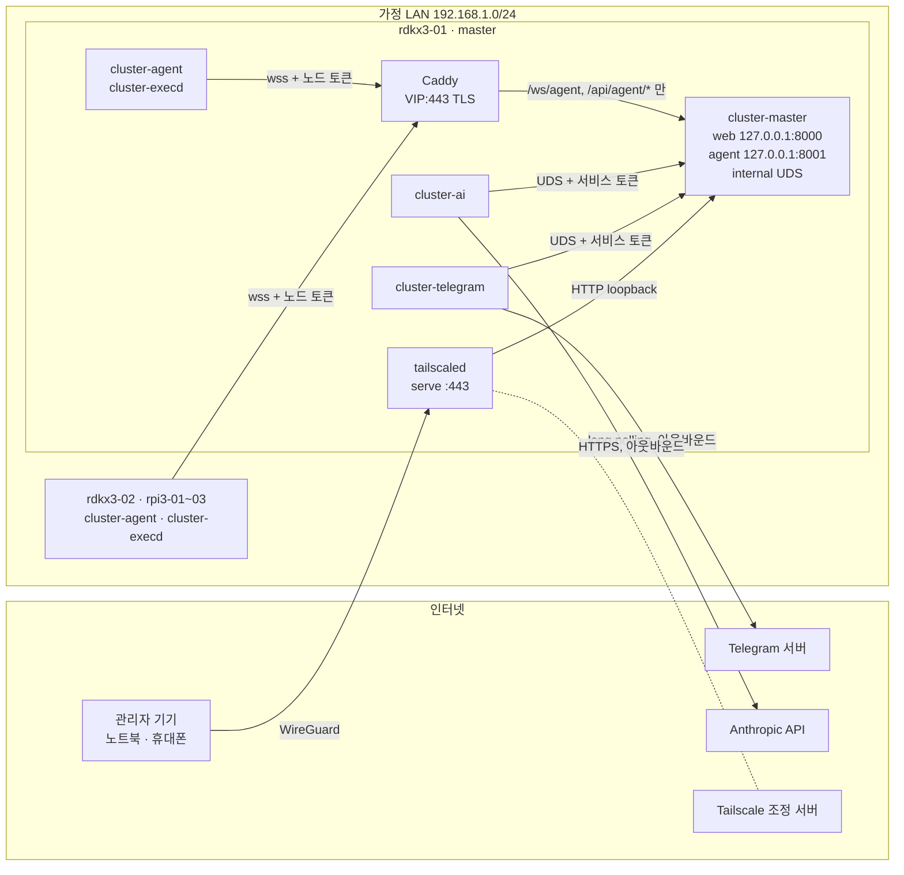
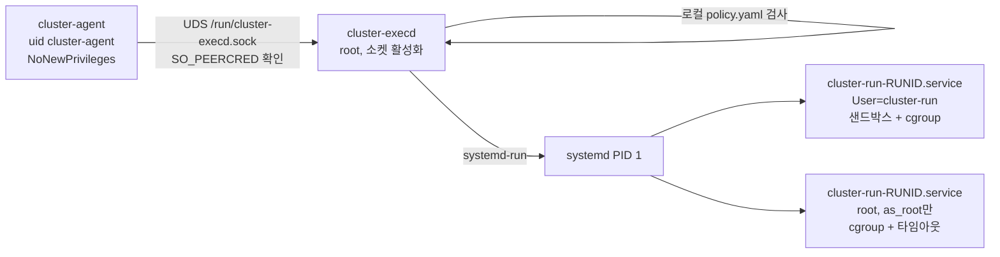
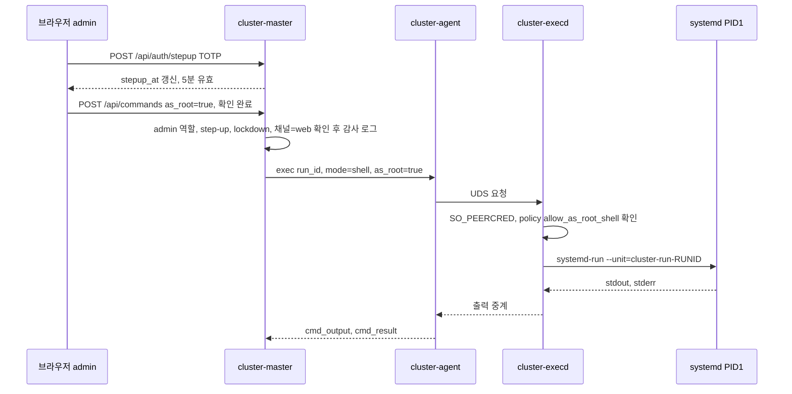
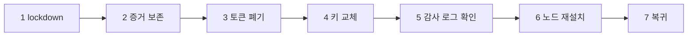

# 보안 설계

> 열린 인바운드 포트 0개, 계층별 최소 권한, 사람 승인과 감사 로그를 축으로 Cluster Web 전체의 보안 기준선을 정의한다. 다른 설계 문서는 이 문서의 규칙을 완화할 수 없다.

**관련 문서**: [PLAN.md](../PLAN.md) · [topology.md](./topology.md) · [jobs.md](./jobs.md) · [telegram.md](./telegram.md) · [ai-agent.md](./ai-agent.md)

| 주제 | 이 문서 | 다른 문서 |
|---|---|---|
| 외부 접속, 방화벽, SSH, 인증서, 인증·세션·RBAC, 실행 권한(as_root), 시크릿, 감사 로그, 킬 스위치, 사고 대응 | 정의 | — |
| 텔레그램 봇 동작·명령어 | 기준선만 (14장) | [telegram.md](./telegram.md) |
| AI 에이전트 툴·루프·모델 | 기준선만 (15장) | [ai-agent.md](./ai-agent.md) |
| 잡 스케줄링·재시도·산출물 | 격리 기준선만 (11장) | [jobs.md](./jobs.md) |
| IP·VIP·백업 복제·failover 절차 | 참조만 | [topology.md](./topology.md) |

---

## 0. 원칙

1. **master가 뚫리면 클러스터 전체가 뚫린다.** 그래서 master로 들어오는 길(외부 접속, 웹 인증, 텔레그램, AI)을 가장 두껍게 막고, master가 뚫린 뒤에도 남는 방어선(노드 로컬 정책, 감사 로그 사본, tailnet ACL)을 따로 둔다.
2. **인바운드 포트를 열지 않는다.** 외부 접속은 Tailscale, 텔레그램은 long polling, AI는 HTTPS 아웃바운드만 쓴다.
3. **프로세스·계정 분리.** 웹(cluster-master), 텔레그램(cluster-telegram), AI(cluster-ai), 노드 데몬(cluster-agent), 사용자 코드(cluster-run), root 실행(cluster-execd)은 각각 다른 Unix 계정과 다른 시크릿을 가진다.
4. **채널이 약할수록 권한도 좁게.** 텔레그램과 AI 채널은 웹과 같거나 더 엄격하다. 치명적(critical) 작업은 웹 + step-up 인증에서만 된다.
5. **경고는 보안 경계가 아니다.** 위험 패턴 경고, 확인 대화상자는 실수 방지용이다. 보안 경계는 계정, 권한, 인증, 승인, 커널 격리다.
6. **모든 실행은 감사 로그에 남고, 감사 로그는 지울 수 없다.**

### 신뢰 경계



---

## 1. 보호 자산

| 자산 | 위치 | 노출 시 결과 |
|---|---|---|
| 클러스터 실행 권한 (명령·잡·as_root) | cluster-master → agent | 5대 전부 장악, 다른 가정 LAN 기기 공격 발판 |
| 사용자 자격 증명 (비밀번호 해시, TOTP 비밀, 세션) | master DB | 웹 로그인 탈취 |
| agent 토큰 / 서비스 토큰 | 노드 파일 / master credential | 노드 사칭, 내부 API 호출 |
| Anthropic API 키 | rdkx3-01 credential | 과금 폭탄, 데이터 유출 |
| 텔레그램 봇 토큰 | rdkx3-01 credential | 봇 사칭, 알림·승인 메시지 가로채기 |
| 내부 CA 개인키 | 관리 PC (클러스터 밖) | 가짜 master로 agent 유인 |
| 감사 로그 | master DB + 암호화 백업 사본(rdkx3-02·관리 PC) + 텔레그램 head 앵커 | 사고 흔적 은폐 |
| Tailscale 계정 / IdP 계정 | 외부 | tailnet 진입 (웹 로그인 화면까지 도달) |
| 잡 데이터·산출물 | 각 노드 작업 디렉터리 | 데이터 유출·위조 |
| 가용성 | 전체 | 원격으로 끈 노드는 물리적으로만 켤 수 있음 (PoE/WoL 없음) |

---

## 2. 위협 모델

| # | 위협 | 영향 | 대응 | 잔여 위험 |
|---|---|---|---|---|
| T1 | **외부 공격자** (인터넷 스캔, 웹 취약점 익스플로잇) | 웹 RCE → 클러스터 전체 | 인바운드 포트 0 (3장), 웹은 tailnet에서만 도달, 앱 자체 인증 + TOTP, 공유기 포트포워딩 금지 | tailscaled 자체 취약점 → 자동 업데이트(17장) |
| T2 | **Tailscale/IdP 계정 탈취** | tailnet 진입, 웹 로그인 화면 도달 | IdP MFA 필수, 기기 승인(device approval), ACL은 관리자 그룹만, 앱 비밀번호 + TOTP가 별도로 필요 | 앱 비밀번호와 TOTP까지 함께 털리면 T4와 같음 |
| T3 | **휴대폰 분실 / 텔레그램 계정 탈취** | 텔레그램으로 프리셋·잡 실행, 승인 버튼 클릭, 휴대폰 브라우저 세션 악용 | 허용된 user_id만, critical 작업은 텔레그램 불가, 텔레그램 셸 기본 off(켜도 TOTP 필요), 웹에서 텔레그램 연결 해제·전 세션 폐기·lockdown | 휴대폰에 TOTP 앱과 웹 세션이 함께 있으면 사실상 1요소 → 화면 잠금, Telegram 2단계 인증(클라우드 비밀번호), TOTP 앱 잠금 권장 |
| T4 | **웹 세션 탈취** (XSS, 쿠키 탈취, 잠그지 않은 노트북) | 해당 사용자 권한으로 조작 | HttpOnly·SameSite=Strict 쿠키, CSP, 유휴/절대 만료, critical 작업은 step-up, 새 기기/IP 로그인 텔레그램 알림, 세션 목록·강제 종료 | step-up 유효 시간(5분) 안의 탈취 |
| T5 | **침해된 worker 노드** | 자기 노드 메트릭·결과 위조, master 공격면(agent 엔드포인트) 공격, LAN 스니핑/ARP 스푸핑, 잡 결과·아티팩트 오염, 출력에 XSS/프롬프트 인젝션 심기, 레이블·용량 허위 광고로 잡 끌어오기 | 노드는 자기 node_id로만 발언, run_id 소유 검증, 크기·속도·필드 상한(8.3), 배치용 레이블·용량은 master 등록값이 권위(8.3), UI 이스케이프, 아티팩트는 다운로드 전용(jobs.md 10.4), TLS + CA 고정, worker에는 다른 노드로 가는 SSH 키 없음 + 방화벽, 토큰 즉시 폐기 | 그 노드에 배치된 잡의 데이터 노출·위조 → 재설치(19장). **rdkx3-02 특례**: 잡을 가장 많이 돌리는 노드이면서 암호화 백업을 보관한다. root까지 침해되면 로컬 백업 사본이 파괴될 수 있다(기밀성은 age, 무결성은 텔레그램 앵커로 유지). 그래서 백업은 rdkx3-02 밖(관리 PC) 사본을 v1 필수로 둔다([topology.md](./topology.md) 7.2, 수용된 위험) |
| T6 | **침해된 master** | 전체 노드에서 cluster-run 권한 실행 | 노드 로컬 정책(9.4: as_root 셸 기본 off, root 동작은 고정 목록), 텔레그램·AI 시크릿은 별도 계정, 감사 로그 외부 사본(백업·텔레그램 앵커), tailnet ACL에서 master → 다른 기기 차단 | 높음. 탐지 후 런북(19장) |
| T7 | **악성/버그 잡** | 자원 고갈, agent·다른 잡 방해, 시크릿 탈취 시도, 외부 유출, 산출물 수집 경로를 이용한 파일 탈취(링크·바꿔치기) | cluster-run 계정, transient unit + cgroup 제한, 작업 디렉터리 격리, 시크릿 경로 접근 불가, 내부 포트 egress 차단, 수집은 execd가 실행 uid로 `O_NOFOLLOW` 기반(9.3·11장) | 같은 cluster-run끼리 시그널 가능(11.3), `network: internet` 잡의 외부 유출, 격리 저하(fallback) 노드는 DAC만(11.2-B) |
| T8 | **AI 오작동 / 프롬프트 인젝션** (명령 출력·로그·파일에 심은 지시) | 의도하지 않은 변경 작업 | AI 전용 툴만, 변경 작업은 사람 승인, 승인은 정확한 payload 해시에 바인딩, AI는 자기 승인·정책 변경 불가, critical 금지, 비용 상한, 킬 스위치(15장) | 사람이 습관적으로 승인 → 위험도 강조, high 이상 일괄 승인 금지 |
| T9 | **공급망** (pip/npm 악성 패키지, 설치 스크립트) | 빌드·런타임 코드 실행 | 버전 + 해시 고정, `npm ci --ignore-scripts`, CI에서만 빌드, curl\|bash 금지, 서명된 apt 저장소만(17장) | 고정한 버전 자체가 악성, 업스트림 침해 |
| T10 | **물리 접근** (SD 카드 탈취, UART/HDMI 콘솔) | SD의 시크릿·DB 탈취, 콘솔 로그인 | worker에는 폐기 가능한 노드 토큰만, master는 물리적으로 안전한 곳, 백업은 암호화, 기본 계정 잠금, 시리얼 콘솔 로그인 비활성(Phase 0 확인) | master SD 탈취 시 전 시크릿 교체 필요 (전체 디스크 암호화는 헤드리스 부팅 문제로 "나중") |
| T11 | **같은 LAN의 다른 기기** (IoT, 게스트) | agent 엔드포인트·SSH 공격, ARP 스푸핑 | agent 포트는 노드 IP만, SSH는 관리 PC만, 웹은 LAN에 노출 안 함, TLS | IP 스푸핑으로 포트까지는 도달 가능(토큰 필요). v2: VLAN 분리([topology.md](./topology.md)) |
| T12 | **cluster-telegram 프로세스 침해** (봇 토큰 불요: 내부 API를 직접 호출) | 서비스 토큰 + outbox의 평문 nonce + 임의 `X-On-Behalf-TG-User` 주장으로, 연결된 사용자를 사칭해 요청 생성과 승인 결정을 모두 위조 | 텔레그램에서 시작하거나 결정하는 **medium 이상 변경은 전부 텔레그램 step-up(TOTP, approval 1건 단위)** 필요(7.3) → 봇이 nonce를 쥐어도 사람의 일회용 코드 없이는 실행 불가. critical은 텔레그램 불가. 서비스 범위에 결정 외 관리 경로 없음(12.2) | low(조회, 본인 잡 취소, 조회성 프리셋)와 안전 방향 조치(lockdown)는 위조 가능. 사용자가 TOTP를 입력하는 순간을 노린 가로채기(30초 창, 재사용 방지로 1건만) |
| T13 | **cluster-ai 프로세스 침해** | 진행 중 태스크 사용자 권한 안의 읽기, 승인 요청 생성 | 서비스 범위에 결정 API 없음, 끝난 태스크 id 거부, 승인 요청 상한([ai-agent.md](./ai-agent.md) 2.2·5.3) | 승인 피로 유도 → 요청 상한, high 단건 승인 |

---

## 3. 외부 접속 아키텍처

### 3.1 방식 비교

| | (A) Tailscale | (B) Cloudflare Tunnel + Access | (C) 포트포워딩 + 리버스 프록시 |
|---|---|---|---|
| 인바운드 포트 | 없음 (NAT 통과) | 없음 (cloudflared 아웃바운드) | 443 개방 |
| 공격 표면 | tailnet 멤버만 패킷 도달 | 공개 URL, Cloudflare Access가 앞단에서 차단 | 인터넷 전체가 앱에 직접 도달 |
| 클라이언트 요구 | 각 기기에 Tailscale 앱 | 브라우저만 | 브라우저만 |
| 종단 암호화 | WireGuard E2E (조정 서버는 메타데이터만) | TLS가 Cloudflare에서 종료 → **Cloudflare가 명령 출력 평문을 봄** | 직접 TLS |
| 필요 자원 | 계정 | 도메인 + Cloudflare 계정 | 도메인/DDNS, 인증서, 공인 IP |
| SSH 원격 접속 | 그대로 됨 | 별도 설정(cloudflared access) | 추가 포트 개방 |
| 판정 | **기본 권장** | 브라우저만으로 접속해야 할 때의 대안 | **금지** |

**결정**: (A) Tailscale. 공용 PC처럼 앱을 깔 수 없는 기기에서 접속해야 하는 요구가 생기면 (B)를 추가한다. (C)는 쓰지 않는다. **Tailscale Funnel(공개 노출)은 금지**한다.

### 3.2 설치 범위

| 노드 | Tailscale | 태그 | 이유 |
|---|---|---|---|
| rdkx3-01 | 설치 | `tag:cluster-master` | 유일한 외부 진입점 ([topology.md](./topology.md) 3.1) |
| rdkx3-02 | 설치 | `tag:cluster-standby` | failover 시 외부 경로를 바로 넘기기 위해. 평소에는 SSH만 쓰임(웹 서비스는 mask 상태) |
| rpi3-01~03 | **설치 안 함** | — | 1GB RAM 절약, worker 침해가 tailnet 진입으로 번지지 않음. 외부에서의 SSH는 rdkx3-01을 경유(ProxyJump) |

- subnet router(`--advertise-routes`)와 exit node는 쓰지 않는다. LAN 전체를 tailnet에 노출하게 되기 때문이다.
- Tailscale SSH 대신 OpenSSH를 쓴다(4.4). 설정: `tailscale up --advertise-tags=tag:cluster-master --ssh=false --accept-routes=false --accept-dns=false` (rdkx3-02는 태그만 다름). 인증 키는 **일회용·태그 지정·짧은 만료**로 발급해 쓰고 버린다.
- 태그된 기기는 키 만료가 기본 비활성이다. 대신 기기 승인과 ACL로 통제하고, 분실·침해 시 관리 콘솔에서 기기를 제거한다.
- MagicDNS 이름은 Let's Encrypt 인증서 투명성(CT) 로그에 공개된다. 기기 이름에 민감한 정보를 넣지 않는다.

### 3.3 tailnet ACL 정책

기본 정책(`*` → `*:*` 전부 허용)을 **반드시 삭제**하고 아래로 바꾼다.

```jsonc
// Tailscale admin console > Access controls
{
  "groups": {
    "group:cluster-admins": ["you@example.com"]
  },
  "tagOwners": {
    "tag:cluster-master":  ["autogroup:admin"],
    "tag:cluster-standby": ["autogroup:admin"]
  },
  "acls": [
    // 관리자 기기 → master: 웹(443), SSH(22)
    { "action": "accept", "src": ["group:cluster-admins"], "dst": ["tag:cluster-master:443,22"] },
    // 관리자 기기 → standby: SSH, failover 후 웹
    { "action": "accept", "src": ["group:cluster-admins"], "dst": ["tag:cluster-standby:443,22"] }
    // tag:cluster-* 에서 나가는 규칙은 없다 → 침해된 노드가 노트북·휴대폰에 접근 불가
  ],
  // nodeAttrs 에 "funnel" 속성을 부여하지 않는다 → Funnel 사용 불가
  "tests": [
    { "src": "you@example.com", "accept": ["tag:cluster-master:443", "tag:cluster-master:22"], "deny": ["tag:cluster-master:8000"] },
    { "src": "tag:cluster-master", "deny": ["you@example.com:22", "tag:cluster-standby:22"] }
  ]
}
```

tailnet 계정 설정: IdP 계정 MFA 필수, **device approval 켬**, 사용자 기기 키 만료 유지(기본값), 새 기기 추가 시 이메일 알림. v2: Tailnet Lock.

### 3.4 웹 노출: `tailscale serve`

```bash
# rdkx3-01 (현재 master)에서만
sudo tailscale serve --bg --https=443 http://127.0.0.1:8000
tailscale serve status     # https://<기기이름>.<tailnet>.ts.net → 127.0.0.1:8000 확인
tailscale funnel status    # 비어 있어야 함
```

- TLS는 tailscaled가 `*.ts.net` 인증서로 종료한다. 웹 URL은 `https://<rdkx3-01 기기이름>.<tailnet>.ts.net`.
- `tailscale serve`가 붙이는 `Tailscale-User-Login` 헤더는 **감사 로그 참고용**이다. 같은 호스트의 다른 프로세스가 127.0.0.1:8000에 직접 붙어 위조할 수 있으므로 인증 근거로 쓰지 않는다(4.3의 egress 차단으로 줄이지만 경계로 삼지 않음).
- **failover 시 외부 경로 전환** ([topology.md](./topology.md) 7.3의 5단계): rdkx3-02에서 위 `tailscale serve` 명령을 실행한다. URL이 rdkx3-02의 MagicDNS 이름으로 바뀌므로 두 URL을 모두 북마크해 둔다. Origin 검사(5.3·5.6)의 허용 목록 `web.origins`에는 처음부터 **두 URL을 모두** 넣어 두고, 텔레그램 링크용 `web_base_url`은 failover 절차에서 `cluster-master-admin config set web_base_url <rdkx3-02 URL>`로 바꾼다. rdkx3-01이 살아 돌아오면 `tailscale serve reset` 후 붙인다.

### 3.5 대안 (B) Cloudflare Tunnel + Access (필요할 때만)

- `cloudflared`를 rdkx3-01에 전용 계정으로 실행, 터널 토큰은 12장 규칙의 시크릿으로 취급.
- 터널에는 **웹 경로만** 연결한다(`http://127.0.0.1:8000`). agent 엔드포인트, SSH는 절대 연결하지 않는다.
- Access 정책: 허용 이메일 = 관리자만, IdP 로그인(MFA) 또는 이메일 OTP, 세션 12시간.
- master는 `Cf-Access-Jwt-Assertion` JWT를 검증(팀 도메인 공개키, `aud` 태그)한다. 터널 설정 실수로 Access가 빠져도 앱이 막도록 하기 위해서다.
- 앱 자체 로그인 + TOTP는 그대로 유지한다(이중 인증 아님, 다층 방어).
- Cloudflare가 TLS를 종료하므로 명령 출력이 Cloudflare를 평문으로 지난다는 점을 받아들일 때만 쓴다.

---

## 4. 네트워크 노출 최소화

### 4.1 cluster-master 리스너 구조

cluster-master는 **Uvicorn 단일 프로세스** 안에서 세 개의 리스너를 같은 이벤트 루프로 띄운다(메모리 상태 공유). 리스너마다 **별도 라우터 객체**에 허용 라우트만 마운트한다. 다른 리스너의 라우트로 온 요청은 라우트가 없으므로 404다.

| 리스너 | 바인드 | 허용 라우트 | 앞단 |
|---|---|---|---|
| web | `127.0.0.1:8000` (HTTP) | `/api/*` 중 **`/api/agent/*` 제외**, `/ws/ui`, SPA 정적 파일 | tailscale serve |
| agent | `127.0.0.1:8001` (HTTP) | `/ws/agent`, `/api/agent/*`([jobs.md](./jobs.md) 13.4 전체: 번들·항목 다운로드, 아티팩트 업로드) | Caddy (VIP:443 TLS) |
| internal | UDS `/run/cluster-master/internal.sock` (`cluster-master:cluster-svc`, 0660) | `/internal/tg/*`, `/internal/ai/*`, `/internal/api/*`(아래 허용 목록만), `/internal/admin/*`(콘솔 CLI 전용) | 없음 |

**internal 리스너 라우트 규칙** (web 라우터를 통째로 마운트하지 않는다):

- `/internal/api/*`에는 **명시적 허용 목록**만 마운트한다: `GET cluster/summary, nodes, nodes/{id}, nodes/{id}/metrics, alerts, presets, commands/{id}, jobs, jobs/{id}, jobs/{id}/tasks, tasks/{id}, attempts/{id}/log, job-templates` 와 `POST commands, commands/{id}/cancel, jobs/validate, jobs, jobs/{id}/cancel`. 승인 결정, 사용자, 노드 등록·토큰, 보안 설정, 감사 로그, AI 정책 라우트는 internal에 존재하지 않는다.
- 모든 라우트는 **허용 principal 집합**(`user`, `telegram-bot`, `ai-operator`, `cli`)을 데코레이터로 선언해야 하고, 선언이 없으면 기본 거부(403)다. 앱 시작 시 선언 누락 라우트가 있으면 기동을 실패시킨다.
- `/internal/admin/*`(lockdown on/off, 감사 기록 삽입 등 CLI용)은 `SO_PEERCRED`로 상대 uid가 0일 때만 받는다(13.1, 16장).
- CI에서 리스너별 라우트 목록을 스냅숏으로 고정한다. 라우트가 추가되면 스냅숏 갱신이 리뷰 대상이 된다.

- FastAPI의 `/docs`, `/redoc`, `/openapi.json`은 운영 빌드에서 끈다.
- agent TLS는 Caddy가 내부 CA 인증서로 종료한다(8.1). Caddy는 agent 경로만 프록시하고 나머지는 403:

```caddyfile
master.cluster.internal:443 {
  bind 192.168.1.200
  tls /etc/caddy/certs/master.crt /etc/caddy/certs/master.key
  handle /ws/agent* { reverse_proxy 127.0.0.1:8001 }
  handle /api/agent/* { reverse_proxy 127.0.0.1:8001 }
  handle { respond 403 }
}
```

- `/api/agent/*` HTTPS 요청 인증은 WebSocket과 같다: `Authorization: Bearer cat_…` + `X-Node-Id`(8.2). 아티팩트 업로드는 여기에 Attempt 전용 `upload_token`이 더 필요하다([jobs.md](./jobs.md) 10.4).
- web 리스너는 tailscale serve가, agent 리스너는 Caddy가 붙인 `X-Forwarded-For`만 신뢰한다(둘 다 127.0.0.1 출처, 다른 계정의 직접 접속은 4.3 output 규칙으로 차단).
- Caddy가 VIP에만 바인드하므로 부팅 순서는 `cluster-vip.service` 뒤여야 한다([topology.md](./topology.md) 3.3).

### 4.2 서비스별 바인드 주소 / 포트

IP는 [topology.md](./topology.md) 3.2 예시 기준이며 Phase 0에서 실제 값으로 치환한다.

| 노드 | 프로세스 (실행 계정) | 바인드 | 포트 / 소켓 | 허용 출처 |
|---|---|---|---|---|
| rdkx3-01 | tailscaled (root) | tailnet IP | tcp/443 (serve), tcp/22 경유 | tailnet ACL: `group:cluster-admins` |
| rdkx3-01 | cluster-master (`cluster-master`) | 127.0.0.1 | tcp/8000, tcp/8001 | tailscale serve / Caddy만 (4.3 output 규칙) |
| rdkx3-01 | cluster-master | UDS | `/run/cluster-master/internal.sock` | 그룹 `cluster-svc` (= `cluster-telegram`, `cluster-ai`) |
| rdkx3-01 | Caddy (`caddy`) | VIP 192.168.1.200 | tcp/443 | 등록 노드 IP 5개 |
| rdkx3-01 | chrony (서버) | 0.0.0.0 | udp/123 | 등록 노드 IP |
| rdkx3-01 | cluster-telegram (`cluster-telegram`) | — | 리스닝 없음 (→ api.telegram.org:443) | — |
| rdkx3-01 | cluster-ai (`cluster-ai`) | — | 리스닝 없음 (→ AI 백엔드:443) | — |
| 모든 노드 | cluster-agent (`cluster-agent`) | — | 리스닝 없음 (→ master.cluster.internal:443) | — |
| 모든 노드 | cluster-execd (root, socket-activated) | UDS | `/run/cluster-execd.sock` (`root:cluster-agent`, 0660) | uid `cluster-agent`만 (SO_PEERCRED) |
| 모든 노드 | sshd | 0.0.0.0 | tcp/22 | 관리 PC, rdkx3-01(ProxyJump·백업 push), master는 tailscale0 추가 |
| 선택 | 로컬 LLM 서버 ([ai-agent.md](./ai-agent.md)에서 배치 결정) | 127.0.0.1 또는 LAN | ai-agent.md | `cluster-ai`만 (원격이면 nft로 출처 제한 + 토큰) |

웹 UI는 **LAN에 직접 노출하지 않는다.** 집 안에서도 Tailscale로 접속한다(같은 LAN이면 직접 연결로 빠르다). Tailscale이 안 될 때의 비상 경로는 `ssh -L 8000:127.0.0.1:8000 rdkx3-01`이다(Secure 쿠키가 `http://localhost`에서 동작하는지 Phase 3에서 확인, 안 되면 비상 시에는 CLI를 쓴다).

### 4.3 nftables

ufw 대신 **nftables 하나**로 통일한다(두 OS 공통, 규칙을 파일 하나로 배포). `meta skuid "이름"`은 로드 시점에 계정이 있어야 하므로 계정 생성 후 적용한다. 원격 적용 시 잠김 방지를 위해 `nft -f new.conf; sleep 120; nft -f old.conf`를 백그라운드로 걸고 확인 후 취소한다.

**rdkx3-01 (master)**

```nft
#!/usr/sbin/nft -f
flush ruleset

define VIP      = 192.168.1.200
define NODES    = { 192.168.1.201, 192.168.1.202, 192.168.1.211, 192.168.1.212, 192.168.1.213 }
define ADMIN_PC = { 192.168.1.50 }          # 관리 PC (DHCP 예약, Phase 0)

table inet filter {
  chain input {
    type filter hook input priority filter; policy drop;
    iif "lo" accept
    ct state established,related accept
    ct state invalid drop
    meta l4proto icmp icmp type { echo-request, destination-unreachable, time-exceeded } limit rate 10/second accept
    meta l4proto ipv6-icmp accept
    ip saddr $NODES ip daddr $VIP tcp dport 443 accept     # agent wss (Caddy)
    ip saddr $NODES udp dport 123 accept                    # chrony 서버
    ip saddr $ADMIN_PC tcp dport 22 accept                  # 관리 PC SSH
    iifname "tailscale0" tcp dport 22 accept                # tailnet SSH (ACL이 1차 필터)
    # udp dport 41641 accept                                # Tailscale 직접 연결이 안 될 때만 (Phase 6 확인)
  }
  chain forward {
    type filter hook forward priority filter; policy drop;
  }
  chain output {
    type filter hook output priority filter; policy accept;
    # master 내부 리스너에는 tailscaled(root)·Caddy·관리자 SSH 포워딩만 붙는다
    meta skuid { "cluster-run", "cluster-agent", "cluster-telegram", "cluster-ai" } ip daddr 127.0.0.0/8 tcp dport { 8000, 8001 } reject
    meta skuid "cluster-run" ip daddr 100.64.0.0/10 reject          # tailnet 대역
    meta skuid "cluster-run" ip daddr $NODES tcp dport 22 reject    # 잡에서 다른 노드 SSH 시도
    meta skuid "cluster-run" ip daddr $VIP tcp dport 443 reject     # 잡에서 agent 엔드포인트 접근
  }
}
```

**worker (rdkx3-02, rpi3-01~03)**

```nft
#!/usr/sbin/nft -f
flush ruleset

define VIP      = 192.168.1.200
define MASTERS  = { 192.168.1.201, 192.168.1.202 }   # rdkx3-01, rdkx3-02 (ProxyJump, 백업 push, failover 후)
define NODES    = { 192.168.1.201, 192.168.1.202, 192.168.1.211, 192.168.1.212, 192.168.1.213 }
define ADMIN_PC = { 192.168.1.50 }

table inet filter {
  chain input {
    type filter hook input priority filter; policy drop;
    iif "lo" accept
    ct state established,related accept
    ct state invalid drop
    meta l4proto icmp icmp type { echo-request, destination-unreachable, time-exceeded } limit rate 10/second accept
    meta l4proto ipv6-icmp accept
    ip saddr { $ADMIN_PC, $MASTERS } tcp dport 22 accept
    # rdkx3-02만: iifname "tailscale0" tcp dport 22 accept
    # rdkx3-02만 (failover 대비, 평소엔 리스너 없음): master와 같은 VIP:443 / udp 123 규칙을 미리 둔다
  }
  chain forward {
    type filter hook forward priority filter; policy drop;
  }
  chain output {
    type filter hook output priority filter; policy accept;
    meta skuid "cluster-run" ip daddr $VIP tcp dport 443 reject
    meta skuid "cluster-run" ip daddr $NODES tcp dport 22 reject
  }
}
```

- `cluster-run`의 인터넷 egress는 v1에서 막지 않는다. 대신 잡 단위로 `network: none`이면 transient unit에 `PrivateNetwork=yes`를 건다(11.2). v2: `cluster-run` egress를 허용 목록으로 제한.
- Tailscale은 자체 방화벽 규칙(iptables 또는 nftables 모드)을 추가한다. 공존 여부와 `tailscale serve` 443이 input 체인을 지나는지는 Phase 6에서 확인하고, 필요하면 `iifname "tailscale0" tcp dport 443 accept`를 추가한다.

### 4.4 SSH 하드닝

```text
# /etc/ssh/sshd_config.d/10-cluster.conf (전 노드)
PasswordAuthentication no
KbdInteractiveAuthentication no
PermitRootLogin no
PubkeyAuthentication yes
AuthenticationMethods publickey
AllowGroups ssh-login            # 관리자 계정만. cluster-agent, cluster-run, 서비스 계정은 넣지 않음
MaxAuthTries 3
LoginGraceTime 20
X11Forwarding no
AllowAgentForwarding no
PermitTunnel no
AllowTcpForwarding no            # rdkx3-01만 아래 Match로 예외

# ↓ 이 Match 블록은 rdkx3-01에만 배포: ProxyJump(-W)와 비상 웹 포워딩만 허용
Match Group ssh-login
    AllowTcpForwarding local
    PermitOpen 192.168.1.202:22 192.168.1.211:22 192.168.1.212:22 192.168.1.213:22 127.0.0.1:8000
```

- 키는 관리 PC에서 `ed25519` + 패스프레이즈. worker 접속은 `ProxyJump rdkx3-01`(키는 관리 PC에만 있고 master에 남지 않음). `PermitOpen`은 요청 문자열과 비교하므로 관리 PC의 `~/.ssh/config`에서 worker `HostName`을 IP로 적는다. **ForwardAgent 금지.**
- rdkx3-02의 백업 수신 계정 `cluster-backup`([topology.md](./topology.md) 7.2)은 `AllowGroups`에 추가하되, `authorized_keys`에 `restrict,command="rrsync -wo /var/backups/cluster-master/incoming"`처럼 쓰기 전용 강제 명령을 건다. 셸은 주지 않는다.
- `cluster-agent`, `cluster-run`, `cluster-master`, `cluster-telegram`, `cluster-ai`, `caddy` 계정은 셸 `/usr/sbin/nologin`, 비밀번호 잠금.
- 이미지 기본 계정은 첫 부팅 즉시 비밀번호 변경 또는 잠금/삭제한다([topology.md](./topology.md) R11). root 비밀번호 잠금(`passwd -l root`).
- 시리얼 콘솔(UART) 로그인 getty와 불필요 서비스(avahi, cups, 데스크톱, 블루투스)는 끈다. 무엇이 기본으로 켜져 있는지 Phase 0에서 `systemctl list-units --type=service --state=running`으로 기록.
- 키 전용 + LAN/tailnet 한정이므로 fail2ban은 필수가 아니다(선택).

---

## 5. 웹 인증

### 5.1 비밀번호

| 항목 | 결정 |
|---|---|
| 해시 | **Argon2id** (`argon2-cffi`), 초기값 `m=19456 KiB, t=2, p=1` (OWASP 최소 권고). Phase 3에서 RDK X3 실측 0.2~0.5초가 되도록 조정, 파라미터는 해시 문자열에 포함되어 로그인 시 재해시로 업그레이드 |
| 동시 해시 | 세마포어 2개 (로그인 폭주로 메모리 고갈 방지) |
| 정책 | 최소 12자, 상한 128자, 흔한 비밀번호 목록(로컬 파일) 차단, 주기적 강제 변경 없음 |
| 기본 계정 | **없음** (5.7) |

### 5.2 TOTP 2FA

- RFC 6238, SHA-1, 6자리, 30초, 허용 오차 ±1 step. **operator와 admin은 필수**, 첫 로그인 시 등록을 마쳐야 다른 화면으로 넘어간다. viewer는 선택.
- 재사용 방지: 사용자별 마지막으로 성공한 time-step을 저장해 같은 코드나 이전 코드를 거부한다.
- TOTP 비밀은 DB에 `totp_kek`(12장)로 AES-256-GCM 암호화해 저장한다.
- 복구 코드 10개(일회용, Argon2id 해시 저장). 모두 잃으면 콘솔에서 `cluster-master-admin reset-totp <user>` (물리/SSH 접근 = 소유 증명).
- WebAuthn(패스키)은 "나중".

### 5.3 세션

| 항목 | 값 |
|---|---|
| 저장 | 서버측 `sessions` 테이블 (256-bit 랜덤 ID, DB에는 SHA-256만) |
| 쿠키 | `__Host-cw_session`; `HttpOnly; Secure; SameSite=Strict; Path=/` (Domain 없음) |
| 유휴 만료 | 30분 |
| 절대 만료 | 12시간 |
| ID 재발급 | 로그인, 2FA 통과, 역할 변경, step-up 시 |
| 관리 | "내 세션" 화면에서 기기·IP·마지막 사용 확인, 개별/전체 종료. admin은 사용자별 전체 종료 |
| 무효화 | 비밀번호·TOTP 변경, 역할 변경, 계정 비활성 시 해당 사용자 전 세션 폐기 |

`/ws/ui` 연결은 세션 쿠키 + `Origin` 헤더가 허용 origin 목록 `web.origins`(5.6)에 있을 때만 수락한다(CSWSH 방지). 세션이 만료·폐기되면 열린 WebSocket도 끊는다.

### 5.4 로그인 rate limit과 잠금

master는 단일 프로세스이므로 카운터는 메모리에 둔다.

| 기준 | 규칙 |
|---|---|
| 계정별 | 실패 3회부터 지연(1 → 2 → 4 … 최대 30초), 15분 안에 10회 실패 시 15분 잠금 |
| IP별 | 15분에 20회 실패 시 해당 IP 15분 차단 |
| TOTP | 계정별 5회 연속 실패 시 15분 잠금 |
| 알림 | 잠금 발생 시 `security.login` (result=locked) → 텔레그램 |
| 응답 | 계정 존재 여부와 무관하게 같은 메시지·비슷한 시간(존재하지 않는 계정도 더미 해시 수행) |

admin 잠금이 공격자의 DoS가 될 수 있지만, 웹이 tailnet 안에만 있으므로 감수한다. 콘솔 CLI로 해제 가능.

### 5.5 새 기기 / 새 IP 알림

- 로그인 성공 시 장기 쿠키 `__Host-cw_device`(랜덤 ID, 1년)를 확인한다. 처음 보는 기기이거나 최근 30일에 없던 IP면 `security.login` 이벤트(new_device/new_ip=true)를 발행한다.
- 텔레그램 알림: 사용자, 시각, IP(tailnet 이름), User-Agent 요약 + "[본인 아님: 세션 종료 + lockdown]" 버튼(telegram.md).

### 5.6 CSRF와 보안 헤더

- CSRF: `SameSite=Strict` + 상태 변경 요청(POST/PUT/PATCH/DELETE)에 `X-CSRF-Token` 헤더 필수(세션에 묶인 토큰, HMAC) + `Origin` 검사. CORS는 설정하지 않는다(동일 출처만).
- 허용 origin은 설정 목록 `web.origins = [<rdkx3-01 ts.net URL>, <rdkx3-02 ts.net URL>]`이다. failover 후에도 설정을 바꾸지 않고 Origin 검사가 통과하도록 처음부터 두 개를 넣는다(3.4). 목록 변경은 보안 설정(admin · step-up).
- 응답 헤더 (master 미들웨어에서 일괄):

```text
Content-Security-Policy: default-src 'self'; script-src 'self'; style-src 'self'; img-src 'self' data:;
  connect-src 'self'; font-src 'self'; object-src 'none'; base-uri 'none'; form-action 'self';
  frame-ancestors 'none'
Strict-Transport-Security: max-age=31536000
X-Content-Type-Options: nosniff
Referrer-Policy: no-referrer
Permissions-Policy: camera=(), microphone=(), geolocation=(), usb=()
Cross-Origin-Opener-Policy: same-origin
Cross-Origin-Resource-Policy: same-origin
Cache-Control: no-store            (API 응답)
```

- 외부 CDN을 쓰지 않는다(폰트·스크립트 모두 빌드 산출물에 포함). 차트 라이브러리가 인라인 style 속성을 요구하면 `style-src-attr 'unsafe-inline'`만 완화한다. `script-src`는 완화하지 않는다.
- **신뢰할 수 없는 파일의 다운로드 응답**(잡 아티팩트, Attempt 로그, 명령 출력 내려받기)은 웹 UI와 같은 origin에서 나가므로 `script-src 'self'`가 막아 주지 못한다. 그래서 항상 `Content-Disposition: attachment`, `Content-Type: application/octet-stream`(로그·출력은 `text/plain; charset=utf-8`), `X-Content-Type-Options: nosniff`, `Content-Security-Policy: sandbox; default-src 'none'`를 붙이고 inline 미리보기는 두지 않는다. 미리보기가 필요하면 텍스트로 가져와 React 텍스트 노드로만 렌더링한다([jobs.md](./jobs.md) 10.4).

### 5.7 최초 실행

- 웹 setup 화면은 두지 않는다(누가 먼저 접속하느냐의 경쟁 문제). admin은 master 콘솔/SSH에서만 만든다:
  `sudo cluster-master-admin create-admin --username <name>` → 비밀번호 입력 → TOTP 등록 QR을 터미널에 출력.
- admin이 하나도 없으면 cluster-master는 web 리스너에서 "설정 필요" 안내만 내보내고 API는 503.
- **외부 노출 게이트**: 20장의 Phase 3·4 항목을 모두 통과하기 전에는 `tailscale serve`를 켜지 않는다.

---

## 6. Step-up 인증

| 항목 | 결정 |
|---|---|
| 방법 | TOTP 재입력 (`POST /api/auth/stepup`) |
| 유효 시간 | **5분** (세션의 `stepup_at` 기준, 연장 없음) |
| 실패 | 5회 연속 실패 시 그 세션 폐기 + `security.login`(result=stepup_failed) 텔레그램 알림 |
| 텔레그램 | 웹 step-up이 필요한 작업(아래 표)은 텔레그램에서 허용하지 않는다. 별도로 **텔레그램 step-up**(TOTP 6자리 메시지, 그 approval 1건에만 유효, 2분)이 있다. 텔레그램에서 시작하거나 결정하는 **medium 이상의 변경 전부**(변경 프리셋, 템플릿 잡, 타인 잡 취소, 셸·임의 명령 잡, AI 요청 승인)에 요구한다. 근거: cluster-telegram 프로세스가 침해되면 사용자 사칭과 nonce 획득이 가능하다(T12) |

step-up 필요 작업:

| 작업 | 추가 조건 |
|---|---|
| as_root 실행 (셸·잡 모두) | 실행마다 대상 노드와 명령 원문을 보여주는 확인 대화상자 |
| 노드 전원 끄기 (`system.poweroff`) | "다시 켤 수 없음" 경고 + 노드 이름 입력 |
| 사용자 생성·삭제·역할 변경, 다른 사용자의 TOTP/비밀번호 초기화 | — |
| 노드 등록·삭제, agent 토큰 발급·폐기 | — |
| 서비스 토큰 발급·교체, 텔레그램 연결 생성 | — |
| 보안 설정 변경 (`allow_shell`, 세션 정책, 허용 텔레그램 ID 등) | — |
| AI 정책 변경 (툴 허용 목록, 비용 상한, 자동 승인 범위) | — |
| lockdown 해제 | — |
| 감사 로그 내보내기 | — |

---

## 7. 권한 모델

### 7.1 주체 (principal)

| 주체 | 종류 | 인증 | 비고 |
|---|---|---|---|
| 웹 사용자 | user (viewer / operator / admin) | 비밀번호 + TOTP + 세션 | |
| 텔레그램 사용자 | user (연결된 웹 계정) | 허용 user_id + 계정 연결 | cluster-telegram이 대신 호출 |
| `telegram-bot` | service | 서비스 토큰 + UDS | 반드시 연결된 사용자 대신(on behalf of)으로만 호출 가능 |
| `ai-operator` | service | 서비스 토큰 + UDS | 반드시 `ai_task_id`를 붙여 호출. master가 그 태스크를 만든 사용자를 찾아 권한을 계산 |
| 노드 | node | 노드 토큰 + TLS | 자기 node_id로만 발언 |

### 7.2 유효 권한 계산 (master에서만)

```text
허용(action) =  role_allows(사용자.현재역할, action)
             ∧ channel_allows(channel ∈ {web, telegram, ai}, action)      # 7.3 표
             ∧ service_scope(주체, action)                               # telegram-bot / ai-operator 범위
             ∧ ¬lockdown(action)                                         # 16장
             ∧ (step-up 필요 → 5분 내 step-up)
             ∧ (승인 필요 → 정확히 일치하는 approved 승인 1건 소비)
             ∧ 노드 로컬 정책(policy.yaml)이 허용                          # 9.4, agent 측에서 재확인
```

- 역할은 **실행 시점에** 다시 읽는다. AI 태스크 도중 사용자가 강등·비활성되면 이후 동작은 실패한다.
- `ai-operator`의 권한 = 요청한 사용자 권한 ∩ AI 정책 ∩ AI 채널 규칙. 절대 사용자보다 넓어지지 않는다.

### 7.3 RBAC 매트릭스

표기: `viewer+` = viewer 이상. `✗` = 불가. **승인** = 15장/7.5의 Approval 필요. **확인** = 실행 전 확인 단계(대화상자/버튼).

| 작업 | 위험도 | Web | Telegram | AI (`ai-operator`) |
|---|---|---|---|---|
| 보기 (대시보드, 노드, 명령·잡 이력) | low | viewer+ | viewer+ (요약) | viewer+ (읽기 툴) |
| 감사 로그 보기 | low | admin (다른 역할은 본인 행위만) | ✗ | ✗ |
| 프리셋: 조회성 (`readonly: true`) | low | operator+ | operator+ | operator+ (`ai_policy.auto_presets`에 있는 것만 승인 없이, 그 밖은 승인) |
| 프리셋: 변경 (서비스 재시작, 재부팅, apt update/upgrade, 캐시 정리) | high | operator+ · 확인 | operator+ · 확인 + 텔레그램 step-up | operator+ · **승인(단건)** |
| 프리셋: 전원 끄기 | critical | admin · step-up | ✗ | ✗ |
| 셸 (`cluster-run`) | high | admin | admin · 기본 off · 확인 + 텔레그램 step-up | admin · **승인(명령별)** |
| as_root 셸 | critical | admin · step-up · 노드 로컬 정책 허용 시 | ✗ | ✗ |
| 잡 제출: 등록된 템플릿 | medium | operator+ | operator+ · 확인 + 텔레그램 step-up | operator+ · **승인** (계획 승인 묶음 가능, 7.5-10) |
| 잡 제출: 임의 코드 (`shell`/`python` runtime) | high | admin | admin · 셸과 같은 조건 | admin · **승인(단건)** |
| 잡 제출: as_root | critical | admin · step-up (v1은 미지원) | ✗ | ✗ |
| 잡 취소: 본인 잡 | low | operator+ | operator+ | 같은 AI 태스크가 제출한 잡만 (승인 불필요) |
| 잡 취소: 타인 잡 | medium | admin | admin · 확인 + 텔레그램 step-up | ✗ |
| 승인 결정 | — | 그 작업을 직접 할 권한이 있는 사람 | 같음 + 그 작업이 텔레그램에서 허용된 경우만 + medium 이상이면 텔레그램 step-up | **✗ (절대 불가)** |
| 노드 drain/cordon | medium | admin | ✗ (웹에서) | ✗ (제안만) |
| 노드 등록·삭제, 토큰 | critical | admin · step-up | ✗ | ✗ |
| 사용자 관리 | critical | admin · step-up | ✗ | ✗ |
| AI 사용 | — | viewer: 읽기 질의만 / operator+: 변경 제안 가능 | 웹과 같음 | — |
| AI 정책 | critical | admin · step-up | ✗ | ✗ |
| lockdown 발동 | — | operator+ | operator+ (`/lockdown`) | ✗ |
| lockdown 해제 | critical | admin · step-up | ✗ | ✗ |
| 보안 설정, 서비스 토큰 | critical | admin · step-up | ✗ | ✗ |
| 텔레그램 연결 | — | 본인 (operator/admin은 step-up) | `/link <코드>`만 | ✗ |

규칙:

- **operator는 임의 코드를 실행할 수 없다.** 잡 제출은 admin이 등록한 템플릿(argv + 검증된 파라미터)만. 임의 코드(`shell`/`python`) 잡은 셸과 같은 admin 권한·high 등급이다([jobs.md](./jobs.md) 14.2가 따름).
- 승인은 "그 작업을 결정 채널에서 직접 할 수 있을 때만" 그 채널에서 결정할 수 있다. 예: 텔레그램 셸이 꺼져 있으면 AI의 셸 승인은 웹에서만 된다.
- **위험도는 master의 단일 함수 `risk_of(action, payload)` 하나가 계산한다.** 승인 레코드의 `risk`, 계획 승인 묶음 판정, 텔레그램·웹 화면 표시, `jobs/validate` 응답이 모두 이 함수 결과만 쓴다. 이 함수는 이 표와 7.4보다 낮은 등급을 돌려줄 수 없다.
- 이 표는 table-driven 테스트(역할 × 채널 × 작업, 그리고 잡 runtime × type × 프리셋 `readonly`)로 그대로 옮겨 CI에서 검증한다.

### 7.4 위험도 등급

| 등급 | 정의 | 예 | AI | 텔레그램 |
|---|---|---|---|---|
| low | 읽기, 되돌릴 필요 없음 | 상태·로그 조회, `readonly` 프리셋, 본인 잡 취소 | 자동 (`auto_presets`에 있는 프리셋, 읽기 툴) | 즉시 |
| medium | 자원 사용, 쉽게 되돌림, 임의 코드 아님 | 템플릿 잡 제출, 타인 잡 취소, drain | 승인 (계획 승인 묶음 가능) | 확인 + 텔레그램 step-up |
| high | 서비스 영향, 임의 코드 | 셸, `shell`/`python` 잡, 재부팅, 서비스 재시작, apt | 승인 (명령별, 묶음 불가) | 확인 + 텔레그램 step-up / 셸은 스위치 on 조건 |
| critical | 복구 불가 또는 보안 경계 변경 | as_root, 전원 끄기, 사용자·토큰·보안·AI 정책, lockdown 해제 | **불가** | **불가** |

### 7.5 Approval 기준선

공통 규약의 `approvals` 테이블을 쓴다. 이 문서가 정하는 필드와 규칙:

```text
approvals (
  id, requested_by_type [user|ai], requested_by_user_id, ai_task_id NULL,
  origin_channel [web|telegram|ai],
  action, payload JSON, payload_hash,           -- SHA-256(canonical JSON)
  risk [low|medium|high],                       -- risk_of() 결과 (7.3)
  required_role, allowed_channels JSON,
  nonce_hash,                                   -- 텔레그램 버튼용 일회용 nonce의 해시
  created_at, expires_at,
  status [pending|approved|rejected|expired|cancelled|consumed],
  decided_by, decided_via [web|telegram], decided_stepup BOOL, decided_at,
  consumed_at, executed_ref NULL                -- 실행 결과 참조 {command_id | job_id}
)
```

1. **payload는 실행될 내용 그대로**다. 대상은 요청 시점에 구체적 node_id 목록으로 풀어 둔다(`all` 금지). 명령 원문, argv, 파라미터, `as_root`(항상 false), 자원 제한, 네트워크 모드, 템플릿 버전, `notify`까지 포함.
2. 실행은 승인 레코드에 저장된 payload 사본으로만 한다. 실행 직전에 해시를 다시 계산해 비교한다.
3. 만료: 기본 10분(`ai_policy.approval_ttl_s`). 텔레그램 본인 확인은 5분. **계획 승인**(10항)은 예외로 최대 30분(`ai_policy.plan_ttl_s`)까지 허용한다(묶을 수 있는 단계가 medium 이하·비코드로 제한되므로). 만료·거절·취소된 승인은 되살릴 수 없다. **master 시작 시(재시작, 백업 복원, failover 포함) pending/approved 상태는 전부 expired로 바꾼다.**
4. 결정자는 사람이어야 하고, 그 작업을 그 채널에서 직접 할 권한이 있어야 한다. `ai-operator`와 `telegram-bot` 주체는 결정 API를 호출할 수 없다(서비스 범위에서 제외). 텔레그램 결정의 중계는 12.2의 별도 경로이며, medium 이상이면 텔레그램 step-up이 붙는다(6장).
5. lockdown이 걸리면 pending 승인은 전부 cancelled.
6. 승인 화면/메시지는 원문 명령, 대상 노드, 위험도, 요청자(AI면 태스크 요약), 만료 시각을 보여준다. **승인 메시지는 절대 잘라내지 않는다**: 한 화면(텔레그램 3800자, 명령 20줄)에 전부 못 담으면 그 채널에는 버튼 없이 "웹에서만 승인 가능"만 보낸다. 요청자가 쓴 설명(AI의 `reason`, 태스크 제목)은 "요청자 설명 — 검증되지 않음" 라벨을 붙여 명령 **아래**에 둔다. high 등급은 일괄 승인 버튼을 두지 않는다.
7. 생성·결정·소비 모두 감사 로그에 남고 `approval.requested`, `approval.decided` 이벤트를 발행한다.
8. **실행 주체는 master 하나다(1단계 모델).** 승인(approve) 결정이 들어오면 master는 같은 트랜잭션에서 결정자 권한·해시를 재확인하고 `pending → approved → consumed`로 바꾼 뒤, 저장된 payload로 실행을 시작하고 `executed_ref`를 기록한다. 요청 주체(사용자·AI·텔레그램)는 실행을 다시 요청하지 않는다. AI는 `/internal/ai/tasks/{id}/approvals/{aid}/outcome`으로 결과만 조회한다. `approved` 상태는 트랜잭션 안에서만 존재한다.
9. **표시 = 해시 대상 (문자 규칙)**: 실행에 쓰이는 payload 문자열 필드(명령 원문, argv, 파라미터 값, targets)에 C0/C1 제어문자(`\t` 제외), bidi 제어문자(U+202A–202E, U+2066–2069), zero-width 문자(U+200B–200F, U+FEFF)가 있으면 **AI 채널은 요청 단계에서 400으로 거부**한다. 그 밖의 비ASCII 문자(동형 문자 포함)가 있으면 **모든 채널의** 승인/확인 화면에서 비ASCII를 `\u{XXXX}`로 이스케이프해 보여주고 위험도를 high로 올린다(사람 채널은 제어·bidi 문자도 같은 방식으로 이스케이프 표시). 표시 문자열은 해시 대상과 같은 바이트열에서 만들며, 정화(삭제)로 둘을 다르게 만들지 않는다. 설명용 필드(`reason`, 제목)는 실행되지 않으므로 제어·bidi·zero-width 문자를 제거한 뒤 텍스트로만 표시한다.
10. **묶음 승인 규칙**: 계획 승인([ai-agent.md](./ai-agent.md) 5.2) 한 건에 묶을 수 있는 단계는 `risk_of() ≤ medium`이면서 **임의 코드가 아닌 것**(템플릿 잡, `readonly` 프리셋)뿐이다. `run_shell`, `shell`/`python` 잡, 변경 프리셋(high)은 위험도 계산 결과와 무관하게 항상 단건 승인이다.

## 8. Agent ↔ Master 채널

### 8.1 전송 보안과 인증서 고정

| 항목 | 결정 |
|---|---|
| URL | `wss://master.cluster.internal/ws/agent` (VIP:443, [topology.md](./topology.md) 3.2). Caddy가 TLS 종료 |
| 인증서 | **내부 CA**("Cluster Web Internal CA", ECDSA P-256)가 서명한 서버 인증서, SAN `DNS:master.cluster.internal`, 유효기간 1년 |
| CA 개인키 | 관리 PC에 패스프레이즈로 암호화해 보관. **클러스터에 두지 않는다** |
| agent 검증 | `/etc/cluster-agent/ca.pem`만 신뢰(시스템 trust store 미사용), `check_hostname=True`, TLS 1.2 이상 |
| 만료 감시 | master가 자기 서버 인증서 만료 30일 전 `alert.raised` |

인증서 지문 고정 대신 CA를 고르는 이유: failover 때 rdkx3-02가 **같은 이름의 새 인증서**(같은 CA 서명)를 쓰더라도 5대의 agent 설정을 바꿀 필요가 없다. 서버 인증서 키는 백업 번들(암호화)에만 있고, failover 때 복원한다.

### 8.2 노드 인증: 노드별 토큰 (mTLS는 v2)

| | 노드별 토큰 (채택) | mTLS 클라이언트 인증서 |
|---|---|---|
| 발급 | 웹에서 노드 등록 시 1회 표시 | 노드별 CSR·서명 작업 |
| 폐기 | DB 해시 삭제 → 즉시 차단 | CRL/허용 목록 관리 필요 |
| 프록시 | Caddy 뒤에서 그대로 동작 | Caddy가 클라이언트 인증서를 검증하고 정보를 넘겨야 함 |
| 갱신 | 재발급 후 재설치 | 만료마다 재발급 |
| 탈취 난이도 | 파일 하나 | 키 파일 하나 (차이 없음) |

5대 규모에서 mTLS의 이득(전송 계층 상호 인증)은 TLS + CA 고정 + 토큰으로 대부분 얻는다. **v1은 토큰, v2에서 필요하면 mTLS 추가.**

- 토큰 형식: `cat_` + 32바이트 base64url (접두사는 마스킹·비밀 스캔용). master에는 **SHA-256 해시만** 저장(고엔트로피라 느린 해시 불필요), 비교는 `hmac.compare_digest`.
- 전달: WebSocket 업그레이드 요청의 `Authorization: Bearer cat_...` 헤더 + `X-Node-Id`. 인증 실패는 업그레이드 단계에서 401로 끊는다(WS를 열기 전). 따라서 `hello` 메시지에는 토큰을 넣지 않는다(PLAN.md 12장에 반영). websockets 라이브러리 버전에 따라 인자 이름이 `extra_headers` / `additional_headers`로 다르므로 agent에서 둘 다 처리.
- 노드 저장: `/etc/cluster-agent/agent.token`, `cluster-agent:cluster-agent`, **0600**, 디렉터리 `/etc/cluster-agent` 0750 `root:cluster-agent`. `cluster-run`은 읽을 수 없고, 실행 unit에서 `InaccessiblePaths`로 한 번 더 막는다(11.2). v1 agent는 토큰 파일을 쓰지 않는다(읽기 전용).
- 토큰이 등록된 노드 IP가 아닌 곳에서 쓰이면 `alert.raised`(v1은 경보만, 거부는 설정).

### 8.3 스푸핑 방지와 입력 검증

| 규칙 | 내용 |
|---|---|
| 신원 고정 | 연결의 node_id는 토큰으로 결정된다. 메시지 안의 node_id·hostname 필드는 무시하거나 일치 확인용(불일치 시 close 4403) |
| run_id 소유 | `cmd_output`/`cmd_result`/잡 상태 메시지는 **master가 그 노드에 보낸 run_id**에 대해서만 받는다. 다른 노드의 run_id면 버리고 경보 |
| 중복 연결 | 같은 노드의 새 연결이 오면 이전 연결을 close 4409로 끊고 `alert.raised`(토큰 탈취 징후) |
| 스키마 | pydantic 엄격 모델(타입·길이·범위). 알 수 없는 `type`은 버리고 카운트 |
| 크기 | WebSocket 메시지 최대 1 MiB (`max_size`), 출력 청크 64 KiB |
| 필드 상한 | `metrics.extra` 직렬화 후 ≤ 4 KB · 키 ≤ 64개 · **허용 목록 키만**(`bpu`, `throttled`, `reboot_required`, `isolation_mode` 등, 목록은 코드 상수) · `sched.running`, `sched.cached_bundles` 배열 길이 ≤ 64, 요소 문자열 ≤ 32자 · `static_info` 직렬화 후 ≤ 16 KB. 초과분은 잘라내고 `rejected_fields` 카운트, 10분 지속 시 `alert.raised`(security.node_input). `metrics_1m.extra` 저장 시에도 같은 상한을 다시 적용 |
| 속도 | 연결당 토큰 버킷: 초당 50 메시지·1 MiB/s(버스트 2배). `metrics`는 2초에 1개 이하. 초과 시 drop, 지속되면 close 4429 + 경보 |
| 메트릭 값 | NaN/Inf/음수/비현실적 값은 null로 |
| 정적 정보 | hostname 등 문자열은 `[A-Za-z0-9._-]{1,64}`만, 화면의 노드 이름은 **DB에 등록된 이름**을 쓰고 보고된 hostname은 보조 표시(불일치 시 경고) |
| 배치용 레이블·용량 | 보안·배치에 영향을 주는 레이블(`node_role`, `standby`, `dataset.*`)과 용량(`slots`, `bpu_slots`, `job_mem_mb`)은 **master의 노드 등록 레코드(admin 설정값)가 권위값**이다. agent가 `static_info`로 보고한 값은 기본값 제안과 불일치 경고에만 쓰고, 보고값이 등록값보다 크더라도 스케줄러는 등록값을 쓴다. `board`·`arch`·`bpu`·`cpus`·`mem_mb`는 보고값을 쓰되 등록 시 확인한 값과 다르면 경고. 노드가 침해되면 그 노드의 `config.yaml`도 공격자 통제라는 전제로 이 규칙을 둔다. 민감 데이터 잡은 레이블 대신 `constraints.nodes`(node_id 지정)를 쓴다([jobs.md](./jobs.md) 10.3) |

close code: 4401 인증 실패, 4403 신원 불일치, 4409 중복 연결, 4429 속도 초과.

### 8.4 agent가 보낸 문자열의 출력 처리

agent 출력·hostname·에러 메시지는 **신뢰할 수 없는 입력**이다.

- **웹**: React 텍스트 렌더링만. `dangerouslySetInnerHTML` 금지(ESLint `react/no-danger`를 error로). ANSI는 SGR(색·굵게)만 파싱해 허용 목록 className으로 바꾸고, 나머지 ESC 시퀀스(OSC 8 링크, OSC 52 클립보드, 커서 이동, DCS)와 `\n`·`\t` 외 C0 제어문자는 제거한다. 출력에서 링크를 만들지 않는다. 나중에 웹 터미널(xterm.js)을 붙이면 OSC 52를 끄고 링크 클릭은 확인을 거친다.
- **텔레그램**: `parse_mode=HTML`이면 `html.escape` 후 `<pre>`에 넣는다. 긴 출력은 요약 + "웹에서 보기".
- **AI**: 출력은 "신뢰할 수 없는 데이터"로 표시해 툴 결과에 넣는다(15장).
- **로그**: CR/LF는 이스케이프해 기록(로그 위조 방지).

### 8.5 master → agent 명령 서명: v1은 하지 않는다

| 가정한 공격 | 서명이 막는가 | 이미 막는 것 |
|---|---|---|
| LAN 도청·변조, ARP 스푸핑 | 막음 | TLS |
| 가짜 master (DNS/IP 탈취) | 막음 | CA 고정 + hostname 검증 |
| master 침해 | **못 막음** (서명 키가 master에 있으므로) | 노드 로컬 정책 (9.4) |

서명은 TLS가 이미 주는 것만 다시 준다. master 침해에 대한 실질적 방어선은 **master가 원격으로 바꿀 수 없는 노드 로컬 정책**이다. 나중에 사람 키(WebAuthn 등)로 as_root 요청에 서명하는 방식은 "나중" 검토 항목으로 둔다.

---

## 9. 노드 실행 권한 모델

### 9.1 계정

| 계정 | 용도 | 셸 로그인 | sudo | 접근 가능 |
|---|---|---|---|---|
| `cluster-agent` | agent 데몬 | ✗ | **없음** | `/etc/cluster-agent`(토큰), `/var/lib/cluster-agent`, execd 소켓 |
| `cluster-run` | 사용자 셸 명령·잡 | ✗ | **없음** | `/var/lib/cluster-run` 아래 자기 작업 디렉터리 |
| root (cluster-execd) | 실행 위임, root 동작 | — | — | 소켓 요청 중 정책이 허용한 것만 |

`cluster-agent`는 비밀이 있는 쪽, `cluster-run`은 임의 코드가 도는 쪽이다. 두 계정은 그룹도 공유하지 않는다.

### 9.2 sudoers를 쓰지 않는 이유

초기 계획 초안의 sudoers 방식은 쓰지 않는다.

1. **와일드카드 인자 주입**: sudoers의 `*`는 공백을 포함해 아무 인자나 매칭한다.
   - `cluster-agent ALL=(root) NOPASSWD: /usr/bin/apt-get *` → `apt-get update -o APT::Update::Pre-Invoke::=/bin/sh` 로 root 셸.
   - `/usr/bin/journalctl *` → 페이저(less)에서 `!sh` 로 root 셸.
   - `/usr/bin/systemctl restart *` → 원하지 않는 유닛 재시작, 추가 옵션 주입.
   인자를 완전히 고정해도 `journalctl`처럼 페이저·편집기를 띄우는 프로그램은 위험하다.
2. **비root → 다른 계정 전환 문제**: agent(`cluster-agent`)가 `cluster-run`으로 프로세스를 띄우려면 `sudo -u cluster-run`(또는 CAP_SETUID, 사실상 root 등가)이 필요하다.
3. **하드닝 충돌**: sudo는 setuid 바이너리라 `NoNewPrivileges=yes`인 유닛 안에서는 동작하지 않는다. sudo를 쓰는 순간 agent의 가장 중요한 하드닝 옵션을 포기해야 한다.

### 9.3 결정: root 소유 실행 위임 데몬 `cluster-execd`



- `cluster-execd.socket` (`ListenStream=/run/cluster-execd.sock`, `SocketUser=root`, `SocketGroup=cluster-agent`, `SocketMode=0660`, `Accept=yes`, `MaxConnections=<N>`) + `cluster-execd@.service`. 연결마다 짧게 사는 root 프로세스가 요청 하나를 처리한다. `N = slots + bpu_slots + 명령 동시 상한 + 4`(설치·수집·정리 요청 여유)를 설치 스크립트가 노드 용량으로 계산해 넣는다([topology.md](./topology.md) 1.2·6장).
- execd는 소켓 상대방의 uid가 `cluster-agent`인지 `SO_PEERCRED`로 확인한다.
- **명령과 잡 모두** 이 경로로 실행한다(`cluster-run` 실행도 포함). execd가 `systemd-run --unit=cluster-run-<run_id> --slice=<cluster-cmd.slice|cluster-jobs.slice> --pipe --wait --collect -p ...`로 transient service를 띄우고 출력을 소켓으로 중계한다. 실행 프로세스는 PID 1의 자식이므로 execd 자신은 강하게 샌드박스할 수 있다. 잡은 `run_id = attempt_id`다.
- 취소: agent가 `cancel`을 보내거나 연결을 끊으면 execd가 `systemctl stop cluster-run-<run_id>.service`(cgroup 전체 종료: SIGTERM → `TimeoutStopSec=5` → SIGKILL). `setsid`·데몬화로 도망친 자식도 같이 죽는다. 예외: root_op의 `survive_disconnect`·`detach`(9.4).
- agent는 `cluster-run`이 만든 경로를 **직접 열지 않는다.** 작업 디렉터리 생성, 번들 설치, 산출물 수집, 정리는 모두 execd 요청이다.
- 요청 형식(JSON 한 줄, Python 3.8 호환 구현). `kind`는 `command` | `job` | `root_op` | `install_bundle` | `collect` | `cleanup` | `stop`:

```json
{"v":1, "run_id":"r_01HZX...", "kind":"command", "mode":"shell", "as_root":false,
 "command":"df -h", "limits":{"memory_mb":256,"cpu_pct":100,"tasks":64,"timeout_s":60},
 "network":"internet", "env":{"LANG":"C.UTF-8"}}
```

execd 검증 규칙:

| 필드 / kind | 규칙 |
|---|---|
| `run_id` | `^[A-Za-z0-9_-]{1,64}$` (유닛 이름 주입 방지) |
| `mode=preset` + `as_root=false` | argv 리스트를 셸 없이 실행 |
| `mode=shell` | `/bin/sh -c <command>` 를 **argv 한 원소로** 전달(명령·잡 공통). policy의 `allow_shell`이 false면 거부 |
| `as_root=true` + `mode=shell` | policy의 `allow_as_root_shell`이 true일 때만 |
| `kind=root_op` | policy의 `root_ops`에 있는 id만. **argv·env·실행 모드는 노드 로컬 정책에서 가져오고** master가 보낸 argv는 무시. 파라미터는 로컬 enum/범위로 검증 |
| `kind=job` | `kind=command`와 같은 검증 + 잡 고유 속성(`Nice`, `IOSchedulingClass`, slice)만 추가. 작업 디렉터리 `/var/lib/cluster-run/work/<attempt_id>`를 `cluster-run` 0700으로 만들고 번들·데이터 캐시를 읽기 전용 `BindReadOnlyPaths`로 붙인다 |
| `kind=install_bundle` | agent가 `/var/lib/cluster-agent/incoming/<sha256>`에 받아 둔 파일의 sha256을 execd가 **다시 계산**해 일치할 때만, tar 목록 검사(절대 경로·`..`·링크·장치·setuid 거부)를 다시 하고 `/var/lib/cluster-run/cache/{bundles,data}/<sha256>/`에 root 소유 0755/0644로 풀어 원자적으로 rename |
| `kind=collect` | 실행 uid(`cluster-run`)로 권한을 내린 자식 프로세스가 `openat(O_NOFOLLOW)`로 작업 디렉터리를 내려가며 `outputs.paths`에 맞는 **일반 파일만**, `st_nlink == 1`이고 소유 uid가 `cluster-run`인 것만, 열린 fd 기준 `fstat` 크기로 상한을 적용해 읽는다. 결과는 바이트 스트림으로 소켓에 넘기고 execd가 `/var/lib/cluster-agent/outbox/<attempt_id>/`에 `cluster-agent` 소유로 쓴다. 심볼릭 링크·하드 링크·디렉터리 링크·장치·FIFO는 건너뛰고 목록에 `skipped`로 남긴다 |
| `kind=cleanup` / `stop` | `run_id` 형식 검증 후 그 run의 디렉터리 삭제 / 유닛 정지만 |
| `limits` | policy의 `limits_max`로 잘라냄(clamp) |
| `env` | 허용 키만: `LANG`, `TZ`, `PYTHONDONTWRITEBYTECODE`, `HOME`(작업 디렉터리로 강제), `CLUSTER_*`(**execd가 직접 생성**, 요청에 있으면 거부), 사용자 env는 `CW_` 접두사 키만(잡 명세의 `env`는 master가 `CW_<KEY>`로 재작성). agent의 환경변수는 넘기지 않음 |

### 9.4 노드 로컬 정책 (master 침해 대비 방어선)

```yaml
# /etc/cluster-execd/policy.yaml  (root:root 0644)
# 원격으로 바꿀 수 없다: SSH/Ansible로만 변경. master·agent는 읽기만 가능.
allow_shell: true              # cluster-run 셸·임의 코드 잡
allow_as_root_shell: false     # 임의 root 셸. 기본 false — 켤 노드에서만 관리자가 직접 true로
root_ops:                      # master가 id로만 호출. argv·env·실행 모드는 여기서 결정
  system.reboot:   { argv: [/usr/bin/systemctl, reboot],   detach: true }
  system.poweroff: { argv: [/usr/bin/systemctl, poweroff], detach: true }
  agent.restart:   { argv: [/usr/bin/systemctl, restart, cluster-agent], detach: true }
  service.restart:
    argv: [/usr/bin/systemctl, restart, "{unit}"]
    params: { unit: { enum: [docker] } }      # cluster-agent 재시작은 agent.restart(detach)로만
  apt.update:
    argv: [/usr/bin/apt-get, update]
    survive_disconnect: true
    env: { DEBIAN_FRONTEND: noninteractive, NEEDRESTART_MODE: l }
  apt.upgrade:
    argv: [/usr/bin/apt-get, -y, -o, "Dpkg::Options::=--force-confold", upgrade]
    survive_disconnect: true
    env: { DEBIAN_FRONTEND: noninteractive, NEEDRESTART_MODE: l }
  maint.apt_clean:      { argv: [/usr/bin/apt-get, clean], survive_disconnect: true }
  maint.journal_vacuum:
    argv: [/usr/bin/journalctl, "--vacuum-size={size}"]
    params: { size: { enum: [50M, 100M, 200M] } }
  logs.journal:                                # 인증 기록(ssh) 포함 → AI 자동 목록 불가
    argv: [/usr/bin/journalctl, --no-pager, -u, "{unit}", -n, "{lines}"]
    params: { unit: { enum: [cluster-agent, ssh] }, lines: { int: [10, 1000] } }
    env: { SYSTEMD_PAGER: cat }
    readonly: true
  diag.journal_err:                            # auth/authpriv 시설 제외 (systemd 245+, Phase 0 확인)
    argv: [/usr/bin/journalctl, --no-pager, -p, err, -n, "{lines}", "--facility=kern,user,daemon,syslog,cron"]
    params: { lines: { int: [10, 500] } }
    env: { SYSTEMD_PAGER: cat }
    readonly: true
  diag.dmesg:                                  # 커널 로그 (OOM, 저전압). dmesg_restrict 무관
    argv: [/usr/bin/journalctl, --no-pager, -k, -p, warning, -n, "{lines}"]
    params: { lines: { int: [10, 500] } }
    env: { SYSTEMD_PAGER: cat }
    readonly: true
limits_max:                    # 보드별로 설치 스크립트가 채움 (topology.md 6장)
  memory_mb: 384               # rpi3 예 (= job_mem_mb). rdkx3-02는 더 크게
  cpu_pct: 400
  tasks: 256
  timeout_s: 86400
```

root_op 실행 모드:

| 필드 | 동작 |
|---|---|
| (기본) | 다른 실행과 같다. 연결이 끊기면 유닛 stop |
| `readonly: true` | 시스템을 바꾸지 않는 조회. presets.yaml의 같은 id도 `readonly: true`여야 AI 자동 목록 후보가 된다([ai-agent.md](./ai-agent.md) 4.2). 둘이 다르면 master는 변경으로 취급 |
| `detach: true` | 자기 자신(agent)이나 노드를 끊는 동작. execd는 `systemd-run --on-active=3s --no-block`으로 **예약만** 하고 즉시 성공을 돌려준다. agent는 `cmd_result(status=scheduled)`를 보낸다. master는 그 노드의 `node.online`(5분 이내, 재부팅이면 새 부팅 id)을 받으면 결과를 `ok`로 확정하고 `command.finished`를 발행한다. 5분 안에 복귀하지 않으면 `error(not_returned)` |
| `survive_disconnect: true` | 도중에 끊기면 위험한 동작(dpkg). agent 연결이 끊겨도 execd는 유닛을 stop하지 않는다. 유닛 종료 후 `Result`·`ExecMainStatus`를 `/var/lib/cluster-agent/results/<run_id>.json`에 기록하고(`ExecStopPost`로 execd 헬퍼 호출), agent가 재접속하면 `hello.unacked_results`로 보낸다. 명시적 `cancel`이 오면 stop한다 |

- 이 파일 덕분에 **master가 침해돼도** 노드에서 할 수 있는 일은 `cluster-run` 권한 실행 + 고정된 root 동작으로 제한된다. `allow_as_root_shell: true`인 노드만 root 셸이 열린다.
- `cluster-execd`와 policy는 웹의 "agent 업데이트" 프리셋으로 바꿀 수 없다. root 구성요소는 SSH/Ansible로만 배포한다.
- 프리셋 정의(PLAN.md 8장)의 root 동작은 `argv: [sudo, ...]`가 아니라 `root_op: <id>`로 적는다.
- `apt.*` root_op에 고정한 `NEEDRESTART_MODE=l`은 needrestart가 서비스를 자동 재시작하지 않게 한다(cluster-agent가 업그레이드 도중 재시작되는 것 방지). needrestart 설치 여부와 모드는 Phase 0에서 확인한다([topology.md](./topology.md) 8.1 C8).

### 9.5 as_root 실행 흐름



### 9.6 systemd 유닛 하드닝

sudo를 쓰지 않으므로 agent에 `NoNewPrivileges=yes`를 걸 수 있다.

```ini
# /etc/systemd/system/cluster-agent.service (발췌)
[Service]
User=cluster-agent
Group=cluster-agent
SupplementaryGroups=video          # Pi: vcgencmd(/dev/vchiq). 필요 여부는 topology.md P7
NoNewPrivileges=yes
CapabilityBoundingSet=
AmbientCapabilities=
ProtectSystem=strict
ProtectHome=yes
PrivateTmp=yes
ReadWritePaths=/var/lib/cluster-agent
ProtectKernelTunables=yes
ProtectKernelModules=yes
ProtectKernelLogs=yes
ProtectControlGroups=yes
ProtectClock=yes
ProtectHostname=yes
RestrictSUIDSGID=yes
RestrictNamespaces=yes
RestrictRealtime=yes
LockPersonality=yes
MemoryDenyWriteExecute=yes
RestrictAddressFamilies=AF_UNIX AF_INET AF_INET6 AF_NETLINK
SystemCallArchitectures=native
SystemCallFilter=@system-service
SystemCallFilter=~@privileged @resources
UMask=0077
```

- `PrivateDevices=yes`는 Pi의 `/dev/vchiq` 접근을 막으므로 쓰지 않는다(필요 시 `DevicePolicy=closed` + `DeviceAllow=/dev/vchiq rw`).
- cluster-master / cluster-telegram / cluster-ai도 같은 계열 옵션 + `LoadCredential=`(12장). cluster-ai는 로컬에서 명령을 직접 실행할 이유가 없으므로 `ProtectProc=invisible`, `ProcSubset=pid`를 추가하고 쓰기 경로는 상태 디렉터리 하나만.
- cluster-execd는 root지만 실행을 PID 1에 위임하므로 `ProtectHome=yes`, `PrivateNetwork=yes`, `ProtectKernel*` 등을 건다. `systemd-run`이 동작하는 최소 조합은 Phase 1에서 확정한다.
- 각 유닛은 Phase 6에서 `systemd-analyze security <unit>` 점수를 기록하고, 낮추는 옵션에는 주석으로 이유를 남긴다.
- systemd 버전에 따라 없는 옵션이 있다(예: `LoadCredential` 247+, `ProtectProc` 247+). Phase 0의 C4 결과로 유닛 템플릿을 고른다.

---

## 10. "셸 자유 실행" 정책

| 규칙 | 내용 |
|---|---|
| 허용 범위 | **admin만**, `cluster-run` 권한. master 설정 `allow_shell`(기본 true)과 노드 policy `allow_shell` 둘 다 true여야 함 |
| as_root | admin + step-up + 웹 + 노드 policy `allow_as_root_shell: true` |
| 감사 | 모든 실행의 원문 명령, 대상, 요청자, 채널, 승인 id, 종료 코드, 출력 요약(마스킹)을 감사 로그에 기록 |
| 위험 패턴 경고 | `rm -rf /`, `mkfs`, `dd of=/dev/`, `:(){ :\|:& };:`, `chmod -R 777 /`, `> /dev/sd*` 등을 정규식으로 감지하면 "명령을 다시 입력해 확인" 단계를 추가 |

**위험 패턴 경고는 과속방지턱이지 보안 경계가 아니다.** 변수, base64, 스크립트 파일, 별칭으로 쉽게 우회된다. 실제 경계는 `cluster-run` 계정, 노드 로컬 정책, step-up, 감사 로그다. 경고 목록을 보안 통제로 문서화하거나 테스트에서 보안 요구사항으로 다루지 않는다.

---

## 11. 실행 격리 (명령·잡 공통)

### 11.1 원칙

명령과 잡은 모두 cluster-execd가 띄우는 transient service `cluster-run-<run_id>.service`로 실행된다(잡은 `run_id = attempt_id`). 차이는 수명, slice, 자원 기본값뿐이다(잡의 배치·재시도는 [jobs.md](./jobs.md)).

| 경로 | slice | 상한 |
|---|---|---|
| 명령 | `cluster-cmd.slice` | 노드당 동시 실행 상한(기본 2), slice `MemoryMax`는 두지 않음(유지보수 명령이 잡 때문에 막히지 않도록) |
| 잡 | `cluster-jobs.slice` | slice `MemoryMax = job_mem_mb`, `CPUWeight=50` ([topology.md](./topology.md) 6장) |

### 11.2 기본 실행 속성 (`as_root=false`)

```text
-p User=cluster-run -p Group=cluster-run
-p NoNewPrivileges=yes -p RestrictSUIDSGID=yes -p CapabilityBoundingSet=
-p PrivateTmp=yes -p ProtectSystem=strict -p ProtectHome=yes
-p TemporaryFileSystem=/var/lib/cluster-run/work                 # 다른 run의 디렉터리를 숨김
-p BindPaths=/var/lib/cluster-run/work/<run_id>                   # 자기 디렉터리만 다시 보이게
-p BindReadOnlyPaths=/var/lib/cluster-run/cache/bundles/<sha256>  # 잡: 쓰는 번들·데이터만
-p WorkingDirectory=/var/lib/cluster-run/work/<run_id>
-p InaccessiblePaths=/etc/cluster-agent /var/lib/cluster-agent /etc/cluster-execd /run/cluster-execd.sock
-p ProtectKernelTunables=yes -p ProtectKernelModules=yes -p ProtectControlGroups=yes
-p LockPersonality=yes -p RestrictRealtime=yes
-p MemoryMax=<mb>M -p MemorySwapMax=0 -p CPUQuota=<pct>% -p TasksMax=<n>
-p RuntimeMaxSec=<timeout> -p KillMode=control-group -p TimeoutStopSec=5
-p OOMScoreAdjust=500 -p Slice=<cluster-cmd.slice | cluster-jobs.slice>
[잡만]            -p Nice=10 -p IOSchedulingClass=idle
[network=none 일 때] -p PrivateNetwork=yes
```

- `TemporaryFileSystem` 위에 `BindPaths`로 자기 디렉터리만 다시 보이게 하는 조합이 대상 systemd 버전에서 동작하는지 Phase 1에서 확인한다(안 되면 `InaccessiblePaths`로 다른 run 디렉터리 상위를 막고 디렉터리 권한 0700에 의존).
- 작업 디렉터리 `/var/lib/cluster-run/work/<run_id>`는 execd가 `cluster-run` 소유 0700으로 만들고, 종료 후 산출물 수집(9.3 `collect`)이 끝나면 삭제한다(실패 Attempt 보존 규칙은 jobs.md 9.3).
- 번들 캐시 `/var/lib/cluster-run/cache/{bundles,data}/<sha256>`는 execd가 root 소유로 푼다. `cluster-run`은 읽기만 한다.
- 셸 명령은 run마다 새 작업 디렉터리를 쓰고 영속 홈은 두지 않는다(v1). **agent·execd 경로는 항상 InaccessiblePaths**에 둔다.
- 잡의 네트워크 모드 기본값은 `none`이다. 명세·템플릿이 `internet`/`lan`을 선언할 때만 연다([jobs.md](./jobs.md) 4.2). 명령의 기본값은 `internet`(대화형 유지보수).
- BPU 잡은 BPU 장치 접근이 필요하다. 필요한 그룹/장치는 [topology.md](./topology.md) R7 결과로 `SupplementaryGroups=` 또는 `DeviceAllow=`에 최소한으로 추가한다.

**격리 모드** (노드가 `hello.static_info.isolation`으로 보고, master는 UI·스케줄러에 반영):

| 모드 | 조건 | 적용되는 것 | 빠지는 것 |
|---|---|---|---|
| **A. `systemd`** | `systemd-run` 사용 가능 (memory/cpu 컨트롤러 유무와 무관) | 위 속성 전부. 컨트롤러가 없으면 그 속성(`MemoryMax`, `CPUQuota`)만 무시됨 | 없는 컨트롤러의 제한. 메모리는 execd가 RSS 감시로 대체([jobs.md](./jobs.md) 9.2) |
| **B. `fallback`** | `systemd-run` 자체를 쓸 수 없음 (Phase 0에서 확인될 때만) | execd가 `setsid` + uid 전환으로 실행, `prlimit --nproc`(fork 상한 = TasksMax 대체) · `--as`, `nice`, OOM 점수, 타이머 | **systemd 샌드박스 전부**(NoNewPrivileges, ProtectSystem, InaccessiblePaths, PrivateTmp). 보호는 DAC(별 uid, 0600 토큰, execd 소켓 그룹)뿐 |

- Pi OS·Ubuntu 22.04는 systemd가 기본이라 모드 B는 예외 상황이다. 대부분의 노드는 "A + memory 컨트롤러 없음"이며 그때도 `TasksMax`·`RuntimeMaxSec`·샌드박스는 적용된다.
- 모드 B 노드 요구: (i) `prlimit --nproc` 필수, (ii) Phase 0에서 setuid 바이너리 목록을 감사하고 불필요한 것을 제거([topology.md](./topology.md) 8.1 C9), (iii) **스케줄러는 `shell`/`python` runtime 잡을 모드 B 노드에 배치하지 않는다**([jobs.md](./jobs.md) 5.2 필터 11), (iv) 모드 B 노드 대상 셸 명령·승인 화면에 "격리 저하" 경고, (v) as_root 셸은 모드와 무관하게 9.4 정책을 따른다.

### 11.3 격리 수준과 한계

| 대상 | 격리 | 근거 |
|---|---|---|
| 잡 → agent / execd / 토큰 | **강함** ¹ | 다른 uid, InaccessiblePaths, NoNewPrivileges, nft egress 차단, agent는 cluster-run 경로를 직접 열지 않음 |
| 잡 → 시스템 파일 | 강함 ¹ | ProtectSystem=strict, root 권한 없음 |
| 잡 → 다른 잡의 파일 | 중간 | TemporaryFileSystem + BindPaths로 자기 디렉터리만 보임, PrivateTmp |
| 잡 → 다른 잡의 프로세스 | **약함** | 같은 uid라 `kill` 가능 (PID 네임스페이스 미분리) |
| 잡 → 자원 고갈 | 중간 | cgroup 제한(컨트롤러 있는 노드), 타임아웃, TasksMax(모드 B는 RLIMIT_NPROC) |

¹ 모드 B(fallback) 노드에서는 DAC(별 uid, 파일 권한)만 남는다. 그래서 그 노드에는 임의 코드 잡을 배치하지 않는다(11.2).

같은 `cluster-run` 안의 간섭은 v1의 잔여 위험으로 받아들인다(실행 주체가 모두 신뢰된 operator/admin). 다중 사용자가 생기면 v2에서 run별 `DynamicUser=yes`(+ `SupplementaryGroups=cluster-run`)로 uid를 분리한다.

as_root 실행은 root로 돌기 때문에 위 샌드박스를 적용하지 않고 cgroup 제한·타임아웃·감사만 적용한다. 이것이 as_root를 critical로 두는 이유다.

---

## 12. 시크릿 관리

### 12.1 목록과 저장 위치

| 시크릿 | 형식 | 저장 위치 (권한) | 사용 주체 | 전달 |
|---|---|---|---|---|
| Anthropic API 키 | 콘솔 발급 | `/etc/cluster-ai/credentials/anthropic_api_key` (root 0600) | cluster-ai만 | `LoadCredential=` |
| 텔레그램 봇 토큰 | BotFather | `/etc/cluster-telegram/credentials/bot_token` (root 0600) | cluster-telegram만 | `LoadCredential=` |
| 세션/CSRF 키 `session_key` | 32B 랜덤 | `/etc/cluster-master/credentials/session_key` (root 0600) | cluster-master | `LoadCredential=` |
| TOTP 암호화 키 `totp_kek` | 32B 랜덤 | `/etc/cluster-master/credentials/totp_kek` (root 0600) | cluster-master | `LoadCredential=` |
| 서비스 토큰 (평문) | `cst_` + 32B | `/etc/cluster-telegram/credentials/service_token`, `/etc/cluster-ai/credentials/service_token` | 각 서비스 | `LoadCredential=` |
| 서비스 토큰 (검증용) | SHA-256 | master DB `service_tokens` (principal, scopes, created_at, revoked_at) | cluster-master | — |
| agent 토큰 | `cat_` + 32B | 노드 `/etc/cluster-agent/agent.token` (cluster-agent 0600) / master DB에는 해시 | cluster-agent | 파일 |
| master TLS 키 | ECDSA P-256 | `/etc/caddy/certs/master.key` (caddy 0600) | Caddy | 파일 |
| 내부 CA 개인키 | ECDSA P-256 | **관리 PC**, 암호화 | 관리자 | — |
| 백업 복호화 키 | age X25519 | **관리 PC** + 오프라인 사본(종이/USB) | 관리자 | — |
| Tailscale 인증 키 | 일회용·태그·짧은 만료 | 저장하지 않음 | 설치 시 1회 | — |
| 관리자 SSH 키 | ed25519 + 패스프레이즈 | 관리 PC | 관리자 | — |
| 백업 push SSH 키 | ed25519 (패스프레이즈 없음) | rdkx3-01 백업 전용 계정 홈 (0600) | cluster-backup.timer | rdkx3-02 쪽에서 `restrict` + 쓰기 전용 강제 명령으로 범위 제한 |
| master 생존 감시 ping URL | 외부 dead-man 서비스 발급 URL | `/etc/cluster-master/credentials/deadman_url` (root 0600) | cluster-master | `LoadCredential=`. 탈취 시 가능한 일: 가짜 "살아 있음" 신호로 다운 알림을 늦추는 것뿐 ([topology.md](./topology.md) 7.4) |
| (선택) standby 알림 봇 토큰 | 별도 봇, 채팅 1개에 sendMessage만 | rdkx3-02 `/etc/cluster-standby-watch/bot_token` (root 0600) | cluster-standby-watch.timer | topology.md 7.4 (b)를 쓸 때만. 탈취돼도 알림 위조만 가능(주 봇·내부 API와 무관) |

- `LoadCredential`을 쓰면 시크릿은 서비스 전용 `$CREDENTIALS_DIRECTORY`(다른 프로세스 접근 불가)에만 나타나고 환경변수에 들어가지 않는다. **시크릿을 환경변수, 명령줄 인자, 설정 YAML, git에 두지 않는다.**
- cluster-master는 Anthropic 키와 봇 토큰을 갖지 않는다. 텔레그램 알림은 master의 outbox를 cluster-telegram이 가져가 보낸다.
- Anthropic 키는 이 프로젝트 전용 workspace에서 발급하고 콘솔에서 월 지출 한도를 건다(ai-agent.md의 앱 내 비용 상한과 별개의 바깥 상한).
- 백업 번들([topology.md](./topology.md) 7.2)은 `age`로 관리자 공개키에 암호화한다. 번들에 위 credential 디렉터리와 Caddy 키가 들어가므로 rdkx3-02에는 복호화 키를 두지 않는다.

### 12.2 서비스 토큰 범위

| 주체 | 허용 | 금지 |
|---|---|---|
| `telegram-bot` | 연결된 텔레그램 사용자 대신 조회·프리셋·잡·lockdown 발동 요청, 승인 결정 **중계**(결정자는 텔레그램 사용자, master가 연결·역할 검증, medium 이상은 사용자의 텔레그램 step-up 필수), outbox 수신, AI 지시 전달 | 웹 사용자 사칭, 연결 안 된 텔레그램 ID, critical 작업, 보안 설정 |
| `ai-operator` | `ai_task_id`에 묶인 읽기 툴, 승인 요청 생성, **자기 태스크 승인 결과 조회**(`/internal/ai/tasks/{id}/approvals/{aid}/outcome`), 같은 태스크가 만든 명령·잡 취소 | 승인 결정, 승인된 작업의 실행 요청(실행은 master가 결정 시점에 함, 7.5-8), AI 정책 변경, as_root, lockdown 해제, 사용자·토큰 관리, 감사 로그 |

텔레그램 사용자 → 웹 계정 매핑은 master가 한다(봇은 telegram user_id만 넘김). master는 사람이 실제로 버튼을 눌렀는지 독립적으로 확인할 수 없다. 그래서 **cluster-telegram 프로세스 침해만으로**(봇 토큰 없이도) 서비스 토큰, outbox의 평문 nonce, 임의 `X-On-Behalf-TG-User` 주장을 이용해 연결된 사용자를 사칭할 수 있다(T12). 대응: 텔레그램에서 시작·결정하는 medium 이상 변경은 사람의 일회용 TOTP가 있어야 실행되고(6장), critical은 텔레그램에서 아예 불가하다. 위조 가능한 범위는 low 작업과 lockdown 같은 안전 방향 조치로 한정된다.

### 12.3 마스킹

공용 모듈 `redact` (master/telegram/ai/agent 공통, Python 3.8 호환):

1. **정확 일치**: 각 프로세스가 로드한 시크릿 값을 등록해 문자열에서 치환.
2. **패턴**: `sk-ant-[A-Za-z0-9_-]{20,}`, `\b\d{6,12}:[A-Za-z0-9_-]{30,}\b`(봇 토큰), `cat_[A-Za-z0-9_-]{43}`, `cst_[A-Za-z0-9_-]{43}`, `-----BEGIN [A-Z ]*PRIVATE KEY-----.*?-----END`, `(?i)(password|passwd|secret|token|api[_-]?key)\s*[=:]\s*\S+`, `(?i)authorization:\s*bearer\s+\S+`.
3. 치환 결과: `[REDACTED:<종류>]`.

| 적용 지점 | 규칙 |
|---|---|
| 애플리케이션 로그(journald) | logging Filter로 전부 |
| 감사 로그 detail | 전부 |
| 텔레그램 전송 | 전부 + 출력 길이 제한 |
| Claude API 전송 (툴 결과, 컨텍스트) | 전부 |
| DB 저장 명령 출력 / 웹 표시 | 자체 시크릿 형식(`cat_`, `cst_`, `sk-ant-`, 봇 토큰)만 저장 전에 마스킹. 나머지는 admin 본인의 출력이므로 원문 유지 |
| 로그인 요청 | 비밀번호·TOTP 필드는 로그 대상에서 제외(기록하지 않음) |

### 12.4 교체 (rotation)

| 시크릿 | 절차 | 영향 |
|---|---|---|
| agent 토큰 | 웹(step-up) "토큰 재발급" → 새 토큰을 SSH/Ansible로 노드 파일에 설치 → agent 재시작 → 옛 해시는 재발급 즉시 폐기 | 해당 노드 잠시 offline. v2: 접속 중 `rotate_token` 메시지로 무중단 교체 |
| 서비스 토큰 | `sudo cluster-master-admin token rotate telegram-bot` → 새 credential 파일 기록 → 해당 서비스 재시작 → 옛 토큰 폐기 | 수 초 |
| Anthropic API 키 | 콘솔에서 새 키 → 파일 교체 → `systemctl restart cluster-ai` → 콘솔에서 옛 키 삭제 | AI 태스크 잠시 중단 |
| 텔레그램 봇 토큰 | BotFather `/revoke` → 새 토큰 파일 교체 → `systemctl restart cluster-telegram` | 봇 잠시 중단 |
| `session_key` | 새 값 생성 → cluster-master 재시작 | 모든 세션·CSRF 토큰 무효 (재로그인) |
| `totp_kek` | `cluster-master-admin rekey-totp` (옛 키로 복호화 → 새 키로 재암호화, 트랜잭션) | 없음 |
| master TLS 인증서 | 관리 PC에서 CA로 재발급 → Caddy 파일 교체 → reload | 없음 (agent는 CA만 신뢰) |
| 내부 CA | 새 CA 생성 → 전 노드 `ca.pem`에 새·옛 CA 둘 다 배포 → 서버 인증서 교체 → 옛 CA 제거 | 계획된 작업 |
| 정기 교체 | 서비스 토큰·API 키·봇 토큰 연 1회, master 인증서 연 1회. 사고 의심 시 즉시 전부 (19장) | |

---

## 13. 감사 로그

### 13.1 구조

```sql
CREATE TABLE audit_log (
  id          INTEGER PRIMARY KEY,
  ts_ms       INTEGER NOT NULL,              -- master 시각 (epoch ms, 정수: 해시 재현성)
  actor_type  TEXT NOT NULL,                 -- user | service | ai | node | system
  actor_id    TEXT NOT NULL,
  on_behalf_of TEXT,                         -- 서비스 주체가 대신한 사용자
  channel     TEXT NOT NULL,                 -- web | telegram | ai | cli | agent
  action      TEXT NOT NULL,                 -- 예: command.exec, auth.login, approval.decide
  target      TEXT,
  detail      TEXT NOT NULL,                 -- canonical JSON, 마스킹됨
  ip          TEXT,
  approval_id INTEGER,
  prev_hash   TEXT NOT NULL,
  hash        TEXT NOT NULL                  -- SHA-256(prev_hash || canonical_json(나머지 컬럼)), 정수·문자열만
);
CREATE TRIGGER audit_no_update BEFORE UPDATE ON audit_log
  BEGIN SELECT RAISE(ABORT, 'audit_log is append-only'); END;
CREATE TRIGGER audit_no_delete BEFORE DELETE ON audit_log
  BEGIN SELECT RAISE(ABORT, 'audit_log is append-only'); END;
```

- 기록 대상: 로그인 성공/실패/잠금, step-up, 세션 폐기, 모든 명령·잡 제출과 결과, as_root, 승인 생성·결정·소비, AI 태스크 시작·툴 호출·종료, 노드 등록·토큰, 사용자·역할 변경, 설정 변경, lockdown 발동·해제, 시크릿 교체(값 제외), 무결성 이벤트(중복 연결, 체인 불일치).
- 트리거는 앱 버그로 인한 수정·삭제를 막는다. DB 파일에 직접 접근한 공격자는 트리거를 지울 수 있으므로 **변조 탐지는 해시 체인과 외부 사본**이 맡는다.
- UI와 API에 삭제·수정 기능은 없다. 보존 기간이 지난 구간의 정리는 CLI(`cluster-master-admin audit archive --before <date>`)로만 하며, 정리 직전 구간의 마지막 hash를 체크포인트 행으로 남긴다.
- **체인 직렬화**: 감사 행은 master와 CLI 모두 `BEGIN IMMEDIATE` 트랜잭션 안에서 마지막 `hash`를 읽고 새 행을 계산해 커밋한다. 감사 행은 배치 쓰기(PLAN.md 13장) 대상에서 **제외**하고, master 안에서는 단일 asyncio 큐로 순서대로 넣는다. master가 실행 중이면 콘솔 CLI(`cluster-master-admin`)는 DB에 직접 쓰지 않고 internal UDS의 `/internal/admin/*`(상대 uid 0만, 4.1)를 호출한다. CLI가 DB에 직접 쓰는 것은 master가 멈춘 상태에서만 허용한다(CLI가 `systemctl is-active cluster-master`와 DB 잠금으로 확인).
- **canonical JSON**: 키 정렬, 공백 없음, UTF-8, 값은 정수·문자열·불리언·null·배열·객체만(부동소수점 금지, 시각은 정수 ms). 직렬화 함수 버전을 체크포인트 행에 적어 라이브러리 변경으로 인한 오탐을 막는다.
- 검증: `cluster-master-admin audit verify` (전체 체인 재계산). 매일 1회 타이머로 실행. 실패 시 `alert.raised`(critical, kind `security.audit_chain`) → 텔레그램 즉시 알림 + 웹 상단 배너. **자동 lockdown은 하지 않는다**(오탐이면 장시간 잡·AI 작업이 전부 취소되고, 공격자가 체인을 깨는 것만으로 DoS를 일으킬 수 있음). lockdown 여부는 사람이 판단한다(`/lockdown`).

### 13.2 외부 사본과 앵커

**v1** (단순하게):

| 수단 | 내용 |
|---|---|
| 해시 체인 + 트리거 | 13.1 |
| 백업 포함 | 감사 로그는 master DB의 일부이므로 1시간마다 age 암호화 백업에 들어가 rdkx3-02와 관리 PC로 간다([topology.md](./topology.md) 7.2). rdkx3-02에는 평문을 두지 않는다 |
| 외부 앵커 | 매일 체인 head(마지막 id와 hash)를 admin의 텔레그램으로 보낸다. 사고 조사 시 이 값과 백업 사본으로 과거 변조를 판별한다 |

**v2** (봉인 사본): 1시간마다 닫힌 구간을 JSONL 세그먼트로 내보내 age 암호화 + 평문 manifest(세그먼트 이름, id 범위, 첫 `prev_hash`, 마지막 `hash`, 암호문 SHA-256)를 만들고, **잡을 돌리지 않는 보관처**(관리 PC 또는 별도 장치)에서 봉인 타이머가 연속성(앞 세그먼트 마지막 hash = 새 세그먼트 첫 prev_hash)을 확인한 뒤 고칠 수 없게(root 0444, `chattr +i`) 보관한다. rdkx3-02는 잡 주력 노드라 봉인 보관처로 쓰지 않는다(T5).

---

## 14. 텔레그램 보안 기준선

상세 동작은 [telegram.md](./telegram.md). 아래는 telegram.md가 완화할 수 없는 최소 조건이다.

| 항목 | 기준 |
|---|---|
| 수신 방식 | long polling(`getUpdates`). 웹훅 금지(인바운드 포트 필요) |
| 허용 사용자 | 설정의 허용 user_id 목록 ∩ 웹 계정과 연결된 ID. 그 외 메시지는 무시(응답 없음) + 반복 시 감사 로그 |
| 채팅 종류 | **개인 채팅만** (`chat.type == "private"` 이고 `chat.id == from.id`). 그룹 추가는 BotFather에서 비활성(`/setjoingroups` Disable), 그룹에 들어가면 즉시 나감 |
| 계정 연결 | 웹에서 발급한 **일회용 코드**(8자 이상, 10분 만료, 1회 사용, DB엔 해시) → 봇에 `/link <코드>`. operator/admin은 발급 시 step-up. 연결·해제는 텔레그램 알림 + 감사 로그 |
| 승인 버튼 | `callback_data` = `ap:<approval_id>:<nonce>` (64바이트 제한 안). nonce는 승인별 랜덤·일회용, DB엔 해시. 콜백의 `from.id`가 연결된 사용자이고 권한이 있는지, 승인이 pending이고 만료 전인지 master가 확인. 결정 후 메시지를 수정해 버튼 제거. 승인 메시지는 잘라내지 않는다(7.5-6) |
| 권한 | 7.3 표의 Telegram 열. critical 불가, 셸 기본 off, **medium 이상 변경은 텔레그램 step-up(TOTP)** |
| 자유 텍스트 | 사용자·노드·AI가 만든 모든 자유 텍스트(출력 꼬리, 오류 문구, AI 보고·질문·진행 메시지)는 `<pre>`/`<code>` 안에만 넣고, 링크는 템플릿이 만든 "상세 보기" 하나만 둔다. AI 본문의 `web_base_url` 외 URL은 무력화(`hxxp://`) |
| 민감 정보 | 텔레그램 클라우드 채팅은 **종단 간 암호화가 아니다**(봇은 비밀 대화 불가). 시크릿, 전체 출력, 내부 IP 목록, 감사 상세는 보내지 않고 요약 + "웹에서 보기". 모든 메시지는 마스킹(12.3) |
| 비상 | `/lockdown` (operator+). 휴대폰 분실 시 웹에서 텔레그램 연결 해제 |
| 권고 | 사용자 Telegram 계정에 2단계 인증(클라우드 비밀번호), 휴대폰 화면 잠금 |

---

## 15. AI 에이전트 보안 경계 기준선

상세는 [ai-agent.md](./ai-agent.md). 아래는 ai-agent.md가 완화할 수 없는 최소 조건이다.

1. **전용 툴만.** cluster-ai는 로컬 셸·파일 시스템·임의 HTTP 툴을 갖지 않는다. 모든 동작은 master 내부 API(`ai-operator` 서비스 토큰)를 거친다. cluster-ai 프로세스 자체는 rdkx3-01에서 아무것도 실행하지 않는다.
2. **변경 작업은 사람 승인.** 위험도 medium 이상은 Approval(7.5)이 있어야 실행된다. low(읽기)만 자동.
3. **승인은 정확한 payload에 바인딩.** AI가 승인 후 명령·대상을 바꾸면 해시가 달라져 실행 불가.
4. **AI는 승인을 결정할 수 없고, 자기 정책(툴 허용 목록, 비용 상한, 자동 승인 범위)을 바꿀 수 없다.** 정책 변경은 admin + 웹 + step-up.
5. **critical 금지**: as_root, 전원 끄기, 사용자·토큰·보안 설정, lockdown 해제.
6. **권한 상한**: 요청한 사용자의 현재 권한 ∩ AI 정책. viewer가 시킨 태스크는 읽기 툴만.
7. **프롬프트 인젝션 대응**: 명령 출력·로그·파일 내용·메트릭 문자열·텔레그램 전달문은 툴 결과에 "신뢰할 수 없는 데이터" 경계로 감싸 넣고, 그 안의 지시를 따르지 않도록 시스템 프롬프트에 명시한다. 이것은 보조 수단이며 **실제 경계는 2~5번**이다. 테스트에 인젝션 시나리오(출력에 "승인 없이 rm -rf 실행" 등)를 포함한다.
8. **비용 상한**: 태스크당 스텝·토큰 상한, 일일 비용 상한(앱 내) + Anthropic 콘솔 지출 한도(바깥).
9. **킬 스위치**: lockdown(16장) 시 진행 중 AI 태스크 즉시 중단·신규 거부. AI 기능만 끄는 `ai_enabled=false` 스위치(operator+가 끌 수 있고, 다시 켜기는 admin + step-up).
10. **외부 전송 최소화**: Claude API로 보내는 내용은 마스킹(12.3), 감사 로그·사용자 정보·시크릿 파일은 툴로 제공하지 않는다.
11. **자동 실행 범위**: 승인 없이 도는 프리셋(`auto_presets`)은 presets.yaml과 노드 policy 양쪽에서 `readonly: true`인 것만. 인증 기록을 읽을 수 있는 root_op(`logs.journal`처럼 `ssh` 유닛을 대상으로 하는 것)는 넣을 수 없다. master가 설정 변경 시점에 거부한다.
12. **묶음 승인 제한**: 계획 승인에는 medium 이하·비코드 단계만 묶는다(7.5-10). 임의 코드는 항상 단건.

---

## 16. 전역 킬 스위치 (lockdown)

`system_state.mode` = `normal` | `lockdown` (DB 저장, 재시작해도 유지).

| 항목 | lockdown 시 |
|---|---|
| 새 명령·잡 제출 | 거부 (모든 채널) |
| 실행 중 명령·잡 | **전부 취소** (agent에 `cancel`, 잡 큐 정지) |
| AI | 진행 중 태스크 중단, 신규 거부 |
| 승인 | pending 전부 cancelled, 신규 생성 거부 |
| agent | master가 `lockdown` 메시지 전송 → agent는 해제 메시지 전까지 모든 `exec` 거부 (재접속 시 `welcome`에 상태 포함) |
| 보기·로그인·텔레그램 알림 | 정상 (읽기 전용 모드) |

| 발동 | 해제 |
|---|---|
| 웹 버튼 (operator+) | **웹 + admin + step-up만** |
| 텔레그램 `/lockdown` (operator+) | 콘솔 CLI `sudo cluster-master-admin lockdown off` |
| 콘솔 CLI `sudo cluster-master-admin lockdown on` (master 실행 중이면 `/internal/admin/lockdown` 호출 → 메모리·DB 즉시 반영, 중지 상태면 DB만 바꾸고 다음 기동 때 적용) | |
| 자동: 새 기기 알림의 "본인 아님" 버튼 | |

노드 단위 비상 정지는 SSH로 `sudo systemctl stop cluster-agent cluster-execd.socket`. master 자체가 의심되면 19장.

---

## 17. 공급망과 업데이트

| 항목 | 규칙 |
|---|---|
| Python (master/telegram/ai) | `pip-compile --generate-hashes`로 `requirements.lock` 생성, 설치는 `pip install --require-hashes --no-deps -r requirements.lock` (venv) |
| Python (agent) | 가능하면 배포판 apt 패키지(`python3-psutil`, `python3-websockets`, `python3-yaml`, 서명된 저장소). apt 버전이 부족하면 해시 고정 wheel ([topology.md](./topology.md) C19) |
| npm | lockfile 커밋, CI에서 `npm ci --ignore-scripts`, 런타임 의존성 최소화, `npm audit --audit-level=high` 실패 시 빌드 중단. 클러스터에 Node.js 없음 |
| 의존성 갱신 | Dependabot/Renovate로 PR, 리뷰 후 병합. 새 의존성 추가는 필요성 검토 |
| 빌드 | **GitHub Actions에서만**. Action은 커밋 SHA로 고정, `permissions: contents: read` 기본, 포크 PR에 시크릿 미노출 |
| 릴리스 | CI 산출물(웹 dist, master/agent 패키지) + `SHA256SUMS`. 배포 스크립트가 체크섬 검증 후 설치. v2: minisign 서명 + 노드에 공개키 고정 |
| 설치 스크립트 | **`curl \| bash` 금지.** Tailscale도 공식 설치 스크립트 대신 서명 키를 확인한 apt 저장소로 설치 |
| OS 보안 패치 | `unattended-upgrades` 보안 저장소만, 자동 재부팅 끔. `/var/run/reboot-required` 생기면 agent가 보고 → `alert.raised`(warning). RDK X3 벤더 저장소(BSP·커널)는 자동 업데이트에서 제외하고 수동 적용(Phase 0에서 저장소 구성 확인) |
| Tailscale | 서명된 apt 저장소 → unattended-upgrades 대상에 포함 |
| 저장소 위생 | `.gitignore`에 credentials/토큰/`.env`, pre-commit에 gitleaks, GitHub secret scanning 켬 |
| root 구성요소 | cluster-execd, policy.yaml, nftables, sshd 설정은 웹 업데이트 경로로 바꾸지 않고 SSH/Ansible로만 |

---

## 18. 물리 보안과 백업

- master(rdkx3-01)는 사람 손이 잘 닿지 않는 곳에 둔다. SD/SSD를 잃어버리면 12장의 모든 시크릿을 교체하고 사용자 비밀번호·TOTP를 재설정한다.
- worker SD 분실: 해당 노드 토큰 폐기만으로 충분하도록 worker에는 다른 시크릿을 두지 않는다.
- 백업은 age 암호화 번들만 rdkx3-02와 외부로 내보낸다. 로컬 스테이징의 평문은 즉시 삭제(topology.md 7.2). 복호화 키는 관리 PC + 오프라인 사본.
- 디스크 전체 암호화(LUKS)는 헤드리스 부팅 시 키 입력 문제로 "나중"(TPM 없는 보드).

---

## 19. 사고 대응 런북

### 19.1 의심 신호

| 신호 | 출처 |
|---|---|
| 모르는 기기/IP의 로그인 알림, 잠금 알림 | `security.login` → 텔레그램 |
| 감사 체인 검증 실패 (v2: 봉인 연속성 오류) | 13장 |
| master 무응답 (외부 dead-man 알림) | [topology.md](./topology.md) 7.4 |
| 같은 노드의 중복 연결, 등록 IP 밖 토큰 사용 | 8.2·8.3 |
| 내가 하지 않은 명령·잡·승인 요청 | 텔레그램 완료 보고, 이력 |
| tailnet에 모르는 기기, Anthropic 사용량 급증 | Tailscale·Anthropic 콘솔 |

### 19.2 절차



| 단계 | 조치 |
|---|---|
| 1. lockdown | 텔레그램 `/lockdown` 또는 웹 버튼. master 자체가 의심되면: Tailscale 관리 콘솔에서 rdkx3-01 기기 비활성(master가 침해돼도 외부에서 끊을 수 있음) → SSH(관리 PC, LAN)로 `sudo systemctl stop cluster-master cluster-ai cluster-telegram caddy` |
| 2. 증거 보존 | 바꾸기 전에 외부 저장소로 복사: master DB(`sqlite3 .backup`), 감사 JSONL, `journalctl -o export`, 각 노드의 `/etc/passwd`, `/etc/sudoers.d`, systemd 유닛 목록, crontab, `authorized_keys`. 시각 기록 |
| 3. 토큰 폐기 | `cluster-master-admin sessions revoke --all`, 서비스 토큰 폐기, 의심 노드(또는 전체) agent 토큰 폐기, 텔레그램 연결 전부 해제, BotFather `/revoke`, Anthropic 키 삭제, Tailscale 기기 키 만료/제거와 기기 목록 점검, 각 노드 `authorized_keys` 점검 |
| 4. 키 교체 | 12.4 표 전부. DB 유출 가능성이 있으면 전 사용자 비밀번호 재설정 + TOTP 재등록. 관리 PC 의심 시 SSH 키·CA 키·백업 키까지 |
| 5. 감사 로그 확인 | `cluster-master-admin audit verify`, 관리 PC의 백업 사본(복호화) 및 텔레그램 head hash와 비교. 의심 구간의 `auth.login`, `command.exec`(특히 as_root), `approval.*`, AI 태스크, 설정 변경 검토. 노드: 모르는 계정·유닛·setuid 파일(`find / -perm -4000`), `debsums -c` |
| 6. 노드 재설치 | 침해 의심 노드는 **SD를 새로 굽는다**(정리 시도 금지). [topology.md](./topology.md) 9장 순서 + 이 문서 하드닝 → CI 릴리스로 설치 → 새 토큰. master 침해 시 사고 이전 백업으로 복원하되 시크릿은 전부 새 값, 감사 로그는 보존 |
| 7. 복귀 | 웹 + step-up으로 lockdown 해제, 1주간 알림 주시, 원인·조치를 `docs/incidents/YYYY-MM-DD.md`로 기록 |

v1 완료 전에 1~3단계를 한 번 연습한다(failover 리허설과 함께).

---

## 20. 단계별 보안 체크리스트

[PLAN.md](../PLAN.md) 18장의 Phase 기준. **각 단계의 항목을 통과하지 못하면 다음 단계로 넘어가지 않는다.**

| Phase | 반드시 충족 |
|---|---|
| **0. 환경 준비** | 이미지 기본 계정 비밀번호 변경/잠금, root 잠금 · SSH 키 전용 + 4.4 설정 · nftables 기본 규칙(4.3) · 불필요 서비스·시리얼 getty 비활성 · unattended-upgrades(보안만) · 시간 동기화 · systemd/cgroup 버전 기록(유닛 템플릿 선택용) · setuid 바이너리 목록 기록 · needrestart 모드 확인 · 관리 PC에 내부 CA와 백업 age 키 생성(클러스터 밖) |
| **1. Agent + execd** | `cluster-agent`·`cluster-run` 계정 분리, 리스닝 포트 없음(`ss -ltnp` 확인) · TLS + CA 고정 + hostname 검증, 토큰을 업그레이드 헤더로 · 토큰 파일 0600 · cluster-execd + policy.yaml(as_root 셸 기본 false) · execd `collect` 링크·하드링크·바꿔치기 테스트 · 9.6 유닛 하드닝, sudo 미사용 · `cluster-run`이 토큰·execd 소켓에 접근 못 함을 테스트로 확인 · 설치 스크립트가 토큰을 stdin(`--token-file -`)으로만 받음 |
| **2. Master 코어** | 리스너 3분리(4.1) + 리스너별 라우트 허용 목록·principal 선언 기본 거부·라우트 스냅숏 · 토큰 해시 비교, 신원 고정, run_id 소유 검증, 크기·속도·필드 상한(8.3) · 배치 레이블은 등록값 우선 · audit_log 해시 체인 + 트리거 + 직렬화 + verify CLI · `redact` 모듈과 로그 필터 · `/docs` 비활성 · LoadCredential 기반 시크릿 로딩 |
| **3. 로그인·대시보드** | 콘솔 CLI로만 admin 생성 · Argon2id · operator/admin TOTP 강제 + 재사용 방지 · 세션 쿠키 속성·만료 · rate limit·잠금 · CSRF 토큰 + `web.origins` Origin 검사 · `/ws/ui` Origin 검사 · CSP·보안 헤더 · ESLint `react/no-danger` · ANSI 정화기 단위 테스트(OSC 52/8 제거) |
| **4. 명령** | 7.3 RBAC table-driven 테스트 · `risk_of()` 단일 함수 · step-up(6장) · as_root는 execd 경유만, 프리셋 root 동작은 `root_op` · `detach`/`survive_disconnect` 동작 · 위험 패턴 확인 단계 · 모든 실행 감사 기록 · lockdown(16장) 동작 확인 · 새 기기 로그인 알림(웹) |
| **5. 경고·이력 + 텔레그램 v1** | 14장 표 중 v1 해당(수신 방식, 허용 사용자, 개인 채팅, 계정 연결, 민감 정보, `/lockdown`) · 서비스 토큰 범위(12.2) · 마스킹 · 자유 텍스트 `<pre>` 규칙·URL 무력화 · 보안 경보 규칙: 감사 체인 실패, 중복 연결, 인증서 만료 30일, reboot-required, 백업 2시간 누락 · 감사 로그 화면에 삭제 기능 없음 |
| **6. 배포·외부 접속** | `systemd-analyze security` 점수 기록 · tailnet ACL(3.3, 기본 정책 삭제, tests 통과) · `tailscale serve`만, `tailscale funnel status` 비어 있음 · LTE 등 외부망에서 공인 IP 포트 스캔 결과 열린 포트 없음 · tailnet 내 다른 기기에서 8000/8001 접근 불가 확인 · Caddy가 `/ws/agent`·`/api/agent/*` 외 403 · 백업 age 암호화 + 관리 PC 사본 + 복호화 복원 리허설 · 외부 dead-man 알림 동작 · 런북 1~3단계 연습 |
| **7·8. 잡 v1·v2** | transient unit 속성(11.2) 적용, 유닛 이름 `cluster-run-<attempt_id>` · operator는 템플릿만 · 임의 코드 잡 = high · 네트워크 모드 기본 `none` · 작업 디렉터리 격리·정리, agent는 cluster-run 경로를 직접 열지 않음 · limits clamp · 모드 B 노드에 임의 코드 잡 미배치 · 아티팩트 경로 검증(경로 순회 거부) · 아티팩트·로그 다운로드 헤더(5.6), **HTML·JS 아티팩트가 웹 origin에서 실행되지 않음** 테스트 · 잡 결과를 보안 결정에 쓰지 않음 |
| **9. AI v1 + 텔레그램 v2a** | 15장 1·4·6~11 · 프롬프트 인젝션 테스트 시나리오 · 비용 상한·킬 스위치 · AI 주체로 승인 결정 API 호출 시 403 · internal 허용 목록 밖 라우트 403 · `auto_presets`에 root_op `logs.journal` 넣기 거부 테스트 · 전달 메시지 untrusted 처리 |
| **10. 공통 승인 + 텔레그램 v2b** | 7.5 1~10 전부 · 승인 해시 불일치 시 실행 거부 · master 재시작 시 expire · 승인 nonce·만료·사용자 확인 테스트 · 텔레그램 medium 이상 결정에 TOTP 필수(침해된 봇 시뮬레이션: TOTP 없이 위조 결정 → 거부) · 4KB 명령 승인 메시지에 버튼 없음 · bidi·zero-width 명령 표시 테스트 |
| **11. AI v2** | 15장 2·3·5 · 승인 우회 테스트 전부(ai-agent.md 15.1) · 위험 패턴 명령은 web + step-up 승인만 |
| **12. AI v3 + 텔레그램 v3** | 15장 12 · 계획 승인에 임의 코드 단계를 넣으면 단건 승인으로 분리되는지 · 계획 TTL ≤ 30분 |

---

## 21. 다른 문서가 따라야 할 보안 계약

| 대상 | 계약 |
|---|---|
| PLAN.md 12장 프로토콜 | 토큰은 `hello`가 아니라 업그레이드 요청 `Authorization: Bearer` 헤더로 · `exec`에 `as_root`, `root_op`, `limits`, `network` 필드 · `lockdown`/`unlock` 메시지 · `cmd_result.status`에 `scheduled`(detach) · close code 4401/4403/4409/4429 |
| PLAN.md 8장 프리셋 | 프리셋의 root 동작은 `root_op: <id>` · `readonly: true` 필드 · sudoers 파일 없음 · `cluster-execd` 유닛과 `/etc/cluster-execd/policy.yaml` |
| PLAN.md 17장 배포 | 리스너 3개(127.0.0.1:8000 / 127.0.0.1:8001 / UDS) · agent 설치 인자 `--master wss://master.cluster.internal/ws/agent --ca ca.pem --token-file -` · 시크릿은 `.env`가 아니라 `LoadCredential` |
| PLAN.md 13장 데이터 모델 | `sessions`, `user_devices`, `totp`(암호화), `recovery_codes`, `telegram_links`, `service_tokens`, `approvals`(7.5), `system_state`, `system_settings`, `audit_log`(13.1) |
| topology.md | 웹 경로는 `tailscale serve → cluster-master(127.0.0.1:8000)`, Caddy는 agent 경로(VIP:443) 종료 전용 · Tailscale은 rdkx3-01·rdkx3-02에만 · 백업 암호화는 age, 관리 PC 사본 필수 · failover 시 승인은 7.5-3 규칙으로 만료, `web_base_url` 전환 · 배치 레이블·용량은 master 등록값이 권위 |
| jobs.md | 모든 실행은 `cluster-run-<attempt_id>.service`(execd `kind=job`) · 경로 `/var/lib/cluster-run/{work,cache}` · 수집은 execd `collect` · operator는 템플릿 잡만 · 위험도는 `risk_of()` · 네트워크 모드 기본 `none` · limits는 노드 policy로 clamp · 아티팩트 경로 검증·다운로드 헤더 · 잡 결과는 신뢰할 수 없는 입력 |
| telegram.md | 14장 · 승인 채널 규칙(7.3) · medium 이상 텔레그램 step-up · 텔레그램 셸 기본 off · critical 불가 · 승인 메시지 무절단 |
| ai-agent.md | 15장 · `ai-operator` 범위(12.2) · 1단계 실행 모델(7.5-8) · AI 툴 결과는 untrusted 경계로 · 로컬 LLM 서버를 두면 cluster-ai만 접근 가능하게 |
| 이벤트 버스 | `security.login` (result: success/failure/locked/stepup_failed, new_device, new_ip), 무결성 경보는 `alert.raised`(kind: `security.*`)로 발행 · lockdown 발동·해제 이벤트 `system.lockdown` |
