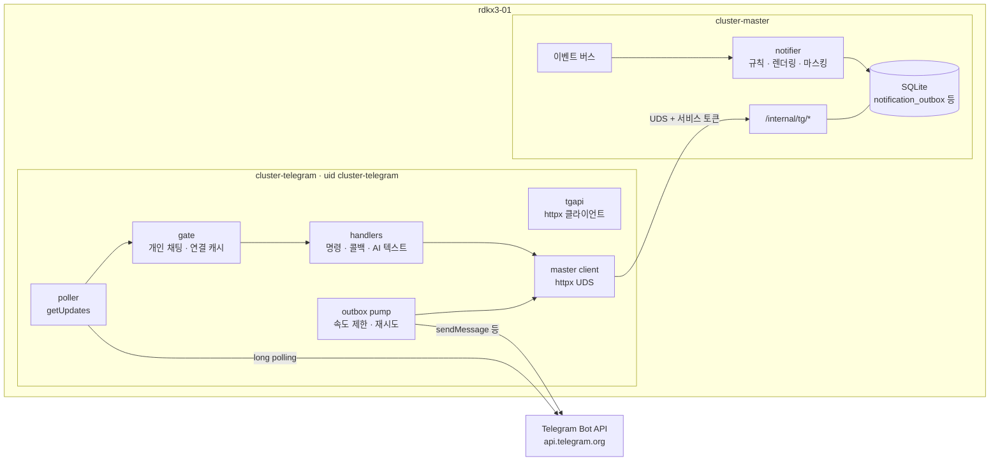
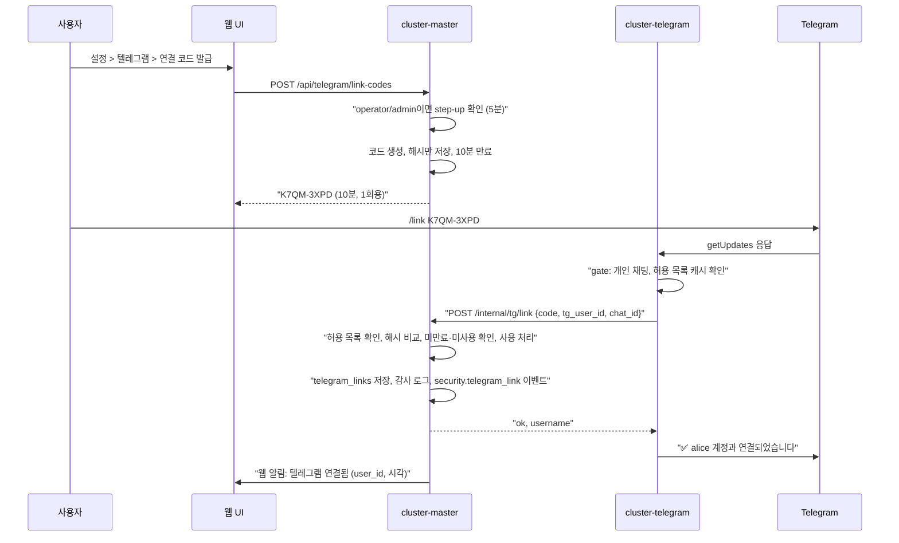
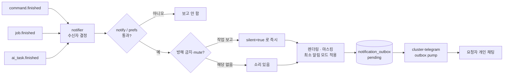
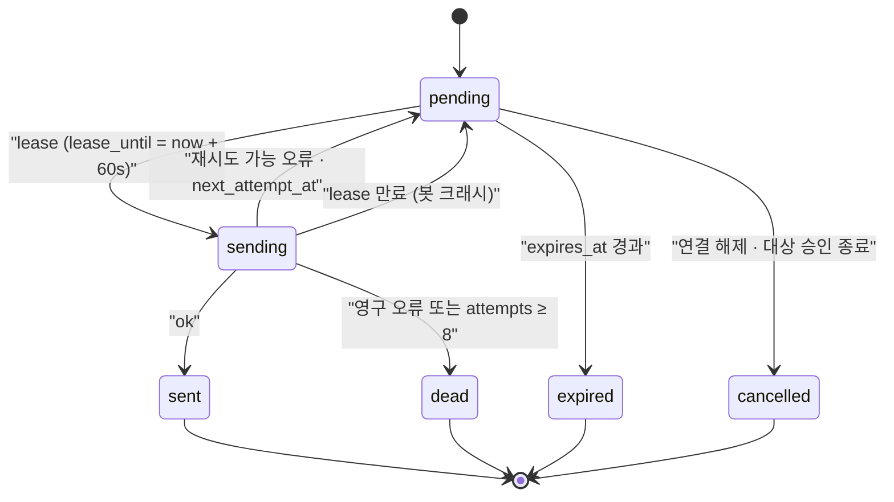
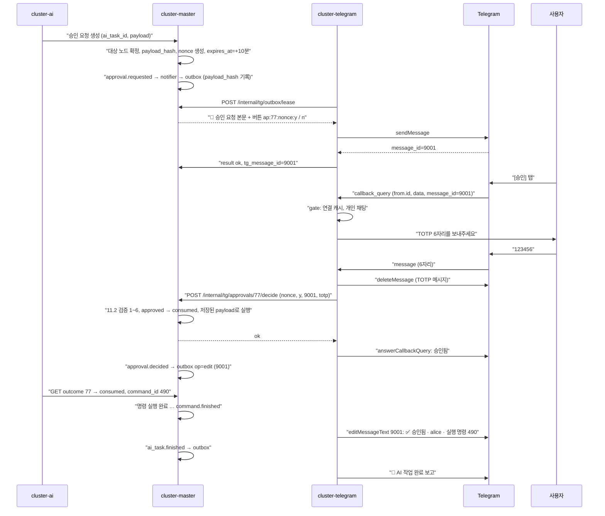
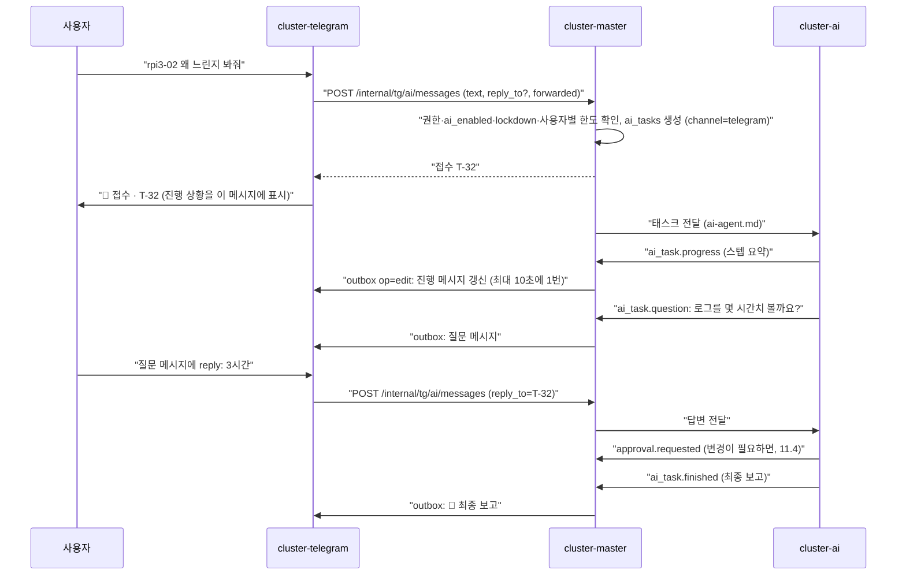

# 텔레그램 연동 설계

> 사용자가 요청한 명령·잡·AI 작업이 끝나면 요청자의 텔레그램으로 보고하고, 경고 알림·간단한 조회/제어·승인 버튼·AI 에이전트 대화 창구를 인바운드 포트 없이(long polling) 제공하는 `cluster-telegram` 서비스의 설계.

**관련 문서**: [PLAN.md](../PLAN.md) · [security.md](./security.md) · [topology.md](./topology.md) · [jobs.md](./jobs.md) · [ai-agent.md](./ai-agent.md)

| 주제 | 이 문서 | 다른 문서 |
|---|---|---|
| 봇 설정, 수신 방식, cluster-telegram 내부 구조, 계정 연결 절차, 알림 규칙·포맷, outbox 신뢰성, 명령어, 승인 버튼 UX, 텔레그램 데이터 모델 | 정의 | — |
| 텔레그램 채널이 완화할 수 없는 보안 기준선, RBAC 매트릭스(Telegram 열), step-up, Approval 필드, 서비스 토큰 범위, 마스킹 규칙, lockdown | 참조만 | [security.md](./security.md) 6, 7, 12, 14, 16장 |
| 잡 상태·재시도·`job.finished` 발생 조건 | 참조만 | [jobs.md](./jobs.md) |
| AI 태스크 수명, 대화 맥락, 진행/질문 이벤트 생성 | 참조만 | [ai-agent.md](./ai-agent.md) |
| rdkx3-01의 cluster-telegram 메모리 예산(RSS ≤60MB, MemoryMax 120M), 콜드 스탠바이 mask | 참조만 | [topology.md](./topology.md) 6.2, 7장 |

---

## 0. 핵심 결정 요약

| 항목 | 결정 |
|---|---|
| 수신 방식 | **long polling (`getUpdates`)**. webhook 금지 (security.md 14장) |
| 프로세스 | `cluster-telegram` 별도 systemd 서비스, 계정 `cluster-telegram`, 리스닝 포트 없음 |
| master 접근 | UDS `/run/cluster-master/internal.sock`의 `/internal/tg/*` + 서비스 토큰(주체 `telegram-bot`). DB 직접 접근 없음 |
| 라이브러리 | **httpx로 Bot API 직접 호출** (얇은 클라이언트 자체 구현). python-telegram-bot / aiogram 미사용 |
| 메시지 렌더링 | master의 `notifier`가 이벤트를 받아 **마스킹된 HTML 본문을 outbox에 저장**, cluster-telegram은 전송만 (전송 직전 `redact` 한 번 더) |
| 신원 확인 | 1차: cluster-telegram이 개인 채팅·캐시된 연결 목록으로 사전 필터. **최종: master가 `tg_user_id → 웹 사용자` 매핑과 권한 계산** |
| 확인/승인 버튼 | 실행을 일으키는 모든 버튼은 `approvals` 객체에 바인딩 (`ap:<approval_id>:<nonce>:<y\|n>`). 실행이 아닌 안전 조치(lockdown, 연결 해제, "본인 아님")는 일회용 확인 토큰 (`cf:<token>:<y\|n>`) |
| 텔레그램 step-up | **medium 이상의 변경**(변경 프리셋, 템플릿 잡, 타인 잡 취소, 셸, AI 요청 승인)은 확인 버튼 + TOTP 6자리(그 approval 1건 전용). cluster-telegram 프로세스가 침해돼도 사람의 일회용 코드 없이는 실행되지 않게 하기 위해서다(security.md T12) |
| 셸 | admin + 텔레그램 셸 스위치 on(기본 off) + 확인 버튼 + 텔레그램 step-up |
| critical 작업 | **텔레그램에서 불가** (as_root, 전원 끄기, 사용자·토큰·보안·AI 정책, lockdown 해제). TOTP를 입력해도 불가 |
| 전체 출력 | 텔레그램으로 보내지 않음. 마지막 N줄(마스킹) + 웹 상세 링크. 자유 텍스트는 `<pre>`/`<code>` 안에만 (6.3) |
| 전달 보장 | outbox 기반 at-least-once, 지수 백오프, 429 `retry_after` 준수. 텔레그램 장애는 master를 막지 않음 |

---

## 1. 봇 생성과 설정

### 1.1 BotFather 절차 (Phase 0, 1회)

| 순서 | BotFather 명령 | 값 | 이유 |
|---|---|---|---|
| 1 | `/newbot` | 표시 이름 `Cluster Web`, username은 추측하기 어려운 이름(예: `cw_<랜덤4자>_bot`) | 봇 username은 공개 검색된다. 숨김은 보안 경계가 아니지만 스팸 유입을 줄인다 |
| 2 | 토큰 보관 | `/etc/cluster-telegram/credentials/bot_token` (root 0600) | 저장·전달 규칙은 security.md 12.1 (`LoadCredential=`) |
| 3 | `/setjoingroups` | **Disable** | 그룹 추가 차단 (security.md 14장) |
| 4 | `/setinline` | 설정하지 않음 (inline mode off) | 다른 채팅에서 `@봇` 호출 경로 제거 |
| 5 | `/setprivacy` | 기본값(Enable) 유지 | 그룹이 막혀 있어 실효는 없지만 안전한 기본값 |
| 6 | `/setdescription`, `/setabouttext` | "개인용 클러스터 관리 봇. 연결된 사용자 외에는 응답하지 않습니다." | |
| 7 | 명령 목록 | BotFather `/setcommands` 대신 **cluster-telegram 시작 시 `setMyCommands`로 등록** (1.2) | 코드와 목록을 한곳에서 관리 |

사용자 측 권고(security.md 14장): 텔레그램 계정에 2단계 인증(클라우드 비밀번호), 휴대폰 화면 잠금.

### 1.2 명령 목록 등록

- 시작 시 `setMyCommands(scope=BotCommandScopeAllPrivateChats)`로 **viewer 수준 목록**(`/start /help /status /nodes /node /jobs /job /ai /mute /unlink`)을 등록한다. 목록은 힌트일 뿐이며 권한은 master가 판단한다.
- v2b: 연결된 사용자마다 `setMyCommands(scope=BotCommandScopeChat(chat_id))`로 역할에 맞는 목록(operator: `/run /cancel /approvals /lockdown` 추가, admin: `/sh` 추가)을 설정한다. 역할이 바뀌면 연결 목록 갱신(3.4) 때 다시 설정한다.

---

## 2. 연결 방식: long polling

| 기준 | long polling `getUpdates` (채택) | webhook `setWebhook` (기각) |
|---|---|---|
| 네트워크 | **아웃바운드 HTTPS만** (rdkx3-01 → api.telegram.org:443) | 인터넷에서 닿는 공개 HTTPS 엔드포인트 필요 (포트포워딩, 공인 인증서, 또는 Cloudflare Tunnel 등) |
| 보안 기준선 | security.md 0장 "인바운드 포트 0개" 준수 | 위반. 공개 엔드포인트가 새 공격 표면이 된다 |
| 지연 | 수백 ms 수준. 1인 사용에 충분 | 약간 더 빠름 |
| 자원 | 상시 연결 1개 (50초 주기 재요청) | 요청 시에만 |
| 장애 시 | master·봇이 내려가도 Telegram이 미수신 update를 일정 시간(공식 문서 기준 24시간, 구현 시 재확인) 보관 | 재전송은 되지만 공개 엔드포인트가 살아 있어야 함 |

### 2.1 폴링 루프 규칙

```text
getUpdates(offset=last_update_id+1, timeout=50,
           allowed_updates=["message", "callback_query", "my_chat_member"])
httpx read timeout = 65초, 연결 실패 시 백오프 1 → 2 → 4 … 최대 60초
```

- `allowed_updates`에 없는 종류(`edited_message`, `channel_post`, `inline_query` 등)는 Telegram이 보내지 않는다. 수정된 메시지로 명령을 바꿔치기하는 경로가 없어진다.
- **offset은 처리 전에 저장한다.** update를 받으면 `/var/lib/cluster-telegram/state.json`(`last_update_id`)을 먼저 기록(원자적 rename)하고 핸들러를 실행한다. 핸들러 도중 죽으면 그 update는 다시 오지 않는다 → 변경 작업은 **at-most-once**. 사용자는 결과가 없으면 다시 보낸다.
- **오래된 update 거부**: `message.date`가 현재보다 120초 넘게 과거인 **변경 요청**(`/run`, `/sh`, `/cancel`, `/lockdown`, AI 텍스트)은 실행하지 않고 "오래된 요청이라 무시했습니다. 다시 보내주세요"라고 답한다. 조회 명령은 처리한다. 봇·master가 오래 내려갔다 올라왔을 때 쌓인 명령이 한꺼번에 실행되는 것을 막는다. 시간 동기화는 topology.md 4.4.
- **시작 시 webhook 점검**: `getWebhookInfo`에 URL이 설정돼 있으면 우리가 설정한 적이 없으므로 **봇 토큰 유출 신호**다. `deleteWebhook` 후 master에 `security.telegram` 경보(`alert.raised`, critical)를 보고하고 토큰 교체(security.md 12.4)를 안내한다.
- **단일 인스턴스**: 같은 토큰으로 `getUpdates`를 두 프로세스가 호출하면 409 Conflict가 난다. rdkx3-02의 cluster-telegram은 mask 상태다(topology.md 7장). 409가 계속되면 경보를 올리고 폴링을 60초 간격으로 늦춘다(토큰을 다른 곳에서 쓰는 중일 수 있음).

---

## 3. 프로세스 구조

### 3.1 구성



| 모듈 | 책임 | 하지 않는 것 |
|---|---|---|
| `tgapi` | Bot API 메서드 호출, 오류 분류(429/403/400/5xx/네트워크) | 재시도 정책 결정 |
| `poller` | `getUpdates` 루프, offset 저장 | 판단 |
| `gate` | 채팅 종류·발신자 1차 필터, 무시 카운트 보고 | 권한 판단 (master 몫) |
| `handlers` | 명령 파싱, master 호출, 즉시 응답(조회 결과·접수 확인) | DB 접근, 권한 계산 |
| `outbox pump` | outbox 임대(lease) → 전송 → 결과 보고 | 메시지 내용 생성 |
| `master client` | `/internal/tg/*` 호출, `X-On-Behalf-TG-User` 헤더 부착 | — |

**master 쪽 `notifier`**(master/app/services/notifier.py)가 이벤트를 구독해 수신자·구독·방해 금지·중복 억제 규칙을 적용하고, HTML 본문을 렌더링·마스킹해 `notification_outbox`에 넣는다. 데이터와 권한 정보가 master에 있으므로 렌더링도 master에서 한다. cluster-telegram은 "무엇을 보낼지" 모르는 배달부다.

### 3.2 라이브러리 선택

| 기준 | python-telegram-bot v21+ (async) | aiogram 3 | **httpx 직접 호출 (채택)** |
|---|---|---|---|
| 추가 의존성 | httpx + 프레임워크 본체 | aiohttp, pydantic v2, magic-filter, aiofiles 등 | **httpx 하나** (UDS 호출에도 어차피 필요) |
| 메모리 (RSS 예산 60MB) | 여유 있음 | pydantic 모델 로딩으로 가장 무거움 | 가장 가벼움 |
| 우리가 쓰는 기능 | Application, 핸들러, JobQueue, persistence 대부분 미사용 | Router, FSM 대부분 미사용 | 필요한 메서드 13개만 |
| 429·재시도·offset 제어 | 프레임워크 내부 동작을 이해하고 맞춰야 함 | 동일 | **outbox 설계와 1:1로 직접 구현** |
| 버전 변화 | 메이저 버전마다 호환성 깨짐이 잦았음 | 2→3에서 전면 변경 | Bot API 자체는 하위 호환을 잘 지킴 |
| 테스트 | 가짜 서버 가능 | 가능 | `base_url`만 바꾸면 가짜 Bot API 서버로 그대로 (15장) |
| 감사 가능성 (보안 우선) | 큰 코드베이스 | 큰 코드베이스 | 약 400줄, 전부 읽을 수 있음 |

**결정: httpx 직접 호출.** 쓰는 메서드는 `getMe, getUpdates, getWebhookInfo, deleteWebhook, sendMessage, editMessageText, editMessageReplyMarkup, answerCallbackQuery, sendDocument, deleteMessage, sendChatAction, leaveChat, setMyCommands` 13개다. Update/Message는 dict로 받고 필요한 필드만 작은 dataclass로 꺼낸다. 프레임워크가 주는 편의(FSM, 핸들러 라우팅)는 명령 수가 적어 직접 만드는 비용이 작다. 나중에 기능이 크게 늘면 python-telegram-bot으로 옮기는 것을 재검토한다(같은 httpx 기반이라 이전 비용이 낮다).

### 3.3 내부 API (`/internal/tg/*`)

공통: `Authorization: Bearer cst_...`(주체 `telegram-bot`, security.md 12.2). 사용자 대신 하는 요청은 `X-On-Behalf-TG-User: <telegram user_id>`와 `X-TG-Update-Id`를 붙인다. **봇은 웹 사용자 ID를 보내지 않는다.** master가 `telegram_links`로 사용자를 찾고, 연결이 없거나 `status != active`면 403. 감사 로그는 `actor_type=service, actor_id=telegram-bot, on_behalf_of=<user>, channel=telegram`으로 남는다(security.md 13.1).

| Method | Path | 용도 | 단계 |
|---|---|---|---|
| GET | `/internal/tg/links` | 연결 캐시용 목록 `[{tg_user_id, chat_id, role, status}]` + 허용 user_id 목록 | v1 |
| POST | `/internal/tg/link` | `{code, tg_user_id, chat_id, tg_username}` 계정 연결 | v1 |
| POST | `/internal/tg/unknown` | 무시한 발신자 카운트 `{tg_user_id, n}` (내용 없음) | v1 |
| POST | `/internal/tg/outbox/lease` | `{limit, lease_s}` → 전송할 항목 임대 | v1 |
| POST | `/internal/tg/outbox/{id}/result` | `{ok, tg_message_id, error_code, retry_after, description}` | v1 |
| POST | `/internal/tg/health` | 폴링 상태, 연속 실패 수, 409/webhook 탐지 보고 | v1 |
| GET | `/internal/tg/view/status` · `/view/nodes` · `/view/nodes/{name}` | 조회 (요약 텍스트 렌더링은 master) | v1 (`status`) / v2b |
| GET | `/internal/tg/view/jobs` · `/view/jobs/{id}` · `/view/commands/{id}/tail?node=` | 조회, 출력 꼬리 | v2b |
| POST | `/internal/tg/commands` | `/run`, `/sh` 요청 → 확인용 approval 생성 또는 즉시 실행(조회성 프리셋) | v2b |
| POST | `/internal/tg/cancel` | `{kind: command\|job\|ai_task, id}` | v2a(`ai_task`) / v2b |
| POST | `/internal/tg/approvals/{id}/decide` | `{nonce, decision, tg_message_id, totp?}` — 결정 **중계**. medium 이상 승인은 `totp` 필수 | v2b |
| GET | `/internal/tg/approvals` | 이 사용자가 텔레그램에서 결정할 수 있는 pending 목록 | v2b |
| POST | `/internal/tg/confirm` | `cf:` 토큰 사용 `{token, decision}` (lockdown, 연결 해제, 본인 아님) | v1 |
| POST | `/internal/tg/confirm-token` | `/lockdown`, `/unlink` 입력 시 확인 토큰 발급 | v1 |
| POST | `/internal/tg/prefs/mute` | `{minutes \| off}` | v1 |
| POST | `/internal/tg/ai/messages` | `{text, effort, reply_to_ai_task_id?, forwarded}` → AI 태스크 생성/후속 지시/ask_user 답변. 텔레그램 AI 입력의 **유일한 경로**(ai-agent.md 6.2) | v2a |

이 목록에 없는 동작(사용자·노드·보안 설정, lockdown 해제, as_root, 전원 끄기)은 내부 API 자체에 경로가 없다. `/internal/tg/*` 라우터는 web 라우터를 재사용해 통째로 마운트하지 않고 위 표의 경로만 명시적으로 등록하며, 각 라우트는 허용 principal(`telegram-bot`)을 선언해야 한다(선언 없으면 기본 거부, 라우트 스냅숏 CI 고정 — security.md 4.1). 서비스 범위(`service_scope`)와 채널 규칙(`channel_allows`) 검사는 master의 공통 권한 함수(security.md 7.2)가 한 번 더 한다.

### 3.4 연결 캐시와 master 장애

- cluster-telegram은 `GET /internal/tg/links` 결과를 메모리에 캐시한다(60초마다, 그리고 outbox에 `refresh_links` 신호가 오면 즉시 갱신). 캐시는 **응답할지 말지**를 정하는 사전 필터일 뿐, 권한 근거가 아니다.
- master에 닿지 않으면: 캐시에 있는 사용자에게만 "master에 연결할 수 없습니다. 잠시 후 다시 시도하세요"라고 답한다. 캐시에 없으면 무응답. 캐시가 비어 있으면(시작 직후 master 다운) 모두 무응답.

### 3.5 systemd 유닛 (발췌)

security.md 9.6의 하드닝 계열 옵션을 그대로 쓰고, 텔레그램 고유 항목만 적는다.

```ini
# /etc/systemd/system/cluster-telegram.service (발췌)
[Unit]
After=network-online.target cluster-master.service
Wants=network-online.target

[Service]
User=cluster-telegram
Group=cluster-telegram
SupplementaryGroups=cluster-svc            # internal.sock 접근 (security.md 4.2)
ExecStart=/opt/cluster-web/venv/bin/python -m cluster_telegram
LoadCredential=bot_token:/etc/cluster-telegram/credentials/bot_token
LoadCredential=service_token:/etc/cluster-telegram/credentials/service_token
StateDirectory=cluster-telegram            # /var/lib/cluster-telegram (offset만)
RestrictAddressFamilies=AF_UNIX AF_INET AF_INET6
ProtectProc=invisible
MemoryMax=120M
OOMScoreAdjust=-300
Restart=always
RestartSec=5
# v2 (cgroup BPF 지원 여부 Phase 0 확인): 사설망·tailnet으로의 연결 차단, DNS 서버만 허용
# IPAddressDeny=localhost 10.0.0.0/8 172.16.0.0/12 192.168.0.0/16 100.64.0.0/10
# IPAddressAllow=<공유기 DNS IP>
```

설정 파일 `/etc/cluster-telegram/config.yaml` (비밀 없음):

```yaml
master_socket: /run/cluster-master/internal.sock
api_base: https://api.telegram.org      # 운영에서는 고정. 테스트에서만 가짜 서버 주소
poll_timeout_s: 50
stale_update_s: 120
rate:
  per_chat_per_s: 1        # Telegram FAQ 권고(채팅당 초당 약 1건) — 구현 시 공식 문서 재확인
  global_per_s: 25         # FAQ의 전체 약 30건/초보다 낮게
lease_s: 60
```

---

## 4. 계정 연결

### 4.1 전제: 허용 user_id 목록

security.md 14장에 따라 처리 대상은 **허용 user_id 목록 ∩ 웹 계정과 연결된 ID**다. 허용 목록은 보안 설정(`telegram.allowed_user_ids`, admin + 웹 + step-up)이다. 자기 user_id를 알아내는 방법:

1. 봇에게 아무 메시지나 보낸다(무응답).
2. 웹 설정 → 텔레그램 화면의 **"최근 무시된 발신자"** 목록(user_id, 처음·마지막 시각, 횟수 — 메시지 내용은 저장하지 않음)에서 자신을 확인하고 허용 목록에 추가한다.

외부 봇(user_id 조회 봇 등)을 쓰라고 안내하지 않는다.

### 4.2 연결 절차



| 항목 | 규칙 |
|---|---|
| 코드 형식 | Crockford Base32 8자(혼동 문자 제외, 약 40비트), 표시용 하이픈 `XXXX-XXXX`. 입력은 대소문자·하이픈 무시 |
| 유효 | 10분, 1회 사용. 사용자당 유효한 코드는 1개(새로 발급하면 이전 코드 폐기) |
| 저장 | `telegram_link_codes.code_hash` = HMAC-SHA256(session_key 파생 키, 코드). 평문 저장 안 함 |
| 무차별 대입 | tg_user_id당 `/link` 실패 5회/1시간 → 1시간 동안 `/link` 무응답. 코드당 실패 3회 → 코드 폐기. 허용 목록 밖의 `/link`는 처음부터 무응답 |
| 바인딩 | 웹 사용자 1명 ↔ 텔레그램 user_id 1개 (양쪽 UNIQUE). `chat_id`는 개인 채팅이므로 user_id와 같다 |
| 재연결 | 이미 연결된 사용자가 새 코드로 다른 user_id를 연결하면 이전 연결은 `revoked`, 이전 채팅에 "다른 텔레그램 계정으로 연결이 옮겨졌습니다" 전송 |
| 확인 메시지 | 연결·해제·재연결 모두 **웹 알림 + 텔레그램 메시지 + 감사 로그**. 사용자 본인이 아닌데 연결됐다면 즉시 알아챌 수 있게 한다 |

### 4.3 해제

| 경로 | 절차 |
|---|---|
| 텔레그램 `/unlink` | 확인 버튼(`cf:`) 한 번 → 해제 |
| 웹 설정 (본인) | 즉시 해제 (권한 축소이므로 step-up 불필요) |
| 웹 (admin) | 다른 사용자의 연결 해제. 휴대폰 분실 대응 (security.md 14장) |
| 자동 | 사용자 비활성·삭제 → `suspended`/`revoked`. 사용자가 봇을 차단(403) → `blocked` (전송 중단, 웹에 표시. 사용자가 다시 `/start` 하면 `active`로 복귀) |

해제되면 그 사용자의 pending outbox 항목은 `cancelled`, 그 사용자가 텔레그램 채널에서 요청한 pending 승인은 `cancelled`.

---

## 5. 인증과 인가

### 5.1 처리 순서

```text
update 수신
 ├─ my_chat_member: 봇이 그룹/채널에 추가됨 → leaveChat, 경보(alert.raised security.telegram)  [응답 없음]
 ├─ chat.type != "private" 또는 chat.id != from.id → 무시                                   [응답 없음]
 ├─ from.is_bot → 무시
 ├─ from.id ∉ 연결 캐시:
 │    ├─ from.id ∈ 허용 목록 이고 /start 또는 /link → 연결 안내 / 연결 처리
 │    └─ 그 외 → 무시, unknown 카운트 +1 (60초마다 묶어서 master에 보고)                   [응답 없음]
 ├─ 대기 중인 TOTP 입력 상태이고 text가 ^\d{6}$ → step-up 처리 (11.3, medium 이상 승인)
 ├─ forward_origin 있음 → 명령으로 해석하지 않음. AI 텍스트로만 전달(forwarded=true, v2a)
 └─ 명령/콜백/텍스트 → master 호출 (master가 최종 권한 판단, 거부 시 이유 한 줄)
```

- 무시한 발신자에 대한 기록은 user_id·횟수·시각뿐이다. 1시간에 20회를 넘는 발신자는 master가 `security.telegram_probe` 감사 기록을 남기고 웹 보안 화면에 표시한다(텔레그램 알림은 하지 않음 — 알림 폭탄 방지).
- 연결된 사용자의 요청이 권한 부족으로 거부되면 "권한이 없습니다 (필요: admin)"처럼 짧게 답한다. 연결되지 않은 발신자에게는 존재조차 드러내지 않는다.

### 5.2 텔레그램 채널 정책

역할은 웹 사용자의 **현재** 역할을 따르고(security.md 7.2, 실행 시점 재조회), 채널 규칙은 security.md 7.3의 Telegram 열을 그대로 구현한다. 이 표는 그 열을 텔레그램 UX로 옮긴 것이며, 충돌하면 security.md가 우선한다.

| 작업 | 위험도 | 필요 역할 | 텔레그램 절차 |
|---|---|---|---|
| 조회 (`/status /nodes /node /jobs /job`) | low | viewer+ | 즉시 |
| 프리셋: 조회성 (프리셋 정의에 `readonly: true`) | low | operator+ | 즉시 |
| 프리셋: 변경 (서비스 재시작, 재부팅, apt) | high | operator+ | **확인 버튼 + TOTP** (approval, 5분) |
| 템플릿 잡 제출 | medium | operator+ | 확인 버튼 + TOTP. 전용 명령(`/submit <템플릿>`)은 "나중", AI v3(PLAN Phase 12)부터는 AI 경유 제출(승인 버튼 + TOTP)로 가능 |
| 셸 `/sh` (`cluster-run`) | high | admin | 텔레그램 셸 스위치 on(기본 **off**, 웹 admin + step-up으로 켬) + **확인 버튼 + TOTP** |
| 임의 코드 잡 | high | admin | 셸과 같은 조건 |
| 취소: 본인 명령·잡·AI 태스크 | low | operator+ (AI 태스크는 viewer+ 본인) | 즉시 |
| 취소: 타인 잡 | medium | admin | 확인 버튼 + TOTP |
| 승인 결정 (AI 요청 등) | 대상 작업 | 그 작업을 텔레그램에서 직접 할 수 있는 사람 | 버튼. 대상이 medium 이상이면 TOTP 추가 |
| lockdown 발동 `/lockdown` | — | operator+ | 확인 버튼 1회 (`cf:`) |
| AI 사용 | — | viewer: 읽기 질의 / operator+: 변경 제안 | 즉시 (변경은 AI가 approval 요청) |
| cordon/drain, as_root, 전원 끄기, 노드·사용자·토큰·보안·AI 정책, lockdown 해제, 감사 로그 보기 | medium~critical | — | **불가.** "웹에서만 가능합니다" + 웹 링크 |

> 텔레그램 step-up(TOTP)은 **medium 이상의 모든 변경과 그 승인**에 쓴다(security.md 6장·7.3). 이유: master는 사람이 실제로 버튼을 눌렀는지 독립적으로 확인할 수 없어서, cluster-telegram 프로세스가 침해되면(봇 토큰 없이도) 연결된 사용자를 사칭해 요청과 승인 결정을 모두 위조할 수 있다(security.md T12, 12.2). 사람만 아는 일회용 코드가 그 위조를 막는다. TOTP는 critical 작업의 우회 수단이 아니며, TOTP를 입력해도 as_root·전원 끄기는 열리지 않는다.

---

## 6. 작업 완료 보고 (핵심)

### 6.1 notify 옵션

명령·잡·AI 작업 생성 요청에 `notify` 필드를 둔다. 웹, 텔레그램, AI(대신 제출) 모두 같다.

| 값 | 의미 |
|---|---|
| `default` (기본) | 요청자의 `notification_prefs`를 따른다 (아래 기본값: 항상 보고) |
| `always` | 성공·실패 모두 보고 |
| `failure` | 실패·타임아웃·취소(본인 외)·일부 실패만 보고 |
| `never` | 보고 안 함 (웹 이력에는 남음) |

- 저장: `commands.notify`, `jobs.notify`, `ai_tasks.notify` 컬럼 (jobs.md, ai-agent.md 계약). 세 곳 모두 **이 단일 문자열 enum**을 쓰고 `job.finished` 등 이벤트 payload의 `notify`도 같은 값이다.
- AI가 대신 제출한 명령·잡의 기본값은 `never`(AI 보고에 포함). AI 태스크가 끝났는데 그 잡이 아직 돌면 master가 `default`로 바꾼다.
- prefs 기본값: `report_commands=always`, `report_jobs=always`, `report_ai=always`, `skip_success_under_s=0`(생략 안 함). 사용자가 `skip_success_under_s=10`처럼 설정하면 **10초 미만에 성공한 명령**은 보고하지 않는다(실패는 항상 보고).
- 수신자는 **요청자 한 명**이다. AI가 대신 제출한 명령·잡의 요청자는 그 AI 태스크를 만든 사용자다.
- AI 태스크 안에서 실행된 명령·잡은 개별 보고하지 않고 `ai_task.finished` 보고에 포함한다. 단, AI 태스크가 끝난 **뒤에** 끝난 잡(장시간 잡)은 개별 `job.finished` 보고를 보낸다.
- 텔레그램에서 요청한 명령은 접수 응답("⏳ 실행 중 · #482")을 보낸 뒤, 완료 보고로 **그 메시지를 편집**한다(outbox `op=edit`). 웹·AI에서 요청한 것은 새 메시지.

### 6.2 이벤트 → outbox 흐름



- 이벤트 핸들러는 **DB insert 한 번**만 한다(배치 쓰기에 합류). 텔레그램 상태와 무관하게 즉시 끝난다.
- 작업 완료 보고는 사용자가 요청한 것이므로 방해 금지 시간에도 보내되 **소리 없이**(`disable_notification=true`) 보낸다.
- (v2) 묶음 전송: 같은 사용자에게 10초 안에 완료 보고가 5건을 넘으면 6번째부터는 모아서 "완료 7건 · 실패 1건" 요약 1건으로 보낸다. v1은 개별 전송 + 9.1의 속도 제한만 쓴다.

### 6.3 메시지 포맷

공통 규칙:

- 첫 줄: **상태 이모지 + 종류 + 작업 이름** (굵게). 실패면 첫 줄 전체를 `<b>`로, 성공은 이름만 굵게.
- 둘째 줄: 대상·결과 집계·소요 시간. 셋째 줄: 요청 채널·요청자·완료 시각(사용자 시간대).
- 노드별 결과는 한 줄 요약. 5대이므로 전부 나열한다(10대 초과 시 실패 노드만 + "외 N대 성공").
- 출력 꼬리: **실패한 노드만** 마지막 `output_tail_lines`줄(기본 5, 최대 20), 노드당 최대 800자, 마스킹(security.md 12.3) + ANSI·제어문자 제거(security.md 8.4) + HTML 이스케이프 후 `<pre>`. 성공 노드 출력은 기본 생략(prefs `tail_on_success`로 켤 수 있음).
- **자유 텍스트 격리**: 사용자·노드·AI가 만든 모든 자유 텍스트(출력 꼬리, 잡 `error_tail`, 오류 메시지, AI `report_md`·진행·질문 메시지, 명령 원문)는 `<pre>` 또는 `<code>` 안에만 넣는다. 템플릿이 만든 고정 문구와 노드 이름·숫자만 그 밖에 둔다. AI 보고 본문에서 `web_base_url`로 시작하지 않는 URL은 `hxxp://`·`hxxps://`로 무력화한다. 메시지 안의 링크는 템플릿이 만든 "상세 보기" 하나뿐이다. `<pre>` 안의 URL이 텔레그램 클라이언트에서 자동 링크되는지는 Phase 0에서 확인하고, 링크된다면 `<pre>` 안에도 같은 무력화를 적용한다.
- 마지막 줄: 웹 상세 링크 `{web_base_url}/commands/<id>` (`web_base_url`은 tailscale serve 주소, 설정값. tailnet 안에서만 열린다. failover 시 `cluster-master-admin config set web_base_url`로 바꾼다 — topology.md 7.3). 링크 미리보기는 끈다(`link_preview_options.is_disabled=true`).
- 최소 알림 모드(prefs `minimal_mode=true`): 첫 두 줄 + 링크만. 출력, 오류 메시지, 명령 원문 없음.

상태 이모지:

| 이모지 | 의미 |
|---|---|
| ✅ | 전체 성공 |
| ❌ | 실패 또는 일부 실패 (노드별: exit ≠ 0, error) |
| ⏱ | 타임아웃 (노드별) |
| 🛑 | 취소됨 |
| ⏭ | 건너뜀 (offline 노드) |
| ⏳ | 실행 중 (접수 응답) |
| 🔐 | 승인 필요 |
| 🤖 | AI 작업 |

예시 1 — 명령 성공 (렌더링 결과):

```text
✅ 명령 완료 · uptime
대상 5대 · 성공 5 · 1.2초
web · alice · 10/06 14:02
rdkx3-01 ✅  rdkx3-02 ✅  rpi3-01 ✅  rpi3-02 ✅  rpi3-03 ✅
상세 보기
```

예시 2 — 프리셋 일부 실패:

```text
❌ 명령 실패 (1/3) · APT 업데이트 [system.apt_update]
대상 3대 · 성공 2 · 실패 1 · 34.8초
telegram · alice · 10/06 14:05
rpi3-01 ✅ 0   rpi3-02 ✅ 0   rpi3-03 ❌ exit 100
── rpi3-03 출력 마지막 3줄 ──
E: Could not get lock /var/lib/apt/lists/lock. It is held by process 812 (apt-get)
E: Unable to lock directory /var/lib/apt/lists/
W: Problem with auth.conf: password=[REDACTED:secret]
상세 보기
```

예시 3 — 잡 실패 (재시도 소진 후 `job.finished` 1회):

```text
❌ 잡 실패 · bpu-infer-batch #J-1187
템플릿 bpu.infer v3 · rdkx3-02 · 시도 3/3 · 12분 4초
web · alice · 10/06 15:20
하위 작업 8개 · 성공 7 · 실패 1 (rdkx3-02: exit 137, 메모리 제한 512MB 초과 의심)
상세 보기
```

예시 4 — AI 작업 완료:

```text
🤖 AI 작업 완료 · T-31
요청: "rpi3 노드 디스크 정리해줘"          ← <code>
rpi3-01~03 작업 디렉터리 캐시 정리, 확보 1.8GB  ← AI 요약, <pre>
실행: 명령 #490 (승인 #77 · telegram에서 승인)
스텝 7 · 3분 12초
상세 보기
```

HTML 템플릿(예시 2의 머리 부분):

```html
<b>❌ 명령 실패 (1/3) · {{ name | e }}</b>
대상 {{ n }}대 · 성공 {{ ok }} · 실패 {{ fail }} · {{ duration }}
{{ channel }} · {{ user | e }} · {{ finished_at }}
{{ node_lines }}
<pre>{{ tail | redact | strip_ansi | e }}</pre>
<a href="{{ web_base_url }}/commands/{{ id }}">상세 보기</a>
```

`e` = `html.escape(s, quote=False)` (`&`, `<`, `>`만 대상. 속성값인 href는 `quote=True`). 노드 이름·프리셋 이름·사용자 이름·AI 요약문 등 **모든 변수**를 이스케이프한다. 자유 텍스트 변수는 이스케이프 후 반드시 `<pre>`/`<code>` 안에 넣는다(템플릿 린트로 검사). 렌더링 후 길이 검사는 7.1.

---

## 7. 메시지 길이와 형식

### 7.1 길이

- `sendMessage` 텍스트 한도는 엔티티 파싱 후 4096자(공식 문서 기준, 구현 시 재확인). 안전 여유를 두고 **렌더링된 본문의 가시 텍스트를 3800자(UTF-16 코드 단위)** 이내로 맞춘다.
- 초과 처리 순서: ① 출력 꼬리 줄 수를 줄인다 → ② 노드별 줄을 실패 노드만 남긴다 → ③ 그래도 넘으면 본문을 잘라 "…(웹에서 보기)".
- **예외: 승인(approval) 메시지는 절대 잘라내지 않는다**(security.md 7.5-6). 원문 명령, 대상, payload 해시 접두사를 넣어 3800자를 넘거나 명령이 20줄(`approval_max_lines`)을 넘으면 텔레그램에는 **버튼 없이** "🔐 승인 요청 #N — 내용이 길어 웹에서만 승인할 수 있습니다" + 상세 링크만 보내고, approval의 `allowed_channels`에서 `telegram`을 뺀다. 사용자가 본 내용과 실행될 내용이 항상 같도록 하기 위해서다.
- **명령·잡 출력은 파일로도 보내지 않는다.** security.md 14장("전체 출력은 보내지 않고 요약 + 웹에서 보기")을 따른다. 사용자가 더 보고 싶으면 [출력 더 보기] 버튼(`mo:`)으로 해당 노드의 마지막 50줄(마스킹, 한 메시지 한도 안)을 받는다.
- **`.txt` 첨부(`sendDocument`)는 출력이 아닌 요약성 본문에만** 쓴다: 4096자를 넘는 AI 최종 보고서, 일일 요약. 마스킹 후 첨부, 최대 64KB. 파일명 `ai-task-<id>.txt`.

### 7.2 HTML parse_mode

- `parse_mode=HTML` 고정(MarkdownV2는 이스케이프 대상 문자가 많아 실수 위험이 크다).
- 허용 태그만 템플릿에서 쓴다: `<b> <i> <code> <pre> <a href>`. 사용자·노드에서 온 문자열은 6.3의 `e`로 반드시 이스케이프.
- 전송 시 400 "can't parse entities"가 나면: 같은 본문을 태그 제거 + 일반 텍스트로 1회 재전송하고, 렌더러 버그로 경보(웹 전용)를 남긴다.
- 모든 메시지에 `protect_content=true`(전달·저장 제한. 스크린샷까지 막는 보장은 아니므로 보안 경계로 보지 않음), `link_preview_options.is_disabled=true`.

---

## 8. 기타 알림

### 8.1 알림 종류와 기본 구독

| 이벤트 | 내용 | 기본 수신자 | 기본 구독 | 방해 금지 시간 | 중복 억제 키 |
|---|---|---|---|---|---|
| `node.offline` | 🔴 노드 offline (마지막 수신 시각) | operator·admin | on | 보류 → 요약 | `node:<id>:state` |
| `node.online` | 🟢 복귀 (offline 지속 시간) | 같음 | offline 알림을 보낸 경우에만 | 보류 → 요약 | 같음 |
| `alert.raised` warning | 🌡 온도 ≥70°C, ⚡ Pi 저전압, 💾 디스크 ≥90%, 메모리 지속 | operator·admin | on (`alert_min_level=warning`) | 보류 → 요약 | `alert:<rule>:<node>` |
| `alert.raised` critical | 🚨 온도 ≥80°C, 백업 2시간 누락, 감사 체인 실패 등 | operator·admin | on | **즉시, 소리 있음** | 같음 |
| `alert.resolved` | 해결 (원래 알림에 reply) | 원래 받은 사람 | on | 보류 → 요약 | 같음 |
| `security.login` | 🛡 새 기기/IP 로그인, 잠금, step-up 실패 | **해당 사용자 + 모든 admin** | **필수 (끌 수 없음)** | 즉시, 소리 있음 | `sec:<user>:<kind>` (5분) |
| `security.login` 실패 급증 | 15분 실패 20회 이상 등 (security.md 5.4 임계값) | 모든 admin | 필수 | 즉시 | `sec:bruteforce` (15분) |
| `system.lockdown` | 발동·해제, 발동 주체·채널 | 모든 연결 사용자 | 필수 | 즉시 | — |
| `security.telegram_link` | 연결·해제·재연결 | 해당 사용자 | 필수 | 즉시 | — |
| `approval.requested` | 🔐 승인 요청 (11장) | 결정 권한자 | on | 즉시, 소리 있음 | — |
| master 무응답 (외부 감시) | 🚨 rdkx3-01/master에서 ping이 끊김 | 외부 dead-man 서비스가 직접 보냄 (이 봇 경로 아님) | 필수 | 즉시 | — (topology.md 7.4) |
| 일일 요약 | 노드 가동률, 완료/실패 작업 수, 경고 요약, AI 비용 | 신청자 | **off** (선택) | 해당 없음 | `daily:<date>` |

- node offline은 PLAN.md 12장 기준 15초 무응답으로 판정되지만, 재부팅·순간 끊김 알림을 줄이려고 **offline이 `node_offline_grace_s`(기본 60초) 지속될 때만** 보낸다. 사용자가 텔레그램/웹에서 직접 요청한 재부팅 대상 노드는 5분간 offline 알림을 억제하고 완료 보고에 "재부팅 후 복귀 확인됨"을 붙인다(복귀 실패 시 offline 알림).
- 새 기기 로그인 알림에는 [본인 아님: 세션 종료 + lockdown] 버튼(`cf:`, 24시간 유효)을 단다(security.md 5.5). 누르면 그 사용자의 전 세션 폐기 + lockdown 발동.

### 8.2 사용자별 설정과 소음 제어

| 기능 | 규칙 |
|---|---|
| 구독 | 웹 설정 → 알림 화면에서 종류별 on/off, `alert_min_level`(warning/critical/off). 필수 항목은 끌 수 없음 |
| 방해 금지 | (v2) `quiet_start`~`quiet_end`(사용자 시간대, 기본 꺼짐). 이 시간 동안 non-critical 알림은 보류했다가 종료 시각에 **요약 1건**으로 보내고, 그 사이 해결된 경고는 "발생 후 해결됨"으로 묶는다. 작업 완료 보고는 소리 없이 즉시. critical·보안은 그대로. v1은 `/mute`만 |
| `/mute [30m\|2h\|off]` | 기본 1시간, 최대 24시간. 방해 금지와 같은 처리. 필수 항목은 영향 없음 |
| 중복 억제 | 같은 `dedupe_key`의 pending 항목이 있으면 새로 만들지 않고 기존 항목의 본문을 최신 상태로 갱신(v1). (v2) 같은 키로 10분 안에 3번 넘게 상태가 바뀌면(flapping) "rpi3-02 상태 불안정: 10분간 offline 4회"로 1건만 |
| 우선순위 | outbox `priority`: critical > high(승인·보안) > normal(작업 보고) > low(요약). 사용자별 전송 순서는 우선순위 → id |

---

## 9. 신뢰성

### 9.1 outbox 상태



| 항목 | 규칙 |
|---|---|
| 전달 보장 | at-least-once. 전송 성공 후 결과 보고 전에 봇이 죽으면 lease 만료로 한 번 더 보낼 수 있다(작업 보고 중복은 감수). 승인 메시지는 중복 전송돼도 버튼이 같은 approval을 가리키므로 안전 |
| 백오프 | `next_attempt_at = now + min(5s × 2^attempts, 10분) × (0.8~1.2 지터)`, 최대 8회 |
| 429 | 응답의 `parameters.retry_after`(초)를 그대로 지킨다. 그 채팅의 전송을 그 시간만큼 멈추고(다른 채팅은 계속) 항목은 attempts를 올리지 않고 `next_attempt_at = now + retry_after`. 같은 1분 안에 429가 3번이면 전역 속도를 절반으로 10분간 낮춤 |
| 403 (차단·탈퇴) | 영구 오류. 해당 링크 `blocked`, 그 사용자 pending 전부 `cancelled`, 웹에 표시 |
| 400 | 파싱 오류는 7.2의 일반 텍스트 재전송 1회. "message is not modified"(편집)는 성공으로 처리. "message to edit not found"는 새 메시지로 전송 |
| 5xx·네트워크 | 재시도 가능 |
| 유효 기간 | 작업 보고·승인 24시간(승인은 approval 만료가 더 짧으면 그쪽), 경고·노드 상태 1시간, 요약 6시간. 지나면 `expired` (3시간 늦은 "offline" 알림은 혼란만 준다) |
| 속도 제한 | 토큰 버킷: 채팅당 초당 1건, 전역 초당 25건 (3.5 설정). 편집(`editMessageText`)도 같은 버킷 |
| 상한 | 사용자당 pending 500건 초과 시 low → normal 순으로 오래된 것부터 `cancelled`, 남은 수를 요약 1건으로 |
| 보존 | `sent/dead/expired/cancelled` 행은 7일 후 삭제(본문에 출력 꼬리가 있으므로 오래 두지 않음). 감사 로그에는 전송 사실만(본문 없음) |
| 재시작 | master 시작 시 `sending` → `pending`. 승인 메시지는 approval이 만료 처리되므로(security.md 7.5-3) 해당 메시지를 "만료됨(master 재시작)"으로 편집하는 항목을 생성 |

### 9.2 텔레그램 장애가 master를 막지 않는 이유

1. master는 Bot API를 호출하지 않는다(봇 토큰도 없다, security.md 12.1). 이벤트 → outbox insert가 전부다.
2. cluster-telegram이 죽거나 api.telegram.org가 막혀도 outbox만 쌓인다. 상한(9.1)과 유효 기간이 무한 증가를 막는다.
3. cluster-telegram의 lease 호출이 5분 넘게 없거나 `/internal/tg/health`가 연속 실패를 보고하면 master가 `alert.raised`(kind `telegram.down`, warning)를 **웹에만** 띄운다.
4. 반대로 master가 죽으면 cluster-telegram은 3.4대로 동작하고, 폴링은 계속한다(오래된 update 거부 규칙이 재개 시 폭주를 막음).
5. **rdkx3-01 자체가 죽으면**(전원, SD 고장, 커널 패닉) notifier·outbox·cluster-telegram이 모두 함께 멈추므로 이 봇으로는 알릴 수 없다. 이 경우는 외부 dead-man 감시가 알린다([topology.md](./topology.md) 7.4).

---

## 10. 명령어

대상(`<대상>`) 문법은 웹과 같다: 노드 이름(`rpi3-01`), 쉼표 목록(`rpi3-01,rpi3-02`), 보드(`board=rpi3`), `all`. master가 요청 시점에 구체적 node_id 목록으로 풀어 approval payload에 넣는다(security.md 7.5-1, `all` 저장 금지).

| 명령 | 설명 | 필요 역할 | 절차 | 단계 |
|---|---|---|---|---|
| `/start` | 연결 상태·사용법. 허용 목록에 있고 미연결이면 연결 안내 | 연결 사용자 (또는 허용 목록) | 즉시 | v1 |
| `/help` | 내 역할로 쓸 수 있는 명령만 표시 | 연결 사용자 | 즉시 | v1 |
| `/link <코드>` | 계정 연결 (4장) | 허용 목록 | 즉시 | v1 |
| `/unlink` | 연결 해제 | 연결 사용자 | 확인 버튼 | v1 |
| `/status` | 클러스터 요약: 온라인 수, 노드별 CPU·온도 한 줄, 활성 경고, 실행 중 잡 수, lockdown 여부 | viewer+ | 즉시 | v1 |
| `/mute [기간\|off]` | 일시 무음 (8.2) | viewer+ | 즉시 | v1 |
| `/lockdown` | 전역 킬 스위치 발동 (security.md 16장) | operator+ | 확인 버튼 | v1 |
| `/ai <자연어>` | AI 에이전트에게 지시 (12장), effort medium | viewer+ (범위는 역할에 따라) | 즉시 접수 | v2a |
| `/ai! <자연어>` | effort high로 지시 (`ai_policy.effort_high_roles`에 있는 역할만) | operator+ (기본) | 즉시 접수 | v2a |
| 일반 텍스트 | `/ai`와 같음 (v2a 이전에는 `/help` 안내) | viewer+ | 즉시 접수 | v2a |
| `/cancel T-<n>` | 본인 AI 태스크 중단 (ai-agent.md 6.3, 실행 중 명령·잡까지 취소) | viewer+ (본인) | 즉시 | v2a |
| `/nodes` | 노드 목록 + 상태 | viewer+ | 즉시 | v2b |
| `/node <이름>` | 노드 상세: 정적 정보 요약, 최신 메트릭, 경고, 실행 중 작업. 내부 IP는 표시하지 않음 | viewer+ | 즉시 | v2b |
| `/jobs` | 내 잡(admin은 전체) 최근 10개, 페이지 버튼(`pg:`) | viewer+ | 즉시 | v2b |
| `/job J-<n>` | 잡 상태·배치 노드·시도 횟수·실패 사유 (`J-<seq_no>`, jobs.md 17장) | viewer+ | 즉시 | v2b |
| `/run <프리셋> <대상> [k=v …]` | 프리셋 실행. 파라미터는 프리셋 스키마로 검증 | operator+ (프리셋별 `role`) | 조회성: 즉시 / 변경: 확인 버튼 + TOTP / 전원 끄기: 불가 | v2b |
| `/sh <대상> <명령>` | 셸 명령 (`cluster-run`). 명령은 첫 공백 이후 원문 그대로 | admin | 셸 스위치 on + 확인 버튼 + TOTP | v2b |
| `/cancel <id>` | 명령·잡 취소 (`#482`=명령, `J-1187`=잡) | operator+ (본인) / admin (타인) | 본인: 즉시 / 타인: 확인 버튼 + TOTP | v2b |
| `/approvals` | 내가 텔레그램에서 결정할 수 있는 pending 승인 목록 (각각 버튼 메시지 재전송) | operator+ | 즉시 | v2b |

- `/run`에 쓸 수 있는 프리셋 목록은 `/run`만 입력하면 표시한다(내 역할 기준, master의 `/presets`와 같은 필터).
- `/sh` 입력 메시지는 명령 원문을 담고 있으므로 처리 후 봇이 `deleteMessage`로 지우지 **않는다**(사용자가 무엇을 보냈는지 확인할 수 있어야 함). 대신 확인 메시지에 원문을 다시 보여준다.

---

## 11. 승인 흐름

### 11.1 callback_data 형식

`callback_data`는 1~64바이트(공식 문서 기준). security.md 14장의 `ap:<approval_id>:<nonce>`에 결정 접미사를 붙인다.

| 접두사 | 형식 | 용도 | 검증 |
|---|---|---|---|
| `ap:` | `ap:<approval_id>:<nonce>:<y\|n>` | 실행을 일으키는 모든 확인·승인 (텔레그램 본인 확인, AI 요청 승인, 타인 잡 취소). medium 이상은 `y` 탭 후 TOTP 입력(11.3) | 11.2 전체 |
| `cf:` | `cf:<token>:<y\|n>` | 실행이 아닌 안전 조치: lockdown 발동, 연결 해제, "본인 아님" | 토큰 해시·소유자·만료·1회 사용 |
| `mo:` | `mo:<command_id>:<node_idx>` | 출력 더 보기 (읽기) | 연결·조회 권한 |
| `pg:` | `pg:<view>:<page>` | 목록 페이지 (읽기) | 연결·조회 권한 |

- `approval_id`는 정수(최대 10자), `nonce`는 승인별 96비트 랜덤의 base64url 16자 → `ap:` 형식은 최대 약 32바이트.
- nonce는 approval 생성 시 만들고 DB에는 `nonce_hash`만 둔다(security.md 7.5). 평문 nonce는 outbox 본문의 `reply_markup`에만 존재하고, outbox 행이 지워질 때 함께 사라진다.
- `cf:` 토큰은 `telegram_confirm_tokens`(13장)에 해시로 저장. 유효: lockdown·연결 해제 2분, "본인 아님" 24시간.

### 11.2 콜백 검증 (master가 최종)

`/internal/tg/approvals/{id}/decide` 처리 순서. 하나라도 실패하면 거부하고 감사 로그(`approval.decide_rejected`, 이유)를 남긴다.

1. `X-On-Behalf-TG-User`(= 콜백의 `from.id`)가 `active` 연결이고, 콜백이 온 채팅이 그 사용자의 개인 채팅이다. (봇이 1차 확인, master가 재확인)
2. approval이 존재하고 `status=pending`, `expires_at > now`. 이미 결정·소비·만료·취소됐으면 "이미 처리된 요청입니다".
3. `SHA-256(nonce) == nonce_hash` (상수 시간 비교).
4. **결정자 권한**: 그 사용자가 이 작업을 **텔레그램 채널에서 직접 할 수 있다**(security.md 7.3 규칙). 텔레그램 셸이 꺼져 있으면 셸 승인은 거부 → "웹에서 승인하세요". `allowed_channels`에 `telegram`이 있어야 한다(7.1의 긴 승인 메시지는 여기서 빠져 있음).
5. **payload 무결성**: 저장된 payload의 canonical JSON 해시를 다시 계산해 `payload_hash`와 비교한다. 그리고 콜백이 온 `tg_message_id`가 이 approval을 표시한 outbox 행의 메시지이고, 그 행에 기록한 `payload_hash`가 현재 값과 같아야 한다 → **사용자가 화면에서 본 내용 = 실행될 내용**.
6. **텔레그램 step-up**: approval의 `risk`가 medium 이상이면(셸 계열 포함) 이 결정 요청에 유효한 TOTP가 있어야 한다(11.3). 거절(`n`)은 TOTP 없이 가능하다(권한 축소 방향).
7. 승인이면 master가 **같은 트랜잭션에서** `pending → approved → consumed`로 바꾸고 저장된 payload로 실행을 시작한다(security.md 7.5-8, 1단계 모델). 요청 주체(AI·사용자)가 실행을 다시 요청하는 단계는 없다. 거절이면 `rejected`.
8. `approval.decided` 이벤트 발행 → notifier가 **원래 메시지를 결과로 편집**하는 outbox 항목(`op=edit`, 버튼 제거)을 만든다. 웹에서 결정되거나 만료돼도 같은 방식으로 텔레그램 메시지가 "웹에서 승인됨 / 만료됨"으로 바뀐다.

봇은 모든 콜백에 `answerCallbackQuery`로 짧은 토스트("승인됨", "만료된 요청")를 반드시 응답한다(버튼 로딩 표시 해제).

### 11.3 텔레그램 step-up (medium 이상)

- 대상 approval이 medium 이상이면 버튼 이름이 [승인 (TOTP 필요)]이다. 누르면 봇이 "TOTP 6자리를 보내주세요 (2분)" 메시지를 보내고, 메모리에 대기 상태 `{tg_user_id, approval_id, nonce, until}`를 둔다(봇 재시작 시 소실 → 버튼을 다시 누르면 됨).
- 다음 메시지가 `^\d{6}$`이면 봇은 **즉시 `deleteMessage`로 그 메시지를 지우고**, `decide`에 `totp`를 담아 보낸다. 6자리 메시지는 어떤 경우에도 AI에 전달하지 않는다.
- master는 웹과 같은 TOTP 검증(재사용 방지 time-step 공유, security.md 5.2)을 한다. 이 step-up은 **그 approval 1건에만** 쓰인다(일회용, security.md 6장의 5분 창보다 좁음). 5회 연속 실패 시 그 사용자의 텔레그램 연결을 `suspended` + `security.login`(result=stepup_failed, channel=telegram) 알림.
- 잔여 위험: 침해된 cluster-telegram이 사용자가 입력한 TOTP를 가로채 다른 approval에 쓸 수 있다. 재사용 방지 때문에 한 번만 쓸 수 있고, 사용자의 원래 승인은 실패해 이상을 알아챌 수 있다. 사용자가 TOTP를 입력하지 않는 한 봇 단독으로는 아무것도 실행하지 못한다(security.md T12).

### 11.4 시퀀스: AI가 요청한 변경 작업 승인



승인 메시지 예시 (security.md 7.5-6의 필수 항목):

```text
🔐 승인 요청 #77 · AI 태스크 T-31 (alice)
작업: 셸 명령 (cluster-run)   위험도: high
대상: rpi3-01, rpi3-02, rpi3-03
명령:
  du -sh /var/lib/cluster-run/cache; rm -rf /var/lib/cluster-run/cache/*    ← 원문 그대로, <pre>, 자르지 않음
요청자(AI) 설명 — 검증되지 않음:
  캐시 디렉터리 정리                                                       ← reason, <pre>
만료 15:42 · payload #a1b2c3d4
[승인 (TOTP 필요)]  [거절]
```

- high 등급은 일괄 승인 버튼을 두지 않는다(security.md 7.5-6). `/approvals`도 건별 메시지로 보낸다.
- 명령 원문·파라미터에 비ASCII 문자가 있으면 `\u{XXXX}`로 이스케이프해 보여주고 위험도를 high로 올린다. AI 요청은 제어·bidi·zero-width 문자가 있으면 master가 요청 단계에서 거부하므로 승인 메시지까지 오지 않는다(security.md 7.5-9).
- 메시지가 3800자 또는 명령 20줄을 넘으면 버튼 없이 웹 안내만 보낸다(7.1).
- 텔레그램 본인 확인(`/run` 변경 프리셋 등)은 같은 구조에 `requested_by_type=user`, `origin_channel=telegram`, `allowed_channels=["telegram"]`, `expires_at=+5분`인 approval이다. 결정자는 요청자 본인이고, medium 이상이므로 TOTP가 붙는다. 승인 순간 master가 실행한다(1단계 모델).

---

## 12. AI 에이전트 대화 창구 (v2a)

텔레그램은 AI의 **입출력 창구**일 뿐이다. cluster-telegram은 cluster-ai와 직접 통신하지 않고, 모든 것은 master를 거친다. AI 태스크의 수명·대화 맥락·툴·비용 상한은 [ai-agent.md](./ai-agent.md)가 정의한다.



| 항목 | 규칙 |
|---|---|
| 입력 | `/ai <텍스트>` 또는 명령이 아닌 일반 텍스트. 최대 2000자 |
| 대화 이어가기 | AI 메시지에 **reply**하면 그 태스크로 전달(질문 답변 또는 후속 지시). reply가 아니면 새 요청으로 보내되, 맥락 이어붙이기 여부는 ai-agent.md가 결정 |
| 진행 상황 | 접수 메시지 하나를 계속 편집(스팸 방지, 최대 10초에 1회). 응답 대기 중에는 `sendChatAction(typing)` |
| 질문 | 새 메시지(알림이 울리도록). AI가 답을 기다리는 동안 그 태스크의 질문 메시지에 reply만 답변으로 인정 |
| 승인 | 11장과 같음(v2b 이후, AI 변경은 AI v2부터). AI가 요청한 승인은 그 태스크를 만든 사용자에게 간다. 그 사용자가 텔레그램에서 결정할 수 없는 작업이면 버튼 없이 "웹에서 승인하세요" + 링크 |
| 최종 보고 | `ai_task.finished` → 6.3 예시 4 형식. AI가 쓴 본문은 `<pre>` 안에, `web_base_url` 외 URL은 무력화(6.3). 길면 `.txt` 첨부(7.1, 첨부 본문도 같은 URL 무력화) |
| 취소 | `/cancel T-32` (본인 태스크). lockdown·`ai_enabled=false`면 진행 중 태스크 중단 메시지 |
| 권한 | viewer는 읽기 질의만, operator+는 변경 제안 가능(security.md 7.3). 실제 권한 계산은 master (`ai-operator` ∩ 요청자) |
| 신뢰 경계 | 사용자가 직접 쓴 텍스트는 지시로, **전달된 메시지(`forward_origin`)는 `forwarded=true`로 표시해 "신뢰할 수 없는 데이터"로** 다룬다(security.md 15-7). 6자리 숫자만 있는 메시지는 AI로 보내지 않는다(11.3) |
| 남용 방지 | 텔레그램 경유 AI 요청 사용자당 시간당 20건(설정값). 비용 상한은 ai-agent.md |

---

## 13. 데이터 보호

| 위험 | 대응 |
|---|---|
| 텔레그램 클라우드 채팅은 종단 간 암호화가 아님 (봇은 비밀 대화 불가) | 보내는 정보 최소화: 전체 출력·시크릿·내부 IP 목록·감사 상세·환경변수 안 보냄 (security.md 14장) |
| 출력에 섞인 시크릿 | master 렌더링 시 `redact`(security.md 12.3) + cluster-telegram 전송 직전 `redact` 재적용(자기 봇 토큰·서비스 토큰 정확 일치 포함) |
| 상세 정보가 휴대폰에 남음 | **최소 알림 모드**: 상태·작업 이름·집계·링크만. 웹 설정에서 켬. lockdown 상태에서는 모든 사용자에게 강제 적용 |
| 메시지 전달·저장 | `protect_content=true` (완화책, 경계 아님) |
| 링크 미리보기로 URL이 외부에 조회됨 | 미리보기 비활성. 링크는 tailnet 주소라 외부에서 열리지 않음 |
| TOTP가 채팅 기록에 남음 | 수신 즉시 `deleteMessage` (11.3). 봇은 개인 채팅의 받은 메시지를 지울 수 있다(공식 문서 기준 48시간 이내 메시지 — 구현 시 재확인) |
| 승인 메시지의 nonce | 결정·만료 후 메시지 편집으로 버튼 제거. outbox 행 7일 후 삭제 |
| cluster-telegram 로그 | 메시지 본문·명령 원문·TOTP를 로그에 남기지 않음. update_id, user_id, 명령 이름, 길이, 결과 코드만 |
| 휴대폰·텔레그램 계정 탈취 | critical 불가(5.2), 셸은 기본 off + TOTP, `/lockdown`, 웹에서 연결 해제. 사용자 2단계 인증 권고 |
| 나중 | 보낸 작업 보고를 N시간 후 자동 삭제(`deleteMessage`, 봇 자신의 메시지 48시간 제한 내) 옵션 |

---

## 14. 데이터 모델

master DB(SQLite)에 둔다. cluster-telegram은 이 테이블에 직접 접근하지 않는다.

```sql
CREATE TABLE telegram_links (
  id              INTEGER PRIMARY KEY,
  user_id         INTEGER NOT NULL REFERENCES users(id),
  tg_user_id      INTEGER NOT NULL,
  chat_id         INTEGER NOT NULL,           -- 개인 채팅이므로 tg_user_id와 같음 (검증용으로 따로 저장)
  tg_username     TEXT,                       -- 표시용, 신원 근거 아님
  status          TEXT NOT NULL,              -- active | blocked | suspended | revoked
  linked_at       REAL NOT NULL,
  link_code_id    INTEGER REFERENCES telegram_link_codes(id),
  last_seen_at    REAL,
  stepup_failures INTEGER NOT NULL DEFAULT 0,
  ended_at        REAL,
  ended_reason    TEXT                        -- user_unlink | admin_unlink | relinked | user_disabled | stepup_failed
);
-- revoked 행은 이력으로 남기고, 살아 있는 연결만 1:1로 강제
CREATE UNIQUE INDEX tg_links_user ON telegram_links(user_id)    WHERE status != 'revoked';
CREATE UNIQUE INDEX tg_links_tg   ON telegram_links(tg_user_id) WHERE status != 'revoked';

CREATE TABLE telegram_link_codes (
  id              INTEGER PRIMARY KEY,
  user_id         INTEGER NOT NULL REFERENCES users(id),
  code_hash       TEXT NOT NULL,              -- HMAC-SHA256
  created_at      REAL NOT NULL,
  expires_at      REAL NOT NULL,              -- +600초
  used_at         REAL,
  used_by_tg_user_id INTEGER,
  failed_attempts INTEGER NOT NULL DEFAULT 0,
  status          TEXT NOT NULL               -- active | used | expired | superseded | burned
);

CREATE TABLE telegram_confirm_tokens (       -- cf: 버튼
  token_hash      TEXT PRIMARY KEY,
  user_id         INTEGER NOT NULL,
  action          TEXT NOT NULL,              -- lockdown | unlink | not_me
  args            TEXT NOT NULL,              -- JSON (not_me: session/device 정보)
  expires_at      REAL NOT NULL,
  used_at         REAL
);

CREATE TABLE telegram_unknown_senders (      -- 메시지 내용 저장 안 함
  tg_user_id      INTEGER PRIMARY KEY,
  count           INTEGER NOT NULL,
  first_seen      REAL NOT NULL,
  last_seen       REAL NOT NULL
);

CREATE TABLE notification_outbox (
  id              INTEGER PRIMARY KEY,
  user_id         INTEGER NOT NULL,           -- chat_id는 lease 시점에 telegram_links에서 해석 (재연결 대응)
  kind            TEXT NOT NULL,              -- task_report | alert | node_state | security | approval | ai | digest | system
  event_type      TEXT NOT NULL,              -- command.finished 등
  ref_type        TEXT,                       -- command | job | ai_task | approval | alert | node
  ref_id          TEXT,
  priority        INTEGER NOT NULL,           -- 0 critical, 1 high, 2 normal, 3 low
  op              TEXT NOT NULL,              -- send | edit | delete | document | refresh_links
  edit_of         INTEGER REFERENCES notification_outbox(id),  -- op=edit/delete 대상 (그 행의 tg_message_id)
  reply_to        INTEGER REFERENCES notification_outbox(id),  -- alert.resolved → 원래 알림에 reply
  body_html       TEXT,                       -- 마스킹된 최종 본문
  reply_markup    TEXT,                       -- JSON 인라인 키보드
  document_name   TEXT,
  document_body   BLOB,                       -- ≤64KB, 마스킹된 요약성 본문만
  silent          INTEGER NOT NULL DEFAULT 0, -- disable_notification
  dedupe_key      TEXT,
  payload_hash    TEXT,                       -- approval 메시지일 때 표시한 payload의 해시 (11.2-5)
  status          TEXT NOT NULL,              -- pending | sending | sent | failed | dead | expired | cancelled
  attempts        INTEGER NOT NULL DEFAULT 0,
  next_attempt_at REAL NOT NULL,
  lease_until     REAL,
  last_error      TEXT,
  tg_message_id   INTEGER,
  created_at      REAL NOT NULL,
  sent_at         REAL,
  expires_at      REAL NOT NULL
);
CREATE INDEX outbox_due ON notification_outbox(status, next_attempt_at, priority);
CREATE INDEX outbox_dedupe ON notification_outbox(user_id, dedupe_key) WHERE status = 'pending';

CREATE TABLE notification_prefs (
  user_id              INTEGER PRIMARY KEY REFERENCES users(id),
  enabled              INTEGER NOT NULL DEFAULT 1,
  minimal_mode         INTEGER NOT NULL DEFAULT 0,
  report_commands      TEXT NOT NULL DEFAULT 'always',   -- always | failure | never
  report_jobs          TEXT NOT NULL DEFAULT 'always',
  report_ai            TEXT NOT NULL DEFAULT 'always',
  skip_success_under_s INTEGER NOT NULL DEFAULT 0,       -- 0 = 생략 안 함
  output_tail_lines    INTEGER NOT NULL DEFAULT 5,       -- 0~20
  tail_on_success      INTEGER NOT NULL DEFAULT 0,
  alert_min_level      TEXT NOT NULL DEFAULT 'warning',  -- warning | critical | off
  node_state           INTEGER NOT NULL DEFAULT 1,
  node_offline_grace_s INTEGER NOT NULL DEFAULT 60,
  daily_summary        INTEGER NOT NULL DEFAULT 0,
  daily_summary_at     TEXT NOT NULL DEFAULT '09:00',
  quiet_start          TEXT,                             -- 'HH:MM', NULL = 사용 안 함
  quiet_end            TEXT,
  timezone             TEXT NOT NULL DEFAULT 'Asia/Seoul',
  mute_until           REAL,
  updated_at           REAL NOT NULL
);
```

- 다른 테이블에 추가할 컬럼: `commands.notify`, `jobs.notify`, `ai_tasks.notify` (TEXT, 기본 `'default'`). AI 태스크의 요청 채널은 ai-agent.md 14장의 `ai_tasks.channel` (`web|telegram`)을 쓴다.
- 시스템 설정: `telegram.allowed_user_ids`, `telegram.shell_enabled`(기본 false) — 둘 다 보안 설정(admin + 웹 + step-up, security.md 6장).
- 웹 API(사용자용, 이 문서 소관): `POST /api/telegram/link-codes`, `DELETE /api/telegram/link`, `GET/PUT /api/notification-prefs`, `GET /api/telegram/unknown-senders`(admin).

---

## 15. 테스트

### 15.1 가짜 Bot API 서버

`tests/fake_telegram.py`: FastAPI 앱으로 `/bot<token>/<method>`를 흉내 낸다. cluster-telegram의 `api_base`만 바꿔 연결한다.

- 시나리오 주입: update 큐(메시지, 콜백, my_chat_member), 메서드별 응답 조작(429 + `retry_after`, 403, 400 파싱 오류, 5xx, 지연·타임아웃, 409).
- 기록: 받은 모든 호출(메서드, 인자, 시각)을 저장해 속도 제한·순서·본문을 검증.
- 엔티티 파서: HTML 본문을 실제 Telegram 규칙과 비슷하게 파싱해 4096자 초과와 잘못된 태그를 400으로 거부.
- 통합 테스트 구성: cluster-master(테스트 DB) + cluster-telegram + 가짜 Bot API, UDS는 임시 디렉터리.

### 15.2 필수 테스트 목록

| 영역 | 케이스 | 기대 |
|---|---|---|
| 게이트 | 미연결·허용 목록 밖 사용자의 메시지, `/link`, 콜백 | 응답 없음(가짜 서버에 send 호출 0건), unknown 카운트 증가 |
| 게이트 | 그룹 채팅 메시지, `chat.id != from.id`, 봇 발신자 | 무시 / 그룹 추가 시 `leaveChat` + 경보 |
| 연결 | 만료 코드, 사용한 코드 재사용, 다른 사용자 코드, 대소문자·하이픈 변형 | 만료·재사용 거부, 변형은 허용 |
| 연결 | `/link` 무차별 대입 6회 | 1시간 무응답, 코드 폐기 |
| 연결 | 재연결 | 이전 채팅에 이동 알림, 이전 링크 revoked, 웹 알림 |
| 승인 위조 | 다른 연결 사용자의 `from.id`로 콜백 | 거부 (결정자 불일치/권한 없음) |
| 승인 위조 | nonce 변조, 다른 approval_id + 유효 nonce | 거부, 감사 기록 |
| 승인 재사용 | 같은 콜백 두 번, 웹 승인 후 텔레그램 탭 | 두 번째는 "이미 처리됨", 실행 1회 |
| 승인 만료 | 만료 후 탭, master 재시작 후 탭 | 거부, 메시지 "만료됨"으로 편집 |
| payload 해시 | 메시지 전송 후 DB payload 변조, 다른 메시지의 콜백 | 해시/메시지 불일치로 거부 |
| 채널 정책 | 텔레그램 셸 off에서 `/sh`, AI 셸 승인 | 거부, "웹에서 승인" 안내 |
| step-up 범위 | medium 이상 approval을 TOTP 없이 `decide` / low 조회성 `/run` | 거부 / 즉시 실행 |
| 봇 침해 시뮬레이션 | 테스트가 `telegram-bot` 서비스 토큰으로 직접 `/internal/tg/commands`(사칭 사용자, `system.reboot`) → outbox lease로 nonce 획득 → TOTP 없이 `decide` | 거부, 실행 0건, 감사 기록 |
| 긴 승인 | 4KB 명령 / 21줄 명령 승인 메시지 | `ap:` 버튼 없음, "웹에서만 승인" 안내, `allowed_channels`에서 telegram 제외 |
| 승인 표시 | 명령에 RTL override·zero-width·한글 포함 (사람 채널) | 비ASCII가 `\u{…}`로 표시되고 위험도 high |
| 채널 정책 | `/run system.poweroff`, as_root 시도 | TOTP 여부와 무관하게 거부 |
| RBAC | security.md 7.3 Telegram 열 table-driven (역할 × 명령) | 표와 정확히 일치 |
| step-up | 틀린 TOTP 5회, 같은 TOTP 재사용(웹에서 쓴 코드 포함), 2분 초과 | 거부, 5회면 링크 suspended + 알림 / TOTP 메시지 `deleteMessage` 호출 확인 |
| 오래된 update | `date`가 10분 전인 `/run` | 실행 안 함, 안내 |
| offset | 핸들러 중 봇 강제 종료 후 재시작 | 같은 update 재처리 안 함 |
| 신뢰성 | 429 retry_after=7 | 7초 동안 그 채팅 호출 0건, 다른 채팅은 계속 |
| 신뢰성 | 403 | 링크 blocked, pending 취소 |
| 신뢰성 | 가짜 서버 다운 30분 | master 이벤트 처리 지연 없음(이벤트 → insert p99 측정), 복구 후 순서대로 전송, 만료 항목은 expired |
| 형식 | 출력에 `<script>`, `&`, `</pre>`, ANSI OSC 52, 10만 자 | 이스케이프·제거·길이 제한 준수, 400 없음 |
| 형식 | AI 보고·`error_tail`에 `https://evil.example/login` | `hxxps://`로 무력화, 자유 텍스트가 `<pre>`/`<code>` 밖에 없음, 링크는 "상세 보기" 1개 |
| 마스킹 | 출력에 봇 토큰·`cst_`·`sk-ant-`·`password=` | `[REDACTED:…]` |
| 보고 | notify=failure 성공 명령, skip_success_under_s, AI 내부 명령, 텔레그램 요청 명령 | 각각 미보고 / 생략 / AI 보고에 포함 / 접수 메시지 편집 |
| 소음 (v2) | 방해 금지 중 warning 3건 + critical 1건, flapping | 요약 1건 + 즉시 1건, 불안정 1건 |
| AI | 전달 메시지, 6자리 숫자 메시지 | forwarded=true, AI 미전달 |

---

## 16. 구현 단계

security.md 20장의 해당 Phase 행은 그 기능이 들어가는 단계에서 반드시 충족한다. 전제: master Phase 2(내부 UDS 리스너, 서비스 토큰, 이벤트 버스) 완료.

| 단계 | PLAN.md Phase | 범위 | 완료 기준 |
|---|---|---|---|
| **v1** | Phase 5 (MVP) | BotFather 설정, cluster-telegram 골격(poller, gate, tgapi, outbox pump), 유닛·credential, 허용 목록 + 무시된 발신자 화면, 계정 연결/해제, notifier + outbox(재시도·429·만료·상한·dedupe), **작업 완료 보고**(명령; 잡은 jobs.md 구현 시 자동 합류), 노드·경고·보안 알림("본인 아님" 버튼 포함), `/mute`, `/start /help /status /lockdown /unlink` | 웹에서 3개 노드에 명령 실행 → 끝나면 요청자 텔레그램에 6.3 형식 보고. 미연결 사용자에게 무응답. 가짜 서버 장애 30분 동안 master 정상. 15.2의 게이트·연결·신뢰성·형식·마스킹 테스트 통과 |
| **v2a** | Phase 9 (AI v1과 동시) | AI 대화 창구(12장): `/ai`, `/ai!`, 일반 텍스트, 접수·진행 메시지 편집, `ask_user` 질문과 reply 답변, `ai_task.finished` 보고, `/cancel T-n`. **승인이 필요 없는 범위** | 텔레그램에 "rpi3-02 왜 느린지 봐줘" → 진행 표시 → 최종 보고. 전달 메시지·6자리 숫자 테스트 통과 |
| **v2b** | Phase 10 (공통 승인과 동시) | 조회 명령(`/nodes /node /jobs /job`), `/run`(조회성 즉시·변경 확인 + TOTP), `/cancel`, approval 버튼(`ap:`)과 11.2 검증, medium 이상 텔레그램 step-up, 결정 후 메시지 편집, `/approvals`, 텔레그램 셸(스위치 + TOTP), 역할별 명령 목록, `.txt` 첨부(요약성 본문), AI 요청 승인 버튼(AI v2와 함께 동작) | 텔레그램에서 `/run service.restart rpi3-01 unit=docker` → 확인 + TOTP → 실행 → 접수 메시지가 완료 보고로 편집. 15.2의 승인 위조·재사용·만료·payload·채널 정책·step-up·봇 침해·긴 승인·RBAC 테스트 통과 |
| **v3** | Phase 12 (AI v3와 동시) | 계획 승인 메시지(단계별 펼침, high 단계는 단계별 버튼) | AI 계획 승인 1회로 템플릿 잡 제출 → 완료 보고까지 같은 채팅에서 |
| **v2 기타** | Phase 10 이후 아무 때나 | 방해 금지 요약, flapping 억제, 10초 묶음 전송, 일일 요약 | 15.2 소음 테스트 |
| 나중 | — | 보낸 보고 자동 삭제, 일일 요약 차트 이미지, 다중 텔레그램 계정 연결 | — |

### Phase 0에서 확인할 것

- rdkx3-01에서 `api.telegram.org:443` 아웃바운드 연결과 DNS (`curl -sS https://api.telegram.org` 응답 확인).
- RDK X3 커널의 cgroup BPF 지원 여부 → 3.5의 `IPAddressDeny` 적용 가능 여부.
- Bot API 한도(메시지 길이, callback_data, 속도 제한, 파일 크기, 받은 메시지 삭제 기한)를 공식 문서(core.telegram.org/bots/api, /bots/faq)에서 재확인하고 3.5 설정값을 맞춘다.
- `<pre>`/`<code>` 안의 URL이 텔레그램 클라이언트(안드로이드·iOS·데스크톱)에서 자동 링크되는지(6.3).

---

## 17. 다른 문서와의 계약

| 대상 | 계약 |
|---|---|
| security.md | 14장 기준선 전부 준수 · callback 형식은 `ap:<approval_id>:<nonce>`에 `:<y\|n>` 접미사 추가 · 텔레그램 step-up은 **medium 이상 변경** approval 1건 단위 · 승인 메시지 무절단(7.5-6) · 1단계 실행 모델(7.5-8) · `telegram.shell_enabled`, `telegram.allowed_user_ids`는 보안 설정 · 새 감사 action: `telegram.link`, `telegram.unlink`, `telegram.probe`, `approval.decide_rejected` |
| master 이벤트 버스 | notifier가 구독: `command.finished`, `job.finished`, `ai_task.finished`, `ai_task.progress`, `ai_task.question`, `alert.raised`, `alert.resolved`, `node.online`, `node.offline`, `approval.requested`, `approval.decided`, `security.login`, `system.lockdown`. 이 문서가 추가: `security.telegram_link` |
| jobs.md | 잡 생성 API에 `notify` 필드(6.1의 단일 enum, 기본 `default`, AI 제출 `never`) · `jobs.seq_no`(표시용 `J-n`) · `job.finished`는 재시도 소진 후 최종 상태에서 **1회**만 발행 · 이벤트 payload에 요청자 user_id, 템플릿 이름·버전, 배치 노드, 시도 횟수, 하위 작업 집계, 실패 사유 요약(`error_tail` ≤300자), `ai_task_id` |
| ai-agent.md | `ai_tasks.notify`, `ai_tasks.channel`, `ai_tasks.seq_no`(표시용 `T-n`) · 텔레그램 AI 입력은 `/internal/tg/ai/messages`만 · `ai_task.progress`(스텝 요약 문자열, 마스킹 가능), `ai_task.question`(질문 문자열), `ai_task.finished`(요약, 실행한 명령·잡·승인 id, 스텝 수, 소요 시간, 선택적으로 비용) 이벤트 · 텔레그램 입력의 `forwarded` 플래그는 untrusted로 처리 · reply 기반 태스크 지정 · `/ai!` = effort high |
| PLAN.md 13장 | 14장의 테이블 추가, `commands.notify` |
| topology.md | cluster-telegram RSS ≤60MB, rdkx3-02에서는 mask(단일 인스턴스), failover 후 offset 상태는 복제하지 않음(오래된 update 거부 규칙으로 안전) |
