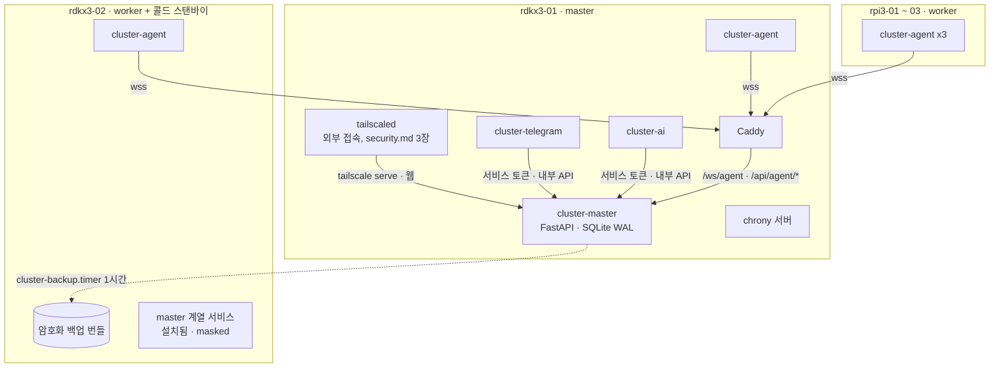
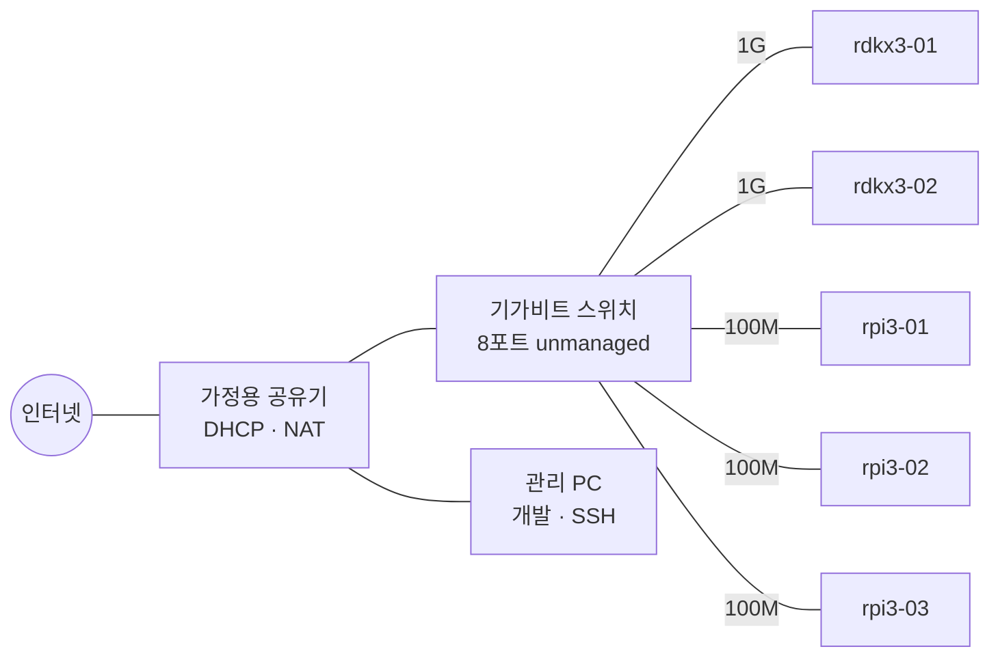
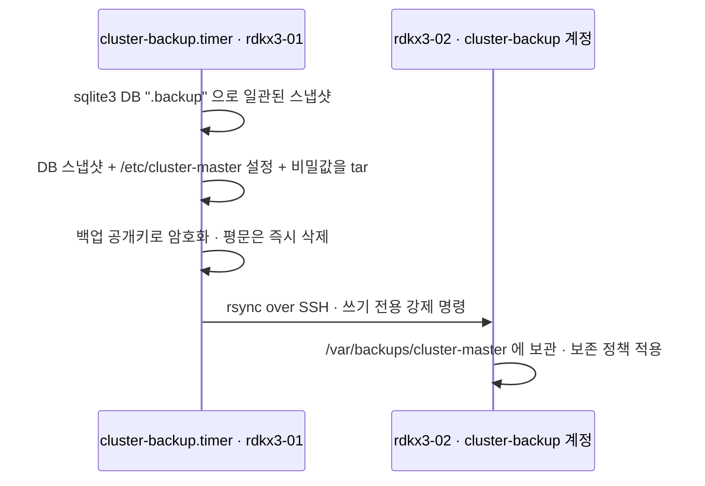

# 노드 토폴로지와 리소스 예산

> RDK X3 2대 + Raspberry Pi 3B 3대의 역할 배치, 물리/네트워크 구성, 전원·냉각·스토리지·시간 동기화, 노드별 리소스 예산, Phase 0 실기기 확인 절차와 초기 설치 순서를 정의한다.

**관련 문서**: [PLAN.md](../PLAN.md) · [security.md](./security.md) · [jobs.md](./jobs.md) · [telegram.md](./telegram.md) · [ai-agent.md](./ai-agent.md)

이 문서가 정하는 것과 다른 문서로 넘기는 것:

| 주제 | 이 문서 | 다른 문서 |
|---|---|---|
| 노드 역할, 레이블, 기본 용량(slots, job_mem_mb) | 정의 | 스케줄링 알고리즘은 [jobs.md](./jobs.md) |
| IP/호스트명/서비스 IP(VIP), 외부 접속이 붙는 위치 | 정의 | 외부 접속 방식·방화벽·하드닝·인증서는 [security.md](./security.md) |
| rdkx3-02 콜드 스탠바이 백업 복제, 수동 failover 개요 | 정의 | 백업 암호화 키 관리는 [security.md](./security.md) |
| rdkx3-01 상주 서비스 메모리/CPU 예산 | 정의 | cluster-ai의 모델 배치는 [ai-agent.md](./ai-agent.md), 봇 동작은 [telegram.md](./telegram.md) |

---

## 1. 노드 구성

### 1.1 역할표

| 호스트명 | 보드 | RAM | 유선 LAN | 역할 | 상주 서비스 |
|---|---|---|---|---|---|
| `rdkx3-01` | RDK X3 | 2GB 또는 4GB (Phase 0 확인) | 1Gbps | **master** + worker(축소) | cluster-master, cluster-agent, cluster-execd, cluster-telegram, cluster-ai, Caddy, tailscaled, chrony(서버) |
| `rdkx3-02` | RDK X3 | 2GB 또는 4GB (Phase 0 확인) | 1Gbps | worker(BPU 주력) + **master 콜드 스탠바이** | cluster-agent, cluster-execd, tailscaled (master 계열 서비스는 설치만 하고 mask) |
| `rpi3-01` | Raspberry Pi 3B | 1GB | 100Mbps (USB2 버스 공유) | worker(CPU) | cluster-agent, cluster-execd |
| `rpi3-02` | Raspberry Pi 3B | 1GB | 100Mbps (USB2 버스 공유) | worker(CPU) | cluster-agent, cluster-execd |
| `rpi3-03` | Raspberry Pi 3B | 1GB | 100Mbps (USB2 버스 공유) | worker(CPU) | cluster-agent, cluster-execd |

Pi 3B는 PoE와 Wake-on-LAN을 지원하지 않는다. 즉 **원격으로 끈 노드는 물리적으로 전원을 다시 꽂아야 켜진다** (PLAN.md 8장의 poweroff 경고 유지). 원격 전원 사이클은 "나중" 단계의 스마트 플러그 확장으로 미룬다.

### 1.2 스케줄러 레이블과 기본 용량

agent는 접속 시 `hello.static_info`에 아래 레이블과 용량을 실어 보낸다. 노드 쪽에서는 자동 감지값이 기본이고 `/etc/cluster-agent/config.yaml`의 값이 있으면 그것이 우선한다(config는 SSH/Ansible로만 바꾸는 신뢰 경로). 레이블 키 이름은 [jobs.md](./jobs.md)의 배치 조건(selector)과 공유하는 계약이다.

**권위값은 master 쪽이다.** 노드가 침해되면 그 노드의 config도 공격자 통제이므로, 보안·배치에 영향을 주는 레이블(`node_role`, `standby`, `dataset.*`)과 용량(`slots`, `bpu_slots`, `job_mem_mb`)은 admin이 노드 등록 시 확정한 **master 등록 레코드 값**을 스케줄러가 쓴다. 첫 접속의 보고값은 등록 화면에 기본값으로 제안되고, 이후 보고값이 등록값과 다르면 경고만 낸다([security.md](./security.md) 8.3). 아래 표의 "출처"는 노드 쪽 기본값의 출처다.

| 키 | 값 예 | 출처 | 용도 |
|---|---|---|---|
| `board` | `rdkx3` / `rpi3` | config → `/proc/device-tree/model` 자동 감지 | 보드별 대상 지정, collector 선택 |
| `arch` | `aarch64` | `uname -m` | 바이너리/wheel 호환성 (Pi를 32-bit로 바꾸면 `armv7l`) |
| `bpu` | `2` / `0` | board에서 유도, sysfs로 검증 | BPU 잡 라우팅 |
| `cpus` | `4` | `os.cpu_count()` | 부하 정규화 |
| `mem_mb` | 실측 MemTotal | `/proc/meminfo` | 메모리 기반 배치 |
| `net_mbps` | `1000` / `100` | `/sys/class/net/eth0/speed` | 데이터 이동량 큰 잡의 배치 가중치 |
| `storage` | `sd` / `ssd` | config | I/O 많은 잡 배치 |
| `node_role` | `master` / `worker` | config | master 보호 (슬롯 축소) |
| `standby` | `master` (rdkx3-02만) | config | failover 대상 표시 |

| 용량 키 | 의미 |
|---|---|
| `slots` | 일반(CPU) 잡 동시 실행 수 |
| `bpu_slots` | BPU 잡 동시 실행 수 |
| `job_mem_mb` | 이 노드에서 잡들이 쓸 수 있는 메모리 합계 (5장 공식) |

노드별 기본값 (RAM 값은 Phase 0 실측 후 확정):

| 호스트명 | 레이블 | slots | bpu_slots | job_mem_mb (2GB 보드 / 4GB 보드) |
|---|---|---|---|---|
| `rdkx3-01` | `board=rdkx3 arch=aarch64 bpu=2 net_mbps=1000 node_role=master storage=ssd*` | 1 (2GB에서 공식 < 256이면 0) | 1 (같음) | 공식 결과 / 1408 |
| `rdkx3-02` | `board=rdkx3 arch=aarch64 bpu=2 net_mbps=1000 node_role=worker standby=master storage=sd` | 3 | 2 | 1024 / 2816 |
| `rpi3-0N` | `board=rpi3 arch=aarch64 bpu=0 net_mbps=100 node_role=worker storage=sd` | 2 | 0 | 384 (잠정) |

`*` USB SSD를 붙인 경우. `slots`/`job_mem_mb`는 **잡**(큐 경유)에만 적용된다. 즉시 실행되는 **명령**은 슬롯을 차지하지 않고 노드당 동시 실행 상한(PLAN.md 8장, 기본 2)만 따른다. 두 경로 모두 agent의 같은 executor와 같은 실행 계정 `cluster-run`을 쓴다.

```yaml
# /etc/cluster-agent/config.yaml (발췌, rdkx3-02 예)
node_id: rdkx3-02
master_url: wss://master.cluster.internal/ws/agent   # TLS 종단·포트는 security.md
labels:
  node_role: worker
  standby: master
  storage: sd
capacity:          # 생략 시 board 기본값. 스케줄러는 master 등록값을 쓴다
  slots: 3
  bpu_slots: 2
  job_mem_mb: 1024
```

### 1.3 노드 증감

- RDK X3는 `rdkx3-0N` → `192.168.1.201~208`, Pi는 `rpi3-0N` → `192.168.1.211~219` 범위에서 추가한다.
- 추가: OS 설치 → 9장 설치 순서 → admin이 노드 등록(토큰 발급) → agent 첫 접속 시 보고한 레이블·용량을 admin이 등록 화면에서 확인·확정(step-up) → 스케줄러 후보가 된다.
- 제거: 노드 토큰 폐기 후 전원 차단. 진행 중이던 잡의 재배치는 [jobs.md](./jobs.md).

---

## 2. 논리 배치



- 웹(브라우저)은 tailscale serve → cluster-master(127.0.0.1:8000)로 직접 간다. Caddy는 agent 경로(`/ws/agent`, `/api/agent/*`) TLS 종료 전용이다([security.md](./security.md) 4.1).
- 모든 agent는 **물리 호스트명이 아니라 서비스 이름 `master.cluster.internal`(VIP)** 로 접속한다. failover 시 VIP만 옮기면 agent 설정은 그대로다 (3.3절).
- cluster-telegram과 cluster-ai는 master DB에 직접 접근하지 않고 내부 API만 호출한다. 같은 호스트에 있지만 별도 systemd 서비스/별도 계정이다(계정·토큰은 [security.md](./security.md)).

---

## 3. 네트워크

### 3.1 물리 구성



| 항목 | v1 결정 | v2 / 나중 |
|---|---|---|
| 스위치 | 기가비트 unmanaged 8포트 (노드 5 + 공유기 업링크 1 + 여유 2) | VLAN 지원 managed 스위치로 클러스터를 가정 LAN과 분리 ([security.md](./security.md)) |
| 케이블 | Cat5e 이상, 전 노드 유선. **Pi 3B의 Wi-Fi/BT는 끈다** (공격 표면·전력 절감) | — |
| 업링크 | 스위치 ↔ 공유기 1회선 | — |
| 외부 진입점 | **rdkx3-01 한 곳만**. 공유기 포트포워딩 금지. 방식(VPN/터널)과 정책은 [security.md](./security.md) | — |
| 아웃바운드 | rdkx3-01: Telegram Bot API(HTTPS), Tailscale, Claude API(HTTPS), 외부 dead-man ping(7.4). 전 노드: apt, NTP | 노드별 egress 제한 ([security.md](./security.md)) |

텔레그램 봇은 아웃바운드 연결만 필요하다는 전제로 둔다(수신 방식은 [telegram.md](./telegram.md)). 따라서 텔레그램 때문에 인바운드 포트를 열 일은 없다.

### 3.2 IP 계획 (예시)

가정 LAN 대역은 공유기에 따라 다르므로 **Phase 0에서 실제 대역으로 치환**한다. 아래는 `192.168.1.0/24`, 공유기 DHCP 풀 `.100~.199` 가정.

| 이름 | IP | 할당 방식 | 비고 |
|---|---|---|---|
| `master.cluster.internal` (VIP) | 192.168.1.200 | 현재 master의 보조 IP (정적) | **반드시 DHCP 풀 밖**. `cluster-vip` 서비스가 붙인다 |
| `rdkx3-01` | 192.168.1.201 | DHCP 예약 (MAC 고정) | |
| `rdkx3-02` | 192.168.1.202 | DHCP 예약 | |
| `rpi3-01` | 192.168.1.211 | DHCP 예약 | |
| `rpi3-02` | 192.168.1.212 | DHCP 예약 | |
| `rpi3-03` | 192.168.1.213 | DHCP 예약 | |
| 예비 | .203~.208, .214~.219 | — | 노드 추가용 |

- **DHCP 예약을 기본**으로 한다(공유기 한 곳에서 관리). 공유기가 예약을 지원하지 않거나 풀 밖 예약을 거부하면 노드 OS에서 정적 IP로 설정한다(RDK OS: netplan 여부 Phase 0 확인 / Pi OS: NetworkManager `nmcli`).
- `.internal`은 사설 용도로 예약된 최상위 도메인이라 실제 인터넷 이름과 충돌하지 않는다.

### 3.3 호스트명 해석

v1은 **모든 노드와 관리 PC에 같은 `/etc/hosts` 블록**을 배포한다(설치 스크립트/Ansible 템플릿 `deploy/hosts.cluster`). mDNS(`.local`)는 agent 접속 경로로 쓰지 않는다.

```text
# --- cluster (managed by deploy/hosts.cluster) ---
192.168.1.200  master.cluster.internal
192.168.1.201  rdkx3-01.cluster.internal  rdkx3-01
192.168.1.202  rdkx3-02.cluster.internal  rdkx3-02
192.168.1.211  rpi3-01.cluster.internal   rpi3-01
192.168.1.212  rpi3-02.cluster.internal   rpi3-02
192.168.1.213  rpi3-03.cluster.internal   rpi3-03
```

v2 선택지: 공유기(dnsmasq 지원 시)나 rdkx3-01의 로컬 DNS로 이전. 5대 규모에서는 hosts 파일이 장애 지점이 가장 적다.

**VIP를 쓰는 이유**: failover 시 5대의 hosts 파일을 고치는 대신 IP 하나만 옮긴다. 내부 TLS 인증서도 `master.cluster.internal` 이름으로 한 번만 발급하면 된다(발급 방식은 [security.md](./security.md)).

```bash
# cluster-vip.service 가 하는 일 (현재 master에서만 enable)
# VIP 주소 자체는 네트워크 설정 도구(C21 결과)의 보조 주소로 영속화하고, 서비스는 붙이기·떼기와 ARP 갱신만 한다
nmcli con mod "<eth0 연결>" +ipv4.addresses 192.168.1.200/24 && nmcli con up "<eth0 연결>"   # NetworkManager인 경우
#   netplan인 경우: addresses 목록에 192.168.1.200/24 추가 후 netplan apply
arping -U -c 3 -I eth0 192.168.1.200   # 다른 노드의 ARP 캐시 갱신 (iputils-arping)
```

- `ip addr add`로 붙인 수동 주소는 NetworkManager/netplan이 인터페이스를 다시 적용하거나 DHCP를 갱신할 때 사라질 수 있다. 그래서 위처럼 **연결 프로필의 보조 주소**로 둔다(어느 도구인지는 Phase 0 C21). failover 시에는 rdkx3-01에서 제거(전원 차단이 기본)하고 rdkx3-02 프로필에 추가한다.
- 부팅 순서: `caddy.service`와 chrony 서버 설정 유닛에 `Requires=cluster-vip.service`, `After=cluster-vip.service`. VIP가 없으면 Caddy가 `bind: cannot assign requested address`로 실패해 5대가 모두 offline이 되기 때문이다.
- 대안: Caddy를 `0.0.0.0:443`에 바인드하고 nft의 `ip daddr $VIP tcp dport 443` 규칙으로 VIP 외 접근을 막는다(VIP 소실 시에도 Caddy는 살아 있음). 기본은 위 방식, C21 결과가 불안정하면 대안으로 바꾼다.

### 3.4 Pi 3B 100Mbps 병목과 분산 작업

Pi 3B의 이더넷(LAN9514)은 USB2 허브 뒤에 붙어 있어 **USB 포트와 대역(480Mbps 공유)을 나눠 쓴다**. 실효 TCP 처리량은 약 90Mbps(≈11MB/s)로 가정하고 Phase 0의 `iperf3`로 확정한다. SD 카드 순차 읽기도 수십 MB/s 수준이라 Pi에서는 네트워크와 디스크가 둘 다 느리다.

| 데이터 크기 | Pi 3B 한 대 (≈11MB/s) | RDK X3 한 대 (1Gbps, SD 쓰기 속도가 상한이 될 수 있음) |
|---|---|---|
| 10MB | ≈1초 | <1초 |
| 100MB | ≈9초 | ≈1~4초 |
| 1GB | ≈1.5분 | ≈10~40초 |
| 4GB | ≈6분 | ≈1~3분 |

master(1Gbps)는 Pi 3대에 동시에 보내도(3 × 100Mbps) 링크가 남으므로 **병목은 각 Pi의 NIC**다. [jobs.md](./jobs.md)가 지켜야 할 토폴로지 제약:

1. **대용량 데이터는 WebSocket 제어 채널로 보내지 않는다.** agent 연결 하나로 heartbeat(metrics)를 겸하므로, 큰 전송이 끼면 15초 offline 판정이 오탐 날 수 있다. 입력/산출물은 별도 HTTP(S) 다운로드/업로드 경로로 분리한다.
2. **데이터 지역성 가중치**: 입력이 큰 잡(예: 100MB 이상)은 `net_mbps=1000` 노드를 우선하고, Pi에는 "계산은 길고 데이터는 작은" 잡(파라미터 스윕, CPU 배치 처리)을 우선 배치한다.
3. **노드 로컬 캐시**: 같은 입력을 반복 전송하지 않도록 콘텐츠 해시 기반 캐시를 두는 것을 권장(구현은 jobs.md).
4. Pi에 USB 스토리지를 붙이면 이더넷과 버스를 다투므로 Pi는 SD만 쓴다.
5. 제어/메트릭 트래픽은 노드당 수 KB/5초 수준이라 무시해도 된다.

---

## 4. 전원 · 냉각 · 스토리지 · 시간

### 4.1 전원

| 보드 | 입력 | 권장 | 주의 |
|---|---|---|---|
| Pi 3B | micro-USB 5V | **5V 2.5A** 어댑터 (공식 어댑터급) | 얇고 긴 케이블은 전압 강하로 저전압 플래그 유발. 짧고 굵은 케이블 사용. 팬을 GPIO 5V에서 끌어 쓰면 그 전류도 합산 |
| RDK X3 | Phase 0 확인 (커넥터·전압·전류) | 제조사 문서 기준으로 Phase 0에서 확정 | USB SSD를 붙이는 rdkx3-01은 전력 여유를 더 둔다(필요 시 외부 전원 USB 허브) |

- 멀티포트 USB 충전기를 쓸 경우 **포트당 2.5A 이상을 동시에 보장**하는 제품만 쓴다. Phase 0에서 USB 전력계로 부하 중 전압을 측정하고 `vcgencmd get_throttled`가 `0x0`인지 확인한다.
- 정전 후 복전 시 전 노드가 자동 부팅되는지 Phase 0에서 확인한다(부팅 순서는 상관없음: agent는 지수 백오프로 재접속).
- v2: 소형 UPS(SD 손상 방지). 나중: 개별 전원 제어(스마트 플러그)로 원격 전원 사이클.

### 4.2 냉각

| 항목 | Pi 3B | RDK X3 |
|---|---|---|
| 방열 | 방열판 필수, 장시간 잡이면 팬 | 방열판 + 팬 권장 (BPU 부하 시 발열 큼) |
| 스로틀링 | 80°C부터 클럭 제한, 85°C 강제 스로틀 (`get_throttled` bit 2·3으로 확인) | trip point를 Phase 0에서 `thermal_zone*/trip_point_*_temp`로 확인 |
| 경고 | PLAN.md 7.4: 70°C warning / 80°C critical | 동일 |

- 스택형 케이스는 아래→위로 공기가 흐르도록 팬을 한쪽 끝에 둔다.
- 스케줄러 입력: 온도가 warning 이상이거나 Pi의 스로틀링 비트가 켜진 노드에는 신규 잡을 배치하지 않는 것을 권장(정책 확정은 [jobs.md](./jobs.md)).
- Phase 0에서 `stress-ng --cpu 4 --timeout 300s`로 5분 부하를 걸어 최고 온도와 스로틀 여부를 기록한다.

### 4.3 스토리지

| 노드 | 부트/루트 | 데이터 | 비고 |
|---|---|---|---|
| `rdkx3-01` | microSD 32GB 이상, A1 이상, High Endurance 계열 | **권장: USB SSD를 `/var/lib/cluster-master`에 마운트** (SQLite DB, 백업 스테이징) | fstab에 UUID + `nofail`, 유닛에 `RequiresMountsFor=/var/lib/cluster-master`. SSD가 없으면 SD에 두고 PLAN.md 13장의 쓰기 절감 규칙에 의존 |
| `rdkx3-02` | microSD 32GB 이상 | `/var/backups/cluster-master` (암호화 백업 번들, 수십 MB 규모) | failover 시 SD에서 master를 돌리게 되므로 SSD 이동은 선택 |
| `rpi3-0N` | microSD 16~32GB, A1 이상 | 잡 작업 디렉터리·캐시는 SD | USB 부팅은 이더넷과 버스를 공유하므로 쓰지 않는다 |

공통 설정:

```ini
# /etc/systemd/journald.conf.d/cluster.conf
[Journal]
Storage=persistent
SystemMaxUse=100M      # Pi 3B는 50M
SystemKeepFree=500M    # Pi 3B는 300M
RuntimeMaxUse=30M
```

- 루트 파일시스템 `noatime`. 스왑은 SD 스왑 파일 대신 **zram**(Pi는 OS 기본 스왑 방식을 Phase 0에서 확인 후 zram으로 통일).
- 감사 기록의 원본은 master DB(audit_log)이고 journald는 운영 로그용이다.
- SD 고장 대비: 노드 설정은 설치 스크립트/Ansible로 재현 가능하게 유지해 "새 SD에 굽고 9장 순서 재실행"으로 복구한다. master 데이터는 7.2절의 백업으로 복구한다.

### 4.4 시간 동기화

Pi에는 RTC가 없어 부팅 직후 시계가 틀릴 수 있다(Pi OS의 `fake-hwclock`은 마지막 종료 시각만 복원). **시계가 틀리면 wss 인증서 검증과 시간 기반 인증 코드(step-up 인증에 쓰는 경우) 검증이 실패**하므로 시간 동기화는 agent보다 먼저 보장한다.

| 노드 | chrony 설정 |
|---|---|
| 현재 master (VIP 보유) | 상위: `pool pool.ntp.org iburst` · 클러스터 대역에 `allow 192.168.1.0/24` |
| 그 외 노드 | `server master.cluster.internal iburst prefer` + `pool pool.ntp.org iburst` (master 장애 시 대체) |

- master 서버 설정에 `local stratum` 은 넣지 않는다(상위와 끊긴 상태에서 틀린 시간을 배포하지 않도록).
- cluster-agent 유닛은 `After=time-sync.target`, `Wants=time-sync.target`. 동기화 완료를 기다리는 `chrony-wait.service`(또는 동등 유닛)가 배포판에 있는지 Phase 0에서 확인하고 enable 한다.
- 저장 시각은 여전히 master 수신 시각 기준(PLAN.md 12장)이다.

---

## 5. OS 선택

| 보드 | 권장 OS | 이유 | 확인 사항 (Phase 0) |
|---|---|---|---|
| RDK X3 (두 대 모두) | **Ubuntu 22.04 기반 RDK OS, server(데스크톱 없는) 구성** | 기본 Python 3.10 → master를 별도 Python 빌드 없이 실행. rdkx3-02도 master 후보이므로 **두 대 모두 같은 22.04 계열 이미지**여야 한다 | 이미지 버전, 커널 버전, 데스크톱 비활성 가능 여부(`systemctl set-default multi-user.target`), 벤더 apt 저장소의 BSP 업데이트 방식 |

**Python < 3.10 대비 (C3)**: master·cluster-telegram·cluster-ai는 Python 3.10 이상이 필수다(anthropic SDK 1.x 요구). Phase 0에서 RDK X3 이미지가 20.04 계열(Python 3.8)로 확인되고 22.04 계열을 쓸 수 없으면, `/opt/cluster-web/python`에 **aarch64용 독립 실행형 CPython 3.11 빌드**를 CI 릴리스 산출물로 포함하고(`SHA256SUMS`로 검증, [security.md](./security.md) 17장) 그 위에 venv를 만든다. agent·execd는 시스템 `python3`(≥3.8)을 그대로 쓴다.
| Pi 3B | **Raspberry Pi OS Lite 64-bit** (릴리스는 Phase 0 시점의 현행 안정판) | 클러스터 전체가 `arch=aarch64` 하나로 통일 → 잡 바이너리/wheel 한 벌, 스케줄러의 arch 분기 불필요. 64-bit가 Pi 3 계열 Imager 기본 | 64-bit의 메모리 오버헤드 실측 |

**Pi 3B 64-bit 트레이드오프**: 포인터가 8바이트라 Python처럼 객체가 많은 프로세스는 32-bit 대비 RSS가 대략 10~20% 늘어난다. 1GB에서는 이 차이가 잡 할당량을 수십 MB 줄인다. Phase 0에서 agent RSS가 45MB를 넘거나 잡 OOM이 잦으면 32-bit(armhf)로 바꾸고 `arch=armv7l` 레이블로 구분한다(스케줄러는 arch 레이블을 존중해야 함).

**커널과 cgroup**: Pi OS 커널은 cgroup v2를 쓰지만 memory 컨트롤러가 꺼져 있을 수 있다(그 경우 `/boot/firmware/cmdline.txt`에 `cgroup_enable=memory` 추가). RDK X3 벤더 커널이 4.x 계열이면 cgroup v2의 cpu 컨트롤러(커널 4.15+)가 없을 수 있다. 자원 제한이 불가능한 노드의 대체 수단(nice/ulimit/OOM 점수)은 [jobs.md](./jobs.md)가 정의하고, 이 문서는 Phase 0에서 가능 여부만 확인한다.

---

## 6. 리소스 예산

### 6.1 공식

```text
job_mem_mb = MemTotal(실측, BPU/멀티미디어 예약 메모리 제외 후)
           - 상주 서비스 RSS 목표 합계
           - execd_overhead_mb × (slots + bpu_slots + 명령 동시 상한)
           - 여유분 (page cache·순간 피크; RDK X3 300MB, Pi 3B 200MB)
```

결과를 64MB 단위로 내림해 1.2절 표의 `job_mem_mb`로 쓴다. Phase 0 실측 후 재계산한다.

- `execd_overhead_mb`: cluster-execd는 실행 중인 명령·Task 하나마다 연결당 root Python 프로세스 + `systemd-run` 클라이언트를 실행이 끝날 때까지 유지한다([security.md](./security.md) 9.3). 초기값 **25MB**, Phase 1에서 실측해 교체한다. v2에서 execd가 연결을 붙잡지 않고 `StandardOutput=file:`로 출력을 넘기는 방식(re-adopt와 같은 기반, [jobs.md](./jobs.md) 7.5)으로 바꾸면 이 항목이 거의 사라진다.
- execd 소켓의 `MaxConnections`도 같은 입력으로 계산한다: `slots + bpu_slots + 명령 동시 상한 + 4`.

### 6.2 rdkx3-01 (master 동거)

목표치는 노드 5대·UI 접속 1~2개 기준. `MemoryMax`는 cgroup v2 memory 컨트롤러가 있을 때만 적용한다.

| 프로세스 | RSS 목표 | MemoryMax | CPU 목표 (4코어 = 400%) | OOMScoreAdjust |
|---|---|---|---|---|
| 커널 + OS 기본 (sshd, journald, chrony, udev 등, 데스크톱 비활성) | ≈250MB | — | <3% | — |
| BPU/멀티미디어 예약 메모리 (ION/CMA) | **Phase 0 실측** (MemTotal에서 이미 빠져 있는지 확인) | — | — | — |
| cluster-master | ≤150MB | 300M | 평균 <5%, 피크 ≤100% | -800 |
| cluster-agent | ≤40MB | 80M | <3% | -800 |
| cluster-telegram | ≤60MB | 120M | 유휴 <1% | -300 |
| cluster-ai (오케스트레이터만, **모델 추론 제외**) | ≤150MB | 300M | 유휴 <1% | -300 |
| Caddy | ≤40MB | 100M | <2% | -300 |
| tailscaled | ≤50MB | 100M | <2% | -300 |
| cluster-execd (실행당, 2GB 기준 slots 1 + bpu 1 + 명령 2) | 25MB × 4 = 100MB (실측) | — | 순간 | -800 |
| cluster-backup (1시간마다 순간 실행) | ≤50MB | 100M | 순간 | 0 |
| **상주 합계 (execd 최대치 포함)** | **≈890MB** | | **유휴 합계 <15%** | |
| 여유분 | 300MB | | | |
| **잡 할당 (`job_mem_mb`)** | **2GB: 공식 결과에 따름(아래 규칙) / 4GB: 1408MB** | `cluster-jobs.slice` 전체에 적용 | `CPUWeight` 낮게 | +500 |

- **2GB 보드 결정 규칙**: 공식 결과 `job_mem_mb < 256`이면 rdkx3-01은 `slots=0`, `bpu_slots=0`(잡 미배치, master 전용)으로 두고, ION/CMA 예약 축소(벤더 설정 도구 사용 가능 여부는 Phase 0 R6)를 먼저 검토한다. 256 이상이면 64MB 단위 내림 값을 쓴다. 2GB에서 예약 메모리가 크지 않으면 대략 384MB 안팎이 나온다(실측 전 추정).
- **rdkx3-01에서는 LLM 추론을 돌리지 않는다.** 2GB 보드에서는 상주 서비스만으로 절반 가까이 쓰므로, 로컬 모델이 필요하면 rdkx3-02나 외부 PC/API에 둔다. 배치 결정은 [ai-agent.md](./ai-agent.md).
- 메모리가 부족할 때 커널이 **잡 → 부가 서비스 → master/agent 순으로 죽이도록** OOMScoreAdjust를 건다. 이 설정은 cgroup 지원 여부와 무관하게 동작한다.
- master 보호를 위해 rdkx3-01의 `slots=1`, `bpu_slots=1`로 낮춘다. BPU 잡은 rdkx3-02를 우선한다([jobs.md](./jobs.md)).
- cgroup v2 cpu 컨트롤러가 있으면 cluster-master `CPUWeight=200`, 잡 slice `CPUWeight=50`.

### 6.3 rdkx3-02

| 항목 | 목표 |
|---|---|
| OS 기본 | ≈250MB |
| BPU/멀티미디어 예약 | Phase 0 실측 |
| cluster-agent | ≤40MB, CPU <3% |
| tailscaled | ≤50MB (평소 SSH용, failover 대비) |
| cluster-execd (실행당 25MB × slots 3 + bpu 2 + 명령 2) | ≈175MB (실측) |
| 여유분 | 300MB |
| 잡 할당 | 2GB: 1024MB / 4GB: 2816MB (예약 메모리·execd 실측 후 조정) |

failover로 master가 되면 6.2 표를 그대로 적용하고 `node_role=master`, `slots=1`, `bpu_slots=1`로 바꾼다.

### 6.4 rpi3-01 ~ 03

| 항목 | 목표 |
|---|---|
| MemTotal (`gpu_mem=16`, 헤드리스) | ≈900MB 내외, Phase 0 실측 |
| OS 기본 (Lite 64-bit, sshd/journald/chrony) | ≈150MB |
| cluster-agent | **RSS ≤40MB (64-bit에서 45MB 초과 시 5장의 32-bit 재검토), CPU <3%** (PLAN.md 19장) |
| 여유분 | 200MB |
| cluster-execd (실행당 25MB × slots 2 + 명령 2) | ≈100MB (실측) |
| 잡 할당 | **384MB 잠정** (공식: ≈900 − 150 − 40 − 100 − 200 ≈ 410 → 64MB 내림. `slots=2`이므로 256MB 잡 1개 + 128MB 잡 1개, 또는 192MB 잡 2개. execd 실측이 25MB보다 작으면 448로 올림) |
| 스왑 | zram (SD 스왑 금지) |

- Pi에는 tailscaled를 설치하지 않는다([security.md](./security.md) 3.2).
- Pi의 Wi-Fi/BT 비활성(`dtoverlay=disable-wifi`, `dtoverlay=disable-bt`), 불필요 서비스 제거로 메모리를 확보한다.

---

## 7. rdkx3-02 콜드 스탠바이

**자동 HA(자동 failover, 합의 기반 리더 선출, 실시간 DB 복제)는 범위 밖이다.** 5대 가정용 클러스터에서 split-brain 위험과 복잡도가 이득보다 크다. 목표는 "rdkx3-01이 죽어도 30분 안에 손으로 되살린다"이다.

| 항목 | 목표 |
|---|---|
| RPO (잃을 수 있는 데이터) | 최대 1시간 (백업 주기) |
| RTO (복구 시간) | 수동 30분 이내 |
| split-brain 방지 | rdkx3-02의 master 계열 서비스는 평소 `systemctl mask` 상태 |

### 7.1 평소 상태

- rdkx3-02에도 `/opt/cluster-web`에 **master와 같은 버전**의 cluster-master, cluster-telegram, cluster-ai, 웹 빌드 산출물, Caddy 설정, `cluster-vip` 유닛을 설치해 두고 모두 mask 한다. 배포 스크립트는 릴리스 때 두 RDK X3를 함께 갱신한다.
- 텔레그램 봇 토큰 하나로는 수신 프로세스가 동시에 둘이면 충돌하므로, 이 mask가 곧 중복 실행 방지 장치다.

### 7.2 백업 복제



| 항목 | 결정 |
|---|---|
| 주기 | 1시간 (`cluster-backup.timer`), 설정 변경 직후 수동 1회 |
| 전송 | master → rdkx3-02 push. 받는 쪽은 셸 없는 전용 계정 `cluster-backup` + SSH 강제 명령(쓰기 전용 rsync)으로 백업 디렉터리 밖에 접근 불가 |
| 보관 형태 | **암호화된 번들만** 저장. rdkx3-02는 사용자 셸 명령과 잡이 도는 worker이므로 평문 DB·비밀값을 두지 않는다. 복호화 키는 클러스터 밖(관리자 보관)에 둔다. 키 관리와 암호화 도구는 [security.md](./security.md) |
| 보존 | 시간별 24개, 일별 7개, 주별 4개 |
| 감시 | 마지막 성공 백업이 2시간 넘게 없으면 `alert.raised` (텔레그램 알림 경로는 [telegram.md](./telegram.md)) |
| **오프사이트 사본 (v1 필수)** | 관리 PC가 주 1회(그리고 큰 변경 후) rdkx3-02의 `/var/backups/cluster-master`에서 최신 일별 번들을 **pull**한다(관리자 SSH 키, 관리 PC 쪽 타이머 또는 수동). 관리 PC에도 암호문만 두고 복호화 키는 별도 보관([security.md](./security.md) 12.1) |

**수용된 위험 (rdkx3-02 집중)**: rdkx3-02는 잡 코드를 가장 많이 실행하는 노드이면서 백업 번들(감사 로그 포함)을 보관한다. 잡을 통한 침해가 root까지 번지면 로컬 백업 사본이 파괴될 수 있다. 기밀성은 age 암호화(복호화 키는 클러스터 밖), 무결성은 텔레그램 head 앵커([security.md](./security.md) 13.2)로 유지되므로 **가용성 손실만** 수용한다. 그래서 복구 절차(7.3)는 **관리 PC의 오프사이트 사본만으로도** 성립해야 하며, v1 완료 전 리허설에서 rdkx3-02 사본 없이 관리 PC 사본으로 복원해 본다. v2: 감사 봉인 보관을 잡을 돌리지 않는 장치로 분리(security.md 13.2).

### 7.3 수동 failover 절차 개요

1. **rdkx3-01이 확실히 멈췄는지 확인**하고, 살아 있다면 전원을 뽑거나 랜선을 분리한다(split-brain 방지의 핵심).
2. rdkx3-02에 관리 PC에서 SSH 접속, 최신 번들(rdkx3-02 사본이 손상됐으면 관리 PC 사본)을 복호화 키로 풀어 `/var/lib/cluster-master`와 `/etc/cluster-master`에 복원한다.
3. 복원된 DB에서 **진행 중이던 명령·잡 실행은 유실(lost) 처리, 대기 중이던 승인(approvals)은 만료 처리**한다. 백업 시점 이후 상태를 신뢰할 수 없기 때문이다(잡 재배치 규칙은 [jobs.md](./jobs.md) 7.6, 승인 처리 규칙은 [security.md](./security.md) 7.5-3). 표시 번호(`J-n`, `T-n`, 명령 `#n`)는 `max+1000`부터 다시 시작한다(jobs.md 17장).
4. master 계열 서비스를 unmask → `cluster-vip` → cluster-master → cluster-telegram → cluster-ai → Caddy 순으로 시작한다.
5. 외부 접속 경로를 rdkx3-02로 전환한다: rdkx3-02에서 `tailscale serve`([security.md](./security.md) 3.4) + `cluster-master-admin config set web_base_url https://<rdkx3-02 기기이름>.<tailnet>.ts.net`(텔레그램 "상세 보기" 링크). Origin 허용 목록 `web.origins`에는 처음부터 두 URL이 들어 있으므로 바꿀 필요가 없다(security.md 5.6).
6. agent들이 `master.cluster.internal`로 자동 재접속하는지 대시보드에서 확인한다(agent 토큰 해시는 DB에 있으므로 재발급 불필요).
7. rdkx3-02의 agent 설정을 `node_role=master`, `slots=1`, `bpu_slots=1`로 바꾸고 재시작한다. chrony에 `allow` 대역을 넣어 NTP 서버 역할도 넘긴다.
8. 텔레그램으로 failover 완료를 보고한다.

복구(failback)는 같은 절차를 반대로 하되, rdkx3-02에서 새로 뜬 백업을 원본으로 쓴다. 절차를 묶은 `deploy/failover/promote_standby.sh`는 v2. **v1 완료 전에 failover 리허설을 한 번 해본다.**

### 7.4 master 생존 감시 (v1)

notifier·outbox·cluster-telegram이 모두 rdkx3-01에 있으므로 **rdkx3-01 자체가 죽으면(전원, SD 고장, 커널 패닉) 텔레그램은 조용하다.** 백업 누락 경보도 master가 살아 있어야 나간다. 그래서 클러스터 밖에서 "소식이 끊기면 알리는" 감시를 하나 둔다.

| 선택지 | 방식 | 시크릿 | 판정 |
|---|---|---|---|
| **(a) 외부 dead-man 서비스** | cluster-master가 이벤트 루프에서 5분마다 외부 dead-man 서비스(예: healthchecks 계열 SaaS 또는 자체 호스팅. 서비스 선택은 Phase 0)의 ping URL로 **아웃바운드** HTTPS 요청을 보낸다. 내부 점검(DB 쓰기 가능, agent 허브 동작, 감사 큐 정상)을 통과할 때만 보낸다. 15분간 ping이 없으면 그 서비스가 이메일·텔레그램으로 알린다 | ping URL 하나 (`LoadCredential`, security.md 12.1). 탈취돼도 가짜 "살아 있음"으로 알림을 늦추는 것뿐 | **권장 (v1)** |
| (b) rdkx3-02 감시 | rdkx3-02의 `cluster-standby-watch.timer`(root, 3분 간격)가 VIP:443 TLS 핸드셰이크와 `/ws/agent` 업그레이드 응답(401 기대)을 확인하고 3회 연속 실패하면 **send-only 전용 봇**(주 봇과 다른 봇, 채팅 1개에 `sendMessage`만)으로 알린다 | 별도 봇 토큰(rdkx3-02 root 0600). 탈취돼도 알림 위조만 가능 | 외부 서비스를 쓰고 싶지 않을 때 |

- (a)는 rdkx3-01 다운, 인터넷 단절, master 행(hang)을 모두 잡는다. 집 인터넷이 끊겨도 알림이 오는데, 그때는 클러스터 자체는 정상일 수 있다는 점을 알림 문구에 적는다.
- 알림을 받으면 7.3 절차의 1단계(확인)부터 시작한다. RTO 30분은 감지 시점부터 센다.
- [telegram.md](./telegram.md) 8.1의 "master 무응답(외부 감시)" 행이 이것이다.

---

## 8. Phase 0 실기기 확인 체크리스트

### 8.1 확인 명령

명령은 설치용 관리자 계정으로 실행한다. `sudo -u cluster-agent ...` 항목은 9장의 agent 설치 직후 다시 확인한다. (사용자 단위 `systemd-run --user` 확인은 하지 않는다: 실행은 root 소유 cluster-execd가 시스템 수준 `systemd-run`으로 한다.)

**공통 (5대 모두)**

| # | 확인 항목 | 명령 | 기대/판단 |
|---|---|---|---|
| C1 | 보드 모델 | `tr -d '\0' < /proc/device-tree/model; echo` | board 자동 감지 문자열 확보 |
| C2 | OS / 커널 / 아키텍처 | `cat /etc/os-release; uname -rm` | RDK X3: 22.04 계열, Pi: aarch64 |
| C3 | Python | `python3 --version` | RDK X3 ≥3.10 (master 후보), Pi ≥3.8. RDK X3가 <3.10이면 5장의 독립 Python 경로 |
| C4 | systemd | `systemd --version \| head -1` | 버전 기록 |
| C5 | cgroup 버전 | `stat -fc %T /sys/fs/cgroup` | `cgroup2fs` = v2, `tmpfs` = v1/hybrid |
| C6 | 활성 컨트롤러 | `cat /sys/fs/cgroup/cgroup.controllers` | `memory`, `cpu` 포함 여부 |
| C7 | 시스템 서비스 수준 제한 동작 | `sudo systemd-run --wait --collect -p MemoryMax=64M -p CPUQuota=50% sh -c 'cat /proc/self/cgroup; cat /sys/fs/cgroup$(cut -d: -f3 /proc/self/cgroup)/memory.max'` | `67108864` 출력되면 memory 제한 가능. systemd-run 자체가 동작하면 격리 모드 A(execd 경로, security.md 11.2) |
| C8 | needrestart | `dpkg -l needrestart; grep -rh 'nrconf{restart}' /etc/needrestart/ 2>/dev/null` | 설치 여부·모드 기록. `apt.*` root_op은 `NEEDRESTART_MODE=l`로 자동 재시작을 막는다([security.md](./security.md) 9.4) |
| C9 | setuid/setgid 바이너리 | `find / -xdev -perm /6000 -type f 2>/dev/null` | 목록 기록, 불필요한 것 제거 검토. 격리 모드 B 노드는 필수([security.md](./security.md) 11.2) |
| C10 | 메모리 | `free -m; grep -E 'MemTotal\|CmaTotal' /proc/meminfo` | 6장 공식 입력값 |
| C11 | CPU | `lscpu \| grep -E 'Model name\|MHz\|^CPU\(s\)'` | 클럭 기록 |
| C12 | 스왑 | `swapon --show; zramctl` | SD 스왑 사용 여부 |
| C13 | 디스크 | `df -h /; lsblk -o NAME,SIZE,MODEL,TRAN` | SD/SSD 식별 |
| C14 | SD 쓰기 속도(대략) | `dd if=/dev/zero of=$HOME/ddtest bs=1M count=256 oflag=direct status=progress; rm $HOME/ddtest` | MB/s 기록 |
| C15 | 링크 속도 | `cat /sys/class/net/eth0/speed; ip -br addr` | RDK X3 1000, Pi 100 |
| C16 | 실효 대역폭 | rdkx3-01에서 `iperf3 -s`, 각 노드에서 `iperf3 -c rdkx3-01 -t 10` 과 `iperf3 -c rdkx3-01 -t 10 -R` | 3.4절 표 갱신 |
| C17 | 시간 | `timedatectl; chronyc tracking; chronyc sources -v` | 동기화 여부, 오프셋 |
| C18 | time-sync 대기 유닛 | `systemctl list-unit-files \| grep -E 'chrony-wait\|time-wait-sync'` | 사용할 유닛 이름 확정 |
| C19 | agent 의존성 apt 제공 | `apt-cache policy python3-psutil python3-websockets python3-yaml` | 버전 기록 (pip 불필요 여부) |
| C20 | 복전 시 자동 부팅 | 전원 분리 → 재연결 후 SSH 접속 시간 측정 | 자동 부팅 여부, 부팅 시간 |
| C21 | 네트워크 설정 방식 | `ls /etc/netplan/ 2>/dev/null; systemctl is-active NetworkManager systemd-networkd` | 정적 IP/VIP 설정 도구 확정. VIP 보조 주소가 DHCP 갱신·`nmcli con up` 후에도 유지되는지 확인(3.3) |

**Raspberry Pi 3B 전용**

| # | 확인 항목 | 명령 | 기대/판단 |
|---|---|---|---|
| P1 | 온도 | `vcgencmd measure_temp` | 유휴 온도 기록 |
| P2 | 저전압/스로틀 | `vcgencmd get_throttled` | `throttled=0x0`. 0이 아니면 전원부터 교체 |
| P3 | 클럭/전압 | `vcgencmd measure_clock arm; vcgencmd measure_volts core` | 기록 |
| P4 | 메모리 분할 | `vcgencmd get_mem arm; vcgencmd get_mem gpu` | gpu 16M 적용 확인 |
| P5 | sysfs 온도 대체 경로 | `cat /sys/class/thermal/thermal_zone0/temp` | m°C |
| P6 | 부하 시 열/전원 | `stress-ng --cpu 4 --timeout 300s` 실행 중 `watch -n 5 'vcgencmd measure_temp; vcgencmd get_throttled'` | 최고 온도, 스로틀 비트 |
| P7 | 비root의 vcgencmd 권한 | `sudo -u cluster-agent vcgencmd get_throttled` | 실패 시 `cluster-agent`를 `video` 그룹에 추가 |
| P8 | cmdline 위치 | `ls /boot/firmware/cmdline.txt /boot/cmdline.txt 2>/dev/null` | `cgroup_enable=memory` 추가 위치 |
| P9 | Wi-Fi/BT 비활성 | `ip -br link; rfkill list` | wlan0 없음 |

**RDK X3 전용**

| # | 확인 항목 | 명령 | 기대/판단 |
|---|---|---|---|
| R1 | 종합 상태 | `hrut_somstatus` | 출력 형식 샘플 저장 (collector fallback 파서 fixture) |
| R2 | BPU 사용률 | `cat /sys/devices/system/bpu/bpu0/ratio /sys/devices/system/bpu/bpu1/ratio` | 경로 존재·값 형식 |
| R3 | hwmon 온도 | `for h in /sys/class/hwmon/hwmon*; do echo "$h $(cat $h/name 2>/dev/null)"; ls $h; done; cat /sys/class/hwmon/hwmon0/temp1_input` | 온도 경로 확정 (m°C) |
| R4 | thermal trip point | `grep . /sys/class/thermal/thermal_zone*/type /sys/class/thermal/thermal_zone*/temp /sys/class/thermal/thermal_zone*/trip_point_*_temp` | 스로틀 시작 온도 |
| R5 | CPU 주파수/거버너 | `cat /sys/devices/system/cpu/cpu0/cpufreq/scaling_cur_freq /sys/devices/system/cpu/cpu0/cpufreq/scaling_governor` | 기록 |
| R6 | 예약 메모리 | `grep -iE 'cma\|ion' /proc/meminfo; sudo dmesg \| grep -iE 'ion\|cma\|reserved' \| head -20` | 6장 예산 입력 |
| R7 | BPU 장치 권한 | `ls -l /dev \| grep -iE 'bpu\|ion'` | 비root `cluster-run`이 BPU 잡을 돌리려면 필요한 그룹 확인 |
| R8 | RDK OS/BSP 버전 | `cat /etc/version 2>/dev/null; dpkg -l \| grep -i hobot \| head` | 이미지 버전 기록 |
| R9 | USB 속도(SSD용) | `lsusb -t` | rdkx3-01 SSD가 5000M 포트에 붙는지 |
| R10 | 전원 규격 | 제조사 문서 + USB 전력계로 유휴/BPU 부하 시 전류 측정 | 4.1절 표 확정 |
| R11 | 기본 계정 | `getent passwd \| awk -F: '$3>=1000 \|\| $3==0'` | 이미지 기본 계정 확인 → 즉시 처리([security.md](./security.md)) |
| R12 | 부하 시 열 | `stress-ng --cpu 4 --timeout 300s` 중 R3 경로 5초 간격 기록 | 최고 온도 |

### 8.2 결과 기록 양식

노드마다 `docs/phase0/<hostname>.md`로 남긴다(collector fixture와 6장 예산 재계산의 근거).

````markdown
# Phase 0 결과: rpi3-01

- 확인 일시: 2026-MM-DD / 확인자:
- 하드웨어: Raspberry Pi 3B / SD: (제조사, 용량, 등급) / 전원: (어댑터, 케이블)
- IP / MAC: 192.168.1.211 / xx:xx:xx:xx:xx:xx

| # | 항목 | 결과 (원문 출력 요약) | 판정 (OK/조치필요/해당없음) | 조치 |
|---|---|---|---|---|
| C1 | 보드 모델 | Raspberry Pi 3 Model B Rev 1.2 | OK | |
| C5 | cgroup | cgroup2fs | OK | |
| C6 | 컨트롤러 | cpuset cpu io pids (memory 없음) | 조치필요 | cmdline에 cgroup_enable=memory |
| ... | | | | |

## 산출값
- MemTotal: ___ MB → job_mem_mb: ___ MB
- iperf3 송신/수신: ___ / ___ Mbps
- 부하 5분 최고 온도: ___ °C, throttled: ___

## 원문 출력
```text
(hrut_somstatus, vcgencmd 등 파서 fixture로 쓸 원문을 그대로 붙임)
```
````

---

## 9. 초기 설치 순서


| 단계 | 내용 | 대상 |
|---|---|---|
| 1. OS 굽기 | Pi: Raspberry Pi Imager에서 Lite 64-bit, 호스트명·**기본 아닌 사용자 이름**·SSH 공개키·시간대 미리 설정, Wi-Fi 미설정. RDK X3: 22.04 계열 RDK OS 이미지를 SD에 굽고 첫 부팅 시 **이미지 기본 계정 비밀번호를 즉시 변경/잠금**(R11) | 전체 |
| 2. 호스트명·IP | `sudo hostnamectl set-hostname rpi3-01`, MAC 확인(`ip link`) 후 공유기 DHCP 예약, `deploy/hosts.cluster`를 `/etc/hosts`에 반영. 관리 PC hosts에도 추가 | 전체 |
| 3. SSH 키 | 관리 PC에서 `ssh-keygen -t ed25519` → `ssh-copy-id <user>@rpi3-01`. 키 로그인 확인 후 비밀번호 로그인 차단은 7단계에서 | 전체 |
| 4. 업데이트 | `sudo apt update && sudo apt full-upgrade -y && sudo reboot`. RDK X3는 벤더 BSP/커널 패키지 업데이트 방식 확인 후 적용(C2·R8) | 전체 |
| 5. 시간 동기화 | `sudo apt install -y chrony`, 4.4절 설정, time-sync 대기 유닛 enable(C18) | 전체 |
| 6. 보드 설정 | Pi: `config.txt`에 `gpu_mem=16`, `dtoverlay=disable-wifi`, `dtoverlay=disable-bt`, 필요 시 cmdline `cgroup_enable=memory`, zram. RDK X3: `systemctl set-default multi-user.target`(데스크톱 비활성). 공통: journald 제한(4.3절), `noatime`. rdkx3-01: USB SSD 마운트 | 보드별 |
| 7. 보안 하드닝 | 방화벽, SSH 설정, 불필요 서비스 제거, 계정, 외부 접속 경로 → **[security.md](./security.md)** | 전체 |
| 8. Phase 0 기록 | 8장 체크리스트 실행, `docs/phase0/<hostname>.md` 작성, 6장 예산과 1.2절 용량 재계산 | 전체 |
| 9. master 설치 | rdkx3-01: `install_master.sh`, `cluster-vip` enable, 내부 인증서, master 계열 서비스 enable. rdkx3-02: 같은 패키지를 설치하고 master 계열 서비스 mask, `cluster-backup` 수신 계정 생성, 첫 백업 복제 확인 | rdkx3-01, rdkx3-02 |
| 10. agent 설치 | admin이 웹에서 노드 등록(step-up) → 토큰 1회 표시 → 노드에서 `read -rs T && printf %s "$T" \| sudo ./install_agent.sh --master wss://master.cluster.internal/ws/agent --ca ca.pem --token-file -` (토큰은 **stdin으로만**: 셸 히스토리·`ps`·`/proc/*/cmdline`에 남지 않게, [security.md](./security.md) 12.1). 계정(`cluster-agent`, `cluster-run`) 생성, cluster-execd·policy.yaml 설치, 권한 설정은 설치 스크립트가 security.md 규칙대로 수행. 첫 접속 후 웹에서 레이블·용량 확정(1.2절). Pi는 P7 재확인 | 전체 (rdkx3-01 포함) |

완료 기준: 5대 모두 대시보드에 online, 레이블/용량이 1.2절과 일치, 전체 재부팅 후 자동 복귀, rdkx3-02에 암호화 백업이 1시간 주기로 쌓임.
